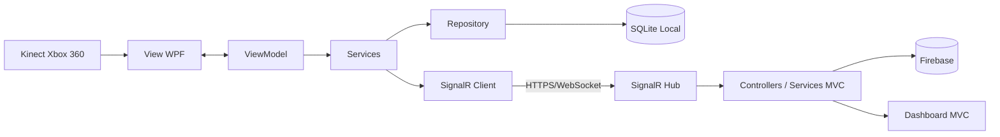

# Infraestrutura — Inventory Masters

## Informações do Projeto

O **Inventory Masters** é uma solução de monitoramento volumétrico de espaços de armazenamento. O sistema utiliza o sensor **Kinect Xbox 360** para capturar dados de profundidade, calcular o volume ocupado e disponibilizar os resultados em uma aplicação web.

A solução é composta por dois módulos integrados:

- **Módulo Kinect/Desktop:** aplicação WPF desenvolvida em C#, organizada com o padrão MVVM e responsável pela captura, calibração, cálculo volumétrico e persistência local.
- **Módulo Web:** aplicação ASP.NET Core organizada com o padrão MVC, responsável por dashboards, usuários, parâmetros, medições, notificações e dados em nuvem.

| Campo | Informação |
|--------|------------|
| **Repositório** | https://github.com/Nylo1991/TCC_Inventory_Masters_Kinect |
| **Linguagem principal** | C# |
| **Módulo Desktop** | WPF — MVVM |
| **Módulo Web** | ASP.NET Core — MVC |
| **Banco local** | SQLite |
| **Banco em nuvem** | Firebase / Google Cloud Firebase|
| **Comunicação** | SignalR via HTTPS/WebSockets |
| **Sensor** | Kinect Xbox 360 |

---

# Nome

**Inventory Masters — Soluções Inteligentes em Mapeamento de Estoque**

---

# Versão

| Componente | Versão |
|------------|---------|
| **Versão do projeto** | 1.0.0 — versão acadêmica para testes e homologação |
| **Módulo Kinect/Desktop** | .NET Framework 4.8 |
| **Módulo Web/MVC** | .NET 8.0 |
| **Kinect for Windows SDK** | 1.8 |
| **SignalR Client** | 6.0.36 |
| **Entity Framework** | 6.5.1 |
| **Google Cloud Firebase** | 4.2.0 |

---

# Requisitos de Hardware

## Estação do Operador (Módulo Kinect/MVVM)

| Recurso | Requisito Mínimo | Recomendado |
|----------|------------------|-------------|
| Processador | Intel Core i3 ou equivalente | Intel Core i5/i7 ou equivalente |
| Memória RAM | 8 GB | 16 GB ou superior |
| Armazenamento | SSD 240 GB | SSD 512 GB ou superior |
| Espaço Livre | 20 GB | 50 GB ou superior |
| Arquitetura | 64 bits | 64 bits |
| Porta USB | Uma porta disponível | Porta dedicada ao Kinect |
| Monitor | 1366×768 | Full HD 1920×1080 |
| Internet | Conexão estável | Conexão estável com redundância |

## Sensor e Ambiente Físico

- Kinect Xbox 360 em perfeito funcionamento.
- Adaptador USB com fonte de alimentação.
- Suporte fixo para posicionamento.
- Área monitorada livre de obstáculos.
- Cabos protegidos contra desconexões.
- Nobreak ou filtro de linha.

## Módulo Web (MVC)

Servidor ou serviço em nuvem compatível com:

- ASP.NET Core .NET 8;
- HTTPS;
- WebSockets;
- Recursos dimensionados conforme número de usuários e sensores.

---

# Requisitos de Software

## Módulo Kinect/Desktop

- Windows 10 ou Windows 11 (64 bits);
- .NET Framework 4.8;
- Kinect for Windows SDK 1.8;
- Drivers do Kinect instalados;
- SQLite compatível;
- Permissão de leitura e gravação;
- Liberação no antivírus (quando necessário);
- Acesso HTTPS ao servidor MVC.

## Módulo Web

- ASP.NET Core .NET 8;
- Hosting Bundle (quando necessário);
- Projeto Firebase configurado;
- Certificado HTTPS válido;
- Suporte a WebSockets;
- Navegador atualizado;
- Variáveis de ambiente para credenciais.

## Ambiente de Desenvolvimento

- Visual Studio;
- Git;
- NuGet;
- SQLiteStudio;
- Acesso ao Firebase.

---

# Dependências

## Módulo Kinect (MVVM)

| Dependência | Versão | Finalidade |
|--------------|---------|------------|
| Entity Framework | 6.5.1 | Persistência local |
| Microsoft.AspNetCore.SignalR.Client | 6.0.36 | Comunicação em tempo real |
| Microsoft.Kinect | SDK 1.8 | Comunicação com o Kinect |
| System.Data.SQLite | 2.0.3 | Banco SQLite |
| SQLitePCLRaw | 3.0.3 | Bibliotecas nativas |
| HelixToolkit.Wpf | 2.25.0 | Visualização gráfica |
| MahApps.Metro | 2.4.11 | Interface WPF |
| Microsoft.Xaml.Behaviors.Wpf | 1.1.19 | Behaviors MVVM |
| Newtonsoft.Json | 13.0.4 | Serialização JSON |

## Módulo Web (MVC)

| Dependência | Versão | Finalidade |
|--------------|---------|------------|
| ASP.NET Core MVC | .NET 8 | Estrutura MVC |
| SignalR | Integrado | Comunicação em tempo real |
| FirebaseAdmin | 3.5.0 | Integração Firebase |
| Google.Cloud.Firebase | 4.2.0 | Persistência em nuvem |
| Razor Views | Integrado | Interface Web |

> Antes da compilação e publicação, todas as dependências devem ser restauradas pelo NuGet.

---

# Arquitetura do Sistema

O Inventory Masters possui uma arquitetura híbrida, combinando processamento local, armazenamento local e armazenamento em nuvem.

## Módulo Kinect/Desktop

- Model
- View
- ViewModel
- Services
- Repository
- Commands

## Módulo Web

- Models
- Views
- Controllers
- Services
- Repositories
- SignalR Hubs

## Fluxo Principal

1. Kinect captura os dados de profundidade.
2. O MVVM calcula o volume.
3. A medição é salva no SQLite.
4. O SignalR envia os dados.
5. O MVC grava no Firebase.
6. Dashboard e notificações são atualizados.

---

# Riscos Identificados

| Risco | Probabilidade | Impacto | Ação Preventiva |
|--------|---------------|----------|-----------------|
| Falha do Kinect | Média | Alto | Verificar cabos e drivers |
| Driver incompatível | Média | Alto | Utilizar SDK 1.8 |
| Internet indisponível | Média | Alto | Persistência no SQLite |
| Servidor indisponível | Baixa | Alto | Manter versão anterior |
| Falha no SignalR | Média | Alto | Verificar HTTPS e WebSockets |
| Corrupção do SQLite | Baixa | Alto | Backups periódicos |
| Falha no Firebase | Baixa | Alto | Backup e controle de acesso |
| Credenciais expostas | Média | Alto | Variáveis de ambiente |
| Acesso não autorizado | Média | Alto | Controle de permissões |
| Firewall/Antivírus | Média | Médio | Liberação adequada |
| Atualização com erro | Média | Alto | Plano de rollback |
| Queda de energia | Média | Alto | Uso de nobreak |

---

# Plano de Contingência

| Situação | Procedimento |
|-----------|--------------|
| Internet indisponível | Continuar utilizando SQLite e sincronizar posteriormente |
| Servidor MVC indisponível | Operação local e registro em log |
| Falha no SignalR | Reconectar e verificar configurações |
| Falha do Kinect | Reiniciar equipamento e verificar drivers |
| SQLite corrompido | Restaurar backup |
| Firebase indisponível | Preservar dados locais até normalização |
| Atualização com erro | Realizar rollback |
| Credencial comprometida | Revogar e gerar nova credencial |
| Queda de energia | Reiniciar sistema e validar integridade |

---

# Fluxo de Implantação Segura

1. Criar backup dos bancos e configurações.
2. Validar a restauração dos backups.
3. Publicar em homologação.
4. Testar Kinect, SQLite, MVC, Firebase e SignalR.
5. Publicar em produção.
6. Monitorar logs.
7. Executar rollback se necessário.

---

# Checklist de Implantação

## Hardware

- [ ] Computador atende aos requisitos.
- [ ] Kinect funcionando.
- [ ] Adaptador conectado.
- [ ] Porta USB disponível.
- [ ] Sensor corretamente posicionado.
- [ ] Área monitorada livre.
- [ ] Equipamentos protegidos por nobreak.

## Software (MVVM)

- [ ] Windows atualizado.
- [ ] .NET Framework instalado.
- [ ] Kinect SDK instalado.
- [ ] Pacotes NuGet restaurados.
- [ ] Compilação Release.
- [ ] SQLite incluído.
- [ ] Permissões configuradas.
- [ ] Antivírus validado.

## Software (MVC)

- [ ] Servidor compatível.
- [ ] Publicação em Release.
- [ ] HTTPS configurado.
- [ ] WebSockets habilitados.
- [ ] Variáveis de ambiente configuradas.
- [ ] Firebase configurado.
- [ ] Firebase criado.

## Rede e Segurança

- [ ] Internet funcionando.
- [ ] Servidor acessível.
- [ ] HTTPS liberado.
- [ ] SignalR conectado.
- [ ] Firewall configurado.
- [ ] Perfis revisados.
- [ ] Senhas protegidas.
- [ ] Logs habilitados.

## Banco de Dados

- [ ] SQLite criado.
- [ ] Testes de leitura e gravação.
- [ ] Firebase acessível.
- [ ] Backup realizado.
- [ ] Teste de restauração executado.
- [ ] Versão anterior disponível para rollback.

## Testes Finais

- [ ] Login do módulo Kinect.
- [ ] Login do MVC.
- [ ] Calibração concluída.
- [ ] Captura funcionando.
- [ ] Volume calculado corretamente.
- [ ] SQLite gravando.
- [ ] SignalR transmitindo.
- [ ] Firebase recebendo dados.
- [ ] Dashboard atualizado.
- [ ] Notificações funcionando.
- [ ] Operação offline validada.
- [ ] Sincronização validada.
- [ ] Logs sem erros críticos.
- [ ] Implantação aprovada.

