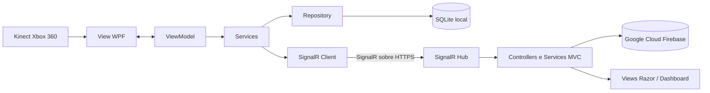

# Infraestrutura — Inventory Masters

**Documento:** Infraestrutura de Implantação  
**Versão documental:** 1.0.0  
**Status:** Ambiente acadêmico de homologação  
**Arquiteturas:** WPF/MVVM e ASP.NET Core MVC  
**Data da revisão:** 04 agosto de 2026  
**Repositório:** https://github.com/Nylo1991/TCC_Inventory_Masters_Kinect

# Informações do Projeto

O **Inventory Masters** é uma solução de monitoramento volumétrico de espaços de armazenamento. O sistema utiliza o sensor **Kinect Xbox 360** para capturar dados de profundidade, calcular o volume ocupado e disponibilizar os resultados em uma aplicação web.

A solução é composta por dois módulos integrados:

- **Módulo Kinect/Desktop:** aplicação WPF desenvolvida em C# e organizada com base no padrão MVVM. O módulo é responsável pela captura dos dados do Kinect, calibração do ambiente, processamento volumétrico, persistência local e comunicação com a aplicação web. Parte dos eventos específicos da interface, navegação e controle de sessão permanece no *code-behind* das Views.
- **Módulo Web:** aplicação ASP.NET Core organizada com o padrão MVC, responsável pelos dashboards, usuários, parâmetros, medições, notificações, autenticação, permissões e persistência dos dados em nuvem.

| Campo | Informação |
|---|---|
| **Repositório** | https://github.com/Nylo1991/TCC_Inventory_Masters_Kinect |
| **Linguagem principal** | C# |
| **Módulo Desktop** | WPF — arquitetura baseada em MVVM |
| **Módulo Web** | ASP.NET Core — MVC |
| **Banco local** | SQLite |
| **Banco em nuvem** | Firebase / Google Cloud Firebase|
| **Comunicação** | SignalR sobre HTTPS, utilizando WebSockets quando disponíveis |
| **Sensor** | Kinect Xbox 360 |

# Nome

**Inventory Masters — Soluções Inteligentes em Mapeamento de Estoque**

# Versão

| Componente | Versão |
|---|---|
| **Versão documental do projeto** | 1.0.0 — versão acadêmica para testes e homologação |
| **Versão de publicação do módulo WPF** | 1.0.0.* |
| **Módulo Kinect/Desktop** | .NET Framework 4.8 |
| **Módulo Web/MVC** | .NET 8.0 |
| **Kinect for Windows SDK** | 1.8 |
| **SignalR Client** | 6.0.36 |
| **Entity Framework** | 6.5.1 |
| **FirebaseAdmin** | 3.5.0 |
| **Google Cloud Firebase** | 4.2.0 |

> **Observação técnica:** o módulo WPF utiliza a biblioteca `Microsoft.Kinect` 1.8.0.0, compatível com o Kinect Xbox 360. Antes da entrega final, a referência do projeto e o `packages.config` devem ser padronizados para o SDK 1.8, eliminando referências divergentes e caminhos absolutos de computadores pessoais.

# Requisitos de Hardware

## Estação do Operador — Módulo Kinect/MVVM

| Recurso | Requisito mínimo | Recomendado |
|---|---|---|
| Processador | Intel Core i3 ou equivalente | Intel Core i5/i7 ou equivalente |
| Memória RAM | 8 GB | 16 GB ou superior |
| Armazenamento | SSD de 240 GB | SSD de 512 GB ou superior |
| Espaço livre | 20 GB | 50 GB ou superior |
| Arquitetura | 64 bits | 64 bits |
| Porta USB | Uma porta USB disponível | Porta USB dedicada ao Kinect |
| Monitor | 1366 × 768 | Full HD 1920 × 1080 |
| Internet | Conexão estável | Conexão estável com alternativa de contingência |

> Os requisitos apresentados foram definidos pela equipe como configuração inicial para implantação e homologação. Antes da entrada em produção, deverão ser confirmados por testes de desempenho realizados em um ambiente equivalente ao do cliente.

## Sensor e Ambiente Físico

- Kinect Xbox 360 em condições adequadas de funcionamento;
- adaptador USB com fonte de alimentação própria;
- suporte fixo para o posicionamento do sensor;
- área monitorada livre de obstáculos permanentes;
- cabos protegidos contra desconexões acidentais;
- iluminação e posicionamento compatíveis com a leitura do sensor;
- filtro de linha ou nobreak para reduzir riscos relacionados a quedas de energia.

## Módulo Web/MVC

O módulo web deverá ser hospedado em servidor ou serviço de nuvem compatível com:

- ASP.NET Core .NET 8;
- certificado HTTPS válido;
- conexões SignalR;
- WebSockets, quando suportados pela hospedagem;
- acesso ao Firebase/Google Cloud ;
- capacidade dimensionada conforme o número de usuários, sensores e conexões simultâneas.

# Requisitos de Software

## Módulo Kinect/Desktop — MVVM

- Windows 10 ou Windows 11, 64 bits;
- Microsoft .NET Framework 4.8;
- Kinect for Windows SDK 1.8;
- drivers do Kinect instalados e reconhecidos pelo Windows;
- bibliotecas nativas do SQLite compatíveis com a arquitetura x64;
- permissão de leitura e gravação na pasta do banco de dados e dos logs;
- liberação controlada no antivírus, quando necessária;
- acesso HTTPS ao endereço do módulo MVC;
- configuração da URL do Hub SignalR.

## Módulo Web — MVC

- ASP.NET Core com .NET 8.0;
- .NET 8 Hosting Bundle, quando a hospedagem exigir instalação própria;
- projeto Firebase/Google Cloud configurado;
- credencial do serviço armazenada fora do repositório;
- certificado HTTPS válido;
- suporte às conexões SignalR e WebSockets;
- navegador atualizado, como Microsoft Edge, Google Chrome ou Firefox;
- variáveis de ambiente para credenciais e configurações sensíveis;
- política CORS restrita aos endereços autorizados em produção.

## Ambiente de Desenvolvimento

- Visual Studio com suporte a WPF, .NET Framework 4.8 e ASP.NET Core .NET 8;
- Git para controle de versão;
- NuGet para restauração das dependências;
- SQLiteStudio ou ferramenta equivalente para inspeção do banco local;
- acesso autorizado ao projeto Firebase;
- computador de validação diferente do ambiente original de desenvolvimento.

# Dependências

## Principais Dependências do Módulo Kinect/MVVM

| Dependência | Versão | Finalidade |
|---|---:|---|
| Entity Framework | 6.5.1 | Mapeamento e persistência dos dados locais |
| Microsoft.AspNetCore.SignalR.Client | 6.0.36 | Comunicação em tempo real com o módulo MVC |
| Microsoft.Kinect | SDK 1.8 | Comunicação com o sensor Kinect Xbox 360 |
| System.Data.SQLite | 2.0.3 | Acesso ao banco SQLite |
| System.Data.SQLite.EF6 | 2.0.3 | Integração do SQLite com o Entity Framework 6 |
| SQLitePCLRaw | 3.0.3 | Suporte às bibliotecas nativas do SQLite |
| HelixToolkit.Wpf | 2.25.0 | Recursos gráficos e visualização no WPF |
| MahApps.Metro | 2.4.11 | Componentes visuais da interface WPF |
| Microsoft.Xaml.Behaviors.Wpf | 1.1.19 | Comportamentos e comandos utilizados no MVVM |
| Newtonsoft.Json | 13.0.4 | Serialização e desserialização JSON |

## Principais Dependências do Módulo Web/MVC

| Dependência | Versão | Finalidade |
|---|---:|---|
| ASP.NET Core MVC | .NET 8.0 | Estrutura da aplicação web |
| SignalR | Integrado ao ASP.NET Core | Atualizações em tempo real |
| FirebaseAdmin | 3.5.0 | Integração administrativa com o Firebase |
| Google.Cloud | 4.2.0 | Persistência dos dados em nuvem |
| Razor Views | Integrado ao ASP.NET Core | Construção das páginas web |

> Antes da compilação e publicação, todas as dependências deverão ser restauradas pelo NuGet. O arquivo do projeto MVC contém referências a bibliotecas WPF e SQLite que deverão ser revisadas e removidas caso não sejam efetivamente utilizadas pelo módulo web.

# Arquitetura do Sistema

O Inventory Masters possui uma arquitetura híbrida, combinando processamento local, armazenamento local e serviços em nuvem.

## Módulo Kinect/Desktop — Arquitetura Baseada em MVVM

- **Model:** representa medições, usuários, logs, sessões, calibrações e históricos;
- **View:** apresenta as telas de login, monitoramento e consulta de histórico;
- **ViewModel:** controla o estado da interface, comandos e fluxo principal de operação;
- **Services:** realizam captura, calibração, cálculo de volume, autenticação e comunicação SignalR;
- **Repository:** centraliza o acesso ao banco de dados SQLite;
- **Commands:** permitem que a View execute ações definidas nas ViewModels;
- **Code-behind:** mantém eventos específicos da interface, navegação entre janelas e parte do controle de sessão.

## Módulo Web — MVC

- **Models:** representam usuários, empresas, medições, parâmetros, perfis e notificações;
- **Views:** exibem páginas Razor e dashboards;
- **Controllers:** recebem requisições e coordenam os fluxos da aplicação;
- **Services:** concentram regras de negócio, autenticação, permissões e integrações;
- **Repositories:** realizam o acesso aos dados do Firebase;
- **Hubs:** executam a comunicação em tempo real pelo SignalR.

## Fluxo Principal

1. O Kinect captura os dados de profundidade do ambiente.
2. O módulo Kinect, organizado com base no MVVM, processa os dados e calcula o volume ocupado.
3. A medição é registrada no SQLite local.
4. Quando a conexão está disponível, o SignalR envia o volume ao módulo MVC.
5. O módulo MVC valida a informação e realiza sua persistência no Firebase.
6. O dashboard e as notificações são atualizados em tempo real.

## Operação Durante Indisponibilidade de Rede

O módulo Kinect mantém a gravação local das medições no SQLite quando a comunicação SignalR não está disponível. A conexão SignalR possui tentativa automática de reconexão. Entretanto, o reenvio automático das medições que não foram transmitidas deverá ser implementado ou formalmente validado antes da implantação em produção. Até essa validação, a equipe deverá manter um procedimento documentado para identificar e reenviar registros pendentes.

# Riscos Identificados

| Risco | Probabilidade | Impacto | Ação preventiva |
|---|---|---|---|
| Falha ou desconexão do Kinect | Média | Alto | Verificar cabos, fonte, porta USB e drivers antes da operação |
| Divergência entre versões do SDK do Kinect | Média | Alto | Padronizar referências e pacotes para o Kinect SDK 1.8 |
| Caminho absoluto para DLL do Kinect | Alta | Alto | Remover caminhos pessoais e validar a compilação após novo clone |
| Indisponibilidade da internet | Média | Alto | Manter persistência local no SQLite e conexão alternativa |
| Indisponibilidade da hospedagem web | Baixa | Alto | Monitorar o servidor e manter o pacote estável anterior |
| Falha na comunicação SignalR | Média | Alto | Verificar URL, HTTPS, firewall, hospedagem e logs |
| Medições não reenviadas após queda de conexão | Média | Alto | Implementar ou documentar o controle de medições pendentes |
| Corrupção do banco SQLite | Baixa | Alto | Realizar backups e testes periódicos de restauração |
| Falha ou perda de dados no Firebase | Baixa | Alto | Manter política de backup, exportação e controle de acesso |
| Credenciais expostas no repositório | Média | Alto | Utilizar variáveis de ambiente, revogar segredos expostos e revisar o histórico |
| Acesso não autorizado | Média | Alto | Aplicar autenticação, perfis e princípio do menor privilégio |
| CORS excessivamente permissivo | Média | Alto | Restringir as origens autorizadas no ambiente de produção |
| Erros detalhados expostos em produção | Média | Médio | Desabilitar mensagens detalhadas do SignalR fora do desenvolvimento |
| Bloqueio pelo antivírus ou firewall | Média | Médio | Validar a aplicação e liberar somente portas e executáveis necessários |
| Falha durante uma atualização | Média | Alto | Fazer backup e manter plano de rollback |
| Queda de energia | Média | Alto | Utilizar filtro de linha ou nobreak e encerrar o sistema corretamente |

# Plano de Contingência

| Situação | Ação imediata | Recuperação | Responsável |
|---|---|---|---|
| Internet indisponível | Manter as medições no SQLite | Identificar e reenviar registros pendentes após o retorno da conexão | Operador e suporte técnico |
| Servidor MVC indisponível | Manter o módulo Kinect em operação local e registrar o erro | Restaurar o serviço, validar os Hubs e revisar os logs | Administrador do servidor |
| Falha no SignalR | Registrar a falha e permitir a tentativa de reconexão | Verificar URL, HTTPS, firewall, hospedagem e WebSockets | Desenvolvedor responsável pela integração |
| Falha do Kinect | Suspender novas medições | Reiniciar o sensor e verificar fonte, USB, SDK e drivers | Operador e suporte técnico |
| Banco SQLite corrompido | Interromper as gravações e preservar o arquivo com falha | Restaurar o último backup válido e validar a integridade | Administrador de dados |
| Firebase indisponível | Preservar os dados locais e suspender cargas incorretas | Reenviar os registros após a normalização do serviço | Administrador de dados |
| Atualização com erro | Suspender a nova versão | Executar rollback para o último pacote estável | Equipe de implantação |
| Credencial comprometida | Revogar imediatamente a credencial | Gerar nova credencial, atualizar o ambiente e revisar os logs | Administrador do sistema |
| Queda de energia | Interromper a operação com segurança | Reiniciar os equipamentos, validar o banco e recalibrar quando necessário | Operador e suporte técnico |

# Fluxo de Implantação Segura

1. Criar backup dos bancos, configurações e versão atual.
2. Validar se os backups podem ser restaurados.
3. Remover credenciais e caminhos pessoais dos arquivos versionados.
4. Restaurar as dependências e compilar os dois módulos em um computador diferente do ambiente original.
5. Publicar a nova versão em ambiente de homologação.
6. Executar testes do Kinect, SQLite, MVC, Firebase e SignalR.
7. Validar o comportamento durante indisponibilidade de internet.
8. Implantar a versão em produção.
9. Monitorar os logs e o funcionamento durante as primeiras horas.
10. Executar rollback caso seja identificado erro crítico.

# Critérios de Aceite da Implantação

A implantação será considerada concluída quando:

- o módulo Kinect reconhecer corretamente o sensor;
- a calibração do ambiente for concluída sem erros críticos;
- as medições forem gravadas corretamente no SQLite;
- a comunicação SignalR for estabelecida;
- as medições forem recebidas e validadas pelo módulo MVC;
- os dados forem persistidos no Firebase;
- o dashboard e as notificações forem atualizados corretamente;
- o funcionamento local durante a indisponibilidade da internet for validado;
- o procedimento de identificação e reenvio de medições pendentes for validado ou documentado;
- os perfis e permissões dos usuários forem revisados;
- as credenciais não estiverem armazenadas no repositório;
- os procedimentos de backup, restauração e rollback forem testados;
- os logs não apresentarem erros críticos;
- o responsável técnico aprovar a entrada em produção.

# Checklist de Implantação

## Hardware

- [ ] O computador atende aos requisitos mínimos definidos pela equipe.
- [ ] A memória RAM e o espaço em disco foram verificados.
- [ ] O Kinect Xbox 360 está funcionando.
- [ ] A fonte e o adaptador USB do Kinect estão conectados.
- [ ] Existe uma porta USB dedicada ao sensor.
- [ ] O sensor está fixado na posição correta.
- [ ] A área monitorada está livre de obstáculos permanentes.
- [ ] Os equipamentos estão protegidos contra quedas de energia.

## Software — MVVM

- [ ] O Windows 10 ou 11, 64 bits, está atualizado.
- [ ] O .NET Framework 4.8 está instalado.
- [ ] O Kinect SDK 1.8 e os drivers estão instalados.
- [ ] A referência do Kinect foi padronizada para o SDK 1.8.
- [ ] Caminhos absolutos de computadores pessoais foram removidos.
- [ ] Os pacotes NuGet foram restaurados.
- [ ] A aplicação foi compilada em modo Release e para x64.
- [ ] O SQLite e as bibliotecas nativas foram incluídos na publicação.
- [ ] O usuário possui permissão de leitura e gravação.
- [ ] O antivírus não está bloqueando a aplicação.

## Software — MVC

- [ ] O servidor é compatível com .NET 8.
- [ ] A aplicação MVC foi publicada em modo Release.
- [ ] O certificado HTTPS está válido.
- [ ] O SignalR está habilitado na hospedagem.
- [ ] Os WebSockets foram habilitados quando suportados.
- [ ] As variáveis de ambiente foram configuradas.
- [ ] As credenciais do Firebase não estão no repositório.
- [ ] O projeto e as coleções do Firebase foram configurados.
- [ ] Dependências WPF e SQLite desnecessárias foram removidas do projeto MVC.
- [ ] Os navegadores suportados foram testados.

## Rede e Segurança

- [ ] A internet está funcionando no ambiente do cliente.
- [ ] O endereço do módulo MVC está acessível.
- [ ] A porta HTTPS 443 está liberada.
- [ ] O SignalR conecta sem erros.
- [ ] O firewall foi configurado com o menor acesso necessário.
- [ ] O CORS está restrito aos endereços autorizados.
- [ ] Os erros detalhados do SignalR estão desabilitados em produção.
- [ ] Os perfis e permissões seguem o princípio do menor privilégio.
- [ ] Senhas e tokens não estão armazenados em texto aberto.
- [ ] Credenciais anteriormente expostas foram revogadas e substituídas.
- [ ] Arquivos sensíveis estão protegidos pelo `.gitignore`.
- [ ] Senhas e tokens não são registrados nos logs.
- [ ] Logs de acesso, falhas e auditoria estão ativos.

## Banco de Dados e Backup

- [ ] O banco SQLite foi criado corretamente.
- [ ] O teste de leitura e gravação local foi realizado.
- [ ] O Firebase está acessível.
- [ ] O backup do SQLite foi realizado.
- [ ] A exportação ou o backup dos dados em nuvem foi realizado.
- [ ] O procedimento de restauração foi testado.
- [ ] O pacote da versão anterior está disponível para rollback.

## Testes Finais

- [ ] O projeto foi clonado e compilado em um computador diferente do ambiente original.
- [ ] O login no módulo Kinect foi validado.
- [ ] O login no módulo MVC foi validado.
- [ ] A calibração do ambiente foi concluída.
- [ ] A captura de profundidade está funcionando.
- [ ] O cálculo volumétrico foi validado.
- [ ] A medição foi gravada no SQLite.
- [ ] A medição foi enviada pelo SignalR.
- [ ] A medição foi gravada no Firebase.
- [ ] O dashboard foi atualizado em tempo real.
- [ ] Os alertas e as notificações foram testados.
- [ ] O armazenamento local durante a indisponibilidade da internet foi validado.
- [ ] O procedimento de identificação e reenvio das medições pendentes foi validado ou documentado.
- [ ] Os logs foram revisados e não apresentam erros críticos.
- [ ] O responsável pela implantação aprovou a entrada em produção.
