# INVENTORY MASTERS - SOLUÇÕES INTELIGENTES EM MAPEAMENTO DE ESTOQUE
---
**Unidade SENAI:** Nova Lima </br>
**Instrutor:** Frederico Martins Aguiar

<div align="center">

## INTEGRANTES DO GRUPO

<p align="center">
  
</p>

</div>

| Nome | Curso | Especialidade no Projeto |
| :--- | :--- | :--- |
| **Danilo Silva Santos** | Programação de Sistemas | Desenvolvimento Kinect, Modelagem de Banco e Documentação|
| **Marilene da Silva Araujo** | Programação de Sistemas |Desenvolvimento MVC, Lógica de Negócio e Documentação|
| **Miguel Cassio Braga Duarte** | Programação de Sistemas | Desenvolvimento MVC, Lógica do Negócio, Modelagem de Banco e Documentação|
| **Diulie Mileide Batista Correia** | Programação de Sistemas | Desenvolvimento Kinect, Lógica de Negócio e Documentação|

---
## SUMÁRIO

- [Quem Somos](#quem-somos)
- [Problema](#problema)
- [Solução](#solucao)
- [Área Tecnológica da Solução](#área-tecnológica-da-solução)
- [Justificativa](#justificativa)
- [Objetivos](#objetivos) 
- [Desenvolvimento](#desenvolvimento)
- [Minimundo](#minimundo)
- [Estrutura do Projeto](#estrutura-do-projeto)                                                  
- [Arquitetura Utilizada](#arquitetura-utilizada)
- [Regras de Negócio](#regras-de-negocio)  
- [Requisitos do Sistema](#requisitos-do-sistema)
- [Modelagem do Sistema](#modelagem-do-sistema) 
- [Modelagem do Banco de Dados](#modelagem-do-banco-de-dados)
- [Plano de Implantação](#plano-de-implantacao)
- [Viabilidade Técnica](#viabilidade-tecnica)
- [Viabilidade Econômica](#viabilidade-economica)
- [Resultados e Conclusão](#resultados-e-conclusao)
- [Telas do Sistema](#telas-do-sistema)
- [Documentos Complementares](#documentos-complementares)
---

## QUEM SOMOS

  A Inventory Masters é uma plataforma tecnológica voltada para o monitoramento inteligente de espaços de armazenamento e a gestão estratégica de excedentes produtivos.

  A solução utiliza tecnologias de visão computacional e mapeamento volumétrico para identificar, medir e acompanhar a ocupação de ambientes destinados ao armazenamento de materiais, permitindo maior controle sobre estoques, excedentes e capacidade disponível.

  Por meio da integração entre o sensor Kinect, processamento de dados e dashboards gerenciais, a plataforma transforma informações operacionais em indicadores que auxiliam a tomada de decisão, promovendo maior eficiência logística e redução de desperdícios.

  Além de otimizar a utilização dos espaços monitorados, a Inventory Masters contribui para a economia circular ao conectar materiais excedentes a oportunidades de reaproveitamento, transformando recursos subutilizados em ativos com potencial de geração de valor econômico.

  Nossa proposta combina inovação tecnológica, sustentabilidade e inteligência operacional para apoiar empresas na construção de processos mais eficientes, competitivos e ambientalmente responsáveis.


  <p align="center">
    
  </p>

  ---

## PROBLEMA

  O cenário empresarial atual é caracterizado por elevados níveis de produção e, consequentemente, pela geração contínua de excedentes produtivos. Esses excedentes incluem sobras de matéria-prima, materiais fora dos padrões comerciais, resíduos operacionais e insumos não aproveitados integralmente durante os processos produtivos. Em muitas organizações, esses materiais não são monitorados de forma estratégica, sendo frequentemente tratados apenas como resíduos ou custos inevitáveis.

  Além da dificuldade de gerenciar os excedentes, muitas empresas enfrentam desafios relacionados ao controle e monitoramento da ocupação dos espaços de armazenamento. A ausência de mecanismos automatizados para medir a utilização dos ambientes dificulta a identificação da capacidade disponível, o acompanhamento do crescimento dos estoques e a tomada de decisões relacionadas ao reaproveitamento, movimentação ou destinação de materiais.

  A falta de rastreabilidade, monitoramento e visibilidade dos espaços físicos gera impactos significativos:

  * **Sob a ótica econômica:** aumento dos custos operacionais, desperdício de recursos, utilização inadequada dos espaços disponíveis e baixa eficiência na gestão de estoques.
  * **Sob a ótica operacional:** dificuldade de acompanhar a ocupação dos ambientes em tempo real, reduzindo a capacidade de planejamento, controle logístico e gestão dos excedentes.
  * **Sob a ótica ambiental:** descarte inadequado de materiais reutilizáveis, aumento da geração de resíduos e maior pressão sobre os recursos naturais.

  Embora a economia circular seja amplamente reconhecida como uma estratégia importante para o desenvolvimento sustentável, sua implementação ainda encontra barreiras devido à escassez de ferramentas tecnológicas acessíveis que permitam monitorar, medir e gerenciar excedentes de forma eficiente e baseada em dados.

  Diante desse cenário, surge a necessidade de uma solução capaz de automatizar o monitoramento dos espaços de armazenamento, medir a ocupação dos ambientes, identificar excedentes produtivos e disponibilizar informações confiáveis para apoiar a tomada de decisão.

  É nesse contexto que se insere a proposta da **Inventory Masters**, uma plataforma tecnológica que utiliza mapeamento volumétrico, visão computacional e monitoramento inteligente para acompanhar a ocupação de espaços físicos, rastrear excedentes produtivos e apoiar estratégias de reaproveitamento de materiais. A solução busca transformar dados operacionais em informações gerenciais, permitindo maior controle dos recursos, melhor utilização da capacidade disponível e redução de desperdícios.

  Assim, o presente estudo busca integrar inovação tecnológica, eficiência operacional e sustentabilidade, contribuindo para uma gestão mais inteligente dos recursos, redução de desperdícios e fortalecimento das práticas de economia circular.

  Com base nas medições realizadas, a plataforma calcula automaticamente diversos indicadores para apoio à tomada de decisão:

  -  Volume ocupado;
  -  Espaço livre disponível;
  -  Percentual de ocupação;
  -  Histórico das medições;
  -  Situação dos limites configurados;
  -  Indicadores gerenciais e operacionais.

  ---

## SOLUÇÃO

  A **Inventory Masters** é uma plataforma tecnológica desenvolvida para apoiar a gestão inteligente de excedentes produtivos por meio do monitoramento volumétrico de espaços de armazenamento e da rastreabilidade de materiais com potencial de reaproveitamento.

  A solução utiliza tecnologias de visão computacional e mapeamento volumétrico para acompanhar a ocupação dos ambientes monitorados, permitindo identificar a capacidade utilizada, o espaço disponível e possíveis situações de excedente operacional. Por meio da integração entre o sensor Kinect, processamento de dados e dashboards gerenciais, o sistema transforma medições físicas em informações estratégicas para apoio à tomada de decisão.

  O módulo Kinect é responsável por capturar dados de profundidade do ambiente, realizar a calibração do espaço monitorado e calcular automaticamente o volume ocupado. Essas informações são processadas e disponibilizadas em tempo real para a plataforma, permitindo o acompanhamento contínuo da ocupação dos estoques.

  Além do monitoramento dos espaços físicos, a plataforma atua como um elo integrador entre empresas geradoras de excedentes e parceiros aptos a reutilizar materiais, estruturando um ecossistema colaborativo voltado para eficiência operacional, redução de desperdícios e sustentabilidade empresarial.

  Ao conectar monitoramento inteligente, rastreabilidade e reaproveitamento de materiais, a solução contribui para:
  * *Melhor aproveitamento dos espaços de armazenamento*;
  * *Maior controle sobre excedentes produtivos*;
  * *Melhoria da eficiência logística e operacional*;
  * *Mitigação dos impactos ambientais* relacionados ao descarte inadequado de materiais. Mais do que uma iniciativa sustentável, a Inventory Masters configura-se como uma solução de inovação aplicada à gestão de estoques, monitoramento volumétrico e economia circular, alinhada às tendências de transformação digital, responsabilidade socioambiental e competitividade empresarial.

 ---

## ÁREA TECNOLÓGICA DA SOLUÇÃO

A solução Inventory Masters está inserida no contexto da **Indústria 4.0**, integrando tecnologias de visão computacional, monitoramento volumétrico, processamento de dados e comunicação em tempo real para apoiar a gestão inteligente de excedentes produtivos e ocupação de espaços de armazenamento.

As principais áreas tecnológicas envolvidas são:

* **Visão Computacional:** Utilização do sensor Kinect Xbox 360, câmera RGB e sensor de profundidade (RGB-D) para captura de dados espaciais e realização do mapeamento volumétrico dos ambientes monitorados.

* **Monitoramento Volumétrico:** Processamento dos dados capturados para cálculo do volume ocupado, espaço livre disponível e percentual de ocupação dos ambientes de armazenamento.

* **Internet das Coisas (IoT):** Integração entre hardware e software para coleta automática de dados e monitoramento contínuo dos espaços físicos.

* **Sistemas de Informação:** Processamento, armazenamento e disponibilização das informações por meio de aplicações desenvolvidas em C#, WPF, ASP.NET Core, SQLite e Firebase.

* **Comunicação em Tempo Real:** Utilização do SignalR para sincronização das medições realizadas pelo módulo Kinect com os dashboards da aplicação web.

A combinação dessas tecnologias permite que a solução transforme medições físicas em informações estratégicas para apoio à tomada de decisão, rastreabilidade de excedentes e otimização dos espaços de armazenamento.

---

## JUSTIFICATIVA

A implementação deste projeto justifica-se pelas limitações dos métodos tradicionais de controle de estoque e monitoramento de espaços de armazenamento, que normalmente dependem de medições manuais, inspeções periódicas e registros sujeitos a falhas humanas.

A ausência de informações precisas sobre a ocupação dos ambientes dificulta o planejamento logístico, reduz a eficiência operacional e pode resultar em desperdícios, utilização inadequada dos espaços disponíveis e acúmulo de excedentes produtivos.

Nesse contexto, a Inventory Masters propõe uma alternativa tecnológica de baixo custo baseada no sensor Kinect Xbox 360, permitindo automatizar o monitoramento volumétrico dos ambientes e disponibilizar informações em tempo real sobre ocupação, capacidade disponível e situação dos estoques.

Além dos benefícios operacionais, a solução contribui para práticas de economia circular, rastreabilidade de materiais e redução de impactos ambientais, tornando a gestão dos excedentes mais eficiente, sustentável e orientada por dados.

---

## OBJETIVOS

### Objetivo Geral

Desenvolver e implementar uma plataforma tecnológica capaz de realizar o monitoramento volumétrico de espaços de armazenamento e apoiar a gestão inteligente de excedentes produtivos por meio da captura, processamento e disponibilização de informações em tempo real.

### Objetivos Específicos

#### Módulo Kinect

* Integrar o sensor Kinect Xbox 360 ao ambiente de desenvolvimento C# para captura de dados de profundidade e imagens do ambiente monitorado.
* Desenvolver mecanismos de calibração do espaço físico para obtenção de medições confiáveis.
* Criar algoritmos capazes de converter os dados de profundidade em métricas volumétricas.
* Calcular automaticamente o volume ocupado, espaço livre disponível e percentual de ocupação.
* Armazenar localmente as medições realizadas para consulta histórica e rastreabilidade.
* Disponibilizar as informações coletadas para integração com a aplicação web.

#### Módulo MVC

* Desenvolver dashboards para visualização das informações recebidas do módulo Kinect.
* Permitir o gerenciamento de parceiros e materiais com potencial de reaproveitamento.
* Disponibilizar configurações de parâmetros operacionais e limites de ocupação.
* Implementar mecanismos de notificação e acompanhamento dos excedentes produtivos.
* Apoiar a tomada de decisão por meio de indicadores operacionais e históricos de ocupação.

#### Integração Entre os Módulos

* Sincronizar as medições realizadas pelo Kinect com a aplicação web utilizando SignalR.
* Garantir atualização das informações em tempo real.
* Permitir operação local do módulo Kinect mesmo em situações de indisponibilidade da aplicação web.
* Apoiar a identificação, controle e direcionamento estratégico dos excedentes produtivos.

---

## DESENVOLVIMENTO

O desenvolvimento do projeto foi estruturado em etapas progressivas, permitindo a construção independente dos módulos Kinect e MVC, bem como sua integração para formação da solução completa.

#### 1. Levantamento de Requisitos e Modelagem

Foram definidos os requisitos funcionais, regras de negócio, fluxos operacionais e diagramas necessários para representar o funcionamento da solução.

#### 2. Desenvolvimento do Módulo Kinect

Nesta etapa foi realizada a integração com o sensor Kinect Xbox 360 utilizando o Microsoft Kinect SDK 1.8.

Foram implementados os recursos responsáveis por:

* Captura da câmera RGB;
* Captura dos dados de profundidade;
* Calibração do espaço monitorado;
* Processamento das medições volumétricas;
* Cálculo do volume ocupado;
* Cálculo do espaço livre disponível;
* Cálculo do percentual de ocupação;
* Armazenamento local das medições em SQLite.

#### 3. Desenvolvimento do Módulo MVC

Foi desenvolvida a aplicação web responsável pelo gerenciamento operacional da solução.

Nesta etapa foram implementados:

* Dashboard de acompanhamento;
* Gerenciamento de parceiros;
* Configuração de parâmetros;
* Sistema de notificações;
* Relatórios e consultas históricas;
* Integração com Firebase.

#### 4. Integração Entre os Módulos

Foi implementada a comunicação em tempo real utilizando SignalR, permitindo que as medições realizadas pelo módulo Kinect fossem disponibilizadas automaticamente na aplicação web.

#### 5. Testes e Validação

Foram realizados testes de calibração, precisão das medições, persistência dos dados, sincronização entre os módulos e atualização das informações em tempo real.

#### 6. Consolidação da Solução

Após a integração dos componentes, a plataforma passou a disponibilizar informações sobre ocupação dos espaços, capacidade disponível, histórico de medições e indicadores operacionais, apoiando a gestão dos excedentes produtivos e a tomada de decisão.

---

## MINIMUNDO

O **Inventory Masters** é um sistema de monitoramento logístico inteligente projetado para o controle preciso de estoques em armazéns e centros de distribuição. O problema central que o sistema resolve é a divergência entre o estoque físico e o estoque registrado no sistema de gestão, causada principalmente por processos manuais de contagem, falhas na identificação de carga e falta de visibilidade em tempo real sobre a ocupação volumétrica dos espaços de armazenamento.

#### O Cenário Operacional
O sistema atua em um ambiente industrial onde o monitoramento é realizado por sensores de profundidade (**Microsoft Kinect**). Cada área de armazenamento (ou "Espaço Monitorado") possui um sensor dedicado que realiza leituras constantes do ambiente. O processo inicia-se com a **Calibração**, onde o sistema mapeia o "ambiente vazio" (estado de referência), permitindo que qualquer objeto introduzido no campo de visão seja detectado e calculado matematicamente.

#### A Jornada do Dado
As leituras brutas são processadas localmente para filtrar ruídos e oclusões, garantindo que apenas dados íntegros sejam convertidos para volumes volumétricos ($m^3$). Devido à natureza instável de redes industriais, o módulo de borda opera com **resiliência (Modo Offline)**, utilizando cache local (**SQLite**) para garantir a continuidade da medição mesmo em casos de queda de conexão.

A integração com o módulo central (web) ocorre via **SignalR**, permitindo que o *Dashboard* receba atualizações em tempo real. O sistema MVC atua como o cérebro da operação, onde os administradores configuram os limites de capacidade e os alertas de ocupação. Toda alteração de parâmetros ou ocorrência crítica (como uma zona de ocupação vermelha) gera um log de auditoria imutável, garantindo a conformidade e a rastreabilidade necessárias para processos de qualidade.

#### A Experiência do Operador
O operador do sistema interage com um *dashboard* responsivo e intuitivo, que oferece uma visão holística dos armazéns. Através de indicadores visuais (gráficos *Doughnut* com código de cores), ele identifica rapidamente se o armazém está operando dentro dos parâmetros de segurança. Quando um limite crítico é atingido, o sistema dispara notificações que exigem uma resposta ativa ("Ciente"), garantindo que nenhuma anomalia seja ignorada, transformando o monitoramento passivo em uma ferramenta ativa de suporte à tomada de decisão logística.

---

##  ESTRUTURA DO PROJETO

O **Inventory Masters** é uma solução híbrida projetada para alta disponibilidade e rastreabilidade, composta por dois módulos principais:

### Estrutura dos Módulos

<table align="center" width="80%">
  <tr>
    <th align="center">Módulo Kinect (WPF)</th>
    <th align="center">Módulo Web (MVC)</th>
  </tr>
  <tr>
    <td align="center"></td>
    <td align="center"></td>
  </tr>
</table>

#### 1. Módulo Desktop: TCC Inventory Masters Kinect
* **Tecnologia:** WPF (.NET Framework) com foco em processamento local de alta performance.
* **Responsabilidade:**
    * **Captura:** Integração direta com o sensor Kinect Xbox 360 para mapeamento RGB-D.
    * **Processamento:** Algoritmos de calibração volumétrica, filtragem de ruído e cálculo de métricas de ocupação em $cm^3$.
    * **Resiliência:** Persistência local robusta utilizando **SQLite**, garantindo que nenhum dado de medição seja perdido durante quedas de conexão.
    * **Comunicação:** Atua como um *publisher* de dados via **SignalR** para o servidor Web.

#### 2. Módulo Web (Cloud Firebase): MVC InventoryMasters
* **Tecnologia:** ASP.NET Core MVC com integração ao **Firebase**.
* **Responsabilidade:**
    * **Gestão:** Dashboard centralizado para análise de indicadores, histórico de ocupação e gestão de parceiros.
    * **Segurança:** Controle de acesso baseado em sessões (cookies) e autenticação de dispositivos via token.
    * **Integração:** Atua como *subscriber* e *hub* de dados, processando os eventos em tempo real enviados pelo Módulo Desktop e persistindo-os na nuvem para auditoria.

---

## Estrutura de Camadas - MVC/Web

O **Inventory Masters** adota a arquitetura **MVC** (Model-View-Controller) para separar a lógica de negócio, a interface do usuário e o fluxo de dados. Essa estrutura é reforçada por camadas especializadas (**Repositories**, **Services**, **Hubs**), que atuam como camadas de apoio: elas isolam as operações de banco de dados, centralizam regras complexas e garantem a comunicação em tempo real, resultando em um sistema modular, fácil de testar e simples de evoluir.


### 1. Módulo MVC/Web - Camada de Controllers

<p align="center">
  
</p>

A pasta `Controllers` do projeto **MVC InventoryMasters** desempenha um papel central na orquestração das requisições HTTP e na implementação das regras de negócio que sustentam a plataforma web. A tabela abaixo detalha a responsabilidade de cada componente:

| Controller | Responsabilidade |
| :--- | :--- |
| **AcessoController.cs** | Gerencia os fluxos de autenticação, login e controle de acesso dos usuários. |
| **DashboardController.cs** | Alimenta a interface principal com dados volumétricos e indicadores gerenciais em tempo real. |
| **HomeController.cs** | Gerencia a página inicial e as rotas básicas de navegação do portal. |
| **KinectApiController.cs** | Atua como ponto de recepção dos dados enviados pelo módulo Kinect, integrando o hardware à web. |
| **MedicoesController.cs** | Gerencia a consulta, exibição e processamento do histórico de medições volumétricas. |
| **NotificacoesController.cs** | Processa e exibe alertas operacionais, como excedentes nos limites de ocupação. |
| **ParametrosController.cs** | Permite a configuração de limites operacionais e definições personalizadas de monitoramento. |
| **ParceirosController.cs** | Gerencia o cadastro e a interação com parceiros voltados à economia circular e reaproveitamento. |
| **PerfisController.cs** | Controla as permissões e níveis de acesso baseados nos perfis de usuário. |
| **UsuariosController.cs** | Gerencia o cadastro, edição e administração dos usuários do sistema. |


### 2. Módulo MVC/Web - Camada de Models

<p align="center">
  
</p>

A pasta `Models` do projeto **MVC InventoryMasters** contém as classes que representam as entidades de domínio e as estruturas de dados fundamentais da aplicação. Elas definem o formato dos dados que são persistidos no banco de dados (Firebase) e transitam entre os diversos componentes do sistema.

| Model | Responsabilidade |
| :--- | :--- |
| **Empresa.cs** | Define a estrutura de dados da organização que utiliza o sistema. |
| **ErrorViewModel.cs** | Modelo utilizado para exibir mensagens de erro personalizadas na interface. |
| **LogSistema.cs** | Armazena registros de auditoria sobre ações críticas realizadas no sistema. |
| **MedicaoVolume.cs** | Representa o dado volumétrico capturado pelo Kinect (volume, espaço livre, data). |
| **Notificacao.cs** | Estrutura os dados de alertas e notificações gerados para o usuário. |
| **ParametrosSistema.cs** | Define as configurações e limites operacionais do ambiente monitorado. |
| **Parceiro.cs** | Contém as informações dos parceiros integrados à economia circular. |
| **Perfil.cs** | Define as categorias de perfis de acesso disponíveis. |
| **PermissoesSistema.cs** | Mapeia os níveis de acesso e funcionalidades permitidas para cada perfil. |
| **TokenAcessoKinect.cs** | Estrutura utilizada para a autenticação segura do dispositivo Kinect. |
| **Usuario.cs** | Representa os dados cadastrais e credenciais dos usuários da plataforma. |


### 3. Módulo MVC/Web - Camada de Repositories

<p align="center">
  
</p>

A pasta `Repositories` do projeto **MVC InventoryMasters** implementa o padrão *Repository*, atuando como a camada de abstração de dados. Sua função principal é isolar a lógica de acesso a dados (CRUD) da lógica de negócio, centralizando as operações de comunicação com o **Firebase**.

| Repository | Responsabilidade |
| :--- | :--- |
| **EmpresasRepository.cs** | Gerencia as operações de leitura e escrita das entidades de Empresa. |
| **LogsSistemaRepository.cs** | Manipula a persistência e consulta dos logs de auditoria do sistema. |
| **MedicaoVolumeRepository.cs** | Gerencia a persistência e o histórico das medições volumétricas capturadas. |
| **NotificacaoRepository.cs** | Gerencia o armazenamento e recuperação de notificações do sistema. |
| **ParametrosSistemaRepository.cs** | Realiza a leitura e gravação das configurações e limites operacionais. |
| **ParceirosRepository.cs** | Gerencia os dados cadastrais dos parceiros de logística e economia circular. |
| **PerfisRepository.cs** | Controla o acesso às definições de perfis de usuário. |
| **TokensAcessoKinectRepository.cs**| Gerencia a validação e o armazenamento dos tokens de autenticação do Kinect. |
| **UsuariosRepository.cs** | Gerencia as operações de persistência relacionadas aos usuários da aplicação. |


### 4. Módulo MVC/Web - Camada de Services

<p align="center">
  
</p>

A camada `Services` atua como uma ponte entre os `Controllers` e os `Repositories`. Ela centraliza regras de negócio específicas, processamento de serviços externos e validações de alto nível, promovendo a reutilização de código e a organização da aplicação.

| Service | Responsabilidade |
| :--- | :--- |
| **ContextoUsuarioService.cs** | Gerencia as informações do usuário logado durante a sessão atual. |
| **EmailTokenService.cs** | Manipula a geração e verificação de tokens enviados via e-mail para segurança/recuperação. |
| **FirebaseService.cs** | Centraliza a configuração e a comunicação técnica com o banco de dados Firebase. |
| **PermissaoService.cs** | Implementa as regras de negócio para validação de acesso e permissões de usuários. |
| **TokenAcessoKinectService.cs** | Coordena a lógica de validação dos tokens de acesso específicos do hardware Kinect. |


### 5. Módulo MVC/Web - Camada de ViewModels

<p align="center">
  
</p>

A pasta `ViewModels` contém as classes que estruturam os dados exibidos nas *Views* (telas) da aplicação, servindo como uma camada intermediária que formata as informações para consumo da interface do usuário.

| ViewModel | Responsabilidade |
| :--- | :--- |
| **BaseViewModel.cs** | Classe base que fornece funcionalidades comuns a todos os outros viewmodels. |
| **DashboardViewModel.cs** | Contém os dados necessários para a renderização do painel principal (dashboard). |
| **LoginEmailViewModel.cs** | Estrutura os dados necessários para o formulário de login por e-mail. |
| **SolicitarTokenKinectRequest.cs** | Modelo de requisição para solicitar um novo token de acesso ao dispositivo Kinect. |
| **ValidacaoTokenResultadoViewModel.cs** | Estrutura o retorno do resultado após a tentativa de validação de um token. |
| **ValidarTokenRequest.cs** | Modelo de requisição contendo os dados para validar um token existente. |
| **ValidarTokenViewModel.cs** | Estrutura de dados para a interface de validação de tokens do Kinect. |

### 6. Módulo MVC/Web - Camada de Views

<table align="center">
  <tr>
    <th colspan="4" align="center">
      
    </th>
  </tr>
  <tr>
    <td align="center"></td>
    <td align="center"></td>
    <td align="center"></td>
    <td align="center"></td>
  </tr>
</table>

A pasta `Views` contém os arquivos de interface (Razor Pages) do projeto. Esta camada é responsável pela renderização do HTML que é enviado ao navegador do usuário, refletindo o estado da aplicação e permitindo a interação com o sistema.

| Pasta / View | Responsabilidade |
| :--- | :--- |
| **Acesso/** | Interfaces de login, autenticação e recuperação de acesso. |
| **Dashboard/** | Exibição visual do painel de controle e indicadores de estoque. |
| **Home/** | Renderização da página inicial do sistema. |
| **Medicoes/** | Listagem e visualização detalhada das medições de volume. |
| **Notificacoes/** | Exibição de alertas e mensagens operacionais do sistema. |
| **Parametros/** | Formulários de configuração de limites e variáveis de monitoramento. |
| **Parceiros/** | Interface de cadastro e gestão de empresas parceiras. |
| **Perfis/** | Gerenciamento visual das permissões e papéis de usuário. |
| **Shared/** | Layouts, componentes reutilizáveis e parciais (ex: `_Layout.cshtml`). |
| **Usuarios/** | Telas de cadastro, edição e administração de usuários. |

### 7. Módulo MVC/Web - Camada de Hubs (SignalR)

<p align="center">
  
</p>

A camada `Hubs` contém as classes que estendem `Hub` do SignalR, permitindo a comunicação bidirecional em tempo real entre o servidor e os clientes conectados. É fundamental para o envio imediato de atualizações de medições e alertas sem a necessidade de recarregar a página.

| Hub | Responsabilidade |
| :--- | :--- |
| **MedicaoHub.cs** | Gerencia conexões para o envio em tempo real de novas medições volumétricas capturadas pelo Kinect para o Dashboard. |
| **NotificacaoHub.cs** | Gerencia conexões para o envio imediato de alertas e notificações urgentes para as interfaces dos usuários conectados. |

---

## Módulo Kinect (MVVM)
Para o processamento de dados do hardware **Kinect**, utilizamos o padrão **MVVM** (Model-View-ViewModel). Esta abordagem permite que a interface de captura e processamento volumétrico opere com alta performance e responsividade, utilizando o *data binding* para manter a visualização dos dados sempre sincronizada com o sensor, garantindo uma separação limpa entre a lógica de captura e a interface de monitoramento.

### 1. Módulo Kinect: Camada de Model

<p align="center">
  
</p>

Os `Models` definem a estrutura dos dados que transitam entre o hardware e a aplicação.

| Model | Responsabilidade |
| :--- | :--- |
| **CalibrationProgress.cs** | Armazena o estado atual do progresso da calibração. |
| **CalibrationResult.cs** | Define o resultado final da calibração. |
| **HistoricoOcupacao.cs** | Estrutura dados temporais de ocupação. |
| **Log.cs** | Gerencia o registro de eventos e erros do sistema. |
| **MedicaoVolume.cs** | Representa o dado volumétrico bruto capturado. |
| **SessaoUsuario.cs** | Define o contexto de uma sessão de monitoramento. |
| **TokenSolicitadoResultado.cs** | Estrutura o retorno de tokens solicitados. |
| **UsuarioAcesso.cs** | Define a estrutura de dados para controle de acesso do usuário. |
| **ValidacaoTokenResultado.cs** | Define o resultado da validação de acesso do dispositivo. |

### 2. Módulo Kinect: Camada de Service

<p align="center">
  
</p>

A camada `Service` no módulo Kinect centraliza a inteligência de processamento de hardware. Ela abstrai a complexidade do sensor, permitindo que a camada de apresentação consuma dados prontos para o uso, sem a necessidade de manipular diretamente as bibliotecas de baixo nível do Kinect.

| Service | Responsabilidade |
| :--- | :--- |
| **AutenticacaoMvcService.cs** | Gerencia a validação de acesso e sessões entre o módulo desktop e a API Web. |
| **KinectService.cs** | Serviço base que coordena a inicialização e o ciclo de vida do hardware. |
| **KinectService.Calibration.cs** | Encapsula algoritmos para calibração precisa do sensor. |
| **KinectService.Camera.cs** | Gerencia stream de vídeo e captura de quadros da câmera. |
| **KinectService.Volume.cs** | Implementa algoritmos para cálculo volumétrico de objetos. |
| **SignalRService.cs** | Coordena o envio de dados processados em tempo real via SignalR. |

### 3. Módulo Kinect: Camada de ViewModel

<p align="center">
  
</p>

A camada `ViewModel` atua como o **orquestrador** da interface do Kinect. Ela processa as requisições, gerencia o estado da interface e utiliza *data binding* para refletir as mudanças do sensor na tela em tempo real, mantendo a View leve e desacoplada da lógica de processamento pesado.

| ViewModel | Responsabilidade |
| :--- | :--- |
| **BaseViewModel.cs** | Implementa a lógica base para todas as outras ViewModels. |
| **MainViewModel.cs** | Coordenador principal que orquestra as demais ViewModels. |
| **MainViewModel.Espaco.cs** | Gerencia a visualização e configuração do espaço monitorado. |
| **MainViewModel.Historico.cs** | Controla a apresentação de dados históricos e relatórios. |
| **MainViewModel.Kinect.cs** | Gerencia o estado e status operacional do hardware. |
| **MainViewModel.Volume.cs** | Processa e formata dados volumétricos para exibição gráfica. |

### 4. Módulo Kinect: Camada de View

<p align="center">
  
</p>

A camada `View` é a camada de apresentação final da aplicação. Ela é responsável por exibir os dados ao usuário e capturar interações, mantendo-se estritamente focada no layout e na estrutura visual, delegando toda a lógica de execução para a `ViewModel` correspondente.

| View | Responsabilidade |
| :--- | :--- |
| **HistoricoMedicoesWindow.xaml** | Interface dedicada à visualização e filtragem do histórico de medições. |
| **KinectLogin.xaml** | Tela de autenticação e acesso inicial do dispositivo. |
| **KinectMonitorWindow.xaml** | Interface principal de monitoramento em tempo real do Kinect. |

### 5. Módulo Kinect: Camada de Repository

<p align="center">
  
</p>

A camada `Repository` encapsula a lógica de persistência de dados. Ela utiliza o padrão *Repository* com **Entity Framework Core** para realizar operações de leitura e escrita no banco de dados local **SQLite**, garantindo que as regras de negócio não dependam diretamente da tecnologia de persistência.

| Componente | Responsabilidade |
| :--- | :--- |
| **Interface/IKinectRepository.cs** | Define o contrato de métodos necessários para operações de leitura e escrita. |
| **KinectRepository.cs** | Implementa a lógica concreta de acesso ao **SQLite**, isolando as consultas e gravações de dados através do `AppDbContext`. |

> **Nota:** Esta arquitetura garante o isolamento dos dados por empresa e permite que, caso a tecnologia de banco de dados precise ser alterada no futuro, as modificações fiquem restritas a esta camada, sem impactar as regras de negócio.

### 6. Módulo Kinect: Camada de Commands

<p align="center">
  
</p>

A camada `Command` provê a infraestrutura necessária para a comunicação entre a interface e a lógica de aplicação no padrão MVVM.

| Componente | Responsabilidade |
| :--- | :--- |
| **RelayCommand.cs** | Implementa a interface `ICommand`, permitindo que controles da interface (View) executem ações definidas na ViewModel. Suporta execução assíncrona (`Func<Task>`) para manter a interface responsiva e validação de estado via `CanExecute`. |

---

## ARQUITETURA UTILIZADA

* **WPF (.NET / Visual Studio 2026 - v18.7.1) - MVVM:** Framework de interface gráfica utilizado para o desenvolvimento da aplicação desktop.
* **Kinect SDK 1.8:** Conjunto de bibliotecas e drivers que permite a interface direta com o hardware Kinect. 
* **SQLite (SQLiteStudio v3.4.21):** Banco de dados relacional leve embutido na aplicação desktop. 
* **SignalR (Microsoft.AspNetCore.SignalR.Client v6.0.36):** Biblioteca de comunicação em tempo real que estabelece um canal bidirecional permanente.
* **ASP.NET Core MVC (Razor Pages):** *Framework* web hospedado na nuvem via **MonsterASP.net (Plano Free)**. Atua como o servidor central, recebendo o tráfego via SignalR, processando as regras de negócio e gerenciando o fluxo de informações.
* **Firebase (Google.Cloud v4.2.0):** Plataforma de banco de dados *NoSQL* em nuvem e ORM centralizado onde as medições consolidadas são registradas, servindo de fonte de dados para o dashboard administrativo acessado via interface web.
  
-----

## REGRAS DE NEGÓCIO

As regras de negócio definem o comportamento esperado do sistema, garantindo a precisão das medições, a integridade dos dados, a operação correta do hardware Kinect, a comunicação em tempo real com a aplicação MVC e o apoio à tomada de decisão logística.

As regras do sistema **Inventory Masters** foram divididas em cinco grupos: 

> * Regras de negócio do MVC/Web
> * Regras de negócio do Kinect/Desktop
> * Regras de validação
> * Regras de integração
> * Regras técnicas/operacionais

#### Especificação das Regras
- **Condição:** O gatilho ou cenário em que a regra acontece.
- **Restrição:** O limite, validação ou decisão aplicada.
- **Ação:** O resultado esperado pelo sistema.

#### Critério de organização

- `RN`: Identifica regras relacionadas ao módulo MVC/Web.
- `RNK`: Identifica regras relacionadas ao módulo Kinect/Desktop.
- 🔵 **Regras de negócio:** Descrevem decisões do domínio, fluxos de uso e comportamentos esperados pelo usuário.
- 🔴 **Regras de validação:** Descrevem campos obrigatórios, formatos, limites, bloqueios e consistência de dados.
- 🟢 **Regras de integração:** Descrevem comunicação entre módulos, Firebase, SQLite e SignalR/Hub.
- 🟡 **Regras técnicas/operacionais:** Descrevem controles necessários para execução, rastreabilidade, configuração, cálculo e estabilidade.
- **Funcionalidades em evolução:** WhatsApp, escalonamento e canais de alerta permanecem como funcionalidades parametrizadas, pois o código já possui configurações para esses recursos.

### Regras de Negócio - MVC/Web
---

#### 🔵 RN001 - Solicitação de token por e-mail

| Condição | Restrição | Ação |
| :--- | :--- | :--- |
| O cliente informa o e-mail na tela de login do MVC. | O e-mail deve possuir formato válido e estar cadastrado para um usuário ativo. | O MVC gera um token numérico e envia para o e-mail cadastrado. |

> **Regra:** O sistema deve validar a existência e a integridade dos dados antes de disparar qualquer comunicação de segurança.
---

#### 🔵 RN009 - Envio do token por e-mail

| Condição | Restrição | Ação |
| :--- | :--- | :--- |
| O token é gerado com sucesso. | O envio deve ocorrer para o e-mail cadastrado do usuário. | O MVC envia o token e informa sucesso na tela. |

> **Regra:** O envio da comunicação deve ser direcionado exclusivamente ao endereço eletrônico vinculado ao usuário após a validação do processamento.
---

#### 🔵 RN014 - Login autorizado

| Condição | Restrição | Ação |
| :--- | :--- | :--- |
| O usuário informa token válido, ativo e dentro do prazo. | O usuário vinculado ao token deve existir e estar ativo. | O sistema autentica o usuário e libera o dashboard. |

> **Regra:** A autenticação do usuário depende estritamente da validade, vigência e vinculação correta do token de acesso ao cadastro do usuário.
---

#### 🔵 RN018 - Controle de acesso por perfil

| Condição | Restrição | Ação |
| :--- | :--- | :--- |
| Usuário autenticado acessa uma funcionalidade. | O perfil deve possuir a permissão exigida. | O sistema libera ou bloqueia o acesso. |

> **Regra:** O acesso às funcionalidades do sistema é condicionado pela verificação das permissões ativas atribuídas ao perfil do usuário.
---

#### 🔵 RN020 - Permissões do perfil Administrador

| Condição | Restrição | Ação |
| :--- | :--- | :--- |
| O usuário possui perfil Administrador. | Esse perfil representa controle total do sistema. | O sistema concede privilégios de acesso irrestrito ao usuário. |

> **Regra:** O perfil de Administrador confere privilégios de acesso irrestrito, sendo necessário garantir a gestão segura destas permissões.
---

#### 🔵 RN021 - Permissões do perfil Gestor

| Condição | Restrição | Ação |
| :--- | :--- | :--- |
| O usuário possui perfil Gestor. | O gestor deve acompanhar dados gerenciais sem administrar todo o sistema. | O sistema libera dashboard, medições, notificações e parceiros. |

> **Regra:** O acesso do gestor é limitado à supervisão de indicadores e parceiros, garantindo monitoramento sem privilégios administrativos.
---

#### 🔵 RN022 - Permissões do perfil Operador

| Condição | Restrição | Ação |
| :--- | :--- | :--- |
| O usuário possui perfil Operador. | O operador atua nas atividades operacionais. | O sistema libera dashboard, medições e acesso ao Kinect. |

> **Regra:** O perfil de operador é restrito às funcionalidades necessárias para a execução das atividades operacionais diárias.
---

#### 🔵 RN023 - Permissões do perfil Visualizador

| Condição | Restrição | Ação |
| :--- | :--- | :--- |
| O usuário possui perfil Visualizador. | Esse perfil não deve alterar cadastros. | O sistema permite visualizar dashboard, medições e notificações. |

> **Regra:** O acesso do visualizador é estritamente de leitura, sendo vedada qualquer permissão de alteração ou manipulação de dados.
---

#### 🔵 RN024 - Cadastro de perfil

| Condição | Restrição | Ação |
| :--- | :--- | :--- |
| O administrador cadastra um perfil. | O perfil deve possuir nome, status e permissões da lista oficial. | O sistema salva o perfil para uso no controle de acesso. |

> **Regra:** O cadastro de novos perfis deve respeitar a estrutura de permissões predefinida pelo sistema para garantir a integridade do controle de acesso.
---

#### 🔵 RN025 - Edição de perfil

| Condição | Restrição | Ação |
| :--- | :--- | :--- |
| O administrador edita um perfil. | As permissões devem continuar vinculadas à lista oficial do sistema. | O sistema atualiza o perfil e suas permissões. |

> **Regra:** Qualquer alteração em perfis existentes deve manter a conformidade com as regras e permissões estipuladas na lista oficial.
---

#### 🔵 RN026 - Inativação de perfil

| Condição | Restrição | Ação |
| :--- | :--- | :--- |
| O administrador inativa um perfil. | O perfil deixa de representar uma opção ativa para operação. | O sistema marca o perfil como inativo. |

> **Regra:** A inativação de um perfil deve impedir seu uso imediato em novas operações ou autenticações no sistema.
---

#### 🔵 RN027 - Cadastro de usuário

| Condição | Restrição | Ação |
| :--- | :--- | :--- |
| O administrador cadastra um usuário. | Nome, e-mail, perfil e senha são obrigatórios. | O sistema salva o usuário vinculado à empresa atual. |

> **Regra:** A criação de usuários exige o preenchimento de todos os dados obrigatórios e a vinculação necessária à organização correspondente.
---


#### 🔵 RN038 - Cadastro de parceiro

| Condição | Restrição | Ação |
| :--- | :--- | :--- |
| Usuário autorizado cadastra um parceiro. | Nome, e-mail, telefone, empresa e endereço são obrigatórios. | O sistema salva o parceiro vinculado à empresa atual. |

> **Regra:** O cadastro de parceiros exige a conformidade de todos os campos obrigatórios para garantir a integridade das informações vinculadas à organização.
---

#### 🔵 RN040 - Edição de parceiro somente com alteração real

| Condição | Restrição | Ação |
| :--- | :--- | :--- |
| Usuário autorizado edita um parceiro. | O sistema deve identificar mudanças reais nos dados, inclusive telefone normalizado. | O sistema atualiza o parceiro ou informa que nada foi alterado. |

> **Regra:** A persistência de dados de edição ocorre apenas mediante a detecção de alterações efetivas, evitando processamentos desnecessários.
---

#### 🔵 RN047 - Configuração de parâmetros do sistema

| Condição | Restrição | Ação |
| :--- | :--- | :--- |
| Usuário autorizado altera configurações operacionais. | Apenas perfis com permissão podem gerenciar configurações. | O sistema salva os parâmetros da empresa. |

> **Regra:** O gerenciamento das configurações operacionais é restrito a perfis com privilégios específicos, assegurando a governança do sistema.
---

#### 🔵 RN055 - Calibração acionada pelo MVC

| Condição | Restrição | Ação |
| :--- | :--- | :--- |
| Usuário autorizado aciona nova calibração nos parâmetros. | O parâmetro de calibração deve ser ativado. | O MVC marca `AtivarSistemaCalibracao` como verdadeiro. |

> **Regra:** O acionamento da calibração via MVC requer a ativação prévia do parâmetro correspondente para validar a operação.
---

#### 🔵 RN068 - Dashboard consolidado por empresa

| Condição | Restrição | Ação |
| :--- | :--- | :--- |
| Usuário acessa o dashboard. | Devem ser considerados parceiros, usuários, medições, alertas e parâmetros da empresa. | O sistema monta uma visão consolidada para tomada de decisão. |

> **Regra:** O dashboard deve refletir uma visão integrada de todos os ativos e dados críticos da empresa, otimizando o suporte à decisão.
---

#### 🔵 RN069 - Cálculo de ocupação no dashboard

| Condição | Restrição | Ação |
| :--- | :--- | :--- |
| Existe medição e capacidade máxima configurada. | O percentual deve usar a última medição dividida pela capacidade máxima. | O sistema calcula o percentual de ocupação. |

> **Regra:** A métrica de ocupação deve ser derivada da relação entre o dado de medição mais recente e a capacidade total definida, garantindo precisão nos indicadores do dashboard.
---

### Regras de Negócio - Kinect/Desktop
---

#### 🔵 RNK001 - Solicitação de token pelo Kinect

| Condição | Restrição | Ação |
| :--- | :--- | :--- |
| Usuário informa e-mail no módulo Kinect. | O e-mail deve estar cadastrado e ativo no MVC. | O Kinect solicita ao MVC o envio do token. |

> **Regra:** A solicitação de token via módulo Kinect exige a validação prévia da existência e status ativo do e-mail do usuário no sistema central.
---

#### 🔵 RNK004 - Validação de token no Kinect

| Condição | Restrição | Ação |
| :--- | :--- | :--- |
| Usuário informa token no módulo Kinect. | O token deve ser validado pelo MVC. | O Kinect libera o monitor somente se o token for válido. |

> **Regra:** O acesso ao monitoramento via Kinect é condicionado pela validação do token informada pelo usuário, garantindo a autenticidade do acesso.
---

#### 🔵 RNK012 - Criação da sessão local

| Condição | Restrição | Ação |
| :--- | :--- | :--- |
| MVC retorna token válido ao Kinect. | A sessão local deve guardar usuário, empresa, e-mail e token. | O sistema cria a sessão do usuário. |

> **Regra:** Após a confirmação da autenticidade, deve ser estabelecida uma sessão local persistente que armazene as informações essenciais para a continuidade da operação.
---

#### 🔵 RNK013 - Abertura do monitor somente após autenticação

| Condição | Restrição | Ação |
| :--- | :--- | :--- |
| Usuário tenta acessar o monitor Kinect. | É necessário possuir sessão validada pelo MVC. | O sistema abre o monitor somente após token validado. |

> **Regra:** O monitoramento através do Kinect é bloqueado até que a sessão do usuário seja devidamente validada pelo sistema MVC, assegurando o controle de acesso.
---

#### 🔵 RNK017 - Ambiente vazio na calibração

| Condição | Restrição | Ação |
| :--- | :--- | :--- |
| Usuário inicia a calibração. | A área monitorada deve estar vazia. | O Kinect captura o mapa de referência do ambiente vazio. |

> **Regra:** A calibração precisa de um mapa de referência limpo; portanto, é imperativo que o ambiente esteja desocupado durante a captura inicial.
---

#### 🔵 RNK032 - Medição manual

| Condição | Restrição | Ação |
| :--- | :--- | :--- |
| Usuário aciona uma medição manual. | Kinect conectado, espaço calibrado e espaço salvo são obrigatórios. | O sistema calcula, salva e envia a medição. |

> **Regra:** A execução de medições manuais depende da integridade do hardware e da configuração prévia do espaço de monitoramento.
---

#### 🔵 RNK033 - Medição automática

| Condição | Restrição | Ação |
| :--- | :--- | :--- |
| O timer de medição automática é executado. | As mesmas validações da medição manual devem ser respeitadas. | O sistema realiza a medição automática. |

> **Regra:** O processo automatizado de medição segue as mesmas premissas de validação que o modo manual, garantindo consistência nos dados coletados pelo sistema.
---

### Regras de Validação - MVC/Web
---

#### 🔴 RN002 - Bloqueio de e-mail em formato inválido

| Condição | Restrição | Ação |
| :--- | :--- | :--- |
| O cliente informa um e-mail na tela de login. | O e-mail deve seguir o formato nome@dominio.com. | O sistema exibe mensagem de e-mail inválido e não envia token. |

> **Regra:** A validação sintática do endereço de e-mail é obrigatória para impedir tentativas de comunicação para destinos inexistentes ou mal formatados.
---

#### 🔴 RN003 - Bloqueio de e-mail não cadastrado

| Condição | Restrição | Ação |
| :--- | :--- | :--- |
| O cliente solicita token com um e-mail em formato válido. | O e-mail precisa existir na base de usuários. | O sistema recusa a solicitação e informa que o e-mail não foi encontrado ou o usuário está inativo. |

> **Regra:** A autenticação de existência na base de dados é pré-requisito para o processamento de qualquer solicitação de acesso, garantindo segurança contra acessos não autorizados.
---

#### 🔴 RN004 - Bloqueio de usuário inativo

| Condição | Restrição | Ação |
| :--- | :--- | :--- |
| O cliente solicita token com e-mail cadastrado. | O usuário vinculado ao e-mail deve estar ativo. | O sistema bloqueia o envio do token e registra a tentativa. |

> **Regra:** Usuários com status inativo devem ter seu acesso permanentemente bloqueado, sendo necessário o registro da tentativa para fins de auditoria.
---

#### 🔴 RN005 - Geração de token numérico

| Condição | Restrição | Ação |
| :--- | :--- | :--- |
| A solicitação de acesso é aceita. | O token deve ser numérico e possuir seis dígitos. | O MVC gera um código entre 100000 e 999999. |

> **Regra:** A padronização do token em formato numérico de seis dígitos garante a previsibilidade e conformidade necessária para o sistema de verificação.
---

#### 🔴 RN010 - Validação de token vazio

| Condição | Restrição | Ação |
| :--- | :--- | :--- |
| O usuário tenta validar acesso sem informar token. | Token vazio não pode liberar acesso. | O sistema informa que o token deve ser preenchido. |

> **Regra:** O preenchimento do campo token é obrigatório; o sistema não deve permitir submissões nulas ou em branco.

---

#### 🔴 RN011 - Validação de token inexistente

| Condição | Restrição | Ação |
| :--- | :--- | :--- |
| O usuário informa um token. | O hash informado deve corresponder a um token ativo salvo. | O sistema retorna token inválido quando não encontrar correspondência. |

> **Regra:** A integridade da correspondência entre o hash informado e o registro armazenado é vital para evitar acessos por tokens forjados.
---

#### 🔴 RN012 - Bloqueio de token expirado

| Condição | Restrição | Ação |
| :--- | :--- | :--- |
| O usuário informa um token existente. | A data/hora atual não pode ser maior que a data de expiração. | O sistema nega o acesso e informa que o token expirou. |

> **Regra:** A validade temporal do token é um mecanismo de segurança para limitar a janela de oportunidade de uso, expirando-o automaticamente após o tempo limite.
---

#### 🔴 RN013 - Uso único do token

| Condição | Restrição | Ação |
| :--- | :--- | :--- |
| Um token válido é utilizado com sucesso. | O mesmo token não pode liberar novo acesso. | O sistema marca o token como utilizado. |

> **Regra:** A imutabilidade do status do token após o primeiro uso bem-sucedido impede ataques de repetição e garante que cada token seja de uso exclusivo.
---

#### 🔴 RN017 - Proteção de telas autenticadas

| Condição | Restrição | Ação |
| :--- | :--- | :--- |
| Um usuário tenta acessar tela protegida. | O usuário precisa estar autenticado. | O sistema solicita autenticação ou bloqueia o acesso. |

> **Regra:** O acesso a áreas restritas é condicionado pela verificação da sessão ativa, garantindo que usuários não autenticados sejam barrados ou redirecionados para o login.
---

#### 🔴 RN019 - Acesso negado por falta de permissão

| Condição | Restrição | Ação |
| :--- | :--- | :--- |
| O usuário tenta acessar uma funcionalidade sem permissão. | A permissão necessária não pertence ao perfil do usuário. | O sistema redireciona para a tela de acesso negado. |

> **Regra:** A validação de permissão de acesso é mandatória para cada funcionalidade, prevenindo o acesso indevido por usuários com perfil insuficiente.
---

#### 🔴 RN028 - Validação de senha do usuário

| Condição | Restrição | Ação |
| :--- | :--- | :--- |
| Um usuário é cadastrado. | A senha deve possuir entre 6 e 20 caracteres. | O sistema aceita o cadastro somente quando a senha estiver dentro do padrão. |

> **Regra:** A definição de um comprimento mínimo e máximo para a senha reforça a segurança da conta e padroniza as credenciais de acesso.
---

#### 🔴 RN029 - Validação de e-mail do usuário

| Condição | Restrição | Ação |
| :--- | :--- | :--- |
| Um usuário é cadastrado ou editado. | O e-mail deve seguir formato válido. | O sistema valida o e-mail antes de salvar. |

> **Regra:** A garantia de um formato de e-mail válido no momento da persistência assegura a integridade das comunicações enviadas pelo sistema.
---

#### 🔴 RN030 - Busca de usuário por e-mail normalizado

| Condição | Restrição | Ação |
| :--- | :--- | :--- |
| O sistema valida login ou token. | A comparação não deve depender de maiúsculas, minúsculas ou espaços extras. | O sistema normaliza o e-mail antes da busca. |

> **Regra:** A normalização de e-mails para busca elimina inconsistências causadas por digitação variada, assegurando a precisão na localização de registros.
---

#### 🔴 RN032 - Preservação da senha na edição do usuário

| Condição | Restrição | Ação |
| :--- | :--- | :--- |
| O administrador edita dados gerais de um usuário. | A senha não deve ser alterada nessa edição padrão. | O sistema preserva a senha cadastrada. |

> **Regra:** A preservação da senha durante edições administrativas de dados gerais previne alterações acidentais e mantém a segurança da conta do usuário.
---

#### 🔴 RN033 - Preservação da data de cadastro do usuário

| Condição | Restrição | Ação |
| :--- | :--- | :--- |
| Um usuário é editado. | A data original de cadastro não deve ser substituída. | O sistema mantém a data original. |

> **Regra:** A integridade da data de criação é essencial para fins de auditoria e histórico, devendo ser imutável durante o processo de edição de dados cadastrais.
---

#### 🔴 RN034 - Ativação e inativação de usuário

| Condição | Restrição | Ação |
| :--- | :--- | :--- |
| O administrador altera o status de um usuário. | Usuário inativo não pode acessar o sistema nem receber token. | O sistema alterna o status entre ativo e inativo. |

> **Regra:** O controle de status deve restringir imediatamente o acesso e as operações de qualquer usuário inativado, garantindo a conformidade da segurança.
---

#### 🔴 RN035 - Exclusão de usuário

| Condição | Restrição | Ação |
| :--- | :--- | :--- |
| O administrador confirma exclusão de usuário. | O ID do usuário deve ser informado e existir. | O sistema remove o documento correspondente no Firebase. |

> **Regra:** A exclusão definitiva de registros no Firebase é condicionada à validação prévia da existência do ID, evitando operações em referências nulas ou incorretas.
---

#### 🔴 RN036 - Consulta de usuário inexistente

| Condição | Restrição | Ação |
| :--- | :--- | :--- |
| O administrador tenta editar, excluir ou detalhar usuário. | O usuário precisa existir. | O sistema retorna não encontrado se o usuário não existir. |

> **Regra:** O sistema deve validar a existência do registro em operações de gerenciamento, fornecendo feedback claro e preciso caso o recurso solicitado esteja ausente.
---

#### 🔴 RN039 - Validação de telefone do parceiro

| Condição | Restrição | Ação |
| :--- | :--- | :--- |
| Parceiro é cadastrado ou editado. | O telefone deve seguir o padrão (31) 9 9999-9999. | O sistema bloqueia o salvamento se o formato for inválido. |

> **Regra:** A padronização estrita do campo telefone é obrigatória para assegurar a consistência dos dados de contato dos parceiros no sistema.
---

#### 🔴 RN041 - Preservação da data de cadastro do parceiro

| Condição | Restrição | Ação |
| :--- | :--- | :--- |
| Um parceiro é editado. | A data original de cadastro não deve ser substituída. | O sistema mantém a data original. |

> **Regra:** A data de criação do registro de parceiro é um dado histórico e deve permanecer imutável durante qualquer processo de edição de informações.
---

#### 🔴 RN042 - Ativação e inativação de parceiro

| Condição | Restrição | Ação |
| :--- | :--- | :--- |
| Usuário altera o status de um parceiro. | O parceiro pode estar ativo ou inativo. | O sistema atualiza o status do parceiro. |

> **Regra:** O status operacional do parceiro deve ser gerenciável, permitindo a alternância de estado para controlar a disponibilidade do parceiro nas operações do sistema.
---

#### 🔴 RN043 - Exclusão de parceiro

| Condição | Restrição | Ação |
| :--- | :--- | :--- |
| Usuário autorizado confirma exclusão de parceiro. | O ID do parceiro deve ser informado e existir. | O sistema remove o parceiro do Firebase ou informa falha. |

> **Regra:** A exclusão física de um parceiro é uma operação sensível que requer a validação prévia da existência do registro antes da execução no Firebase.
---

#### 🔴 RN044 - Consulta de parceiro inexistente

| Condição | Restrição | Ação |
| :--- | :--- | :--- |
| Usuário tenta editar, excluir ou detalhar parceiro. | O parceiro precisa existir. | O sistema retorna não encontrado se o parceiro não existir. |

> **Regra:** Toda tentativa de interação com um registro de parceiro deve ser validada pela existência do mesmo na base de dados, garantindo tratamento adequado para casos de inexistência.
---

#### 🔴 RN048 - Capacidade máxima válida

| Condição | Restrição | Ação |
| :--- | :--- | :--- |
| Usuário configura a capacidade máxima. | A capacidade máxima deve ser maior que zero. | O sistema aceita o valor para cálculo de ocupação. |

> **Regra:** O parâmetro de capacidade máxima é crítico para os cálculos de ocupação e deve ser estritamente positivo para garantir a validade dos indicadores.
---

#### 🔴 RN049 - Capacidade mínima válida

| Condição | Restrição | Ação |
| :--- | :--- | :--- |
| Usuário configura capacidade mínima e máxima. | A capacidade mínima deve ser menor que a capacidade máxima. | O sistema salva somente se a relação for válida. |

> **Regra:** A coerência matemática entre os limites de capacidade é essencial para a integridade das regras de monitoramento, invalidando configurações onde o mínimo ultrapasse o máximo.
---

#### 🔴 RN050 - Percentual de alerta válido

| Condição | Restrição | Ação |
| :--- | :--- | :--- |
| Usuário configura percentual de alerta. | O percentual deve estar entre 1% e 100%. | O sistema usa esse valor para alertas de ocupação. |

> **Regra:** A validação do percentual de alerta é fundamental para garantir que os gatilhos de notificação estejam dentro de uma faixa operacional lógica e utilizável.
---

#### 🔴 RN051 - Taxa de amostragem válida

| Condição | Restrição | Ação |
| :--- | :--- | :--- |
| Usuário define a taxa de amostragem de volume. | O valor deve estar entre 1 e 1440 minutos. | O sistema salva a taxa se estiver válida. |

> **Regra:** O intervalo de amostragem deve respeitar limites de tempo (1 minuto a 24 horas) para evitar a sobrecarga do sistema ou a coleta insuficiente de dados.
---

#### 🔴 RN052 - Duração máxima de medição válida

| Condição | Restrição | Ação |
| :--- | :--- | :--- |
| Usuário define duração máxima da medição. | O valor deve estar entre 1 e 86400 segundos. | O sistema salva a duração se estiver válida. |

> **Regra:** A imposição de limites para a duração da medição garante a estabilidade do hardware durante longos períodos de monitoramento contínuo.
---

#### 🔴 RN053 - Raio de detecção válido

| Condição | Restrição | Ação |
| :--- | :--- | :--- |
| Usuário informa raio de detecção do Kinect. | O valor deve estar entre 0 e 100 metros. | O sistema salva o raio se estiver válido. |

> **Regra:** O raio de detecção deve ser configurado dentro dos limites operacionais do dispositivo para assegurar a precisão e a confiabilidade na captura do volume.
---

#### 🔴 RN054 - Configuração de zona de exclusão

| Condição | Restrição | Ação |
| :--- | :--- | :--- |
| Usuário configura parâmetros do Kinect no MVC. | A zona de exclusão pode estar habilitada ou desabilitada. | O sistema salva a decisão nos parâmetros. |

> **Regra:** A flexibilidade para habilitar ou desabilitar a zona de exclusão permite a adaptação do Kinect a diferentes cenários e necessidades de monitoramento do ambiente.
---

#### 🔴 RN056 - Atualização de parâmetros somente com alteração real

| Condição | Restrição | Ação |
| :--- | :--- | :--- |
| Usuário salva parâmetros. | Se nenhum campo foi alterado, não deve haver gravação desnecessária. | O sistema informa que nenhuma alteração foi realizada. |

> **Regra:** Otimização de I/O de dados: gravações no banco devem ocorrer estritamente mediante a detecção de alterações nos valores dos parâmetros.
---

#### 🔴 RN057 - Data de atualização dos parâmetros

| Condição | Restrição | Ação |
| :--- | :--- | :--- |
| Parâmetros são salvos. | Toda alteração deve ser rastreável. | O sistema atualiza `DataAtualizacao` em UTC. |

> **Regra:** A persistência da data de atualização em padrão UTC é obrigatória para garantir o rastreio temporal preciso e a sincronia global dos logs de alteração.
---

#### 🔴 RN062 - Template de mensagem

| Condição | Restrição | Ação |
| :--- | :--- | :--- |
| O usuário configura mensagem padrão de alerta. | O texto deve possuir no máximo 1000 caracteres. | O sistema salva o template para uso nas comunicações. |

> **Regra:** O limite de caracteres no template de mensagem assegura que as notificações sejam otimizadas para leitura rápida e compatibilidade com diferentes canais de comunicação.
---

#### 🔴 RN064 - Nome do remetente WhatsApp

| Condição | Restrição | Ação |
| :--- | :--- | :--- |
| O usuário configura remetente para WhatsApp. | O nome deve possuir no máximo 80 caracteres. | O sistema aceita o remetente somente dentro do limite. |

> **Regra:** A limitação de caracteres no campo de remetente previne erros de formatação nos envios via API do WhatsApp, mantendo a padronização das mensagens.
---

#### 🔴 RN065 - Escalonamento de alerta

| Condição | Restrição | Ação |
| :--- | :--- | :--- |
| Uma notificação permanece pendente. | O tempo de escalonamento deve estar entre 1 e 1440 minutos. | O sistema mantém o tempo e o canal configurados para escalonamento. |

> **Regra:** O intervalo de escalonamento é configurado para garantir a reatividade operacional em casos de notificações não atendidas, respeitando o limite de até 24 horas.
---

#### 🔴 RN066 - Dias sem coleta para alerta

| Condição | Restrição | Ação |
| :--- | :--- | :--- |
| O sistema controla ausência de coleta. | O limite configurável deve estar entre 1 e 365 dias. | O sistema mantém esse parâmetro para alerta operacional. |

> **Regra:** A janela de monitoramento de ausência de dados deve ser definida em um período de até um ano, garantindo que o alerta operacional seja disparado caso a inatividade ultrapasse o limite configurado.
---

#### 🔴 RN071 - Limite visual do percentual

| Condição | Restrição | Ação |
| :--- | :--- | :--- |
| O percentual calculado ultrapassa 100%. | A exibição do dashboard não deve passar de 100%. | O sistema limita o percentual exibido. |

> **Regra:** O truncamento visual em 100% é obrigatório para evitar distorções na interface do usuário (UI) do dashboard, mantendo a clareza e a legibilidade dos indicadores de ocupação.
---

#### 🔴 RN080 - Erro no processamento da medição pelo Hub

| Condição | Restrição | Ação |
| :--- | :--- | :--- |
| Ocorre erro ao processar medição recebida. | O erro não pode gerar dado inconsistente nem derrubar a aplicação. | O MVC registra o erro e envia mensagem de falha ao cliente chamador. |

> **Regra:** A resiliência do sistema é prioritária; erros no processamento de medições via Hub devem ser tratados de forma isolada, evitando a corrupção de dados ou a indisponibilidade do serviço.
---

#### 🔴 RN084 - Bloqueio de alerta sem capacidade válida

| Condição | Restrição | Ação |
| :--- | :--- | :--- |
| O sistema verifica alertas automáticos. | A capacidade máxima deve ser maior que zero. | O sistema não gera alerta se a capacidade estiver inválida. |

> **Regra:** O disparo de alertas automáticos exige uma premissa matemática válida (capacidade máxima > 0); na ausência desta, o sistema deve omitir o alerta para evitar falsos positivos.
---

#### 🔴 RN085 - Não geração de alerta abaixo do limite

| Condição | Restrição | Ação |
| :--- | :--- | :--- |
| Uma medição é recebida. | O percentual calculado está abaixo do percentual de alerta. | O sistema não cria notificação automática. |

> **Regra:** Notificações automáticas são emitidas exclusivamente quando os limiares de ocupação configurados são atingidos, preservando o fluxo de comunicações para situações críticas.
---

#### 🔴 RN089 - Listagem paginada de medições

| Condição | Restrição | Ação |
| :--- | :--- | :--- |
| Usuário acessa o histórico de medições. | A listagem deve exibir 10 registros por página. | O sistema pagina as medições. |

> **Regra:** A paginação dos dados de histórico em blocos de 10 registros garante a performance da interface e a facilidade de navegação para o usuário final.
---

#### 🔴 RN092 - Normalização da página de medições

| Condição | Restrição | Ação |
| :--- | :--- | :--- |
| Usuário informa uma página inválida. | A página não pode ser menor que 1 nem maior que o total disponível. | O sistema ajusta a página para valor válido. |

> **Regra:** A sanitização dos parâmetros de paginação é necessária para prevenir erros de requisição e garantir que a navegação do usuário permaneça dentro dos limites reais do conjunto de dados.
---

#### 🔴 RN102 - Aceite de coleta com ID obrigatório

| Condição | Restrição | Ação |
| :--- | :--- | :--- |
| Parceiro aceita uma coleta. | O ID da notificação deve ser informado. | O sistema rejeita a operação se o ID estiver vazio. |

> **Regra:** O fornecimento de um identificador (ID) único para a notificação de coleta é indispensável para garantir a precisão e a rastreabilidade da operação no banco de dados.
---

#### 🔴 RN103 - Atualização da coleta antes da comunicação

| Condição | Restrição | Ação |
| :--- | :--- | :--- |
| Uma coleta é aceita. | O status deve ser atualizado no banco antes de avisar os clientes. | O sistema só envia aviso após sucesso na atualização. |

> **Regra:** A consistência entre o estado do banco de dados e as comunicações enviadas deve ser mantida, garantindo que o status "Aceito" seja persistido com sucesso antes de disparar qualquer notificação externa.
---

#### 🔴 RN104 - Status de notificação aceita

| Condição | Restrição | Ação |
| :--- | :--- | :--- |
| Parceiro aceita a solicitação de coleta. | O registro deve refletir a nova situação. | O sistema altera o status para `Aceito`. |

> **Regra:** O registro de solicitação deve ser atualizado precisamente para o estado `Aceito`, assegurando que o ciclo de vida da coleta seja corretamente representado para todos os módulos do sistema.
---

#### 🔴 RN106 - Falha no envio de notificação SignalR

| Condição | Restrição | Ação |
| :--- | :--- | :--- |
| O MVC tenta avisar os clientes conectados. | Falhas de comunicação devem ser rastreadas. | O sistema registra erro caso o envio falhe. |

> **Regra:** A falha no canal de comunicação SignalR deve ser documentada via log, permitindo a auditabilidade de eventos de notificação não entregues.
---

#### 🔴 RN109 - Falha de comunicação com Firebase

| Condição | Restrição | Ação |
| :--- | :--- | :--- |
| O sistema tenta acessar o Firebase e ocorre erro. | A falha não deve interromper toda a aplicação. | O MVC registra o erro e retorna mensagem adequada ou lista vazia. |

> **Regra:** O isolamento de falhas de persistência é obrigatório; a indisponibilidade temporária do Firebase deve degradar o serviço de forma controlada, mantendo o sistema operante.
---

#### 🔴 RN111 - Consulta global para dados antigos

| Condição | Restrição | Ação |
| :--- | :--- | :--- |
| O sistema consulta dados por empresa. | Registros antigos sem EmpresaId ainda precisam ser acessíveis no contexto global. | O MVC exibe registros sem empresa apenas quando o contexto for global. |

> **Regra:** A retrocompatibilidade de dados é garantida ao permitir o acesso a registros legados exclusivamente sob a consulta de contexto global, protegendo a integridade do escopo empresarial.
---

#### 🔴 RN115 - Resposta do MVC para token inválido

| Condição | Restrição | Ação |
| :--- | :--- | :--- |
| O Kinect envia token inválido, expirado ou inexistente. | O acesso ao Kinect não pode ser liberado. | O MVC retorna resposta de recusa da validação. |

> **Regra:** Qualquer token que não cumpra os requisitos de validade, expiração ou existência deve resultar em uma negação explícita de acesso ao hardware Kinect.
---

#### 🔴 RN118 - Proteção antifalsificação em formulários

| Condição | Restrição | Ação |
| :--- | :--- | :--- |
| Usuário envia formulário de criação, edição, exclusão ou configuração. | A requisição deve conter token antiforgery válido. | O MVC aceita a operação somente após validação. |

> **Regra:** A implementação de tokens Antiforgery é obrigatória em todas as ações de escrita (CUD) para mitigar ataques de Cross-Site Request Forgery (CSRF).
---

### Regras de Validação - Kinect/Desktop
---

#### 🔴 RNK002 - E-mail obrigatório para solicitar token

| Condição | Restrição | Ação |
| :--- | :--- | :--- |
| Usuário tenta solicitar token no Kinect. | O e-mail é obrigatório. | O sistema informa que o e-mail cadastrado deve ser preenchido. |

> **Regra:** A identificação do usuário via e-mail é o gatilho inicial obrigatório para o fluxo de autenticação no hardware Kinect.
---

#### 🔴 RNK005 - Token obrigatório no Kinect

| Condição | Restrição | Ação |
| :--- | :--- | :--- |
| Usuário tenta entrar no Kinect. | O token de acesso é obrigatório. | O sistema informa que o token deve ser preenchido. |

> **Regra:** O preenchimento do token é requisito de segurança indispensável para validar a entrada no sistema de monitoramento via Kinect.
---

#### 🔴 RNK007 - Bloqueio por token inválido

| Condição | Restrição | Ação |
| :--- | :--- | :--- |
| Usuário tenta acessar o Kinect com token inválido. | O token não pode estar expirado, inexistente ou já utilizado. | O Kinect bloqueia o acesso e exibe mensagem de erro. |

> **Regra:** O acesso é estritamente negado caso as credenciais (tokens) falhem na verificação de integridade, validade ou reutilização.
---

#### 🔴 RNK014 - Kinect conectado para medir

| Condição | Restrição | Ação |
| :--- | :--- | :--- |
| Usuário solicita uma medição. | O sensor Kinect deve estar conectado. | O sistema permite a medição somente com o sensor ativo. |

> **Regra:** A operação de medição depende diretamente da disponibilidade física e da conectividade estável do hardware Kinect.
---

#### 🔴 RNK015 - Leitura de profundidade obrigatória

| Condição | Restrição | Ação |
| :--- | :--- | :--- |
| Kinect tenta calcular volume. | O fluxo de profundidade deve estar disponível. | O sistema retorna volume zero se a leitura de profundidade estiver indisponível. |

> **Regra:** O processamento de volume requer o fluxo constante de profundidade; a indisponibilidade deste dado impede o cálculo, resultando em leitura nula.
---

#### 🔴 RNK016 - Calibração obrigatória

| Condição | Restrição | Ação |
| :--- | :--- | :--- |
| Usuário deseja medir o volume. | O ambiente precisa estar calibrado previamente. | O sistema bloqueia a medição até a calibração ser concluída. |

> **Regra:** A calibração é um passo crítico para a precisão espacial; nenhuma medição deve ser executada sem a definição prévia do mapa de referência do ambiente.
---

#### 🔴 RNK019 - Quantidade mínima de pontos na calibração

| Condição | Restrição | Ação |
| :--- | :--- | :--- |
| Kinect captura o mapa calibrado. | Deve existir quantidade suficiente de pontos válidos. | O sistema cancela a calibração se os dados forem insuficientes. |

> **Regra:** A precisão do mapa de referência é dependente da densidade de pontos capturados; a insuficiência destes invalida o processo de calibração.
---

#### 🔴 RNK020 - Volume máximo de referência

| Condição | Restrição | Ação |
| :--- | :--- | :--- |
| A calibração captura o ambiente vazio. | O volume de referência deve ser maior que zero. | O sistema só marca o ambiente como calibrado se o volume máximo for válido. |

> **Regra:** Um ambiente vazio deve resultar em um volume de referência positivo; valores nulos indicam falha na leitura espacial ou no hardware.
---

#### 🔴 RNK026 - Nome do espaço obrigatório

| Condição | Restrição | Ação |
| :--- | :--- | :--- |
| Usuário deseja salvar o espaço monitorado. | O nome do espaço deve ser informado. | O sistema bloqueia o salvamento se o nome estiver vazio. |

> **Regra:** A identificação nominal de cada espaço monitorado é obrigatória para assegurar a organização e a correta associação dos dados em banco.
---

#### 🔴 RNK027 - Limite de ocupação obrigatório

| Condição | Restrição | Ação |
| :--- | :--- | :--- |
| Usuário salva o espaço monitorado. | O limite de ocupação deve ser informado. | O sistema bloqueia o salvamento se o limite estiver vazio. |

> **Regra:** A configuração de um limiar de ocupação é essencial para o funcionamento dos alertas operacionais, sendo um campo de preenchimento obrigatório.
---

#### 🔴 RNK028 - Limite de ocupação válido

| Condição | Restrição | Ação |
| :--- | :--- | :--- |
| Usuário salva o espaço monitorado. | O limite deve ser numérico e estar entre 1% e 100%. | O sistema salva o espaço somente com limite válido. |

> **Regra:** A validação do percentual de ocupação garante que os limites configurados estejam dentro de um intervalo lógico (1-100%), evitando falhas nos cálculos de status.
---

#### 🔴 RNK029 - Espaço salvo somente após calibração

| Condição | Restrição | Ação |
| :--- | :--- | :--- |
| Usuário tenta salvar o espaço monitorado. | O volume máximo calibrado deve ser maior que zero. | O sistema solicita calibração antes de salvar o espaço. |

> **Regra:** A persistência de uma configuração de espaço está estritamente condicionada à existência de um processo de calibração bem-sucedido.
---

#### 🔴 RNK030 - Espaço salvo antes da medição

| Condição | Restrição | Ação |
| :--- | :--- | :--- |
| Usuário tenta medir o volume. | O espaço monitorado precisa estar salvo. | O sistema bloqueia a medição até o espaço ser salvo. |

> **Regra:** A persistência prévia da configuração do espaço é indispensável para que o sistema possua os metadados necessários para realizar o cálculo de ocupação.
---

#### 🔴 RNK034 - Frame atual obrigatório

| Condição | Restrição | Ação |
| :--- | :--- | :--- |
| Uma medição é solicitada. | O sensor deve entregar frame de profundidade válido. | O sistema retorna volume zero se nenhum frame for capturado. |

> **Regra:** O cálculo volumétrico é dependente de dados em tempo real; a ausência de um frame de profundidade válido interrompe o processamento, resultando em leitura nula.
---

#### 🔴 RNK035 - Mapa calibrado compatível

| Condição | Restrição | Ação |
| :--- | :--- | :--- |
| O sistema compara ambiente calibrado e leitura atual. | Os dois mapas devem possuir o mesmo tamanho. | O sistema cancela o cálculo em caso de incompatibilidade. |

> **Regra:** A paridade nas dimensões entre o mapa de referência (calibrado) e o stream atual é obrigatória para que a subtração volumétrica seja matematicamente precisa.
---

#### 🔴 RNK036 - Profundidade mínima válida

| Condição | Restrição | Ação |
| :--- | :--- | :--- |
| Kinect analisa pontos de profundidade. | Pontos abaixo da profundidade mínima configurada são inválidos. | O sistema ignora esses pontos no cálculo volumétrico. |

> **Regra:** O descarte de pontos que estão muito próximos ao sensor previne ruídos e leituras incorretas (dead zone do Kinect), garantindo a precisão da medição.
---

#### 🔴 RNK037 - Profundidade máxima válida

| Condição | Restrição | Ação |
| :--- | :--- | :--- |
| Kinect analisa pontos de profundidade. | Pontos acima da profundidade máxima configurada são inválidos. | O sistema descarta esses pontos da medição. |

> **Regra:** A delimitação de um alcance máximo de leitura filtra interferências externas e objetos fora da área de interesse, assegurando que o volume calculado reflita apenas a zona monitorada.
---

#### 🔴 RNK038 - Altura mínima do objeto

| Condição | Restrição | Ação |
| :--- | :--- | :--- |
| O sistema compara profundidade base e atual. | Diferenças menores que a altura mínima não representam objeto relevante. | O sistema ignora pequenas variações. |

> **Regra:** A filtragem de variações abaixo da altura mínima é essencial para desconsiderar ruídos de sensor ou pequenas irregularidades superficiais que não constituem um volume relevante.
---

#### 🔴 RNK039 - Altura máxima do objeto

| Condição | Restrição | Ação |
| :--- | :--- | :--- |
| O sistema calcula altura do objeto detectado. | Alturas acima do limite máximo são inconsistentes. | O sistema descarta o ponto da medição. |

> **Regra:** Pontos que excedem a altura máxima esperada são tratados como erros de leitura ou interferências, sendo removidos para não comprometer a precisão do cálculo volumétrico.
---

#### 🔴 RNK040 - Quantidade mínima de pontos válidos

| Condição | Restrição | Ação |
| :--- | :--- | :--- |
| O Kinect calcula volume. | Deve existir quantidade suficiente de pontos válidos. | O sistema descarta a leitura se houver poucos pontos confiáveis. |

> **Regra:** A confiabilidade da medição está atrelada a uma densidade mínima de pontos; leituras com poucos dados válidos são consideradas inconclusivas e descartadas.
---

#### 🔴 RNK041 - Margem de leitura do sensor

| Condição | Restrição | Ação |
| :--- | :--- | :--- |
| O Kinect percorre o frame de profundidade. | As bordas do frame são menos confiáveis. | O sistema ignora margens laterais, superiores e inferiores. |

> **Regra:** O recorte das bordas do frame (margem de segurança) evita distorções geométricas comuns nas extremidades das lentes do Kinect, garantindo que apenas dados de alta fidelidade sejam processados.
---

#### 🔴 RNK044 - Volume não detectado

| Condição | Restrição | Ação |
| :--- | :--- | :--- |
| Kinect realiza uma leitura. | O volume calculado deve ser maior que zero. | O sistema não salva nem envia medições sem volume detectado. |

> **Regra:** A persistência de dados só ocorre quando há volume efetivo detectado, evitando a geração de registros nulos que não agregam valor à inteligência logística do sistema.
---

#### 🔴 RNK046 - Percentual local limitado

| Condição | Restrição | Ação |
| :--- | :--- | :--- |
| O Kinect calcula percentual de ocupação. | O percentual exibido deve ficar entre 0% e 100%. | O sistema limita o valor antes de exibir. |

> **Regra:** A normalização do percentual de ocupação entre os limites de 0 a 100% é obrigatória para manter a integridade visual da interface, evitando valores negativos ou superiores à capacidade total.
---

#### 🔴 RNK047 - Espaço livre não negativo

| Condição | Restrição | Ação |
| :--- | :--- | :--- |
| O Kinect calcula espaço livre. | O espaço livre não pode ficar abaixo de zero. | O sistema limita o espaço livre mínimo a zero. |

> **Regra:** O cálculo de espaço livre deve respeitar o limite físico de zero, garantindo que o valor apresentado sempre represente um volume real disponível.
---

#### 🔴 RNK048 - Alerta local de limite

| Condição | Restrição | Ação |
| :--- | :--- | :--- |
| Percentual de ocupação é calculado. | O percentual deve ser comparado ao limite configurado para o espaço. | O sistema exibe status `Limite` ou `Normal`. |

> **Regra:** A avaliação do status operacional (Limite/Normal) é baseada na comparação constante entre o valor medido em tempo real e o parâmetro configurado pelo usuário.
---

#### 🔴 RNK074 - Mensagem para medição sem calibração

| Condição | Restrição | Ação |
| :--- | :--- | :--- |
| Usuário tenta medir sem volume máximo calibrado. | O sistema não pode calcular ocupação sem referência. | O Kinect informa que o espaço deve ser calibrado antes de medir. |

> **Regra:** A notificação de falta de calibração orienta o usuário sobre o fluxo de trabalho necessário, bloqueando operações que carecem de base de referência (volume zero).
---

#### 🔴 RNK075 - Mensagem para espaço não salvo

| Condição | Restrição | Ação |
| :--- | :--- | :--- |
| Usuário tenta medir antes de salvar o espaço. | Toda medição deve estar associada a um espaço. | O sistema informa que o espaço deve ser salvo. |

> **Regra:** A obrigatoriedade do salvamento do espaço garante que os dados de medição sejam devidamente atribuídos a um registro, mantendo a consistência do banco.
---

#### 🔴 RNK076 - Mensagem para Kinect desconectado

| Condição | Restrição | Ação |
| :--- | :--- | :--- |
| Usuário tenta medir com Kinect desconectado. | O sensor é obrigatório para capturar profundidade. | O sistema informa que o Kinect não está conectado. |

> **Regra:** A detecção imediata da desconexão do hardware é necessária para interromper o fluxo de medição e informar o usuário sobre a necessidade de reparo ou reconexão física.
---

#### 🔴 RNK077 - Limpeza de mensagem ao alternar login

| Condição | Restrição | Ação |
| :--- | :--- | :--- |
| Usuário alterna entre solicitar token e entrar. | Mensagens antigas não devem confundir o usuário. | O Kinect limpa mensagens da tela ao alternar modo. |

> **Regra:** A higienização da interface ao alternar entre modos de entrada evita confusões semânticas, assegurando que o feedback fornecido seja relevante apenas para o estado atual da aplicação.
---

### Regras de Integração - MVC/Web
---

#### 🟢 RN072 - Recebimento de medição em tempo real

| Condição | Restrição | Ação |
| :--- | :--- | :--- |
| O Kinect envia volume ao MVC via SignalR. | O volume recebido deve representar uma leitura válida em cm³. | O `MedicaoHub` recebe e processa a medição. |

> **Regra:** A integridade da comunicação via SignalR é assegurada pela validação da unidade de medida e do tipo de dado, garantindo que o `MedicaoHub` processe apenas informações fidedignas enviadas pelo hardware.
---

#### 🟢 RN073 - Conversão do volume recebido

| Condição | Restrição | Ação |
| :--- | :--- | :--- |
| O MVC recebe volume em cm³. | O módulo web trabalha com volume em m³. | O sistema divide o volume por 1.000.000 antes de salvar e exibir. |

> **Regra:** A conversão de unidades (centímetros cúbicos para metros cúbicos) é mandatória para padronizar o armazenamento e a visualização dos dados, alinhando a entrada bruta ao padrão do sistema.
---

#### 🟢 RN074 - Registro da origem da medição

| Condição | Restrição | Ação |
| :--- | :--- | :--- |
| Uma medição é recebida pelo Hub. | Toda medição automática deve indicar sua origem. | O sistema registra a origem como `Kinect`. |

> **Regra:** A rastreabilidade da origem do dado é essencial para a auditoria do sistema, permitindo identificar que o registro foi gerado por um dispositivo de hardware específico.
---

#### 🟢 RN075 - Status inicial da medição recebida

| Condição | Restrição | Ação |
| :--- | :--- | :--- |
| Uma medição é processada com sucesso. | Medição recebida sem erro operacional deve iniciar como normal. | O sistema salva a medição com status `Normal`. |

> **Regra:** O estado inicial das medições processadas deve ser definido como `Normal`, garantindo que apenas exceções ou alertas sejam tratados posteriormente de forma diferenciada.
---

#### 🟢 RN076 - Persistência da medição no Firebase

| Condição | Restrição | Ação |
| :--- | :--- | :--- |
| O Hub processa uma medição válida. | A medição deve ser armazenada na coleção `Medicoes`. | O MVC salva volume, origem, status, empresa e data/hora. |

> **Regra:** A persistência dos dados no Firebase deve contemplar todos os metadados necessários para a consulta histórica, garantindo a integridade e a contextualização de cada registro.
---

#### 🟢 RN077 - Data e hora da medição no MVC

| Condição | Restrição | Ação |
| :--- | :--- | :--- |
| Uma medição é registrada. | O horário deve representar o momento do recebimento no MVC. | O sistema grava data/hora atual em UTC. |

> **Regra:** O uso do padrão UTC para o registro de data e hora evita discrepâncias de fuso horário, assegurando uma linha do tempo única e confiável para todas as medições globais.
---

#### 🟢 RN078 - Atualização em tempo real do dashboard

| Condição | Restrição | Ação |
| :--- | :--- | :--- |
| Uma medição é salva com sucesso. | Clientes conectados ao Hub devem receber atualização. | O sistema envia o evento `NovaMedicao`. |

> **Regra:** A reatividade da interface é garantida pelo disparo de eventos via SignalR, assegurando que o dashboard do usuário reflita instantaneamente as novas leituras do sensor.
---

#### 🟢 RN079 - Formatação da data/hora no Hub

| Condição | Restrição | Ação |
| :--- | :--- | :--- |
| O Hub envia nova medição aos clientes. | A data/hora deve ser legível ao usuário. | O sistema envia a data no formato `dd/MM/yyyy HH:mm:ss`. |

> **Regra:** A padronização da saída de data no formato local brasileiro é obrigatória para assegurar a clareza e a legibilidade da informação exibida na interface do usuário.
---

#### 🟢 RN083 - Verificação automática de alerta

| Condição | Restrição | Ação |
| :--- | :--- | :--- |
| Uma nova medição é recebida pelo Hub. | A medição deve ser comparada aos parâmetros da empresa. | O sistema verifica se o percentual atingiu o limite de alerta. |

> **Regra:** O processamento em tempo real inclui a validação lógica entre a medição recebida e as regras de negócio parametrizadas para a unidade empresarial específica.
---

#### 🟢 RN086 - Notificação automática por capacidade

| Condição | Restrição | Ação |
| :--- | :--- | :--- |
| O percentual atinge ou ultrapassa o limite de alerta. | Não pode existir outra notificação pendente para a empresa. | O sistema cria notificação automática de capacidade com status `Pendente`. |

> **Regra:** A prevenção de redundância de alertas garante que cada incidente de ocupação limite seja tratado de forma única, evitando o envio de notificações em duplicidade para um mesmo evento pendente.
---

#### 🟢 RN087 - Dados da notificação automática

| Condição | Restrição | Ação |
| :--- | :--- | :--- |
| O sistema cria uma notificação por capacidade. | A notificação deve conter volume, tipo, status, mensagem, empresa e data/hora. | O sistema salva a notificação como automática. |

> **Regra:** A estruturação completa do registro de notificação permite a rastreabilidade total do evento, facilitando a análise posterior e o histórico de alertas.
---

#### 🟢 RN088 - Mensagem automática de alerta

| Condição | Restrição | Ação |
| :--- | :--- | :--- |
| Uma notificação automática é criada. | A mensagem deve informar o percentual atingido. | O sistema gera texto indicando a ocupação da capacidade máxima. |

> **Regra:** O conteúdo da mensagem de alerta deve ser informativo e preciso, comunicando claramente ao operador o nível crítico de ocupação que desencadeou a notificação.
---

#### 🟢 RN105 - Comunicação em tempo real de coleta aceita

| Condição | Restrição | Ação |
| :--- | :--- | :--- |
| A coleta é aceita com sucesso. | Todos os clientes conectados devem ser comunicados. | O MVC envia mensagem via SignalR. |

> **Regra:** Garante a sincronização instantânea da interface visual de todos os operadores ativos assim que uma nova coleta for integrada com sucesso.
---

#### 🟢 RN107 - Firebase como banco principal do MVC

| Condição | Restrição | Ação |
| :--- | :--- | :--- |
| O MVC precisa persistir dados operacionais. | Usuários, parceiros, perfis, parâmetros, medições, tokens, logs e notificações devem ser gravados no Firebase. | O sistema utiliza o Firebase como banco principal web. |

> **Regra:** Centraliza toda a camada de persistência da aplicação Web no ecossistema NoSQL do Google Cloud Firebase.
---

#### 🟢 RN108 - Coleções separadas no Firebase

| Condição | Restrição | Ação |
| :--- | :--- | :--- |
| O MVC salva dados no Firebase. | Cada entidade deve ser gravada em sua coleção correspondente. | O sistema organiza os documentos por tipo de informação. |

> **Regra:** Mantém a consistência, a organização e a performance de indexação estruturando os documentos lógicos em coleções isoladas.
---

#### 🟢 RN110 - Isolamento de dados por empresa

| Condição | Restrição | Ação |
| :--- | :--- | :--- |
| Usuário acessa dados do sistema. | Usuários, parceiros, medições, parâmetros e notificações pertencem à empresa logada. | O sistema impede visualização de dados de outras empresas. |

> **Regra:** Mecanismo rigoroso de *Multi-Tenancy* para garantir que nenhuma empresa tenha visibilidade ou acesso a registros de terceiros.
---

#### 🟢 RN112 - Empresa padrão para usuário sem empresa

| Condição | Restrição | Ação |
| :--- | :--- | :--- |
| Usuário autenticado não possui empresa vinculada. | O sistema precisa manter compatibilidade operacional. | O MVC usa a empresa padrão `global`. |

> **Regra:** Evita quebras de execução ou exceções de referência nula (*NullReferenceException*) para contas administrativas ou globais do sistema.
---

#### 🟢 RN113 - Filtro por cabeçalho de empresa

| Condição | Restrição | Ação |
| :--- | :--- | :--- |
| Uma requisição informa `X-Empresa-Id`. | O contexto da empresa pode vir do cabeçalho quando não houver claim. | O sistema usa esse identificador para filtrar dados. |

> **Regra:** Permite flexibilidade de integração, capturando o identificador diretamente do *header* HTTP para delimitar o escopo da consulta quando necessário.
---

#### 🟢 RN114 - Validação de token do Kinect pelo MVC

| Condição | Restrição | Ação |
| :--- | :--- | :--- |
| O módulo Kinect envia token para validação pelo MVC. | O token deve ser validado pelo mesmo serviço usado no MVC. | O MVC retorna validação positiva para token válido ou recusa para token inválido. |

> **Regra:** Unifica o serviço de identidade, garantindo que o hardware periférico (Kinect) obedeça às mesmas diretrizes de segurança aplicadas à interface web.
---

#### 🟢 RN121 - Configuração de autenticação do MVC

| Condição | Restrição | Ação |
| :--- | :--- | :--- |
| O sistema MVC é iniciado. | A autenticação por cookie deve estar configurada para manter a sessão do usuário. | O MVC habilita login, sessão autenticada e logout do usuário. |

> **Regra:** Define o ciclo de vida e o estado de segurança da sessão do operador web por meio do middleware nativo de Cookies do ASP.NET Core.
---

#### 🟢 RN122 - Configuração do Firebase no MVC

| Condição | Restrição | Ação |
| :--- | :--- | :--- |
| O MVC precisa acessar dados persistidos. | A conexão com o Firebase deve estar configurada antes das consultas e gravações. | O sistema utiliza o serviço Firebase como fonte de dados do módulo web. |

> **Regra:** Estabelece a inicialização obrigatória do SDK do Firebase (`FirebaseDb`) durante o bootstrap da aplicação no `Program.cs`.
---

#### 🟢 RN123 - Configuração dos Hubs SignalR

| Condição | Restrição | Ação |
| :--- | :--- | :--- |
| O sistema precisa operar comunicação em tempo real. | Os hubs de medição e notificação devem estar registrados na aplicação MVC. | O MVC disponibiliza os canais SignalR para receber medições e enviar atualizações aos clientes. |

> **Regra:** Mapeia os endpoints dos Hubs específicos no pipeline de middleware da aplicação, habilitando o tráfego de dados bidirecional via WebSockets.
---

#### 🟢 RN124 - Configuração da validade do token

| Condição | Restrição | Ação |
| :--- | :--- | :--- |
| O MVC gera token de acesso para o usuário. | O tempo de validade deve vir da configuração do sistema ou assumir o padrão de 15 minutos. | O sistema define o prazo de expiração usado na autenticação por token. |

> **Regra:** Controla o tempo de vida das credenciais temporárias do usuário, buscando o valor dinamicamente no arquivo de configuração (`appsettings.json`) ou aplicando o *fallback* de segurança de 15 minutos.
---

#### 🟢 RN126 - Configuração dos serviços e repositórios

| Condição | Restrição | Ação |
| :--- | :--- | :--- |
| O MVC executa funcionalidades de cadastros, medições, parâmetros e notificações. | Serviços e repositórios devem estar registrados para injeção de dependência. | O sistema permite que controllers acessem regras, dados e integrações necessárias. |

> **Regra:** Configura o ciclo de vida dos componentes do sistema (como *Scoped*, *Transient* ou *Singleton*) no container de Injeção de Dependência (DI) nativo do .NET, garantindo o desacoplamento e a testabilidade do código.
---

### Regras de Integração - Kinect/Desktop
---

#### 🟢 RNK003 - Comunicação com MVC para solicitar token

| Condição | Restrição | Ação |
| :--- | :--- | :--- |
| Usuário solicita token pelo Kinect. | O endereço do serviço MVC responsável pela solicitação de token deve estar configurado e acessível. | O Kinect solicita ao MVC a geração e envio do token. |

> **Regra:** Estabelece o canal inicial de comunicação de hardware para requisitar credenciais dinâmicas ao servidor web centralizador.
---

#### 🟢 RNK006 - Comunicação com MVC para validar token

| Condição | Restrição | Ação |
| :--- | :--- | :--- |
| Usuário informa token no Kinect. | O endereço do serviço MVC responsável pela validação do token deve estar configurado e acessível. | O Kinect solicita ao MVC a validação do token informado. |

> **Regra:** Submete o token de acesso inserido ou capturado na interface desktop do Kinect para auditoria e aprovação dos serviços de autenticação do MVC.
---

#### 🟢 RNK008 - Timeout na autenticação MVC

| Condição | Restrição | Ação |
| :--- | :--- | :--- |
| Kinect solicita ou valida token no MVC. | A resposta deve ocorrer dentro do tempo limite de 15 segundos. | O sistema informa tempo esgotado se o MVC não responder. |

> **Regra:** Implementa uma política rigorosa de *timeout* de 15 segundos em chamadas síncronas HTTP, evitando o travamento (*freeze*) da aplicação cliente desktop.
---

#### 🟢 RNK009 - Erro de conexão com MVC na autenticação

| Condição | Restrição | Ação |
| :--- | :--- | :--- |
| Kinect tenta solicitar ou validar token. | O MVC pode estar indisponível. | O sistema informa que não foi possível conectar ao MVC. |

> **Regra:** Trata de forma resiliente as exceções de rede e indisponibilidades completas de servidor (*sockets*, erros 5xx), exibindo uma mensagem amigável e clara para o usuário final no terminal do Kinect.
---

#### 🟢 RNK010 - Resposta inválida do MVC

| Condição | Restrição | Ação |
| :--- | :--- | :--- |
| Kinect recebe retorno do MVC. | A resposta precisa estar no formato esperado. | O sistema bloqueia o acesso se a resposta for inválida. |

> **Regra:** Valida a integridade do contrato de dados recebido (JSON/Texto). Caso a estrutura esteja corrompida ou malformada, o sistema aborta a operação por segurança.
---

#### 🟢 RNK011 - Chamada local sem proxy

| Condição | Restrição | Ação |
| :--- | :--- | :--- |
| Kinect se comunica com serviços locais do MVC. | A chamada local não deve depender de proxy configurado no Windows. | O sistema usa cliente HTTP sem proxy. |

> **Regra:** Ignora as diretivas globais de proxy do sistema operacional para requisições de *loopback* ou redes locais, prevenindo latência ou falhas de rota artificiais.
---

#### 🟢 RNK057 - Banco SQLite por empresa

| Condição | Restrição | Ação |
| :--- | :--- | :--- |
| O Kinect salva medições locais. | Os dados operacionais devem ficar isolados por empresa. | O sistema usa contexto SQLite associado à empresa da sessão. |

> **Regra:** Garante o isolamento de dados (*Multi-Tenancy*) na camada *offline* de borda (desktop), direcionando a persistência local para arquivos ou contextos SQLite específicos da empresa autenticada.
---

#### 🟢 RNK063 - URL do SignalR obrigatória

| Condição | Restrição | Ação |
| :--- | :--- | :--- |
| Kinect tenta conectar ao MVC. | A URL do SignalR deve estar configurada. | O sistema não inicia conexão e informa erro se a URL estiver vazia. |

> **Regra:** Bloqueia a inicialização do módulo de comunicação em tempo real caso o parâmetro de endpoint do Hub não tenha sido fornecido nas configurações da aplicação desktop.
---

#### 🟢 RNK064 - Evitar múltiplas conexões SignalR

| Condição | Restrição | Ação |
| :--- | :--- | :--- |
| Kinect solicita conexão ao SignalR. | Não deve existir conexão já conectada, conectando ou reconectando. | O sistema evita abrir conexão duplicada. |

> **Regra:** Avalia o estado atual da conexão (`HubConnectionState`) antes de invocar um novo início, prevenindo vazamentos de memória e concorrência por conexões redundantes.
---

#### 🟢 RNK065 - Reconexão automática ao MVC

| Condição | Restrição | Ação |
| :--- | :--- | :--- |
| A conexão SignalR cai temporariamente. | O sistema deve tentar restabelecer a comunicação. | O Kinect usa reconexão automática. |

> **Regra:** Ativa a política nativa de resiliência e tentativas de reconexão do cliente SignalR (`WithAutomaticReconnect`), mantendo o hardware tentando restabelecer o canal de escuta sem intervenção manual do operador.
---

#### 🟢 RNK066 - Tempo limite da conexão SignalR

| Condição | Restrição | Ação |
| :--- | :--- | :--- |
| Kinect está conectado ao MVC. | A conexão precisa detectar inatividade ou falha. | O sistema usa controle de tempo limite e verificação periódica da conexão. |

> **Regra:** Configura as propriedades de *Keep-Alive* e *ServerTimeout* no cliente SignalR para identificar quedas silenciosas de conexão e disparar os gatilhos de reconexão.
---

#### 🟢 RNK067 - Envio apenas com conexão saudável

| Condição | Restrição | Ação |
| :--- | :--- | :--- |
| O Kinect tenta enviar volume ao MVC. | A conexão SignalR deve estar no estado `Connected`. | O sistema envia o volume somente com conexão ativa. |

> **Regra:** Atua como uma trava de segurança que valida o estado exato do ciclo de vida da conexão, impedindo chamadas de métodos do Hub quando o canal estiver instável.
---

#### 🟢 RNK068 - Envio da medição ao MVC

| Condição | Restrição | Ação |
| :--- | :--- | :--- |
| Medição válida foi salva localmente. | A conexão SignalR deve estar ativa. | O Kinect envia o volume ao MVC em tempo real. |

> **Regra:** Aciona o gatilho de transmissão imediata para a nuvem assim que o dado operacional é consolidado e protegido na base de dados de borda local.
---

#### 🟢 RNK069 - Falha no envio ao MVC

| Condição | Restrição | Ação |
| :--- | :--- | :--- |
| Medição válida foi realizada. | O SignalR está desconectado ou não inicializado. | O sistema mantém a medição local e informa falha no envio. |

> **Regra:** Mecanismo de contingência e resiliência *offline*; garante que nenhum dado seja perdido, retendo as medições localmente para posterior sincronização quando a rede reestabelecer.
---

#### 🟢 RNK070 - Status visual da comunicação

| Condição | Restrição | Ação |
| :--- | :--- | :--- |
| A conexão SignalR muda de estado. | O usuário precisa saber se está conectado, reconectando ou desconectado. | O Kinect atualiza a mensagem de status. |

> **Regra:** Vincula os eventos de mudança de estado da conexão (`Closed`, `Reconnecting`, `Reconnected`) à camada de interface do usuário, fornecendo *feedback* visual imediato sobre a integridade do link.
---

#### 🟢 RNK071 - Envio de status operacional ao MVC

| Condição | Restrição | Ação |
| :--- | :--- | :--- |
| Kinect precisa comunicar uma situação operacional. | A conexão SignalR deve estar ativa. | O sistema envia status ao MVC via Hub. |

> **Regra:** Permite o envio de telemetria e diagnósticos de hardware em tempo real para que a central web possa monitorar a saúde e o estado de operação do dispositivo periférico remoto.
---

#### 🟢 RNK072 - Falha no envio de status

| Condição | Restrição | Ação |
| :--- | :--- | :--- |
| Kinect tenta enviar status ao MVC. | A conexão pode estar nula, desconectada ou falhar. | O sistema registra erro e atualiza a mensagem de comunicação. |

> **Regra:** Protege a aplicação contra falhas de exceção de objeto nulo (*NullReferenceException*) ou de rede ao enviar telemetria, assegurando o registro do log de erro e o alerta visual para o operador.
---

#### 🟢 RNK073 - Desconexão controlada do SignalR

| Condição | Restrição | Ação |
| :--- | :--- | :--- |
| O módulo Kinect encerra a comunicação com o MVC. | A conexão deve ser parada e liberada corretamente. | O sistema executa parada e descarte da conexão. |

> **Regra:** Garante o encerramento limpo do ciclo de vida da conexão invocando os métodos de descarte apropriados (`StopAsync` e `DisposeAsync`), liberando os recursos de rede e memória do lado do cliente desktop e do servidor central.
---

### Regras Técnicas/Operacionais - MVC/Web
---

#### 🟡 RN006 - Armazenamento seguro do token

| Condição | Restrição | Ação |
| :--- | :--- | :--- |
| Um token é gerado. | O token não deve ser armazenado em texto puro. | O sistema salva o token de forma protegida para evitar exposição do código original. |

> **Regra:** Implementa mecanismos de hash ou criptografia na camada de persistência para assegurar a confidencialidade das credenciais de acesso, prevenindo vazamentos em caso de leitura indevida do banco de dados.
---

#### 🟡 RN007 - Registro de criação e expiração do token

| Condição | Restrição | Ação |
| :--- | :--- | :--- |
| Um token é criado. | O sistema deve saber quando ele foi criado e até quando pode ser usado. | O MVC registra `CriadoEm` e `ExpiraEm`. |

> **Regra:** Armazena metadados temporais estruturados para viabilizar auditorias de segurança e validações de ciclo de vida do token de forma síncrona.
---

#### 🟡 RN008 - Validade configurável do token

| Condição | Restrição | Ação |
| :--- | :--- | :--- |
| O sistema define o prazo de uso do token. | A validade deve usar a configuração do sistema ou o padrão de 15 minutos. | O token recebe uma data/hora de expiração. |

> **Regra:** Aplica regras de expiração dinâmica baseadas no arquivo de configuração do ambiente, garantindo um mecanismo de contingência padrão (*fallback*) de curta duração.
---

#### 🟡 RN015 - Criação da sessão autenticada

| Condição | Restrição | Ação |
| :--- | :--- | :--- |
| O login é realizado com sucesso. | A sessão deve conter identificador, nome, e-mail, perfil e empresa. | O MVC cria as claims e autentica o usuário por cookie. |

> **Regra:** Consolida a identidade do usuário na camada de segurança injetando as propriedades essenciais como declarações (*Claims*), encapsulando o estado na sessão protegida por cookie.
---

#### 🟡 RN016 - Logout do sistema

| Condição | Restrição | Ação |
| :--- | :--- | :--- |
| O usuário solicita sair do MVC. | A sessão autenticada deve ser encerrada. | O sistema remove a autenticação e retorna para a tela de login. |

> **Regra:** Limpa os cookies de autenticação do ciclo do navegador e invalida o contexto de segurança atual da sessão no servidor, redirecionando o fluxo com segurança.
---

#### 🟡 RN031 - Edição de usuário somente com alteração real

| Condição | Restrição | Ação |
| :--- | :--- | :--- |
| O administrador edita um usuário. | A alteração só deve ser salva se houver mudança real nos dados. | O sistema atualiza o cadastro ou informa que nada foi alterado. |

> **Regra:** Previne requisições e escritas redundantes no banco de dados através de validações de estado ou comparação estrutural dos dados recebidos versus os dados persistidos.
---

#### 🟡 RN037 - Listagem e filtro de usuários

| Condição | Restrição | Ação |
| :--- | :--- | :--- |
| O administrador consulta usuários. | A busca pode usar termo, perfil, empresa e status. | O sistema retorna usuários compatíveis com os filtros e a empresa atual. |

> **Regra:** Filtra os dados na origem com base nas cláusulas informadas, respeitando estritamente o isolamento de escopo por empresa (*multi-tenancy*) do usuário logado.
---

#### 🟡 RN045 - Listagem e filtro de parceiros

| Condição | Restrição | Ação |
| :--- | :--- | :--- |
| Usuário consulta parceiros. | A busca pode usar termo, data inicial, data final e status. | O sistema retorna parceiros compatíveis com os filtros e a empresa atual. |

> **Regra:** Combina critérios temporais e cadastrais para refinar a pesquisa na camada de dados, assegurando que o resultado seja restrito ao escopo da empresa logada.
---

#### 🟡 RN046 - Pesquisa textual de parceiros

| Condição | Restrição | Ação |
| :--- | :--- | :--- |
| Usuário pesquisa parceiros por termo. | O termo pode corresponder a ID, nome, e-mail, empresa ou telefone. | O sistema retorna os parceiros encontrados. |

> **Regra:** Implementa uma busca abrangente (*or-like*) que avalia múltiplos campos textuais da entidade a partir de um único argumento de entrada do usuário.
---

#### 🟡 RN058 - Restauração de padrões

| Condição | Restrição | Ação |
| :--- | :--- | :--- |
| Usuário solicita restauração de padrões globais. | O sistema deve possuir valores mínimos para operar. | O MVC aplica os parâmetros padrão. |

> **Regra:** Fornece um mecanismo de reinicialização de segurança (*reset*) que sobrescreve as customizações atuais pelos valores canônicos do sistema.
---

#### 🟡 RN059 - Parâmetros padrão

| Condição | Restrição | Ação |
| :--- | :--- | :--- |
| Não há parâmetros cadastrados ou eles são restaurados. | O sistema precisa operar com valores iniciais. | O MVC usa capacidade máxima 300, alerta 10%, notificações ativas e canais padrão. |

> **Regra:** Define a semente (*seed*) operacional estática da aplicação, garantindo parâmetros de limite estáveis para o correto funcionamento do monitoramento e alertas.
---

#### 🟡 RN060 - Documento de configuração por empresa

| Condição | Restrição | Ação |
| :--- | :--- | :--- |
| O sistema busca parâmetros operacionais. | Cada empresa pode possuir sua própria configuração. | O sistema busca `configuracao_{EmpresaId}` ou `configuracao` no contexto global. |

> **Regra:** Implementa uma estratégia de herança e substituição de configurações; o sistema tenta ler as propriedades customizadas do *tenant* e, caso não existam, adota as diretivas globais.
---

#### 🟡 RN061 - Fallback de configuração global

| Condição | Restrição | Ação |
| :--- | :--- | :--- |
| A empresa não possui configuração própria. | O sistema não pode ficar sem parâmetros básicos. | O MVC utiliza a configuração global como fallback. |

> **Regra:** Garante a resiliência do sistema em arquiteturas *Multi-Tenancy*, agindo como uma camada de proteção que evita falhas de execução ao herdar as diretrizes gerais da plataforma.
---

#### 🟡 RN063 - Canais de notificação

| Condição | Restrição | Ação |
| :--- | :--- | :--- |
| O sistema prepara notificações. | Os canais e-mail, WhatsApp e dashboard push podem estar ativos ou inativos. | O sistema respeita os canais configurados. |

> **Regra:** Funciona como uma central de despacho dinâmico que filtra a saída dos alertas, roteando as mensagens exclusivamente pelos meios de comunicação que foram previamente homologados e ligados pelo usuário.
---

#### 🟡 RN067 - Parceiro padrão para alertas

| Condição | Restrição | Ação |
| :--- | :--- | :--- |
| O sistema possui parceiro padrão configurado. | O parceiro padrão pode ser usado como destinatário operacional das notificações. | O sistema mantém o vínculo nos parâmetros. |

> **Regra:** Define uma conta ou entidade de contingência nos parâmetros do sistema, servindo como o ponto de contato padrão para o recebimento de alertas e relatórios técnicos operacionais.
---

#### 🟡 RN070 - Capacidade padrão no dashboard

| Condição | Restrição | Ação |
| :--- | :--- | :--- |
| O dashboard calcula ocupação sem capacidade configurada. | O cálculo não pode falhar por ausência de valor. | O sistema usa capacidade padrão de 10000 quando necessário. |

> **Regra:** Previne divisões por zero ou exceções de dados nulos nas fórmulas de renderização do painel visual, aplicando um valor de contingência (*fallback*) estático de 10.000 unidades.
---

#### 🟡 RN081 - Log de conexão ao Hub

| Condição | Restrição | Ação |
| :--- | :--- | :--- |
| Um cliente se conecta ao Hub de medições. | A conexão em tempo real deve ser rastreável para diagnóstico. | O sistema registra a conexão em log. |

> **Regra:** Rastreia a entrada de novos clientes (desktop ou web) nos canais de comunicação do SignalR, armazenando o ID da conexão para fins de auditoria e telemetria.
---

#### 🟡 RN082 - Log de desconexão do Hub

| Condição | Restrição | Ação |
| :--- | :--- | :--- |
| Um cliente se desconecta do Hub. | Caso exista erro na desconexão, ele deve ser registrado. | O sistema registra desconexão normal ou com erro. |

> **Regra:** Monitora o encerramento dos canais de comunicação em tempo real, capturando a assinatura de exceções caso a desconexão tenha sido causada por instabilidade de rede ou de hardware.
---

#### 🟡 RN090 - Ordenação de medições

| Condição | Restrição | Ação |
| :--- | :--- | :--- |
| Usuário acessa o histórico de medições. | As medições mais recentes devem aparecer primeiro. | O sistema ordena por data/hora decrescente. |

> **Regra:** Aplica um critério de ordenação cronológica decrescente na consulta à base de dados, garantindo que o painel de telemetria exiba os dados em tempo de execução de forma imediata.
---

#### 🟡 RN091 - Filtros de medições

| Condição | Restrição | Ação |
| :--- | :--- | :--- |
| Usuário consulta o histórico de medições. | A consulta pode consideração origem, status, data inicial e data final. | O sistema retorna apenas medições compatíveis. |

> **Regra:** Disponibiliza uma estrutura de busca combinada sobre a coleção de telemetria para delimitar a análise de dados por período, dispositivo de origem ou gravidade do estado.
---

#### 🟡 RN093 - Indicadores estatísticos de medições

| Condição | Restrição | Ação |
| :--- | :--- | :--- |
| Usuário solicita resumo das medições. | Devem ser consideradas apenas medições da empresa atual. | O sistema calcula total, média, maior e menor volume. |

> **Regra:** Consolida os dados agregados para geração de indicadores analíticos em tempo real na camada de negócios, mantendo o isolamento estrito dos registros por *tenant*.
---

#### 🟡 RN094 - Contadores de medição por status

| Condição | Restrição | Ação |
| :--- | :--- | :--- |
| Usuário consulta medições. | O sistema deve diferenciar medições normais e em alerta. | O MVC calcula totais por status. |

> **Regra:** Executa rotinas de contagem agrupada (*group-by*) em cima do estado das medições coletadas, alimentando os cartões informativos do painel de controle principal.
---

#### 🟡 RN095 - Última medição

| Condição | Restrição | Ação |
| :--- | :--- | :--- |
| Existem medições registradas. | A última medição deve ser a mais recente por data/hora. | O sistema exibe a data da última medição. |

> **Regra:** Recupera o registro mais recente com base no carimbo de data/hora (*timestamp*) para alimentar o indicador de última atividade do dispositivo na interface.
---

#### 🟡 RN096 - Listagem paginada de notificações

| Condição | Restrição | Ação |
| :--- | :--- | :--- |
| Usuário acessa notificações. | Devem ser exibidas 10 notificações por página. | O sistema pagina as notificações. |

> **Regra:** Otimiza o tráfego de dados e a renderização do navegador aplicando paginação com tamanho fixo (*page size*) de 10 registros por requisição.
---

#### 🟡 RN097 - Ordenação de notificações

| Condição | Restrição | Ação |
| :--- | :--- | :--- |
| Usuário acessa a lista de notificações. | As notificações mais recentes devem aparecer primeiro. | O sistema ordena por data/hora decrescente. |

> **Regra:** Exibe os alertas e mensagens de forma cronológica inversa para assegurar que os eventos mais críticos e recentes chamem a atenção imediata do operador.
---

#### 🟡 RN098 - Filtros de notificações

| Condição | Restrição | Ação |
| :--- | :--- | :--- |
| Usuário pesquisa notificações. | A busca pode usar período, parceiro, status e tipo. | O sistema retorna apenas notificações compatíveis. |

> **Regra:** Permite o cruzamento de metadados para auditoria de envio de mensagens, aplicando as cláusulas de pesquisa diretamente na camada de busca do repositório.
---

#### 🟡 RN099 - Contagem de notificações com sucesso

| Condição | Restrição | Ação |
| :--- | :--- | :--- |
| Tela de notificações calcula indicadores. | Status `Aceito`, `Sucesso` e `Resolvido` representam sucesso operacional. | O sistema agrupa esses status no total de sucesso. |

> **Regra:** Consolida diferentes estados positivos de processamento em uma única métrica agregada para simplificar a visualização da eficiência da operação.
---

#### 🟡 RN100 - Contagem de notificações com erro

| Condição | Restrição | Ação |
| :--- | :--- | :--- |
| Tela de notificações calcula indicadores. | Status `Erro` representa falha de comunicação ou processamento. | O sistema contabiliza essas notificações no total de erro. |

> **Regra:** Isola os registros com falhas de entrega ou processamento para gerar o índice de erros operacionais no painel analítico.
---

#### 🟡 RN101 - Contagem de notificações pendentes

| Condição | Restrição | Ação |
| :--- | :--- | :--- |
| Tela de notificações calcula indicadores. | Status `Pendente` representa ação ainda não atendida. | O sistema contabiliza essas notificações no total de pendências. |

> **Regra:** Isola e quantifica os alertas que ainda exigem triagem ou interação por parte do operador, servindo como indicador de pendências na interface gráfica.
---

#### 🟡 RN116 - Inicialização da aplicação MVC

| Condição | Restrição | Ação |
| :--- | :--- | :--- |
| O sistema MVC é iniciado. | Serviços essenciais devem estar configurados. | O sistema inicializa autenticação, Firebase, repositórios, filtros, SignalR e controllers. 

> **Regra:** Orquestra o *bootstrap* global da aplicação no pipeline do .NET, garantindo que nenhum módulo de negócios seja exposto sem suas dependências devidamente resolvidas.
---

#### 🟡 RN117 - Tratamento de erro geral no MVC

| Condição | Restrição | Ação |
| :--- | :--- | :--- |
| Ocorre falha inesperada. | O usuário não deve visualizar erro técnico interno. | O sistema redireciona para tela de erro e registra o problema. |

> **Regra:** Implementa um middleware de exceções globais para interceptar falhas não tratadas, ocultando *stack traces* sensíveis do usuário final e preservando a segurança da informação.
---

#### 🟡 RN119 - Registro de logs do sistema

| Condição | Restrição | Ação |
| :--- | :--- | :--- |
| Ocorre ação crítica no sistema. | Login, token, erros e alterações importantes devem ser rastreados. | O sistema registra logs para auditoria. |

> **Regra:** Centraliza a gravação de trilhas de auditoria para operações que afetam a segurança ou o estado crítico do negócio, facilitando diagnósticos retroativos.
---

#### 🟡 RN120 - Rota inicial e navegação

| Condição | Restrição | Ação |
| :--- | :--- | :--- |
| Usuário acessa a aplicação MVC sem rota específica. | A aplicação deve direcionar para uma página inicial válida. | O MVC exibe a tela inicial ou direciona para o fluxo de acesso. |

> **Regra:** Define a política de roteamento padrão (raiz `/`), avaliando o estado de autenticação do usuário para decidir entre o Dashboard ou a tela de login.
---

#### 🟡 RN125 - Configuração das rotas MVC

| Condição | Restrição | Ação |
| :--- | :--- | :--- |
| O usuário navega pelo sistema web. | Controllers e actions precisam estar mapeados para acesso às telas e operações. | O MVC direciona cada requisição para a funcionalidade correspondente. |

> **Regra:** Configura o middleware de roteamento padrão do ASP.NET Core (`{controller=Home}/{action=Index}/{id?}`), permitindo o mapeamento correto de URLs amigáveis para os endpoints da aplicação.
---

###  Regras de Integração - Kinect/Desktop
---

#### 🟡 RNK018 - Captura múltipla na calibração

| Condição | Restrição | Ação |
| :--- | :--- | :--- |
| O sistema calibra o ambiente. | A referência deve ser formada por múltiplos frames válidos. | O Kinect calcula média de profundidade para reduzir ruído. |

> **Regra:** Mitiga flutuações e ruídos ópticos do sensor de profundidade por meio de empilhamento de quadros (*frame averaging*), gerando uma matriz de referência estável.
---

#### 🟡 RNK021 - Estado calibrado

| Condição | Restrição | Ação |
| :--- | :--- | :--- |
| A calibração é concluída com sucesso. | Mapa de referência e volume máximo precisam estar válidos. | O sistema altera o estado para calibrado. |

> **Regra:** Valida os metadados gerados pela rotina de calibração antes de chavear a flag de estado global da aplicação desktop, habilitando o módulo de volumetria.
---

#### 🟡 RNK022 - Estado não calibrado em falha

| Condição | Restrição | Ação |
| :--- | :--- | :--- |
| A calibração falha ou é cancelada. | O sistema não pode usar referência incompleta. | O Kinect permanece marcado como não calibrado. |

> **Regra:** Bloqueia o uso de dados parciais ou corrompidos de ambiente, forçando o sistema a manter o estado de segurança "Não Calibrado" e impedindo falsas leituras.
---

#### 🟡 RNK023 - Movimento seguro do motor

| Condição | Restrição | Ação |
| :--- | :--- | :--- |
| O Kinect adjusts o ângulo durante a calibração. | O ângulo deve permanecer dentro do intervalo permitido. | O sistema limita o movimento ao ângulo mínimo e máximo. |

> **Regra:** Protege os componentes mecânicos e engrenagens do sensor de inclinação (*tilt motor*), aplicando travas de software que barram comandos fora da faixa física suportada (ex: -27° a 27°).
---

#### 🟡 RNK024 - Restauração do ângulo original

| Condição | Restrição | Ação |
| :--- | :--- | :--- |
| A calibração termina, falha ou é cancelada. | O sensor deve retornar à posição anterior sempre que possível. | O sistema tenta restaurar o ângulo original do Kinect. |

> **Regra:** Armazena o ângulo de inclinação inicial em memória antes de iniciar o processo técnico e tenta reverter para este valor de origem no encerramento ou interrupção do ciclo.
---

#### 🟡 RNK025 - Reset da suavização após calibração

| Condição | Restrição | Ação |
| :--- | :--- | :--- |
| Um novo mapa calibrado é capturado. | Histórico de volumes anteriores não pode influenciar a nova referência. | O sistema limpa o histórico de suavização. |

> **Regra:** Esvazia os buffers ou filas de médias móveis (*smoothing historical data*) no momento em que o ambiente físico é redefinido, evitando distorções nos cálculos subsequentes.
---

#### 🟡 RNK031 - Timer fixo de medição automática

| Condição | Restrição | Ação |
| :--- | :--- | :--- |
| O espaço é salvo com sucesso. | A medição automática deve ocorrer em intervalo fixo local. | O sistema inicia timer de 60 segundos. |

> **Regra:** Inicializa um temporizador de thread síncrono local de 60 segundos (`System.Timers.Timer`), automatizando o ciclo contínuo de escaneamento e processamento de dados do hardware.
---

#### 🟡 RNK042 - Cálculo do volume

| Condição | Restrição | Ação |
| :--- | :--- | :--- |
| Kinect possui mapa calibrado e leitura atual. | O cálculo deve comparar profundidade atual com a referência calibrada. | O sistema calcula o volume ocupado em cm³. |

> **Regra:** Realiza a subtração matricial entre o mapa de profundidade em tempo real e a matriz de referência gerada na calibração para isolar os objetos e cubicar a volumetria.
---

#### 🟡 RNK043 - Estabilização da leitura

| Condição | Restrição | Ação |
| :--- | :--- | :--- |
| O volume é calculado pelo Kinect. | A leitura pode oscilar por ruído do sensor. | O sistema aplica média móvel e suavização antes de exibir. |

> **Regra:** Implementa um filtro digital de média móvel (*Moving Average Filter*) sobre o histórico recente de leituras para suavizar picos espúrios causados por oscilações nativas do hardware.
---

#### 🟡 RNK045 - Conversão local de volume

| Condição | Restrição | Ação |
| :--- | :--- | :--- |
| O Kinect exibe volume ou espaço livre. | O cálculo interno usa cm³, mas a interface deve mostrar m³. | O sistema divide por 1.000.000 e exibe com três casas decimais. |

> **Regra:** Padroniza a exibição de dados para o usuário final convertendo a unidade métrica interna ($1\text{ m}^3 = 1.000.000\text{ cm}^3$) e aplicando formatação numérica estrita com precisão flutuante fixada em 3 casas (`F3`).
---

#### 🟡 RNK049 - Salvamento local da medição

| Condição | Restrição | Ação |
| :--- | :--- | :--- |
| Medição válida é realizada. | A medição deve conter volume, data, usuário, empresa, espaço e status. | O sistema salva a medição no SQLite. |

> **Regra:** Consolida os dados e metadados operacionais da leitura em uma transação ACID local, garantindo a integridade transacional antes do disparo de sincronização com o servidor.
---

#### 🟡 RNK050 - Status da medição local

| Condição | Restrição | Ação |
| :--- | :--- | :--- |
| Uma medição é realizada. | O status deve indicar se a medição foi manual ou automática. | O SQLite registra `Medição manual` ou `Medição automática`. |

> **Regra:** Carimba a origem do gatilho de leitura na tabela local do SQLite, permitindo diferenciar análises históricas entre inspeções sob demanda e varreduras automatizadas do timer.
---

#### 🟡 RNK051 - Registro do usuário na medição

| Condição | Restrição | Ação |
| :--- | :--- | :--- |
| Uma medição é salva no SQLite. | A medição deve indicar quem realizou a operação. | O sistema salva o usuário da sessão. |

> **Regra:** Garante a rastreabilidade da operação associando o identificador do operador autenticado no contexto atual da aplicação à chave estrangeira do registro de auditoria local.
---

#### 🟡 RNK052 - Registro da empresa na medição

| Condição | Restrição | Ação |
| :--- | :--- | :--- |
| Uma medição é salva no SQLite. | A medição deve estar vinculada à empresa autenticada. | O sistema salva a empresa da sessão. |

> **Regra:** Assegura o princípio de isolamento lógico de dados (*Multi-Tenancy*) na camada local, carimbando o ID da empresa ativa para blindar consultas futuras contra vazamento de informações.
---

#### 🟡 RNK053 - Registro do nome do espaço

| Condição | Restrição | Ação |
| :--- | :--- | :--- |
| Uma medição válida é salva. | A medição precisa identificar o espaço monitorado. | O sistema salva o nome do espaço. |

> **Regra:** Captura e desnormaliza o nome do espaço físico/armazém no momento exato da leitura, garantindo a integridade histórica do registro mesmo se o cadastro do espaço for alterado no futuro.
---

#### 🟡 RNK054 - Registro do limite de ocupação

| Condição | Restrição | Ação |
| :--- | :--- | :--- |
| Uma medição válida é salva. | O limite configurado para o espaço deve ser preservado. | O sistema salva o percentual de alerta junto da medição. |

> **Regra:** Grava uma fotografia (*snapshot*) do parâmetro de tolerância de ocupação ativo no momento da medição, permitindo auditorias precisas sobre disparos de alertas retroativos.
---

#### 🟡 RNK055 - Registro do estado do Kinect

| Condição | Restrição | Ação |
| :--- | :--- | :--- |
| Uma medição válida é salva. | Deve ser possível saber se o Kinect estava ligado. | O sistema grava o campo `KinectLigado`. |

> **Regra:** Registra uma flag booleana de telemetria de hardware para atestar a integridade do barramento USB e o fornecimento de energia do periférico no instante da coleta.
---

#### 🟡 RNK056 - Registro do estado de calibração

| Condição | Restrição | Ação |
| :--- | :--- | :--- |
| Uma medição válida é salva. | Deve ser possível saber se a medição ocorreu com ambiente calibrado. | O sistema grava o campo `Calibrado`. |

> **Regra:** Armazena o estado de calibração do ciclo para rotular a confiabilidade do dado, servindo como indicador de qualidade para auditorias de volumetria.
---

#### 🟡 RNK058 - Histórico local limitado

| Condição | Restrição | Ação |
| :--- | :--- | :--- |
| O Kinect carrega histórico local. | A tela não deve carregar registros ilimitados. | O sistema recupera até 100 medições recentes. |

> **Regra:** Aplica uma restrição de paginação superior (`Take(100)`) na query local do SQLite, controlando o consumo de memória RAM da aplicação desktop e acelerando a renderização na interface WPF.
---

#### 🟡 RNK059 - Consulta de histórico por empresa

| Condição | Restrição | Ação |
| :--- | :--- | :--- |
| Medições são consultadas no SQLite. | Dados de empresas diferentes não devem ser misturados. | O sistema filtra os registros pela empresa autenticada. |

> **Regra:** Impõe uma cláusula de filtro estrita `WHERE EmpresaId == Sessao.EmpresaId` em qualquer instrução de seleção de histórico, impedindo a visualização cruzada de dados locais.
---

#### 🟡 RNK060 - Salvamento de histórico de ocupação

| Condição | Restrição | Ação |
| :--- | :--- | :--- |
| O sistema gera histórico de ocupação. | O histórico deve conter espaço, volume atual, volume máximo, espaço livre, percentual e empresa. | O Kinect salva o histórico no SQLite. |

> **Regra:** Estrutura e consolida o registro completo de balanço volumétrico calculado na borda, persistindo todas as variáveis derivadas na tabela histórica local.
---

#### 🟡 RNK061 - Consulta de histórico por espaço

| Condição | Restrição | Ação |
| :--- | :--- | :--- |
| Usuário consulta histórico de um espaço específico. | Devem retornar apenas registros daquele espaço e da empresa atual. | O sistema filtra histórico por espaço e empresa. |

> **Regra:** Aplica um filtro combinado indexado (`EspacioId` e `EmpresaId`) na cláusula de seleção do banco local, refinando a busca e isolando estritamente os dados correspondentes.
---

#### 🟡 RNK062 - Consulta dos últimos históricos

| Condição | Restrição | Ação |
| :--- | :--- | :--- |
| Usuário consulta históricos recentes. | A consulta deve respeitar a empresa da sessão. | O sistema retorna os últimos históricos autorizados. |

> **Regra:** Garante que a query de amostragem rápida na interface desktop do Kinect seja blindada pelo identificador do *tenant* (empresa), limitando o escopo de visualização aos registros autorizados.
---

#### 🟡 RNK078 - Log de acesso liberado ao Kinect

| Condição | Restrição | Ação |
| :--- | :--- | :--- |
| Token é validado com sucesso. | O acesso ao módulo físico deve ser rastreável. | O sistema registra log de acesso liberado. |

> **Regra:** Registra uma entrada de auditoria de segurança de nível informativo (*Information Log*) indicando que o terminal físico foi desbloqueado, associando o timestamp e a identidade confirmada.
---

#### 🟡 RNK079 - Log de tentativa inválida de acesso

| Condição | Restrição | Ação |
| :--- | :--- | :--- |
| Usuário informa token inválido no Kinect. | Tentativas recusadas precisam ser rastreadas. | O sistema registra aviso de tentativa inválida. |

> **Regra:** Emite um alerta de segurança em log de nível de aviso (*Warning Log*) para capturar comportamentos suspeitos ou erros repetitivos de digitação na interface do hardware.
---

#### 🟡 RNK080 - Log de token solicitado pelo Kinect

| Condição | Restrição | Ação |
| :--- | :--- | :--- |
| Usuário solicita token pelo aplicativo Kinect. | A solicitação deve ser rastreável. | O sistema registra log informando que o token foi solicitado ao MVC. |

> **Regra:** Mapeia a intenção inicial de autenticação na borda, criando uma trilha de telemetria da requisição de saída gerada pelo cliente desktop em direção ao barramento web.
---

#### 🟡 RNK081 - Log de eventos operacionais do Kinect

| Condição | Restrição | Ação |
| :--- | :--- | :--- |
| Ocorre calibração, medição, erro ou falha de envio. | Eventos operacionais precisam ser rastreáveis. | O sistema registra logs locais. |

> **Regra:** Implementa um mecanismo autônomo de logging em arquivo local ou SQLite (*Rolling File Logger*) para registrar ciclos de vida de calibração, hardware e falhas de infraestrutura de rede.
---

#### 🟡 RNK082 - Log de erro no SQLite

| Condição | Restrição | Ação |
| :--- | :--- | :--- |
| Ocorre falha ao salvar ou consultar medições locais. | A falha deve ser rastreável. | O Kinect registra erro no log local. |

> **Regra:** Intercepta exceções de infraestrutura de dados (`SqliteException`), capturando a mensagem de falha, o código do erro e o *stack trace*, gravando-os em arquivo de diagnóstico local para evitar perda de rastreabilidade.
---

## REQUISITOS DO SISTEMA
---

Os requisitos do sistema foram organizados conforme requisito funcional e requisito não funcional.

Os **requisitos funcionais (RF)** descrevem o que o sistema deve fazer, ou seja, as funcionalidades esperadas pelos usuários e pelos módulos do sistema, como autenticação por token, cadastro de usuários e parceiros, controle de permissões, configuração de parâmetros, dashboard, medições volumétricas, notificações e integração com o Kinect.

Os **requisitos não funcionais (RNF)** descrevem como o sistema deve se comportar para garantir qualidade, segurança e confiabilidade. Eles abrangem aspectos como autenticação segura, isolamento de dados por empresa, rastreabilidade por logs, comunicação em tempo real via SignalR, persistência em Firebase e SQLite, desempenho das listagens, clareza das mensagens, disponibilidade operacional e suporte à evolução do sistema.

#### Autenticação e Acesso - MVC/Web

| Característica | Requisito Funcional |
|---|---|
| Solicitar token de acesso por e-mail | **RF001:** O sistema deve permitir que o usuário solicite um token informando seu e-mail na tela de login. |
| Validar e-mail informado no login | **RF002:** O sistema deve validar o formato do e-mail informado antes de solicitar o token. |
| Verificar cadastro do usuário pelo e-mail | **RF003:** O sistema deve consultar se o e-mail informado pertence a um usuário cadastrado. |
| Verificar status ativo do usuário | **RF004:** O sistema deve permitir solicitação de token apenas para usuários ativos. |
| Gerar token de acesso | **RF005:** O sistema deve gerar um token numérico para autenticação do usuário. |
| Enviar token por e-mail | **RF006:** O sistema deve enviar o token gerado para o e-mail cadastrado do usuário. |
| Validar token informado pelo usuário | **RF007:** O sistema deve validar o token informado na tela de validação. |
| Bloquear token inválido, expirado ou já utilizado | **RF008:** O sistema deve impedir o acesso quando o token não for válido. |
| Autenticar usuário com token válido | **RF009:** O sistema deve autenticar o usuário quando o token for válido e dentro do prazo. |
| Criar sessão autenticada | **RF010:** O sistema deve criar uma sessão contendo identificador, nome, e-mail, perfil e empresa do usuário. |
| Encerrar sessão do usuário | **RF011:** O sistema deve permitir logout e encerrar a sessão autenticada. |
| Redirecionar usuário sem permissão | **RF012:** O sistema deve redirecionar usuários sem permissão para a tela de acesso negado. |

#### Perfis e Permissões - MVC/Web

| Característica | Requisito Funcional |
|---|---|
| Controlar acesso por perfil | **RF013:** O sistema deve controlar o acesso às funcionalidades com base no perfil do usuário. |
| Aplicar permissões do perfil Administrador | **RF014:** O sistema deve permitir que o perfil Administrador acesse todas as funcionalidades. |
| Aplicar permissões do perfil Gestor | **RF015:** O sistema deve permitir que o perfil Gestor acesse dashboard, medições, notificações e parceiros. |
| Aplicar permissões do perfil Operador | **RF016:** O sistema deve permitir que o perfil Operador acesse dashboard, medições e Kinect. |
| Aplicar permissões do perfil Visualizador | **RF017:** O sistema deve permitir que o perfil Visualizador acesse dashboard, medições e notificações. |
| Cadastrar perfis | **RF018:** O sistema deve permitir o cadastro de perfis com permissões selecionadas. |
| Editar perfis | **RF019:** O sistema deve permitir a alteração dos dados e permissões de um perfil. |
| Inativar perfis | **RF020:** O sistema deve permitir a inativação de perfis. |
| Listar perfis | **RF021:** O sistema deve listar perfis cadastrados. |
| Filtrar perfis | **RF022:** O sistema deve permitir busca de perfis por termo e status. |

#### Usuários - MVC/Web

| Característica | Requisito Funcional |
|---|---|
| Cadastrar usuários | **RF023:** O sistema deve permitir o cadastro de usuários. |
| Validar dados obrigatórios do usuário | **RF024:** O sistema deve validar nome, e-mail, perfil e senha no cadastro de usuário. |
| Editar usuários | **RF025:** O sistema deve permitir a edição de dados de usuários cadastrados. |
| Preservar senha na edição padrão do usuário | **RF026:** O sistema deve manter a senha existente quando a edição não tratar troca de senha. |
| Ativar e inativar usuários | **RF027:** O sistema deve permitir alterar o status de um usuário. |
| Excluir usuários | **RF028:** O sistema deve permitir excluir usuários cadastrados. |
| Detalhar usuários | **RF029:** O sistema deve permitir visualizar detalhes de um usuário. |
| Listar usuários por empresa | **RF030:** O sistema deve listar usuários conforme a empresa do usuário autenticado. |
| Filtrar usuários | **RF031:** O sistema deve permitir filtrar usuários por termo, perfil, empresa e status. |

#### Parceiros - MVC/Web

| Característica | Requisito Funcional |
|---|---|
| Cadastrar parceiros | **RF032:** O sistema deve permitir o cadastro de parceiros. |
| Validar dados obrigatórios do parceiro | **RF033:** O sistema deve validar nome, e-mail, telefone, empresa e endereço no cadastro de parceiro. |
| Editar parceiros | **RF034:** O sistema deve permitir a edição dos dados de parceiros. |
| Ativar e inativar parceiros | **RF035:** O sistema deve permitir alterar o status de um parceiro. |
| Excluir parceiros | **RF036:** O sistema deve permitir excluir parceiros cadastrados. |
| Detalhar parceiros | **RF037:** O sistema deve permitir visualizar detalhes de um parceiro. |
| Listar parceiros por empresa | **RF038:** O sistema deve listar parceiros conforme a empresa do usuário autenticado. |
| Filtrar parceiros | **RF039:** O sistema deve permitir filtrar parceiros por termo, período de cadastro e status. |
| Pesquisar parceiros por texto | **RF040:** O sistema deve permitir pesquisa por ID, nome, e-mail, empresa ou telefone. |

#### Parâmetros e Configurações - MVC/Web

| Característica | Requisito Funcional |
|---|---|
| Exibir parâmetros do sistema | **RF041:** O sistema deve exibir os parâmetros operacionais cadastrados. |
| Editar parâmetros do sistema | **RF042:** O sistema deve permitir que usuários autorizados alterem parâmetros operacionais. |
| Validar capacidade máxima | **RF043:** O sistema deve validar se a capacidade máxima é maior que zero. |
| Validar capacidade mínima | **RF044:** O sistema deve validar se a capacidade mínima é menor que a capacidade máxima. |
| Validar percentual de alerta | **RF045:** O sistema deve validar se o percentual de alerta está entre 1 e 100. |
| Configurar notificação automática | **RF046:** O sistema deve permitir ativar ou desativar notificações automáticas. |
| Configurar exibição de alerta no dashboard | **RF047:** O sistema deve permitir ativar ou desativar alertas visuais no dashboard. |
| Configurar parceiro padrão | **RF048:** O sistema deve permitir definir parceiro padrão para alertas. |
| Configurar dias sem coleta para alerta | **RF049:** O sistema deve permitir definir o limite de dias sem coleta. |
| Configurar calibração pelo MVC | **RF050:** O sistema deve permitir marcar o parâmetro de calibração do Kinect. |
| Configurar raio de detecção do Kinect | **RF051:** O sistema deve permitir configurar o raio de detecção. |
| Configurar zona de exclusão | **RF052:** O sistema deve permitir ativar ou desativar zona de exclusão. |
| Configurar taxa de amostragem | **RF053:** O sistema deve permitir configurar a taxa de amostragem de volume. |
| Configurar duração máxima de medição | **RF054:** O sistema deve permitir configurar a duração máxima de medição. |
| Configurar tipo de alerta padrão | **RF055:** O sistema deve permitir definir o tipo padrão de alerta. |
| Configurar template de mensagem | **RF056:** O sistema deve permitir configurar o texto padrão das mensagens de alerta. |
| Configurar canais de comunicação | **RF057:** O sistema deve permitir ativar ou desativar canais como e-mail, WhatsApp e dashboard push. |
| Configurar escalonamento de alerta | **RF058:** O sistema deve permitir configurar tempo e canal de escalonamento. |
| Restaurar parâmetros padrão | **RF059:** O sistema deve permitir restaurar os padrões globais de configuração. |

#### Dashboard - MVC/Web

| Característica | Requisito Funcional |
|---|---|
| Exibir dashboard operacional | **RF060:** O sistema deve exibir um dashboard com dados consolidados. |
| Exibir usuários no dashboard | **RF061:** O sistema deve apresentar usuários vinculados à empresa. |
| Exibir parceiros no dashboard | **RF062:** O sistema deve apresentar parceiros vinculados à empresa. |
| Exibir medições no dashboard | **RF063:** O sistema deve apresentar medições registradas. |
| Exibir alertas no dashboard | **RF064:** O sistema deve apresentar alertas e notificações. |
| Calcular percentual de ocupação | **RF065:** O sistema deve calcular a ocupação com base na última medição e capacidade máxima. |
| Limitar percentual exibido | **RF066:** O sistema deve limitar a exibição do percentual de ocupação a 100%. |

#### Medições - MVC/Web

| Característica | Requisito Funcional |
|---|---|
| Receber medição enviada pelo Kinect | **RF067:** O sistema deve receber volume enviado pelo Kinect via SignalR/Hub. |
| Converter unidade de volume | **RF068:** O sistema deve converter volume recebido em cm3 para m3. |
| Salvar medição no Firebase | **RF069:** O sistema deve persistir medições recebidas na coleção de medições. |
| Registrar origem da medição | **RF070:** O sistema deve registrar a origem da medição como Kinect. |
| Registrar status da medição | **RF071:** O sistema deve registrar status inicial da medição recebida. |
| Listar medições | **RF072:** O sistema deve listar medições registradas. |
| Paginar medições | **RF073:** O sistema deve paginar medições em grupos de registros. |
| Filtrar medições | **RF074:** O sistema deve permitir filtros por origem, status e período. |
| Ordenar medições | **RF075:** O sistema deve ordenar medições da mais recente para a mais antiga. |
| Exibir resumo estatístico de medições | **RF076:** O sistema deve calcular total, média, maior e menor volume. |
| Exibir última medição | **RF077:** O sistema deve apresentar a data/hora da última medição registrada. |

#### Notificações e Coleta - MVC/Web

| Característica | Requisito Funcional |
|---|---|
| Verificar alerta após medição | **RF078:** O sistema deve verificar se uma nova medição ultrapassou o percentual de alerta. |
| Gerar notificação automática por capacidade | **RF079:** O sistema deve gerar notificação quando a ocupação atingir ou ultrapassar o limite configurado. |
| Evitar notificação pendente duplicada | **RF080:** O sistema deve impedir nova notificação quando já existir pendência. |
| Salvar notificação no Firebase | **RF081:** O sistema deve salvar notificações geradas. |
| Listar notificações | **RF082:** O sistema deve listar notificações cadastradas. |
| Paginar notificações | **RF083:** O sistema deve paginar notificações. |
| Filtrar notificações | **RF084:** O sistema deve permitir filtros por período, parceiro, status e tipo. |
| Calcular totais de notificações | **RF085:** O sistema deve calcular totais de sucesso, erro e pendência. |
| Aceitar solicitação de coleta | **RF086:** O sistema deve permitir aceitar uma solicitação de coleta. |
| Atualizar status da notificação | **RF087:** O sistema deve alterar o status da notificação para Aceito após aceite de coleta. |
| Notificar clientes em tempo real | **RF088:** O sistema deve enviar aviso em tempo real quando uma coleta for aceita. |

#### SignalR/Hub - MVC/Web e Integração

| Característica | Requisito Funcional |
|---|---|
| Disponibilizar Hub de medições | **RF089:** O sistema deve disponibilizar um Hub para receber medições do Kinect. |
| Distribuir nova medição aos clientes conectados | **RF090:** O sistema deve enviar evento de nova medição aos clientes conectados. |
| Disponibilizar Hub de notificações | **RF091:** O sistema deve disponibilizar um Hub para envio de notificações em tempo real. |
| Registrar conexão ao Hub | **RF092:** O sistema deve registrar conexões realizadas aos Hubs. |
| Registrar desconexão do Hub | **RF093:** O sistema deve registrar desconexões normais ou com erro. |

#### Firebase e Persistência - MVC/Web

| Característica | Requisito Funcional |
|---|---|
| Persistir dados no Firebase | **RF094:** O sistema deve persistir dados do MVC no Firebase. |
| Separar dados por coleções | **RF095:** O sistema deve organizar usuários, perfis, parceiros, parâmetros, medições, notificações, tokens e logs em coleções. |
| Consultar dados por empresa | **RF096:** O sistema deve filtrar dados conforme a empresa do usuário autenticado. |
| Usar configuração global como fallback | **RF097:** O sistema deve usar configuração global quando a empresa não possuir configuração própria. |
| Considerar registros globais legados | **RF098:** O sistema deve permitir registros sem empresa no contexto global. |

#### Logs - MVC/Web

| Característica | Requisito Funcional |
|---|---|
| Registrar logs de autenticação | **RF099:** O sistema deve registrar eventos de solicitação de token, validação de token e login. |
| Registrar logs de erro | **RF100:** O sistema deve registrar falhas críticas e erros operacionais. |
| Registrar logs de operações relevantes | **RF101:** O sistema deve registrar eventos importantes para rastreabilidade. |

#### Autenticação - Kinect/Desktop

| Característica | Requisito Funcional |
|---|---|
| Solicitar token pelo Kinect | **RF102:** O sistema Kinect deve permitir solicitar token informando e-mail cadastrado. |
| Validar token pelo MVC | **RF103:** O sistema Kinect deve validar o token junto ao MVC. |
| Bloquear acesso com token inválido | **RF104:** O sistema Kinect deve bloquear acesso ao monitor quando o token for inválido. |
| Criar sessão local do Kinect | **RF105:** O sistema Kinect deve criar uma sessão com usuário, empresa, e-mail e token. |
| Abrir monitor Kinect após autenticação | **RF106:** O sistema Kinect deve abrir a tela de monitoramento após validação do token. |

#### Calibração - Kinect/Desktop

| Característica | Requisito Funcional |
|---|---|
| Verificar conexão do Kinect | **RF107:** O sistema deve verificar se o sensor Kinect está conectado. |
| Iniciar calibração do ambiente | **RF108:** O sistema deve permitir iniciar calibração do espaço monitorado. |
| Capturar referência do ambiente vazio | **RF109:** O sistema deve capturar mapa de profundidade do ambiente vazio. |
| Mover motor do Kinect durante calibração | **RF110:** O sistema deve mover o sensor em ângulos definidos durante a calibração. |
| Capturar múltiplos frames de profundidade | **RF111:** O sistema deve capturar múltiplos frames para formar referência mais estável. |
| Detectar referência angular do ambiente | **RF112:** O sistema deve identificar a referência angular adequada durante a calibração. |
| Calcular volume máximo de referência | **RF113:** O sistema deve calcular o volume máximo do espaço monitorado. |
| Concluir calibração válida | **RF114:** O sistema deve marcar o ambiente como calibrado quando a referência for válida. |
| Cancelar calibração inválida | **RF115:** O sistema deve impedir calibração quando não houver dados válidos suficientes. |
| Restaurar ângulo original do Kinect | **RF116:** O sistema deve tentar restaurar o ângulo original após calibração, erro ou cancelamento. |

#### Espaço Monitorado - Kinect/Desktop

| Característica | Requisito Funcional |
|---|---|
| Salvar espaço monitorado | **RF117:** O sistema deve permitir salvar nome do espaço e limite de ocupação. |
| Validar nome do espaço | **RF118:** O sistema deve exigir nome para salvar o espaço monitorado. |
| Validar limite de ocupação do espaço | **RF119:** O sistema deve exigir limite numérico entre 1% e 100%. |
| Liberar medição após salvar espaço | **RF120:** O sistema deve liberar histórico e medição automática após salvar espaço válido. |

#### Medição Volumétrica - Kinect/Desktop

| Característica | Requisito Funcional |
|---|---|
| Realizar medição manual | **RF121:** O sistema deve permitir medição manual do volume. |
| Realizar medição automática | **RF122:** O sistema deve realizar medições automáticas em intervalo definido. |
| Calcular volume atual | **RF123:** O sistema deve calcular o volume ocupado com base no mapa calibrado e leitura atual. |
| Aplicar filtros de profundidade | **RF124:** O sistema deve considerar apenas pontos válidos de profundidade. |
| Aplicar filtros de altura do objeto | **RF125:** O sistema deve considerar apenas alturas dentro dos limites definidos. |
| Aplicar margem de leitura | **RF126:** O sistema deve ignorar bordas do frame de profundidade. |
| Estabilizar volume calculado | **RF127:** O sistema deve aplicar média móvel e suavização ao volume. |
| Exibir volume em metros cúbicos | **RF128:** O sistema deve exibir volume em m3. |
| Calcular percentual de ocupação local | **RF129:** O sistema deve calcular percentual de ocupação do espaço. |
| Calcular espaço livre local | **RF130:** O sistema deve calcular espaço livre disponível. |
| Exibir status local de ocupação | **RF131:** O sistema deve exibir status Normal ou Limite. |
| Bloquear medição sem Kinect conectado | **RF132:** O sistema deve impedir medição se o Kinect estiver desconectado. |
| Bloquear medição sem calibração | **RF133:** O sistema deve impedir medição sem calibração válida. |
| Bloquear medição sem espaço salvo | **RF134:** O sistema deve impedir medição sem espaço monitorado salvo. |
| Descartar medição sem volume detectado | **RF135:** O sistema não deve salvar nem enviar medições com volume zero ou inválido. |

#### SQLite e Histórico - Kinect/Desktop

| Característica | Requisito Funcional |
|---|---|
| Salvar medição no SQLite | **RF136:** O sistema deve salvar medições locais no banco SQLite. |
| Vincular medição ao usuário | **RF137:** O sistema deve salvar o usuário da sessão na medição local. |
| Vincular medição à empresa | **RF138:** O sistema deve salvar a empresa da sessão na medição local. |
| Vincular medição ao espaço | **RF139:** O sistema deve salvar o nome do espaço monitorado na medição. |
| Salvar estado do Kinect na medição | **RF140:** O sistema deve registrar se o Kinect estava ligado. |
| Salvar estado de calibração na medição | **RF141:** O sistema deve registrar se a medição ocorreu com calibração. |
| Salvar limite de ocupação na medição | **RF142:** O sistema deve salvar o limite configurado junto à medição. |
| Carregar histórico local de medições | **RF143:** O sistema deve carregar medições salvas no SQLite. |
| Limitar histórico local exibido | **RF144:** O sistema deve limitar o histórico local a registros recentes. |
| Salvar histórico de ocupação | **RF145:** O sistema deve salvar histórico consolidado de ocupação. |
| Consultar histórico por espaço | **RF146:** O sistema deve permitir consultar histórico de ocupação por espaço. |
| Consultar últimos históricos | **RF147:** O sistema deve permitir consultar os últimos históricos registrados. |

#### Comunicação Kinect com MVC - Integração

| Característica | Requisito Funcional |
|---|---|
| Conectar Kinect ao SignalR do MVC | **RF148:** O sistema Kinect deve conectar ao Hub SignalR configurado. |
| Enviar volume ao MVC | **RF149:** O sistema Kinect deve enviar volume calculado ao MVC em tempo real. |
| Enviar status operacional ao MVC | **RF150:** O sistema Kinect deve enviar status operacional quando necessário. |
| Atualizar status visual da comunicação | **RF151:** O sistema Kinect deve informar ao usuário o estado da conexão. |
| Tentar reconexão automática | **RF152:** O sistema Kinect deve tentar reconectar ao MVC quando a comunicação cair. |
| Desconectar SignalR de forma controlada | **RF153:** O sistema Kinect deve encerrar a conexão de forma controlada. |

#### Logs - Kinect/Desktop

| Característica | Requisito Funcional |
|---|---|
| Registrar logs locais do Kinect | **RF154:** O sistema Kinect deve registrar eventos operacionais locais. |
| Registrar falhas de medição | **RF155:** O sistema Kinect deve registrar falhas durante medição. |
| Registrar falhas de calibração | **RF156:** O sistema Kinect deve registrar falhas durante calibração. |
| Registrar falhas de comunicação | **RF157:** O sistema Kinect deve registrar falhas de comunicação com o MVC. |

#### Requisitos Não Funcionais

| Categoria | Requisito Não Funcional |
|---|---|
| Segurança | **RNF001 - Autenticação obrigatória:** O sistema deve exigir autenticação para acesso às funcionalidades protegidas. |
| Segurança | **RNF002 - Controle de autorização por perfil:** O sistema deve restringir funcionalidades conforme perfil do usuário. |
| Segurança | **RNF003 - Token temporário:** O token de acesso deve possuir prazo de validade. |
| Segurança | **RNF004 - Token de uso único:** O token validado não deve ser reutilizado. |
| Segurança | **RNF005 - Armazenamento protegido do token:** O token não deve ser persistido em texto puro. |
| Segurança | **RNF006 - Proteção contra requisições indevidas:** Formulários sensíveis devem utilizar proteção antifalsificação. |
| Segurança | **RNF007 - Isolamento por empresa:** O sistema deve impedir acesso a dados de outras empresas. |
| Segurança | **RNF008 - Sessão com dados mínimos de segurança:** A sessão deve armazenar dados necessários para autorização e filtragem. |
| Confiabilidade | **RNF009 - Tratamento de erros no MVC:** O MVC deve tratar falhas sem expor detalhes técnicos ao usuário. |
| Confiabilidade | **RNF010 - Tratamento de erros no Kinect:** O módulo Kinect deve tratar falhas de sensor, calibração, medição e comunicação. |
| Confiabilidade | **RNF011 - Persistência local em caso de falha de comunicação:** O Kinect deve manter medições salvas localmente quando não conseguir enviar ao MVC. |
| Confiabilidade | **RNF012 - Reconexão automática SignalR:** A comunicação SignalR deve tentar reconectar em caso de queda. |
| Confiabilidade | **RNF013 - Logs para rastreabilidade:** O sistema deve registrar eventos relevantes para auditoria e diagnóstico. |
| Confiabilidade | **RNF014 - Fallback de configuração global:** O sistema deve usar configuração global quando não houver configuração por empresa. |
| Confiabilidade | **RNF015 - Não interrupção por falha de Firebase:** Falhas no Firebase devem ser tratadas sem derrubar toda a aplicação. |
| Desempenho e Eficiência | **RNF016 - Paginação de listagens:** Listagens de usuários, parceiros, medições e notificações devem ser paginadas. |
| Desempenho e Eficiência | **RNF017 - Limitação do histórico local:** O Kinect deve limitar a quantidade de medições carregadas na tela. |
| Desempenho e Eficiência | **RNF018 - Processamento de medição em tempo real:** O sistema deve processar medições recebidas pelo Hub em tempo real. |
| Desempenho e Eficiência | **RNF019 - Atualização em tempo real do dashboard:** Clientes conectados devem receber novas medições sem atualização manual da página. |
| Desempenho e Eficiência | **RNF020 - Suavização da leitura volumétrica:** O Kinect deve reduzir oscilações de leitura por meio de estabilização do volume. |
| Desempenho e Eficiência | **RNF021 - Filtro de pontos inválidos:** O cálculo volumétrico deve descartar pontos fora dos limites físicos definidos. |
| Usabilidade | **RNF022 - Mensagens claras de erro:** O sistema deve exibir mensagens compreensíveis para falhas de login, token, cadastro e medição. |
| Usabilidade | **RNF023 - Feedback visual de comunicação:** O Kinect deve informar se está conectado, reconectando, desconectado ou com falha. |
| Usabilidade | **RNF024 - Feedback visual de ocupação:** O Kinect deve exibir volume, percentual, espaço livre e status de ocupação. |
| Usabilidade | **RNF025 - Formatação de volume:** Volumes exibidos ao usuário devem estar em m3 com formatação adequada. |
| Usabilidade | **RNF026 - Formatação de data e hora:** Datas exibidas aos clientes devem estar em formato legível. |
| Usabilidade | **RNF027 - Preservação de mensagens consistentes:** O sistema deve limpar mensagens antigas ao alternar telas de login no Kinect. |
| Manutenibilidade | **RNF028 - Separação por módulos:** O sistema deve manter separação entre MVC/Web, Kinect/Desktop e serviços de integração. |
| Manutenibilidade | **RNF029 - Uso de repositórios:** O acesso a dados deve ser centralizado em repositórios. |
| Manutenibilidade | **RNF030 - Uso de serviços:** Regras de autenticação, token, permissões, e-mail e Firebase devem ser organizadas em serviços. |
| Manutenibilidade | **RNF031 - Permissões centralizadas:** As permissões do sistema devem estar centralizadas em lista oficial. |
| Manutenibilidade | **RNF032 - Parâmetros centralizados:** Configurações operacionais devem ser mantidas em estrutura própria de parâmetros. |
| Manutenibilidade | **RNF033 - Código dividido por responsabilidade:** Funcionalidades do Kinect devem ser separadas por câmera, calibração, volume, histórico e comunicação. |
| Interoperabilidade | **RNF034 - Comunicação em tempo real por SignalR:** O sistema deve usar SignalR/Hub para comunicação entre Kinect, MVC e clientes conectados. |
| Interoperabilidade | **RNF035 - Integração com Firebase:** O MVC deve integrar-se ao Firebase para persistência principal. |
| Interoperabilidade | **RNF036 - Integração com SQLite:** O Kinect deve integrar-se ao SQLite para persistência local. |
| Interoperabilidade | **RNF037 - Compatibilidade entre unidades de medida:** O sistema deve converter corretamente cm3 para m3 entre Kinect e MVC. |
| Interoperabilidade | **RNF038 - Configuração de URLs de comunicação:** Endereços de comunicação entre Kinect e MVC devem ser configuráveis. |
| Disponibilidade e Operação | **RNF039 - Operação local do Kinect:** O Kinect deve conseguir salvar medições localmente mesmo sem comunicação ativa com o MVC. |
| Disponibilidade e Operação | **RNF040 - Dependência de ambiente Windows para Kinect:** O módulo Kinect deve executar em ambiente compatível com Kinect SDK. |
| Disponibilidade e Operação | **RNF041 - Sensor Kinect obrigatório para medições reais:** Medições volumétricas dependem do sensor Kinect conectado e funcional. |
| Disponibilidade e Operação | **RNF042 - Calibração prévia obrigatória:** O ambiente deve ser calibrado antes das medições operacionais. |
| Disponibilidade e Operação | **RNF043 - Configuração prévia do espaço monitorado:** O espaço deve ser salvo antes do início das medições automáticas. |
| Escalabilidade e Evolução | **RNF044 - Configuração por empresa:** O sistema deve suportar parâmetros específicos por empresa. |
| Escalabilidade e Evolução | **RNF045 - Preparação para canais de comunicação futuros:** O sistema deve manter configurações para canais como WhatsApp e dashboard push. |
| Escalabilidade e Evolução | **RNF046 - Preparação para escalonamento de alertas:** O sistema deve manter parâmetros de tempo e canal de escalonamento. |
| Escalabilidade e Evolução | **RNF047 - Suporte a dados legados globais:** O sistema deve manter compatibilidade com registros antigos sem empresa. |
| Escalabilidade e Evolução | **RNF048 - Expansão por novos perfis e permissões:** O sistema deve permitir criação de novos perfis com permissões selecionáveis. |
| Auditoria e Diagnóstico | **RNF049 - Registro de login e token:** O sistema deve registrar eventos de solicitação, envio, validação e uso de token. |
| Auditoria e Diagnóstico | **RNF050 - Registro de erros de integração:** O sistema deve registrar falhas de Firebase, SignalR e comunicação com MVC. |
| Auditoria e Diagnóstico | **RNF051 - Registro de eventos do Kinect:** O sistema deve registrar calibração, medição, falhas e comunicação do Kinect. |
| Auditoria e Diagnóstico | **RNF052 - Registro de operações críticas:** O sistema deve registrar eventos relevantes para suporte e auditoria. |

 ---
## MODELAGEM DO SISTEMA

### Diagrama de Caso de Uso

O Diagrama de Caso de Uso representa as funcionalidades da solução Inventory Masters, organizadas em três módulos principais:

* **Módulo MVC:** Responsável pela autenticação, dashboard, usuários, perfis, parceiros, configurações, medições, notificações e registros operacionais.
* **Módulo Kinect:** Responsável pelo acesso operacional, captura, calibração, processamento volumétrico, armazenamento local e envio das medições.
* **Módulo de Integração:** Responsável pela comunicação entre o Kinect e a aplicação MVC por de SignalR.

---

####  Acesso ao MVC


<p align="center">
  
</p>


| Código | Caso de Uso | Ator | Interação |
|:------:|-------------|------|-----------|
| UC01 | Acessar tela de login | Usuário | Abre a página de autenticação do sistema. |
| UC02 | Solicitar token por e-mail | Usuário | Informa o e-mail cadastrado e solicita um código temporário. |
| UC03 | Consultar token recebido | Usuário | Consulta sua caixa de e-mail para obter o código enviado. |
| UC04 | Informar token de acesso | Usuário | Digita o código recebido para confirmar sua identidade. |
| UC05 | Acessar o sistema | Usuário | Entra no ambiente permitido para seu perfil e empresa. |
| UC06 | Encerrar sessão | Usuário | Solicita a saída segura do sistema. |

---


####  Dashboard


<p align="center">
  
</p>


| Código | Caso de Uso | Ator | Interação |
|:------:|-------------|------|-----------|
| UC07 | Visualizar Dashboard | Todos os perfis | Acessa a visão geral da empresa. |
| UC08 | Consultar indicadores | Todos os perfis | Consulta totais de parceiros, usuários, medições e alertas. |
| UC09 | Consultar movimentação do estoque | Todos os perfis | Analisa entradas, saídas e histórico de volume no gráfico. |
| UC10 | Consultar ocupação do estoque | Todos os perfis | Visualiza o percentual ocupado e sua faixa de alerta. |
| UC11 | Consultar últimas notificações | Todos os perfis | Visualiza as notificações mais recentes da empresa. |
| UC12 | Acompanhar atualizações em tempo real | Todos os perfis | Mantém o painel aberto para acompanhar novos dados sem recarregar a página. |

---

####  Usuários


<p align="center">
  
</p>


| Código | Caso de Uso | Ator | Interação |
|:------:|-------------|------|-----------|
| UC13 | Listar usuários | Administrador | Consulta os usuários vinculados à sua empresa. |
| UC14 | Abrir filtros avançados de usuários | Administrador | Expande a área de filtros da listagem. |
| UC15 | Filtrar usuários | Administrador | Pesquisa por nome, e-mail, perfil, empresa ou status. |
| UC16 | Navegar entre páginas de usuários | Administrador | Avança ou retorna entre páginas de até dez registros. |
| UC17 | Cadastrar usuário | Administrador | Informa dados, empresa, perfil e situação do novo usuário. |
| UC18 | Visualizar usuário | Administrador | Consulta os detalhes cadastrais e de acesso. |
| UC19 | Editar usuário | Administrador | Altera os dados permitidos do usuário. |
| UC20 | Ativar usuário | Administrador | Libera o usuário para novos acessos. |
| UC21 | Inativar usuário | Administrador | Bloqueia novos acessos sem apagar o histórico. |

---

#### Perfis e Permissões

<p align="center">
  
</p>


| Código | Caso de Uso | Ator | Interação |
|:------:|-------------|------|-----------|
| UC22 | Listar perfis | Administrador | Consulta os perfis da empresa. |
| UC23 | Filtrar perfis | Administrador | Pesquisa perfis por nome ou situação. |
| UC24 | Cadastrar perfil | Administrador | Cria um perfil vinculado à empresa. |
| UC25 | Visualizar perfil | Administrador | Consulta descrição, situação e permissões. |
| UC26 | Editar perfil | Administrador | Altera os dados e as permissões do perfil. |
| UC27 | Definir permissões | Administrador | Seleciona as funcionalidades permitidas ao perfil. |
| UC28 | Inativar perfil | Administrador | Impede novas vinculações ao perfil preservando o histórico. |

---

#### Parceiros

<p align="center">
  
</p>

| Código | Caso de Uso | Ator | Interação |
|:------:|-------------|------|-----------|
| UC29 | Listar parceiros | Administrador / Gestor | Consulta os parceiros da empresa. |
| UC30 | Abrir filtros avançados de parceiros | Administrador / Gestor | Expande a área de filtros. |
| UC31 | Filtrar parceiros | Administrador / Gestor | Pesquisa por nome, e-mail, empresa, período ou status. |
| UC32 | Navegar entre páginas de parceiros | Administrador / Gestor | Percorre páginas de até dez registros. |
| UC33 | Cadastrar parceiro | Administrador | Registra os dados de contato e empresa do parceiro. |
| UC34 | Visualizar parceiro | Administrador / Gestor | Consulta os detalhes do parceiro. |
| UC35 | Editar parceiro | Administrador | Atualiza os dados cadastrais. |
| UC36 | Ativar parceiro | Administrador | Habilita o parceiro para operações e notificações. |
| UC37 | Inativar parceiro | Administrador | Suspende o parceiro sem apagar seu histórico. |

---

#### Histórico de Medições


<p align="center">
  
</p>


| Código | Caso de Uso | Ator | Interação |
|:------:|-------------|------|-----------|
| UC38 | Consultar histórico de medições | Usuário autorizado | Visualiza as medições por ordem de data. |
| UC39 | Abrir filtros avançados de medições | Usuário autorizado | Expande os controles de pesquisa. |
| UC40 | Filtrar medições por período | Usuário autorizado | Informa data inicial e final. |
| UC41 | Filtrar medições por origem | Usuário autorizado | Seleciona a origem da leitura. |
| UC42 | Filtrar medições por status | Usuário autorizado | Seleciona a situação da medição. |
| UC43 | Limpar filtros de medições | Usuário autorizado | Retorna a listagem ao estado inicial. |
| UC44 | Navegar entre páginas de medições | Usuário autorizado | Percorre páginas com até dez registros. |
| UC45 | Consultar resumo das medições | Usuário autorizado | Consulta total, média, maior, menor, última medição e alertas. |

---

#### Notificações


<p align="center">
  
</p>


| Código | Caso de Uso | Ator | Interação |
|:------:|-------------|------|-----------|
| UC46 | Consultar histórico de notificações | Usuário autorizado | Visualiza as notificações da empresa. |
| UC47 | Abrir filtros avançados de notificações | Usuário autorizado | Expande os controles de pesquisa. |
| UC48 | Filtrar notificações por período | Usuário autorizado | Define data inicial e final. |
| UC49 | Filtrar notificações por parceiro | Usuário autorizado | Seleciona o destinatário relacionado. |
| UC50 | Filtrar notificações por tipo | Usuário autorizado | Seleciona Informativo, Alerta ou Crítico. |
| UC51 | Filtrar notificações por status | Usuário autorizado | Seleciona envio ou resposta desejada. |
| UC52 | Navegar entre páginas de notificações | Usuário autorizado | Percorre páginas com até dez registros. |
| UC53 | Consultar detalhes da notificação | Usuário autorizado | Visualiza mensagem, volume, empresa, canal, envio e resposta. |
| UC54 | Responder solicitação de coleta | Parceiro | Informa aceite ou negativa pelo canal disponibilizado. |
| UC55 | Acompanhar resposta do parceiro | Administrador / Gestor | Consulta a resposta atualizada no histórico e Dashboard. |

---
#### Configurações

<p align="center">
  
</p>


| Código | Caso de Uso | Ator | Interação |
|:------:|-------------|------|-----------|
| UC56 | Consultar configurações | Administrador | Abre as configurações da empresa. |
| UC57 | Habilitar configuração manual | Administrador | Libera a edição dos parâmetros controlados pelo MVC. |
| UC58 | Configurar capacidade do estoque | Administrador | Define capacidades máxima e mínima. |
| UC59 | Configurar limite de alerta | Administrador | Define o percentual que caracteriza o alerta. |
| UC60 | Configurar tipo de alerta | Administrador | Seleciona Informativo, Alerta ou Crítico. |
| UC61 | Configurar template da mensagem | Administrador | Edita a mensagem utilizando tags disponíveis. |
| UC62 | Configurar canais de envio | Administrador | Habilita e-mail e/ou WhatsApp. |
| UC63 | Configurar regra de envio | Administrador | Define intervalo em minutos ou horas. |
| UC64 | Selecionar modo de disparo | Administrador | Escolhe envio automático ou manual. |
| UC65 | Habilitar calibração pelo MVC | Administrador | Autoriza calibração via sistema Web. |
| UC66 | Iniciar calibração pelo MVC | Administrador | Solicita a calibração quando habilitada. |
| UC67 | Salvar configurações | Administrador | Confirma as alterações realizadas. |
 
---

#### Logs e Auditoria

<p align="center">
  
</p>

| Código | Caso de Uso | Ator | Interação |
|:------:|-------------|------|-----------|
| UC68 | Consultar logs | Administrador | Visualiza os eventos registrados. |
| UC69 | Filtrar logs | Administrador | Pesquisa por período, usuário, nível ou tipo. |
| UC70 | Consultar detalhes do log | Administrador | Visualiza data, responsável, evento, nível e descrição. |

---

#### Aplicação Kinect


<p align="center">
  
</p>


| Código | Caso de Uso | Ator | Interação |
|:------:|-------------|------|-----------|
| UC71 | Abrir tela de acesso ao Kinect | Operador | Inicia a aplicação. |
| UC72 | Solicitar token pelo Kinect | Operador | Solicita token utilizando o e-mail. |
| UC73 | Informar token no Kinect | Operador | Digita o código recebido. |
| UC74 | Acessar monitoramento do Kinect | Operador | Entra na área operacional após validação. |
| UC75 | Conectar sensor Kinect | Operador | Inicializa a comunicação com o Kinect. |
| UC76 | Calibrar ambiente | Operador | Executa a calibração do ambiente. |
| UC77 | Iniciar medição | Operador | Inicia a captura do volume. |
| UC78 | Acompanhar medição em tempo real | Operador | Visualiza indicadores durante a captura. |
| UC79 | Interromper medição | Operador | Finaliza a captura atual. |
| UC80 | Consultar histórico local | Operador | Visualiza medições armazenadas no SQLite. |
| UC81 | Encerrar monitoramento | Operador | Finaliza a sessão do Kinect. |

---

## Diagrama de Fluxo – MVVM Kinect

Esta seção apresenta o fluxo operacional do módulo **MVVM Kinect**, responsável pelo monitoramento volumétrico de espaços utilizando o sensor Kinect. Para facilitar a compreensão do processo e evitar a concentração excessiva de informações em um único diagrama, o fluxo foi organizado em seis etapas principais e sequenciais.

O processo contempla desde o acesso e a autenticação do operador no módulo Kinect/Desktop até a inicialização do sensor, o estabelecimento da comunicação com a aplicação Web MVC, a calibração do ambiente, a configuração do espaço monitorado, a execução da medição volumétrica, a persistência local das informações, a consulta ao histórico e a integração em tempo real por meio do SignalR.

Os diagramas representam o fluxo principal de funcionamento do sistema e seus principais caminhos alternativos. São apresentadas as ações executadas pelo operador e pelos componentes da aplicação, além das validações, decisões, mensagens de alerta, retornos para correção e mecanismos de continuidade operacional utilizados durante o monitoramento.

---

### Etapa 1 — Acesso e Autenticação do Kinect

<p align="center">
  
</p>

> **Nota:** A Etapa 1 representa o controle de acesso ao módulo Kinect/Desktop. O operador solicita um token de autenticação informando um e-mail cadastrado. O sistema valida se o e-mail é válido e se o usuário está ativo. Quando a validação é aprovada, o MVC envia o token por e-mail ao operador. Em seguida, o operador informa o token recebido na aplicação Kinect, e o sistema valida sua autenticidade. Caso o e-mail seja inválido, o usuário esteja inativo ou o token seja inválido, o sistema exibe uma mensagem de alerta e permite uma nova tentativa. Quando o token é validado com sucesso, a sessão local é criada e o acesso ao monitoramento do Kinect é liberado.

A primeira etapa descreve o processo de autenticação do operador antes do acesso ao monitoramento volumétrico. O fluxo inicia com a abertura da tela de acesso ao Kinect, onde o operador solicita um token digitando seu e-mail.

Após o envio do e-mail, o sistema verifica se o endereço informado é válido e se o usuário vinculado está ativo no módulo MVC. Caso essas condições não sejam atendidas, a aplicação apresenta um alerta informando o erro e direciona o operador para uma nova tentativa.

Quando o e-mail é validado com sucesso, o MVC envia o token de autenticação para o e-mail do operador. O operador então informa esse token na aplicação Kinect. O sistema realiza nova validação junto ao MVC para verificar se o token informado é válido.

Se o token for inválido, expirado ou já utilizado, o acesso é bloqueado e uma mensagem de erro é exibida. Caso o token seja validado corretamente, a aplicação cria uma sessão local contendo os dados do operador autenticado e libera o acesso à tela de monitoramento do Kinect.

Após uma rejeição, o sistema também verifica se o token foi digitado incorretamente. Quando houve erro de digitação, o operador pode informar novamente o token recebido. Quando é necessário solicitar outro token, o fluxo retorna ao preenchimento do e-mail.

#### Objetivo da Etapa

Garantir que somente operadores autorizados possam acessar o módulo Kinect/Desktop, protegendo o início do monitoramento volumétrico por meio de validação de e-mail, token e criação de sessão local.

---

### Etapa 2 — Conexão do Kinect e Comunicação SignalR

<p align="center">
  
</p>

> **Nota:** A Etapa 2 representa a preparação operacional do monitoramento. O operador acessa o monitoramento e aciona o botão para ligar o Kinect. O sistema inicializa o sensor e verifica se ele está conectado e disponível. Caso o sensor esteja desconectado ou indisponível, uma mensagem de alerta é exibida e o operador pode realizar nova tentativa. Com o Kinect disponível, a aplicação inicia a comunicação SignalR com o MVC. Se a conexão SignalR estiver ativa, o canal de comunicação em tempo real é disponibilizado. Caso o SignalR ou o MVC estejam indisponíveis, a operação local é mantida e o sistema permanece tentando reconectar em segundo plano.

A segunda etapa descreve a inicialização do sensor Kinect e a tentativa de comunicação em tempo real com o módulo MVC. Após acessar a tela de monitoramento, o operador aciona o comando para ligar o Kinect.

O sistema inicia o sensor e verifica sua disponibilidade física. Caso o Kinect esteja desconectado ou indisponível, a aplicação exibe um alerta informando a falha de conexão física e permite que o operador realize uma nova tentativa.

Quando o Kinect está conectado e disponível, a aplicação inicia a comunicação SignalR com o MVC. Essa comunicação será utilizada para integração em tempo real e envio das informações processadas pelo módulo Kinect.

O sistema verifica se a conexão SignalR está ativa. Caso a comunicação seja estabelecida com sucesso, o status é atualizado para indicar que o SignalR está conectado e que o canal em tempo real está disponível.

Se houver falha na comunicação com o MVC, a aplicação registra o erro, atualiza o status como desconectado e permite ao operador escolher entre uma nova tentativa de conexão ou a continuidade em modo local. Nessa condição, a indisponibilidade do SignalR não bloqueia as funções locais do Kinect.

#### Objetivo da Etapa

Inicializar o sensor Kinect, validar sua disponibilidade física e estabelecer a comunicação SignalR com o MVC, mantendo a operação local resiliente mesmo em caso de falha de conexão.

---

### Etapa 3 — Calibração do Ambiente

<p align="center">
  
</p>

> **Nota:** A Etapa 3 representa a calibração do ambiente vazio. O operador aciona o comando “Calibrar Espaço” e o sistema exibe as orientações necessárias para a calibração. Em seguida, são validados os pré-requisitos, como Kinect conectado, leitura de profundidade disponível e ambiente vazio. Com as condições atendidas, o sistema captura múltiplos frames em diferentes ângulos, processa as leituras, valida os pontos capturados, detecta a referência angular e registra o mapa do ambiente vazio. Caso os pontos sejam insuficientes, o mapa não seja capturado ou o volume máximo calculado seja igual a zero, o sistema exibe alertas e permite nova tentativa. Quando a calibração é concluída com sucesso, a posição original do Kinect é restaurada, a interface é atualizada e o volume máximo calibrado fica disponível para as próximas etapas.

A terceira etapa descreve o processo de calibração do ambiente físico monitorado. O fluxo inicia quando o operador aciona o comando “Calibrar Espaço”. A aplicação exibe orientações para que o ambiente esteja vazio e em condições adequadas para captura.

Antes de iniciar a calibração, o sistema valida os pré-requisitos necessários. São verificados o estado de conexão do Kinect, a disponibilidade da leitura de profundidade e a condição do ambiente vazio. Caso algum pré-requisito não seja atendido, a aplicação exibe um alerta e direciona o operador para correção antes de prosseguir.

Com os pré-requisitos válidos, o sistema realiza a captura de múltiplos frames em diferentes ângulos. As leituras são processadas e os pontos válidos são filtrados. Em seguida, o sistema verifica se existem pontos suficientes para a calibração.

Quando os pontos capturados são insuficientes, o sistema informa a falha e solicita nova condição de captura. Com dados suficientes, o sistema detecta a referência angular e realiza a captura do mapa do ambiente vazio.

Após a captura do mapa, o sistema calcula o volume máximo do ambiente. Se o volume calculado for inválido ou igual a zero, o ambiente permanece não calibrado e a calibração deve ser reiniciada. Quando o volume máximo é válido, a aplicação restaura a posição original do Kinect, conclui a calibração e atualiza a interface com o volume máximo calibrado.

#### Objetivo da Etapa

Criar uma referência confiável do ambiente vazio e calcular o volume máximo calibrado, permitindo que as medições futuras sejam realizadas com base em uma referência espacial válida.

---

### Etapa 4 — Configuração do Espaço Monitorado

<p align="center">
  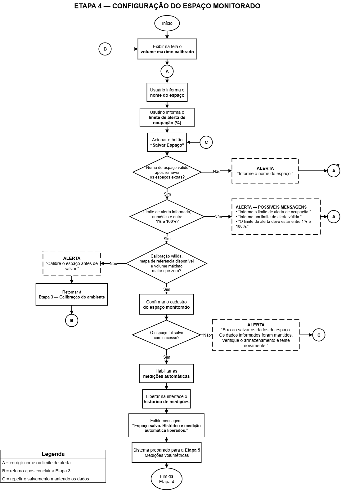
</p>

> **Nota:** A Etapa 4 representa a configuração operacional do espaço monitorado. O operador informa o nome do espaço, define o limite percentual de ocupação e visualiza o volume máximo calibrado. Ao acionar “Salvar Espaço”, o sistema valida os dados informados, verificando se o nome foi preenchido, se o limite está entre 1% e 100% e se existe calibração válida. Caso alguma condição falhe, a aplicação exibe o alerta correspondente e retorna para correção. Quando todas as validações são aprovadas, o sistema salva a configuração do espaço e do limite, liberando a medição volumétrica e o histórico.

A quarta etapa descreve a configuração do espaço que será monitorado pelo sistema. Após a calibração do ambiente, o operador informa o nome do espaço monitorado e define o limite percentual de ocupação que será utilizado para controle do status operacional.

A aplicação também apresenta o volume máximo calibrado, permitindo que o operador confirme que há uma referência válida antes de salvar a configuração.

Ao acionar o comando “Salvar Espaço”, o sistema valida os dados informados. Primeiro, verifica se o nome do espaço foi preenchido. Caso o campo esteja vazio, uma mensagem de alerta é exibida e o fluxo retorna para o preenchimento do nome.

Em seguida, o limite de ocupação é validado. O valor informado deve estar dentro da faixa permitida, entre 1% e 100%. Caso o limite seja inválido, o sistema apresenta um alerta e direciona o operador para correção do valor.

Por fim, o sistema verifica se a calibração do ambiente é válida. Se a calibração estiver ausente ou inválida, a aplicação informa que é necessário realizar a calibração antes de continuar.

Quando todas as validações são aprovadas, o sistema salva a configuração do espaço e do limite de ocupação. Após a confirmação, a medição volumétrica e o histórico são liberados.

#### Objetivo da Etapa

Validar e salvar as informações do espaço monitorado, garantindo que o nome, o limite de ocupação e a calibração estejam corretos antes de liberar a medição volumétrica.

---

### Etapa 5 — Medição Volumétrica

<p align="center">
  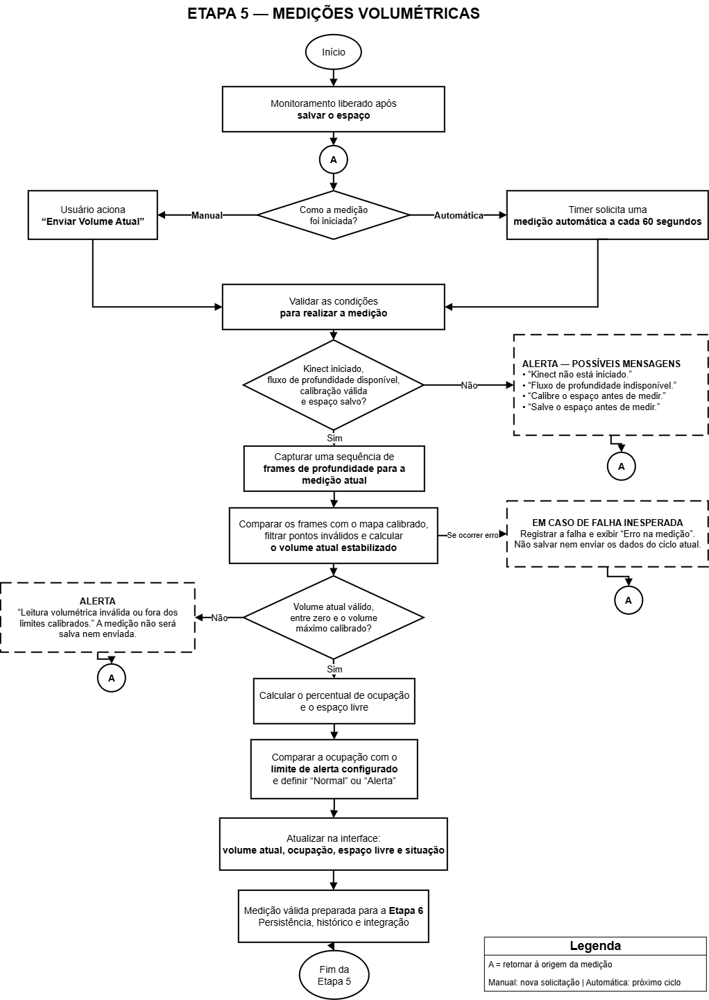
</p>

> **Nota:** A Etapa 5 representa a execução da medição volumétrica, que pode ocorrer de forma manual ou automática. A medição manual é iniciada quando o operador aciona “Enviar Volume Atual”, enquanto a medição automática é disparada pelo temporizador. Antes do cálculo, o sistema valida se o Kinect está conectado, se a calibração é válida e se o espaço foi configurado e salvo. Quando as condições não são atendidas, a tentativa é encerrada e o fluxo retorna para a origem da medição. Quando as condições são válidas, o sistema calcula o volume atual. Se nenhum volume válido for detectado, a medição não é salva nem enviada. Se o volume for maior que zero, o sistema registra o volume, calcula ocupação e espaço livre, compara com o limite configurado, define o status como Normal ou Alerta, atualiza os indicadores e encaminha a medição para persistência e integração.

A quinta etapa descreve o processo de medição volumétrica do ambiente monitorado. A medição pode ser iniciada manualmente pelo operador ou automaticamente pelo temporizador da aplicação.

No modo manual, o operador aciona o comando “Enviar Volume Atual”. No modo automático, o temporizador dispara uma nova solicitação de medição. Em ambos os casos, o fluxo segue para a validação das condições necessárias.

Antes de calcular o volume, o sistema verifica se o Kinect está conectado, se o ambiente possui calibração válida e se o espaço monitorado foi configurado e salvo. Caso alguma dessas condições não seja atendida, a aplicação exibe um alerta informando que a medição não pode ser realizada naquele momento. A tentativa atual é encerrada, e uma nova medição poderá ocorrer por novo acionamento manual ou pelo próximo ciclo automático.

Quando todas as condições são atendidas, o sistema calcula o volume atual do ambiente. Em seguida, verifica se o volume detectado é maior que zero. Caso nenhum volume válido seja identificado, a aplicação informa que não houve volume detectado e a medição não é salva nem enviada.

Quando o volume é válido, o sistema registra o último volume medido, calcula o percentual de ocupação, calcula o espaço livre e compara o percentual com o limite configurado. A partir dessa comparação, o status operacional é definido como “Normal” ou “Alerta”.

Por fim, os indicadores são atualizados na interface, e a medição válida é encaminhada para a etapa de persistência, histórico e integração com o MVC.

#### Objetivo da Etapa

Executar a medição volumétrica manual ou automática, validar as condições operacionais, calcular o volume atual, atualizar os indicadores da interface e encaminhar somente medições válidas para persistência e integração.

---

### Etapa 6 — Persistência, Histórico e Integração com MVC

<p align="center">
  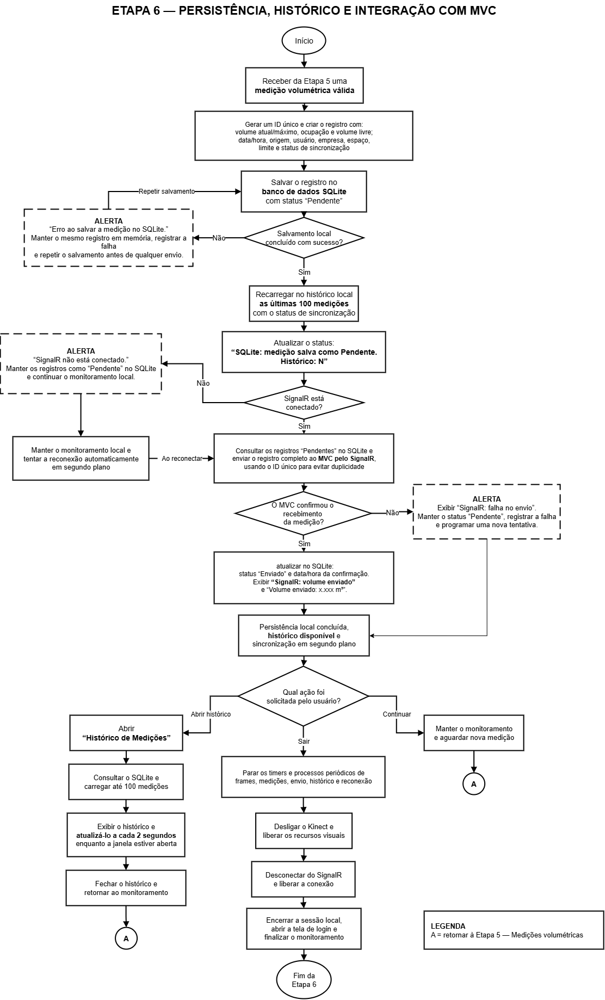
</p>

> **Nota:** A Etapa 6 representa a etapa final do ciclo operacional da medição. A medição válida recebe um identificador único e é salva primeiro no SQLite com o estado “Pendente”. Somente após o salvamento local o sistema tenta enviar os registros pendentes ao MVC pelo SignalR. O MVC precisa confirmar o recebimento da medição para que o estado local seja alterado para “Enviado”. Quando a comunicação está indisponível ou não há confirmação, os dados permanecem preservados localmente e uma nova tentativa é programada. O histórico continua disponível, e o operador pode retornar ao monitoramento ou solicitar o encerramento controlado dos recursos.

A sexta etapa descreve a persistência da medição válida, a atualização do histórico local, a integração com o módulo MVC e o encerramento controlado da operação.

O fluxo inicia com o recebimento de uma medição válida proveniente da etapa anterior. A aplicação gera um identificador único e cria um registro contendo volume atual e máximo, ocupação, volume livre, data e hora, origem, usuário, empresa, espaço, limite e estado de sincronização.

O registro é salvo no SQLite com o estado “Pendente”. Se o salvamento local falhar, o mesmo registro é mantido em memória, a falha é registrada e a gravação é repetida antes de qualquer tentativa de envio. Com o salvamento concluído, a aplicação recarrega até 100 medições no histórico, incluindo o estado de sincronização, e atualiza as informações apresentadas na interface.

Em seguida, a aplicação verifica a conexão SignalR. Quando o SignalR está conectado, consulta os registros pendentes no SQLite e envia o registro completo ao MVC. O identificador único é utilizado para evitar duplicidade. Depois do envio, o sistema verifica se o MVC confirmou o recebimento da medição.

Quando não há confirmação, o registro permanece como “Pendente”, a falha é registrada e uma nova tentativa é programada. Quando o MVC confirma o recebimento, o SQLite é atualizado com o estado “Enviado” e com a data e a hora da confirmação.

Se o SignalR estiver desconectado, os registros permanecem como “Pendente”, o monitoramento local é mantido e a aplicação tenta a reconexão em segundo plano. Ao reconectar, os registros pendentes são enviados ao MVC.

O operador pode consultar até 100 registros no histórico local, que é atualizado a cada dois segundos enquanto a janela estiver aberta. Depois da consulta, pode retornar ao monitoramento. Se optar por continuar, o fluxo retorna à Etapa 5 para uma nova medição.

Quando o encerramento é solicitado, a aplicação interrompe os processos periódicos de frames, medições, envio, histórico e reconexão, desliga o Kinect, libera os recursos visuais, desconecta o SignalR, encerra a sessão local, abre a tela de login e finaliza o monitoramento.

#### Objetivo da Etapa

Garantir que toda medição válida seja salva localmente, manter o histórico disponível, sincronizar os registros pendentes com o MVC de forma controlada e encerrar o monitoramento com segurança.

---

#### Considerações sobre os Diagramas de Fluxo MVVM

A divisão do fluxo operacional em seis etapas reduz a complexidade visual e facilita a compreensão do comportamento do sistema. Cada diagrama representa uma responsabilidade específica do módulo MVVM Kinect e evidencia os principais pontos de interação, validação, decisão, tratamento de falhas e continuidade operacional.

A sequência das etapas demonstra a dependência lógica existente entre os processos:

1. autenticação do operador;
2. inicialização do Kinect e gerenciamento da comunicação SignalR;
3. calibração do ambiente;
4. configuração e liberação do espaço monitorado;
5. captura, processamento e cálculo da medição volumétrica;
6. persistência local, consulta ao histórico, integração com a aplicação Web MVC e encerramento controlado da operação.

Os caminhos alternativos representados nos diagramas permitem visualizar como o sistema reage às principais condições de exceção. Falhas relacionadas ao e-mail, token, sensor Kinect, leitura de profundidade, calibração, configuração do espaço, ausência de volume válido e indisponibilidade da comunicação são tratadas por meio de alertas e retornos específicos, evitando a continuidade do fluxo em condições inválidas.

A arquitetura também prioriza a continuidade da operação local. As medições válidas são mantidas no armazenamento SQLite antes de qualquer tentativa de envio ao MVC. Dessa forma, mesmo quando a comunicação em tempo real por SignalR está indisponível, o módulo Kinect mantém suas funcionalidades essenciais, preserva o histórico local e acompanha o restabelecimento da conexão em segundo plano.

Em conjunto, os seis diagramas representam o ciclo operacional completo do módulo MVVM Kinect, desde a autenticação inicial até a medição, persistência dos dados, disponibilização do histórico, integração com o MVC e encerramento seguro da operação.

---

## Diagrama de Fluxo - MVC

### Login e Acesso Seguro

<p align="center">
  
</p>

Este fluxo garante que apenas usuários validados e com as permissões corretas consigam entrar no sistema e visualizar o painel principal.

#### 1. Entrada do E-mail (UC01 & UC02)

O usuário acessa a tela de login e informa seu endereço de e-mail.

- O sistema valida se o formato do e-mail é válido.
- Caso o formato esteja incorreto, o acesso é bloqueado imediatamente e uma mensagem de erro é exibida ao usuário.

#### 2. Verificação no Banco de Dados (UC04)

Após a validação do formato do e-mail, o sistema consulta o banco de dados para verificar:

- Se o usuário está cadastrado.
- Se a conta está com o status **Ativa**.

Caso o usuário não exista ou a conta esteja inativa, o acesso é negado.

#### 3. Geração e Envio do Token (UC05 a UC08)

Se o usuário estiver ativo, o sistema:

1. Gera um **Token OTP** (senha temporária).
2. Armazena no banco de dados o hash do token e sua data de expiração.
3. Envia o token para o e-mail do usuário.

#### 4. Validação do Token (UC10 & UC12)

O usuário:

1. Acessa seu e-mail.
2. Copia o token recebido.
3. Informa o token na tela de validação.

O sistema verifica a validade do token.

- Se o token estiver expirado, o acesso é negado.
- Se o token estiver incorreto, uma mensagem de erro é exibida.

#### 5. Criação da Sessão e Redirecionamento (UC13 a UC17)

Quando o token é validado com sucesso, o sistema:

1. Marca o token como **utilizado**, impedindo seu reaproveitamento.
2. Cria uma **Sessão Segura** (Cookie/Auth).
3. Verifica o perfil e as permissões do usuário.

Se o usuário possuir autorização para acessar o Dashboard, ele é redirecionado para a tela inicial do sistema com sucesso.

### Gestão de Usuários (Visualização de Detalhes e Exclusão)

<p align="center">
  
</p>

Este fluxo descreve o processo de governança de contas de usuários, permitindo que administradores consultem informações detalhadas e realizem a exclusão segura de usuários, mantendo registros para auditoria.

#### 1. Visualização de Detalhes (Modo Leitura)

### Requisição por ID (UC31)

O administrador seleciona um colaborador na lista de usuários, acionando uma requisição **HTTP GET** para `Details(id)`.

O sistema realiza as seguintes validações:

- Verifica se o identificador (**ID**) foi informado.
- Caso o ID seja nulo ou vazio, retorna uma resposta **BadRequest**.

### Consulta ao Banco de Dados

Após validar o ID, o sistema consulta o **UsuariosRepository**, que busca o registro correspondente nas coleções do **Firebase**.

- Se o usuário não for encontrado, uma mensagem de erro (**NotFound**) é exibida utilizando **TempData**.
- Se o usuário existir, o sistema valida as permissões de acesso do administrador e carrega os dados em modo de leitura.

As informações exibidas incluem:

- Nome
- E-mail
- Perfil
- Empresa

### Registro de Auditoria (UC31)

Sempre que a tela de detalhes é acessada, o sistema registra um **Log Operacional** contendo a ação realizada.

Esse log é armazenado no banco de dados para fins de auditoria e rastreabilidade do acesso a informações sensíveis.

---

## 2. Processo de Exclusão Segura

### Confirmação e Validações (UC35)

Na tela de detalhes, o administrador possui a opção de excluir o usuário.

Ao confirmar a operação, o sistema envia uma requisição **HTTP POST** para `DetailsConfirmed`, protegida pelos seguintes mecanismos de segurança:

- **ValidateAntiForgeryToken**
- Validação do **ModelState**

### Remoção Definitiva (UC35)

Após todas as validações serem aprovadas, o sistema estabelece conexão com o **Firebase** e remove permanentemente o registro do usuário da coleção.

### Encerramento do Processo

Após a exclusão, o sistema executa as seguintes ações:

1. Registra um **Log Operacional** informando:
   - O administrador responsável pela exclusão;
   - O usuário que foi removido.
2. Salva o log no banco de dados.
3. Redireciona o administrador para a lista geral de usuários.
4. Exibe uma mensagem informando que a exclusão foi realizada com sucesso.

# Gestão de Parceiros (Cadastro, Edição, Exclusão e Controle de Status)

<p align="center">
  
</p>

Este fluxo descreve todo o ciclo de vida da gestão de parceiros comerciais no sistema, abrangendo a consulta, o cadastro, a edição, a alteração de status e a exclusão segura dos registros, com mecanismos de validação e auditoria.

## 1. Consulta, Filtros e Listagem (Interface Web)

### Acesso à Tela (UC42–UC47)

O Administrador ou Gestor acessa a tela de parceiros por meio de uma requisição **HTTP GET** para `Index`.

O sistema consulta o **Firebase**, recuperando todos os parceiros vinculados à empresa do usuário autenticado.

### Tratamento dos Resultados

Após a consulta, o sistema verifica o resultado da pesquisa.

- Se nenhum parceiro for encontrado, é exibida a mensagem:
  - **"Nenhum parceiro encontrado."**
- Caso existam registros, o sistema aplica os filtros informados pelo usuário.

Os filtros disponíveis incluem:

- Busca por termo;
- Data inicial;
- Data final;
- Status (Ativo/Inativo).

Após a filtragem, os registros são ordenados, paginados e apresentados na interface contendo as seguintes informações:

- Nome;
- Empresa;
- E-mail;
- Telefone;
- Status.

---

## 2. Cadastro de Novo Parceiro

### Abertura do Formulário (UC48)

Ao selecionar a opção **"Novo Parceiro"**, é enviada uma requisição **HTTP GET** para `Create`.

O sistema exibe um formulário vazio contendo os campos necessários para cadastro, além de dicas e tooltips de auxílio ao preenchimento.

### Envio dos Dados (UC48)

Após preencher o formulário, o usuário envia uma requisição **HTTP POST** para `Create`.

Antes da gravação, o sistema executa as seguintes validações:

- Validação do **ModelState**;
- Verificação dos campos obrigatórios;
- Validação dos formatos informados;
- Proteção contra ataques de falsificação utilizando **ValidateAntiForgeryToken**.

### Persistência dos Dados

Após as validações:

- Se o formulário possuir erros, os campos inválidos são destacados e as mensagens de erro são exibidas.
- Caso todas as validações sejam aprovadas:
  1. O parceiro é salvo no **Firebase**;
  2. Um **Log Operacional** é registrado;
  3. Uma mensagem de sucesso é exibida ao usuário utilizando **TempData**.

---

## 3. Visualização de Detalhes e Edição

### Visualização de Detalhes (UC49)

Ao solicitar os detalhes de um parceiro, o sistema envia uma requisição **HTTP GET** para `Details(id)`.

São realizadas as seguintes validações:

- Verificação da validade do ID informado;
- Consulta ao Firebase para localizar o parceiro.

Caso o registro não seja encontrado, o sistema apresenta uma mensagem de **NotFound**.

Se localizado, todas as informações do parceiro são exibidas em uma tela detalhada.

### Alteração de Dados (UC50)

Ao selecionar a opção de edição, é enviada uma requisição **HTTP GET** para `Edit(id)`.

O sistema carrega o formulário preenchido com os dados atuais do parceiro, incluindo:

- Inputs;
- Checkboxes;
- Campos Select.

Após as alterações, o formulário é enviado por meio de uma requisição **HTTP POST** para `Edit`.

O sistema então:

1. Valida os dados recebidos;
2. Verifica se houve alguma modificação em relação aos dados originais;
3. Atualiza o registro no **Firebase**, caso existam alterações válidas;
4. Registra um **Log Operacional** informando a edição realizada com sucesso.

---

## 4. Controle de Status e Exclusão

### Alternar Status (UC51 e UC52)

O administrador pode alterar rapidamente o status de um parceiro utilizando uma ação **HTTP POST** para `AlternarStatus`.

O sistema executa as seguintes etapas:

1. Valida o ID recebido;
2. Altera o campo booleano responsável pelo status (Ativo/Inativo);
3. Salva a alteração;
4. Redireciona novamente para a listagem;
5. Exibe uma mensagem de confirmação utilizando **TempData**, informando se o parceiro foi ativado ou inativado.

### Exclusão do Registro (UC53)

Para remover um parceiro, o sistema executa uma requisição **HTTP POST** para `DeleteConfirmed`.

Antes da exclusão definitiva, é realizada uma verificação de integridade para identificar possíveis dependências associadas ao parceiro, como notificações vinculadas.

O fluxo segue duas possibilidades:

- **Se houver dependências:**
  - A exclusão é cancelada;
  - O sistema apresenta uma mensagem informando que não foi possível excluir o parceiro devido às dependências existentes.

- **Se não houver impedimentos:**
  1. O parceiro é removido definitivamente do **Firebase**;
  2. Um **Log Operacional** registra a exclusão realizada;
  3. A listagem de parceiros é recarregada;
  4. Uma mensagem de sucesso é exibida ao usuário.

# Gestão de Medições (Listagem, Filtros e Recebimento via Kinect)

<p align="center">
  
</p>

Este fluxo descreve o gerenciamento das medições de volumetria do estoque, integrando a consulta histórica realizada pelos usuários com o recebimento automático de dados em tempo real enviados pelo sensor Kinect.

## 1. Consulta, Filtros e Listagem (Interface Web)

### Acesso à Tela (UC63)

O usuário autorizado acessa a tela de medições por meio de uma requisição **HTTP GET** para `Index`.

O sistema consulta a coleção de medições armazenadas no **Firebase**.

### Tratamento dos Resultados

Após a consulta, o sistema verifica os registros encontrados.

- Caso não existam medições cadastradas, é exibida a mensagem:
  - **"Nenhuma medição encontrada."**

- Caso existam registros, o sistema aplica os filtros disponíveis.

Os filtros incluem:

- Origem da medição;
- Status;
- Data inicial;
- Data final.

Após a filtragem, os registros são ordenados de forma decrescente e paginados utilizando a lógica de **Skip/Take (UC67)**.

A tabela apresenta informações como:

- Volume medido;
- Origem da leitura;
- Status da medição, identificado por badges coloridos:
  - Verde: Normal;
  - Amarelo/Vermelho: Alerta.

---

## 2. Recebimento Automático das Medições (Aplicação Kinect)

### Captura das Leituras (UC69)

O aplicativo responsável pelo sensor Kinect envia continuamente as medições para o **SignalR Hub**, por meio do serviço de recebimento de medições.

Ao receber uma nova leitura, o sistema valida a integridade do identificador (**ID**) enviado.

### Persistência e Atualização das Estatísticas (UC70–UC72)

Após a validação, o sistema:

1. Monta o objeto contendo os dados da medição;
2. Persiste o registro no **Firebase**.

Na sequência, são executados os cálculos estatísticos da aplicação, incluindo:

- Total de medições;
- Média dos volumes;
- Última medição registrada;
- Verificação das metas e geração de alertas.

Com os novos valores calculados, os **Cards de Métricas** e os gráficos do Dashboard são atualizados automaticamente através do envio de um **JSON (HTTP POST Summary)**.

---

## 3. Ações Administrativas

### Visualização de Detalhes e Edição (UC69 e UC71)

O administrador pode consultar uma medição específica ou editar seus dados.

Ao editar um registro, o sistema:

1. Carrega o formulário contendo os dados atuais;
2. Valida o **ModelState**;
3. Compara os dados enviados com o estado anterior;
4. Salva as alterações caso sejam válidas.

### Inativação da Medição (UC70)

Quando uma leitura incorreta ou inválida é identificada, o administrador pode desativar o registro.

A operação é realizada por meio de uma requisição **HTTP POST** protegida por **ValidateAntiForgeryToken**.

O sistema:

1. Valida o registro solicitado;
2. Verifica possíveis dependências;
3. Atualiza o status da medição para **Inativa (Status = false)** na coleção operacional do **Firebase**.

---

# Gestão de Perfis (Cadastro, Permissões e Inativação)

<p align="center">
  
</p>

Este fluxo descreve o gerenciamento dos perfis de acesso da aplicação, permitindo controlar permissões, cadastrar novos perfis, editar privilégios e realizar a inativação segura quando necessário.

## 1. Consulta, Filtros e Listagem (Interface Web)

### Carregamento da Lista (UC36)

O Administrador Gestor acessa a tela de perfis através de uma requisição **HTTP GET** para `Index`.

O sistema consulta os perfis cadastrados no **Firebase**.

### Exibição dos Dados

Após recuperar os registros, o sistema aplica filtros utilizando:

- Nome do perfil;
- Descrição;
- Status.

Os resultados são organizados em uma listagem paginada contendo:

- Nome do perfil;
- Descrição;
- Quantidade de permissões associadas;
- Status atual do perfil.

---

## 2. Cadastro de Novo Perfil

### Abertura do Formulário (UC37 e UC41)

Ao selecionar **"Novo Perfil"**, o sistema envia uma requisição **HTTP GET** para `Create`.

É apresentado um formulário contendo:

- Campos para identificação do perfil;
- Tooltips explicativas;
- Lista de permissões disponíveis por meio de caixas de seleção.

### Validação e Persistência

Ao enviar o formulário (**HTTP POST Create**), o sistema executa:

- Validação do **ModelState**;
- Verificação dos dados obrigatórios.

Caso todas as validações sejam aprovadas:

1. O perfil é salvo no **Firebase**;
2. Um **Log Operacional** é registrado;
3. Uma mensagem de sucesso é armazenada em **TempData**.

---

## 3. Visualização de Detalhes e Edição

### Visualização Completa (UC39)

Ao solicitar os detalhes de um perfil, o sistema executa uma requisição **HTTP GET** para `Details(id)`.

São realizadas as seguintes etapas:

1. Validação do ID informado;
2. Consulta ao Firebase;
3. Exibição das informações do perfil e das permissões associadas.

O acesso também gera um **Log Operacional** para auditoria.

### Alteração de Permissões (UC38 e UC41)

Ao editar um perfil (**HTTP GET Edit**), o sistema carrega:

- Campos de entrada;
- Checkboxes das permissões atualmente atribuídas.

Após o envio (**HTTP POST Edit**), o sistema:

1. Valida o formulário;
2. Normaliza os dados recebidos;
3. Verifica se houve alterações em relação ao estado anterior;
4. Atualiza o perfil e suas permissões no **Firebase**;
5. Registra um **Log Operacional** documentando a alteração.

---

## 4. Inativação de Perfis

### Alteração do Status (UC40, UC51 e UC52)

O administrador pode alterar rapidamente o status de um perfil utilizando a opção de alternância disponível na listagem.

A operação é realizada por uma requisição **HTTP POST** protegida por mecanismos de antifalsificação.

### Verificação de Dependências (UC40)

Antes de concluir a inativação, o sistema verifica se existem usuários ativos associados ao perfil.

O fluxo segue duas possibilidades:

- **Se existirem usuários vinculados:**
  - A operação é interrompida;
  - Uma exceção é tratada e a inativação é cancelada por motivos de segurança.

- **Se não houver dependências:**
  1. O status do perfil é alterado para **Inativo (Status = false)**;
  2. O repositório salva as alterações no **Firebase**;
  3. A base operacional de segurança da aplicação é atualizada com o novo estado do perfil.

---

# Gestão de Notificações (Listagem, Filtros, Resumo e Ações)

<p align="center">
  
</p>

Este fluxo descreve o gerenciamento das notificações geradas pelo sistema, permitindo o monitoramento de alertas, o recebimento automático de eventos provenientes do Kinect e a confirmação de coletas em tempo real por meio do SignalR.

## 1. Consulta e Monitoramento de Alertas (Interface Web)

### Listagem Geral (UC100)

O usuário autorizado acessa a tela de notificações por meio de uma requisição **HTTP GET** para `Index`.

O sistema consulta o **Firebase**, recuperando o histórico de notificações e os parceiros relacionados.

Após a consulta, são apresentados **Cards de Métricas**, contendo indicadores consolidados como:

- Total de notificações;
- Notificações processadas com sucesso;
- Notificações com erro;
- Notificações pendentes.

### Listagem e Filtros (UC101 e UC107)

As notificações são exibidas em uma tabela contendo informações como:

- Data;
- Parceiro ou destinatário;
- Empresa;
- Tipo da notificação;
- Mensagem;
- Volume associado.

Cada registro apresenta uma identificação visual por meio de **badges de status**, indicando situações como:

- Success;
- Warning;
- Danger;
- Ack Warning.

O usuário pode utilizar filtros para localizar registros específicos, incluindo:

- Data inicial;
- Data final;
- Tipo da notificação;
- Status.

Após a aplicação dos filtros, os resultados são ordenados em ordem decrescente e paginados para facilitar a navegação.

---

## 2. Geração Automática e Integração em Tempo Real

### Processamento da Coleta (UC69 e UC103)

O sistema recebe automaticamente eventos enviados pela aplicação de notificações do Kinect através de uma requisição **HTTP POST** para `AceitarColeta`.

Ao receber a solicitação, são realizadas validações para garantir a integridade das informações recebidas.

### Geração e Distribuição da Notificação (UC104)

Após a validação dos dados, o sistema:

1. Persiste a medição original no **Firebase**;
2. Executa a rotina de geração da notificação;
3. Registra as informações necessárias para auditoria.

Na sequência, a nova notificação é publicada no **NotificacaoHub**, utilizando **SignalR**, permitindo que todos os operadores conectados recebam o alerta instantaneamente.

---

## 3. Configuração de Regras e Confirmação da Coleta

### Criação e Edição de Regras (UC67, UC71 e UC88)

Para cadastrar ou alterar regras de notificação, o sistema disponibiliza formulários específicos.

Durante o envio das informações, são executadas as seguintes validações:

- Validação do **ModelState**;
- Verificação da consistência dos dados;
- Comparação entre os dados existentes e as alterações realizadas.

Após a validação, o sistema calcula estatísticas relacionadas às notificações e salva as novas configurações na coleção correspondente do **Firebase**.

### Confirmação da Coleta (UC103)

Quando a atualização do banco de dados é concluída com sucesso, o sistema responde à requisição por meio de um **HTTP POST Aceitar**, retornando um objeto **Success (JSON)**.

Em seguida:

1. O novo status da coleta é persistido no **Firebase**;
2. Os clientes conectados recebem a atualização em tempo real através do **SignalR**;
3. O operador visualiza imediatamente a confirmação da coleta na interface;
4. Um **Log Operacional** é registrado, encerrando o ciclo de auditoria da notificação.

---
# Gestão de Parâmetros do Sistema (Configurações Gerais e Kinect)

<p align="center">
  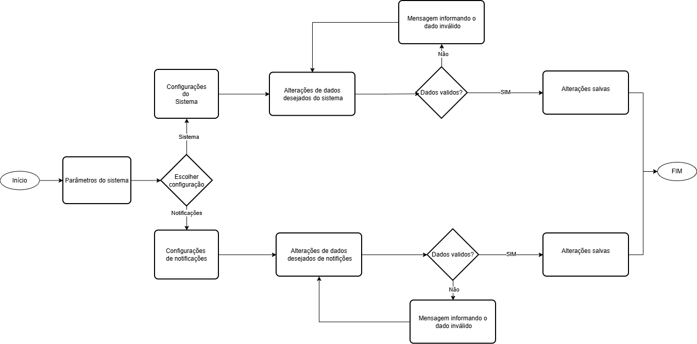
</p>

Este fluxo descreve o gerenciamento das configurações globais da aplicação, permitindo administrar parâmetros operacionais do sistema, configurações do sensor Kinect, regras de notificações e rotinas de calibração, garantindo a consistência das configurações e a integridade da operação.

## 1. Consulta e Exibição de Configurações

### Carregamento das Configurações (UC200)

O usuário com permissão para administrar configurações acessa a tela por meio de uma requisição **HTTP GET** para `Index`.

O sistema consulta o **Firebase**, recuperando os parâmetros gerais da aplicação.

### Painel de Configurações

Após a consulta, as informações são organizadas em blocos distintos na interface.

#### Card 1 – Configurações do Sistema

São apresentados parâmetros relacionados ao funcionamento geral da aplicação, incluindo:

- Capacidade máxima do estoque;
- Capacidade mínima;
- Configurações do sensor Kinect;
- Parâmetros operacionais.

#### Card 2 – Configurações de Notificações

O sistema disponibiliza configurações referentes ao processo de envio de notificações, como:

- Templates de mensagens;
- Canais de comunicação ativos;
- Regras de escalonamento de alertas.

#### Bloco de Pré-visualização

A interface apresenta uma visualização em tempo real da mensagem que será enviada aos usuários.

A prévia utiliza variáveis dinâmicas, como:

- Identificador do sensor;
- Percentual de ocupação;
- Data e hora;
- Links da aplicação.

---

## 2. Alteração de Configurações e Regras de Negócio

### Salvamento das Alterações (UC201)

Após modificar os parâmetros desejados, o usuário seleciona a opção **"Salvar Alterações"**.

O sistema envia uma requisição **HTTP POST** para `Salvar`, contendo o objeto `ModelConfiguracoes`.

### Validação dos Dados

Antes da persistência, o sistema executa diversas validações.

Inicialmente, é realizada a validação do **ModelState**, verificando:

- Campos obrigatórios;
- Tipos de dados;
- Formatos permitidos.

Em seguida, são aplicadas as regras de negócio da aplicação.

Entre elas:

- Verificar se a capacidade mínima é inferior à capacidade máxima;
- Validar limites permitidos para os parâmetros do Kinect;
- Garantir a consistência das configurações de notificações.

Caso alguma regra seja violada, a operação é interrompida e o sistema retorna um **StatusCode 500**, informando que a configuração não pôde ser processada.

### Persistência das Configurações

Se todas as validações forem aprovadas, o sistema:

1. Compara os novos valores com a configuração atual;
2. Verifica se houve alteração efetiva dos dados;
3. Atualiza os parâmetros no **Firebase**;
4. Registra um **Log Operacional** contendo as modificações realizadas;
5. Exibe uma mensagem de sucesso utilizando **TempData**.

---

## 3. Calibração do Sensor Kinect e Restauração de Configurações

### Calibração do Sensor (UC202)

Quando necessário, o operador pode iniciar uma nova calibração do sensor Kinect selecionando a opção **"Iniciar Calibração"**.

Essa ação envia uma requisição **HTTP POST** para `IniciarCalibracao`.

O sistema realiza as seguintes etapas:

1. Valida o identificador do dispositivo;
2. Verifica se o sensor está apto para iniciar a operação;
3. Ativa o modo de calibração (**Status = true**);
4. Inicia a rotina de calibração do equipamento.

Caso ocorra alguma falha durante o processo, o sistema utiliza os parâmetros globais de segurança previamente configurados para preservar a integridade da operação.

### Restauração dos Padrões do Sistema

Se alterações manuais comprometerem o funcionamento da aplicação, o administrador pode selecionar a opção **"Restaurar Padrões"**.

O sistema então:

1. Recupera as configurações padrão da aplicação;
2. Valida as permissões e dependências do perfil responsável pela operação;
3. Restaura os parâmetros originais no **Firebase**;
4. Registra um **Log Operacional** contendo todas as alterações realizadas durante a restauração;
5. Atualiza a aplicação com as configurações restauradas.
---

## Diagrama de Sequência do Módulo Kinect (MVVM)

O Diagrama de Sequência do módulo Kinect apresenta o comportamento dinâmico da aplicação durante a execução das principais funcionalidades do sistema. Diferentemente do Diagrama de Casos de Uso, que demonstra as funcionalidades disponíveis ao usuário, o Diagrama de Sequência evidencia a ordem cronológica das mensagens trocadas entre os componentes internos do sistema.

Essa representação permite compreender como ocorre o fluxo completo do módulo Kinect/Desktop, desde a autenticação do operador, inicialização do sensor, calibração do ambiente, configuração do espaço monitorado, execução das medições volumétricas, persistência local dos dados, sincronização com o módulo MVC e encerramento seguro do monitoramento.

Para facilitar a leitura e reduzir a complexidade visual, o fluxo foi dividido em seis sequências principais, cada uma representando uma fase específica da operação do sistema.

---

### Sequência 1 — Acesso e Autenticação do Kinect

<p align="center">
  
</p>

> **Nota:** A Sequência 1 representa o controle de acesso ao módulo Kinect/Desktop. O fluxo demonstra que o operador somente consegue acessar a tela de monitoramento após informar um e-mail cadastrado, receber o token temporário por e-mail e ter esse token validado pelo módulo MVC. A criação da sessão local garante que as próximas operações do sistema fiquem vinculadas ao usuário, à empresa, ao e-mail e ao token autenticado. Por segurança, o MVC armazena o hash do token e o marca como utilizado após a validação; o token mantido na sessão local não deve ser exibido nem registrado em logs.

A primeira sequência representa o processo de acesso e autenticação do operador no módulo Kinect/Desktop. Inicialmente, o operador abre a aplicação Kinect, informa o endereço de e-mail previamente cadastrado no sistema MVC e aciona a opção **“Solicitar token ao MVC”**.

A tela `KinectLogin` encaminha a solicitação ao `AutenticacaoMvcService`, que envia o e-mail ao endpoint `POST /api/kinect/solicitar-token`, disponibilizado pelo `KinectApiController`. O `TokenAcessoKinectService` verifica se o e-mail informado está cadastrado e vinculado a um usuário ativo. Em caso positivo, o MVC gera um token temporário e utiliza o `EmailTokenService` para enviá-lo ao endereço cadastrado.

Após receber o código, o operador informa o token na aplicação Kinect e aciona a opção **“Validar token e entrar”**. O `AutenticacaoMvcService` envia o token ao endpoint `POST /api/kinect/validar-token`. O MVC verifica se o token é válido, se ainda está dentro do prazo de utilização, se não foi utilizado anteriormente e se não está revogado.

Quando todas as validações são aprovadas, o MVC marca o token como utilizado e retorna os dados do usuário autenticado. A aplicação cria uma sessão local contendo usuário, empresa, e-mail e token. Em seguida, o `KinectLogin` cria o `KinectMonitorWindow`, que inicializa o `MainViewModel`, exibe a tela de monitoramento e permite o prosseguimento para a **Etapa 2 — Conexão do Kinect e comunicação com SignalR**.

Caso o e-mail não seja encontrado, o usuário esteja inativo ou o token informado seja inválido, expirado, utilizado ou revogado, o sistema bloqueia o acesso e permite que o operador realize uma nova tentativa.

### Objetivo da Sequência

Garantir que apenas usuários cadastrados, ativos e devidamente autenticados possam acessar o módulo Kinect/Desktop, criar uma sessão operacional local e iniciar o monitoramento volumétrico.
---

### Sequência 2 — Conexão do Kinect e Comunicação SignalR

<p align="center">
  
</p>

> **Nota:** A Sequência 2 demonstra a preparação inicial do ambiente operacional. O Kinect precisa estar localizado, conectado e inicializado para que o sistema possa avançar para a calibração. A conexão SignalR é estabelecida com o endpoint `/medicaoHub` para disponibilizar a comunicação em tempo real com o módulo MVC. Caso essa conexão não seja estabelecida, o operador pode escolher entre continuar em modo local ou realizar uma nova tentativa, mantendo a operação resiliente diante de falhas de rede.

Após a autenticação bem-sucedida, o operador acessa a tela de monitoramento. A interface apresenta inicialmente os estados **“Kinect desligado”** e **“SignalR desconectado”**. Em seguida, o operador aciona o botão **“Ligar Kinect”**.

A `KinectMonitorWindow`, que representa a View, executa o `LigarKinectCommand` no `MainViewModel`. O ViewModel solicita ao `KinectService` a inicialização do sensor por meio do método `Start()`.

O `KinectService` procura um sensor disponível. Quando o Kinect é localizado, o serviço habilita os fluxos RGB e de profundidade e inicia o sensor. Após a conclusão desse processo, o `MainViewModel` atualiza a interface com o estado **“Kinect conectado”**.

Caso o Kinect não seja localizado ou esteja indisponível, o sistema interrompe o avanço da sequência, atualiza o estado de erro e apresenta orientações para que o operador verifique os cabos, a fonte de alimentação, a porta USB e os drivers instalados. Após essa verificação, uma nova tentativa de inicialização pode ser realizada. Nessa situação, a conexão SignalR e a calibração do ambiente não são liberadas.

Com o Kinect inicializado, o `MainViewModel` solicita ao `SignalRService` a abertura da comunicação por meio do método `ConectarAsync()`. O serviço tenta estabelecer a conexão com o Hub SignalR do módulo MVC utilizando o endpoint `/medicaoHub`.

Quando a conexão SignalR é estabelecida, o `SignalRService` informa o estado conectado ao `MainViewModel`. O ViewModel atualiza a interface, inicia o temporizador responsável pela atualização dos dados e libera a **Etapa 3 — Calibração do Ambiente**. Nesse momento, o canal em tempo real e a calibração ficam disponíveis para o operador.

Caso ocorra uma falha na conexão inicial ou o módulo MVC esteja indisponível, o sistema atualiza o estado para **“SignalR sem conexão”** e orienta o operador a verificar a rede, a URL configurada e a disponibilidade do MVC. Em seguida, são apresentadas as opções de continuar em modo local ou tentar estabelecer a conexão novamente.

Ao escolher **“Continuar em modo local”**, o sistema mantém o Kinect ativo, inicia o temporizador de atualização, altera o estado da interface para **“modo local”** e libera a calibração do ambiente. Dessa forma, a indisponibilidade do SignalR não impede a continuidade da operação, desde que o Kinect esteja conectado e funcional.

Ao escolher **“Tentar novamente”**, o sistema executa uma nova chamada ao método `ConectarAsync()`. A tentativa pode ser repetida enquanto o SignalR permanecer desconectado e o operador solicitar uma nova conexão.

Como observação de aderência ao código, o modo local representa o comportamento projetado para o sistema. Para que esse fluxo seja reproduzido integralmente na implementação, a exceção gerada por `ConectarAsync()` deverá ser tratada separadamente, e o método `IniciarTimerFrames()` deverá ser executado após a escolha do operador pela continuidade em modo local.

### Objetivo da Sequência

Inicializar o sensor Kinect, verificar a disponibilidade do hardware, habilitar os recursos de captura RGB e profundidade e estabelecer a comunicação em tempo real com o módulo MVC por meio do SignalR. Em caso de indisponibilidade da conexão, o sistema deve permitir que o operador continue em modo local ou realize novas tentativas, garantindo que a calibração seja liberada somente quando o Kinect estiver ativo e funcional.
---

### Sequência 3 — Calibração do Ambiente

<p align="center">
  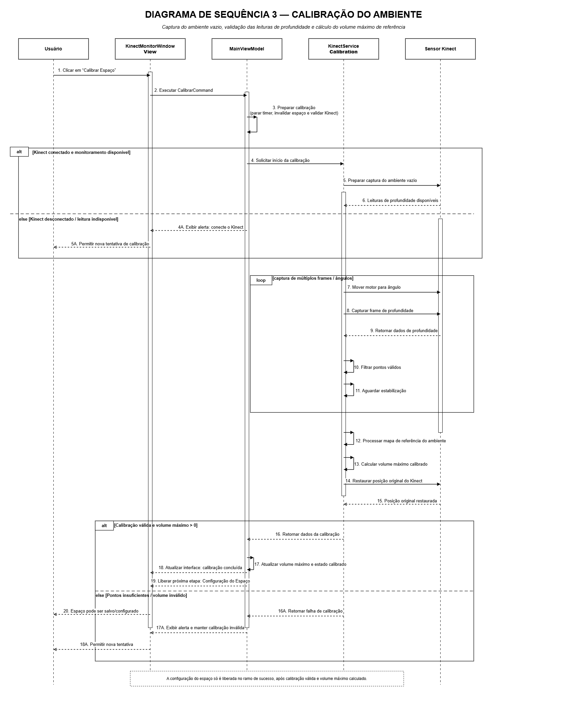
</p>

> **Nota:** A Sequência 3 representa a calibração do ambiente vazio, etapa essencial para que o sistema obtenha uma referência volumétrica confiável. Antes da captura, o operador recebe orientações e confirma que o ambiente está vazio. O sistema interrompe temporariamente as atualizações, invalida a calibração anterior, captura múltiplos frames de profundidade, valida os pontos, consolida o mapa de referência e calcula o volume máximo. A Etapa 4 somente é liberada após uma calibração válida e a restauração da posição original do Kinect.

A terceira sequência representa o processo de calibração do ambiente físico que será monitorado. Inicialmente, o operador aciona o comando **“Calibrar Espaço”** na interface. A `KinectMonitorWindow` encaminha a ação ao `MainViewModel`, que solicita a exibição do vídeo ou das orientações necessárias para preparar o ambiente.

Após receber as orientações, o operador confirma que o espaço está vazio e solicita o início da calibração. A View executa o comando de confirmação, e o `MainViewModel` prepara o processo, interrompendo temporariamente o temporizador de atualização, invalidando a calibração anterior e verificando as condições necessárias.

A calibração somente é iniciada quando o Kinect está ativo, o fluxo de profundidade está disponível e o ambiente vazio foi confirmado pelo operador. Quando essas condições são atendidas, o `MainViewModel` solicita ao `KinectService` o início da calibração. O serviço prepara a captura do ambiente vazio, verifica a disponibilidade das leituras de profundidade e atualiza a interface com o estado **“Calibração em andamento”**.

Durante a calibração, o sistema executa um ciclo de captura para diferentes ângulos e conjuntos de frames. Em cada repetição, o Kinect é movimentado para o próximo ângulo, o sistema aguarda a estabilização do sensor e, somente depois, captura o frame de profundidade. Os dados retornados são filtrados, e os pontos válidos são acumulados para o processamento.

Após concluir as capturas, o `KinectService` valida a quantidade e a qualidade dos pontos, detecta a referência angular e consolida o mapa de referência do ambiente vazio. Com base nesse mapa, o sistema calcula o volume máximo do espaço. Ao final do processamento, a posição original do Kinect é restaurada.

Quando as leituras são suficientes, o mapa de referência é válido e o volume máximo calculado é maior que zero, o `KinectService` retorna ao `MainViewModel` o resultado da calibração, incluindo o volume máximo e a quantidade de pontos válidos. O sistema marca o ambiente como calibrado, define a ocupação inicial como `0%` e calcula o volume livre inicial com base no volume máximo.

Em seguida, a interface é atualizada com o volume máximo, a quantidade de pontos válidos, a ocupação inicial e o volume livre. O sistema exibe a mensagem **“Calibração concluída”**, orienta o operador a salvar o espaço e libera a **Etapa 4 — Configuração e salvamento do espaço monitorado**.

Caso as leituras sejam insuficientes, a referência seja inválida ou o volume máximo calculado seja menor ou igual a zero, o sistema mantém o espaço como não calibrado, exibe uma mensagem de erro, orienta a verificação do Kinect e do ambiente vazio e permite uma nova tentativa.

Se o Kinect estiver indisponível, não houver fluxo de profundidade ou o ambiente vazio não tiver sido confirmado, a calibração não será iniciada. Nesse cenário, o sistema apresenta as orientações necessárias, mantém o espaço como não calibrado e permite que o operador tente novamente.

### Objetivo da Sequência

Preparar e capturar o ambiente vazio, validar as leituras de profundidade, gerar uma referência espacial confiável e calcular o volume máximo calibrado que será utilizado como base para a configuração do espaço e para as futuras medições volumétricas.

---

### Sequência 4 — Configuração do Espaço Monitorado

<p align="center">
  
</p>

> **Nota:** A Sequência 4 demonstra a configuração do espaço monitorado após a calibração. O sistema valida o nome do espaço, o limite percentual de ocupação, o mapa de referência e o volume máximo calibrado. A configuração é persistida no SQLite e somente após a confirmação do salvamento o espaço é marcado como salvo, o temporizador automático de 60 segundos é iniciado e a Etapa 5 é liberada.

Após a calibração válida do ambiente, o operador acessa a etapa de configuração do espaço monitorado. A interface carrega os dados da calibração e exibe o volume máximo calibrado. Em seguida, o operador informa o nome do espaço e o limite percentual de ocupação que será utilizado como referência para os alertas operacionais.

A interface atualiza os dados informados por meio dos bindings vinculados ao `MainViewModel`. Após preencher as informações, o operador aciona o comando “Salvar Espaço”, executando o `SalvarEspacoCommand`.

O sistema aplica `Trim()` ao nome informado e verifica se ele permanece válido após a remoção dos espaços extras. Também verifica se o limite de alerta foi informado, se possui valor numérico e se está dentro do intervalo permitido, entre 1% e 100%.

Além dessas verificações, o sistema confirma se existe uma calibração válida, se o mapa de referência está disponível e se o volume máximo calibrado é maior que zero.

Quando todas as condições são atendidas, o `MainViewModel` solicita ao `EspacoRepository` o salvamento assíncrono da configuração no SQLite por meio da operação `SalvarConfiguracaoAsync(...)`. São persistidos o nome do espaço, o limite de ocupação, o volume máximo calibrado e o mapa de referência.

Somente após a confirmação da persistência, o sistema define `EspacoSalvo = true`, inicia o `DispatcherTimer` com intervalo de 60 segundos e libera a medição automática, o histórico de medições e a Etapa 5 — Medições Volumétricas.

Caso ocorra uma falha durante a persistência da configuração, o sistema mantém os dados preenchidos, exibe uma mensagem de erro de armazenamento e permite que o operador realize uma nova tentativa.

Se a calibração estiver inválida, o mapa de referência estiver indisponível ou o volume máximo for menor ou igual a zero, o sistema orienta o operador a retornar à Etapa 3 — Calibração do Ambiente.

Caso o nome do espaço esteja vazio, o limite de alerta não tenha sido informado, não seja numérico ou esteja fora do intervalo entre 1% e 100%, o sistema exibe a mensagem correspondente e mantém os dados disponíveis para correção.

A configuração do espaço não registra uma medição volumétrica no SQLite. Nessa etapa são armazenados apenas os parâmetros necessários para o monitoramento; as medições são iniciadas na Etapa 5.

### Objetivo da Sequência

Validar e persistir os parâmetros do espaço monitorado, garantir a existência de uma calibração válida e liberar o temporizador, o histórico e a etapa de medições volumétricas somente após o salvamento bem-sucedido da configuração.
---

### Sequência 5 — Medição Volumétrica Manual e Automática

<p align="center">
  
</p>

> **Nota:** A Sequência 5 representa a execução da medição volumétrica manual ou automática. Antes da captura, o sistema valida se o Kinect está iniciado, se o fluxo de profundidade está disponível, se existe uma calibração válida, se o mapa de referência está disponível e se o espaço foi salvo. Somente medições válidas são preparadas para a Etapa 6; leituras inválidas e falhas encerram o ciclo atual sem salvar ou enviar dados.

A quinta sequência representa a execução da medição volumétrica. O processo pode ser iniciado manualmente, quando o operador aciona o comando “Enviar Volume Atual”, ou automaticamente, quando o `DispatcherTimer` executa um novo ciclo após o intervalo de 60 segundos.

Na medição manual, a `KinectMonitorWindow` executa o `MedirAgoraCommand`. Na medição automática, o evento `Tick()` do temporizador solicita diretamente ao `MainViewModel` o início de um novo ciclo. Independentemente da origem, os dois fluxos convergem para a mesma rotina de medição.

Antes de iniciar a captura, o `MainViewModel` registra a origem da medição e valida as condições operacionais. O sistema verifica se:

- o Kinect está iniciado;
- o fluxo de profundidade está disponível;
- existe uma calibração válida;
- o mapa de referência está disponível;
- o volume máximo foi calculado;
- `EspacoSalvo = true`.

Caso alguma dessas condições não seja atendida, a interface apresenta uma das seguintes orientações:

- “Kinect não está iniciado.”
- “Fluxo de profundidade indisponível.”
- “Calibre o espaço antes de medir.”
- “Salve o espaço antes de medir.”

Nessas situações, o ciclo atual é encerrado sem salvar ou enviar dados, mantendo o monitoramento ativo.

Quando todas as condições são atendidas, o `MainViewModel` solicita ao `KinectService` o cálculo do volume atual por meio da operação `CalcularVolumeAtualAsync(mapaReferencia)`.

O `KinectService` solicita ao sensor Kinect a captura de uma sequência de frames de profundidade. Após receber os frames, o serviço filtra os pontos inválidos, compara as leituras com o mapa de referência calibrado e calcula o volume atual estabilizado.

Quando o processamento é concluído, o `KinectService` retorna o `ResultadoVolume(volumeAtual)` ao `MainViewModel`. O sistema considera válida a leitura que atende à condição:

```text
0 < volumeAtual <= volumeMáximo
```

Para uma medição válida, o sistema:

1. registra a última leitura válida;
2. calcula o percentual de ocupação;
3. calcula o espaço livre;
4. compara a ocupação com o limite de alerta configurado;
5. define a situação operacional como `Normal` ou `Alerta`.

Em seguida, a interface é atualizada com:

- volume atual;
- percentual de ocupação;
- espaço livre;
- situação operacional.

Após a atualização dos indicadores, a medição válida é preparada para a **Etapa 6 — Persistência, Histórico e Integração com o MVC**.

Caso nenhum volume seja detectado, a leitura seja inválida ou o valor esteja fora dos limites calibrados, o sistema atualiza a interface, exibe o alerta correspondente e encerra a tentativa atual sem salvar ou enviar dados.

Se ocorrer uma falha inesperada durante a captura ou o cálculo, o sistema registra a falha, atualiza o status para “Erro na medição” e encerra o ciclo atual. O monitoramento permanece ativo para permitir a continuidade da operação.

Quando a origem for manual, o operador poderá solicitar uma nova medição. Quando a origem for automática, o sistema aguardará o próximo evento `Tick()` do temporizador de 60 segundos.

### Objetivo da Sequência

Executar a medição volumétrica manual ou automática, validar as condições operacionais, capturar e processar os dados de profundidade, calcular o volume estabilizado, atualizar os indicadores da interface e preparar exclusivamente as medições válidas para a etapa de persistência, histórico e integração.

---

### Sequência 6 — Persistência, Histórico e Integração com MVC

<p align="center">
  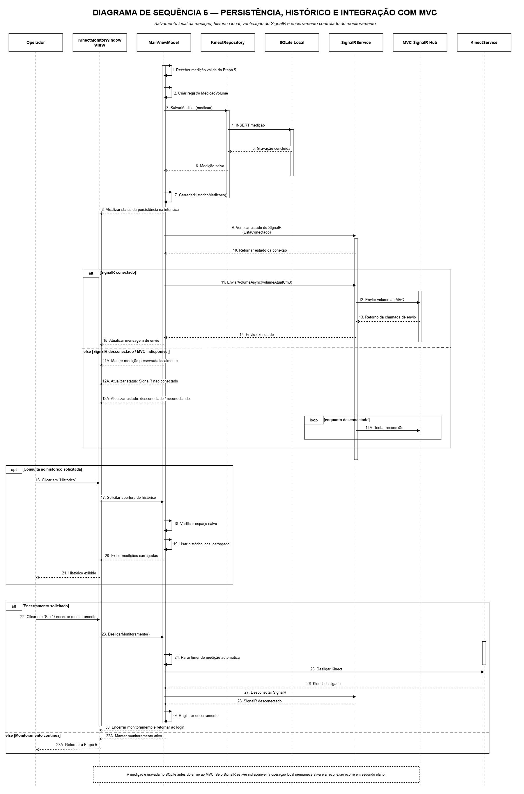
</p>

> **Nota:** A Sequência 6 apresenta a persistência local, atualização do histórico, integração com o MVC e encerramento seguro. Toda medição válida é primeiro salva no SQLite, garantindo preservação dos dados antes de qualquer envio externo. Se o SignalR estiver disponível, a medição é enviada ao MVC; caso contrário, a operação local continua ativa e o sistema mantém tentativas de reconexão em segundo plano.

A sexta sequência representa a etapa de persistência local, atualização do histórico, integração com o módulo MVC e encerramento seguro do monitoramento.

Ao receber uma medição válida da sequência anterior, o MainViewModel cria um registro do tipo MedicaoVolume contendo as informações da medição, como volume calculado, data e hora, usuário autenticado, empresa, nome do espaço, limite configurado e status da medição.

Esse registro é enviado ao KinectRepository, que realiza a gravação no banco de dados SQLite local. Após a confirmação da gravação, o sistema atualiza o histórico local de medições e também atualiza o status da persistência na interface.

Depois de salvar localmente, o sistema verifica o estado da conexão SignalR. Caso o SignalR esteja conectado, o MainViewModel solicita ao SignalRService o envio do volume atual ao Hub SignalR do módulo MVC. Ao término da chamada de envio, a interface é atualizada com a mensagem correspondente.

Caso o SignalR esteja desconectado ou o MVC esteja temporariamente indisponível, a medição permanece preservada no SQLite local. Nessa situação, o sistema mantém a operação local ativa, atualiza o status como desconectado ou reconectando e segue tentando restabelecer a comunicação em segundo plano.

Durante a operação, o operador pode solicitar a consulta ao histórico. Nesse caso, o sistema verifica se o espaço está salvo, utiliza os dados carregados localmente e exibe as medições registradas.

Ao final do monitoramento, caso o operador solicite o encerramento, a aplicação executa o desligamento controlado da operação. O sistema para o temporizador de medição automática, desliga o Kinect, desconecta o SignalR, registra o encerramento e retorna para a tela de login.

Se o monitoramento continuar ativo, o fluxo retorna à sequência de medição volumétrica, mantendo a operação pronta para novas medições manuais ou automáticas.

### Objetivo da Sequência

Garantir que toda medição válida seja preservada localmente, manter o histórico operacional, sincronizar os dados com o MVC quando houver conexão disponível e realizar o encerramento seguro dos recursos utilizados pelo sistema.

---

#### Considerações

O Diagrama de Sequência demonstra a interação entre o operador, as telas da aplicação Kinect, o MainViewModel, os serviços internos, o sensor Kinect, o banco SQLite local e o módulo MVC durante toda a execução da aplicação.

A divisão do fluxo em seis sequências permitiu representar de forma organizada os principais processos do módulo Kinect/Desktop: autenticação, inicialização do hardware, comunicação SignalR, calibração do ambiente, configuração do espaço monitorado, medição volumétrica, persistência local, histórico, integração com o MVC e encerramento seguro.


---

## Diagramas de Sequência - Sistema Web (MVC)

### Etapa 1 – Login e Autenticação (Token OTP)

<p align="center">
  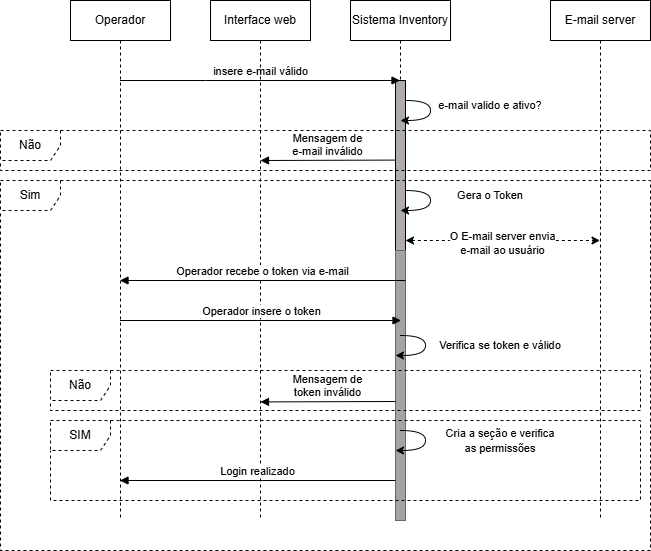
</p>

Esta etapa representa o ponto de entrada seguro da aplicação, garantindo que apenas usuários autorizados tenham acesso ao sistema Web.

**Como funciona:**
* O operador informa seu endereço de e-mail na tela de login.
* O sistema envia a requisição e verifica no Firebase se o e-mail é válido e se a conta do usuário está ativa.
* Se as validações falharem, o sistema retorna uma mensagem de erro ("e-mail inválido").
* Se aprovado, o sistema:
  1. Gera um **Token OTP** (senha temporária).
  2. Aciona o servidor de e-mail para enviar o código ao operador.
* O usuário recebe o token, insere na tela de validação e o sistema verifica sua autenticidade.
* Se o token for válido, o sistema cria a sessão de usuário, verifica as permissões e libera o login.

---

### Etapa 2 – Carregamento do Dashboard

<p align="center">
  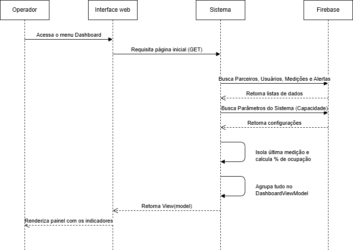
</p>

Esta etapa ilustra a orquestração de dados para a exibição do painel principal da aplicação, agregando informações de diferentes fontes do banco de dados em uma única tela.

**Como funciona:**
* O operador acessa o menu do Dashboard.
* A interface web dispara uma requisição de página inicial (GET) para o controlador do sistema.
* O sistema consulta o **Firebase** e busca simultaneamente as listas de: Parceiros, Usuários, Medições e Alertas.
* Em seguida, busca os Parâmetros do Sistema (necessários para saber a capacidade máxima do tanque/silo).
* O processamento interno do sistema:
  1. Isola a última medição registrada.
  2. Calcula o percentual de ocupação cruzando o volume atual com a capacidade total parametrizada.
  3. Agrupa todas as informações no modelo de visualização (`DashboardViewModel`).
* A interface web recebe os dados prontos e renderiza o painel com todos os indicadores de desempenho.

---

### Etapa 3 – Listagem e Gestão de Medições

<p align="center">
  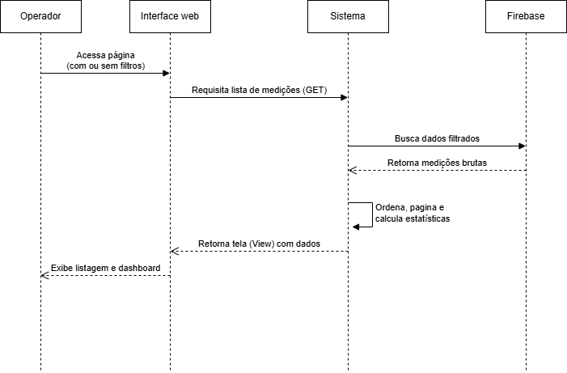
</p>

Esta etapa detalha como o sistema recupera e exibe o histórico de aferições de volume na tela de medições.

**Como funciona:**
* O operador acessa a página de medições, podendo ou não preencher filtros de busca.
* A interface solicita a lista de medições via GET ao sistema.
* O sistema envia a requisição para o banco de dados (Firebase) solicitando os dados correspondentes aos filtros aplicados.
* O banco de dados retorna a lista bruta de medições.
* O sistema realiza o processamento local para:
  1. Ordenar os dados por data/hora (mais recentes primeiro).
  2. Calcular as estatísticas gerais para a página.
  3. Aplicar a paginação.
* A tela (View) é montada com os dados organizados e exibida para o operador.

---

### Etapa 4 – Novo Cadastro (Ex: Parceiros ou Usuários)

<p align="center">
  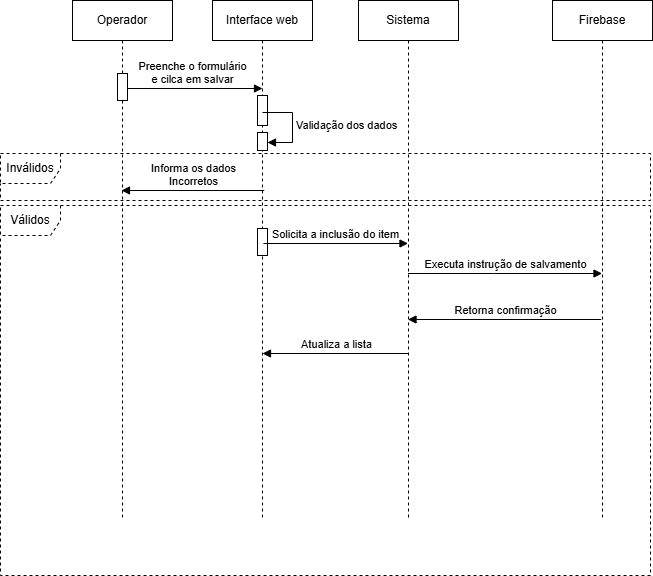
</p>

Esta etapa cobre o fluxo padrão de inserção de novos registros no sistema através de formulários.

**Como funciona:**
* O operador preenche os campos do formulário na interface web e clica em salvar.
* A interface envia os dados para o sistema, que realiza a primeira camada de **validação dos dados** (regras de negócio e anotações obrigatórias).
* Se os dados forem inválidos: O sistema interrompe o fluxo e retorna a interface informando os erros no formulário.
* Se os dados forem válidos:
  1. O sistema solicita a inclusão do item e executa a instrução de salvamento no Firebase.
  2. O Firebase retorna a confirmação de sucesso.
* O sistema notifica a interface web, atualiza a lista de registros e apresenta a mensagem de êxito ao operador.

---

### Etapa 5 – Edição de Registros

<p align="center">
  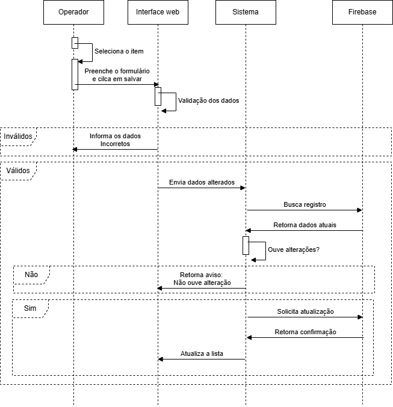
</p>

Este fluxo detalha a alteração de um registro existente, incorporando otimizações para evitar gravações desnecessárias no banco de dados.

**Como funciona:**
* O operador seleciona um item na listagem, preenche o formulário com novas informações e clica em salvar.
* O sistema recebe a requisição, aplica a validação de modelo (se inválido, retorna os erros para a tela).
* Com os dados válidos, o sistema consulta o Firebase e busca o **registro atual**.
* Uma validação avançada é feita em memória para **verificar se houve alterações reais** comparando os dados atuais com os novos recebidos.
* **Se não houver alteração:** O sistema não acessa o banco para salvar, apenas retorna um aviso ao usuário informando que nada foi modificado.
* **Se houver alteração (Sim):** O sistema solicita a atualização no Firebase, recebe a confirmação de gravação e atualiza a interface del operador com os dados modificados.

---

### Etapa 6 – Gerenciamento de Parâmetros e Configurações

<p align="center">
  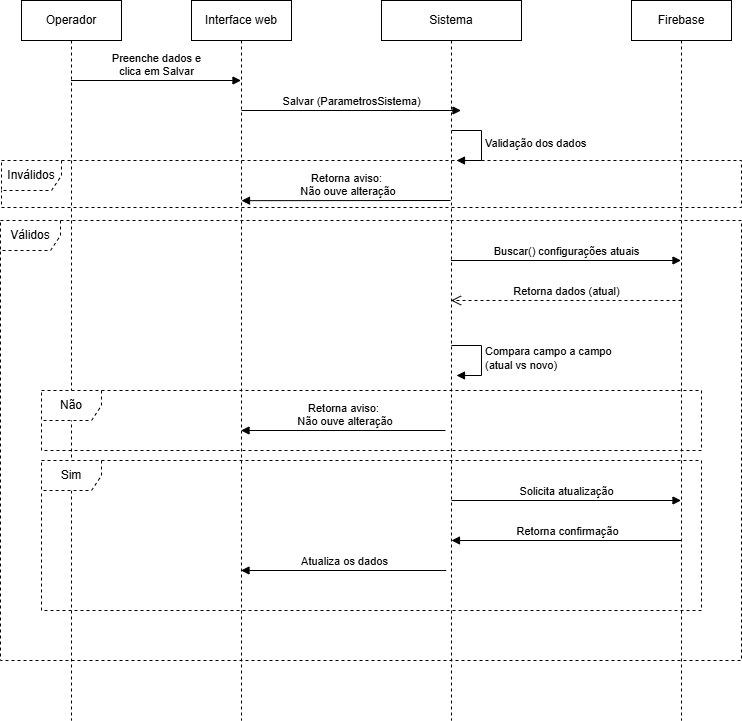
</p>

Fluxo dedicado ao controle das regras globais da aplicação, que regem cálculos de capacidade e limites de alerta do estoque.

**Como funciona:**
* O operador ajusta configurações (ex: Capacidade Mínima e Máxima) e clica em Salvar.
* O sistema envia o comando de atualização (`Salvar ParametrosSistema`).
* Ocorre a validação cruzada (ex: Capacidade mínima não pode ser maior que a máxima). Falhas devolvem a tela com erro.
* Com validação aprovada, o sistema invoca o método para **buscar as configurações atuais** no Firebase.
* O sistema **compara campo a campo** as novas configurações com as atuais.
* Da mesma forma que a etapa de edição: se não detectar mudanças, o sistema descarta o processamento e avisa o usuário.
* Havendo modificações legítimas, as configurações globais são updated no banco, refletindo

---
### Diagrama de Classes

O sistema **Inventory Masters** é composto por classes modulares que garantem a escalabilidade e a separação de responsabilidades.</p>

<p align="center">
  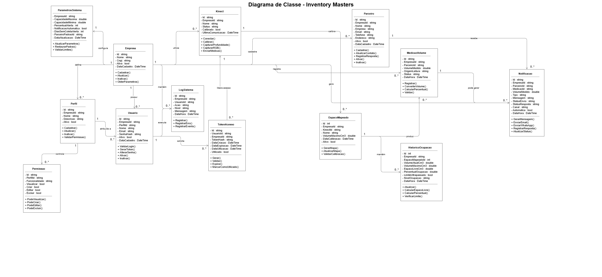
</p>

Abaixo, detalhamos o papel de cada entidade presente no nosso diagrama de classes:

### Núcleo de Segurança e Acesso
* **Usuario:** Entidade central de autenticação, vinculada a um `Perfil`.
* **Perfil:** Define o nível de acesso e as funcionalidades disponíveis.
* **Permissao:** Define granularmente as capacidades (CRUD) do sistema, atribuídas a cada `Perfil`.
* **TokenAcesso:** Gerencia a segurança da sessão e a validade da comunicação.

### Operação e Hardware
* **Kinect:** Classe responsável pela interface direta com o sensor físico, incluindo calibração e envio de medições.
* **ParametrosSistema:** Armazena as configurações globais de operação, como capacidades máxima/mínima e notificações automáticas.
* **EspacoMapeado:** Representação lógica de um ambiente real, ligando o hardware à inteligência de negócio.

### Processamento e Inteligência
* **MedicaoVolume:** Responsável pelo cálculo efetivo do volume ocupado, contendo métodos para conversão de dados brutos e validação.
* **HistoricoOcupacao:** Rastreia a evolução do nível de ocupação do espaço ao longo do tempo, essencial para auditoria e análises de tendência.
* **Notificacao:** Orquestra o envio de alertas baseados nas métricas geradas, suportando múltiplos canais.

### Auditabilidade
* **LogSistema:** Centraliza o registro de eventos e erros do sistema para fins de depuração e auditoria de segurança.
* **Empresa:** Entidade raiz que agrupa usuários, parceiros e configurações do sistema.
* **Parceiro:** Cliente ou unidade externa que utiliza os serviços de medição.

  
---
### Diagrama de Domínio

Este diagrama ilustra a arquitetura de uma solução de software baseada no padrão **Cliente-Servidor**, projetada para ambientes industriais ou logísticos que necessitam de processamento de imagem em tempo real com alta disponibilidade (capacidade de funcionar offline).

<p align="center">
  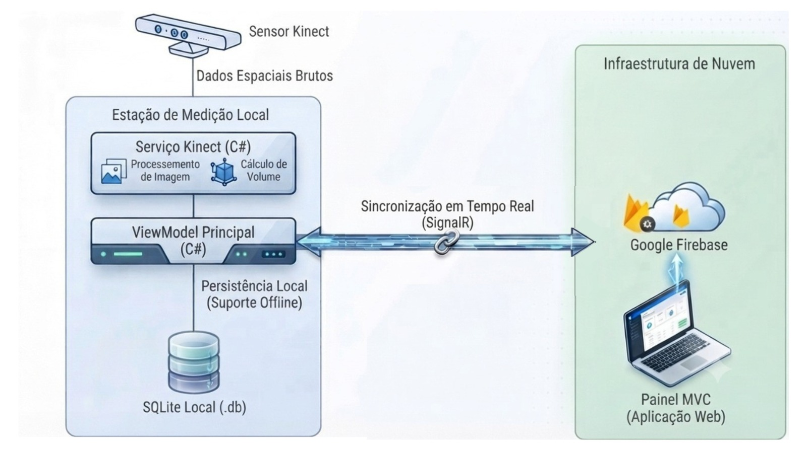
</p>

Abaixo, detalhamos como essa estrutura funciona em cada camada:

#### 1. Estrutura Cliente-Servidor no Fluxo
A arquitetura é dividida em dois grandes ambientes que se comunicam para garantir que os dados saiam do sensor e cheguem ao gestor:

* **Lado Cliente (Estação de Medição Local):** É a "ponta" do sistema, onde ocorre a interação com o hardware físico (Kinect). Esta camada é responsável pelo processamento pesado de dados espaciais e pela resiliência do sistema. Ao utilizar o **SQLite local**, a aplicação garante que, caso a conexão com a internet falhe, as medições não sejam perdidas, mantendo a operação contínua.
* **Lado Servidor (Infraestrutura de Nuvem):** É o cérebro centralizador. Ele recebe os dados processados via **SignalR** (uma biblioteca que permite comunicação bidirecional em tempo real entre cliente e servidor). O servidor atua como um intermediário que armazena as informações no **Firebase**, permitindo que múltiplos usuários ou gestores acessem as medições remotamente através do **Painel MVC**.

#### 2. O Papel dos Componentes na Arquitetura
Para entender como a lógica flui nessa estrutura, observe a responsabilidade de cada bloco:

| Camada | Componente | Responsabilidade |
| :--- | :--- | :--- |
| **Cliente (Local)** | Sensor + KinectService | Coleta bruta e processamento inicial (transformar pixels em volume). |
| **Cliente (Local)** | ViewModel + SQLite | Gerenciamento da UI e garantia de que o dado existe localmente antes de tentar enviá-lo. |
| **Conexão** | SignalR | O "túnel" que mantém o cliente e servidor sincronizados instantaneamente. |
| **Servidor (Nuvem)** | Firebase + Painel MVC | Consolidação dos dados para visualização global e relatórios gerenciais. |

---
### Diagrama de modelo conceitual do sistema

<p align="center">
  
</p>

O Diagrama Conceitual do Sistema apresenta a visão geral da solução Inventory Masters, mostrando os principais elementos envolvidos na operação e a relação entre eles. Ele representa, de forma simplificada, como o usuário interage com o sistema web, como o módulo Kinect realiza o monitoramento volumétrico e como os dados são enviados para consulta, análise e tomada de decisão.

Nesse modelo, o sistema é compreendido como uma solução composta por dois módulos principais: a aplicação MVC, responsável pela gestão administrativa, autenticação, configurações, dashboard, usuários, parceiros e notificações; e a aplicação Kinect, responsável pela captura das leituras do ambiente físico, calibração, cálculo do volume ocupado e envio das medições.

O objetivo do diagrama conceitual é demonstrar o funcionamento macro da solução, sem detalhar tecnologias internas ou estrutura de código. Ele ajuda a entender quais partes compõem o sistema, quais informações circulam entre elas e como o monitoramento físico do estoque se transforma em dados gerenciais.


---

### Diagrama de modelo logico  do sistema

<p align="center">
  
</p>

O Modelo Lógico do Sistema detalha a organização funcional da solução Inventory Masters. Ele apresenta como as responsabilidades estão distribuídas entre as camadas e módulos do sistema, evidenciando a separação entre interface, regras de negócio, serviços, repositórios, integração e persistência de dados.

Na aplicação MVC, o modelo lógico organiza o fluxo a partir das telas acessadas pelo usuário, passando pelos controllers, services e repositories até a gravação ou consulta das informações no Firebase. Essa estrutura permite centralizar as regras de autenticação, permissões, cadastros, parâmetros, notificações e dashboard, mantendo o sistema mais organizado e de fácil manutenção.

Na aplicação Kinect, o modelo lógico representa o fluxo operacional do monitoramento: autenticação por token, inicialização do sensor, calibração do ambiente, captura de profundidade, cálculo volumétrico, armazenamento local em SQLite e envio das medições ao MVC. Essa organização garante que o Kinect possa operar de forma controlada, registrando medições e mantendo rastreabilidade mesmo quando houver falhas temporárias de comunicação.

O objetivo do modelo lógico é explicar como o sistema funciona internamente em termos de responsabilidades e processos, sem depender da infraestrutura física onde será executado.

---

### Diagrama de modelo fisico  do sistema

<p align="center">
  
</p>

O Modelo Físico do Sistema representa a implantação real da solução Inventory Masters, demonstrando onde cada componente é executado e como ocorre a comunicação entre eles. Ele descreve a relação entre o computador que executa o Kinect, o servidor da aplicação MVC, o Firebase, os serviços de e-mail e os usuários que acessam o sistema pelo navegador.

No ambiente físico, o módulo Kinect é executado em uma máquina local conectada ao sensor Kinect Xbox 360. Essa aplicação realiza as leituras do espaço monitorado, salva os registros em SQLite e envia as medições para o servidor MVC por meio da rede. O MVC, por sua vez, fica hospedado em ambiente web e centraliza as informações recebidas, disponibilizando dashboards, históricos, configurações e notificações.

A comunicação em tempo real é realizada por SignalR, permitindo que novas medições sejam refletidas automaticamente na interface web. O Firebase funciona como banco principal da aplicação MVC, enquanto o SQLite atua como base local do módulo Kinect. Os serviços de e-mail são utilizados para envio de token de acesso, garantindo que somente usuários autorizados possam liberar o uso do Kinect.

O objetivo do modelo físico é demonstrar a arquitetura de execução do sistema, identificando máquinas, serviços, conexões e tecnologias utilizadas na operação real da solução.

----
## MODELAGEM DO BANCO DE DADOS
---

Com a evolução arquitetural do projeto, a solução passou a utilizar uma abordagem híbrida de armazenamento de dados, combinando banco relacional local e banco NoSQL em nuvem.

O módulo responsável pela captura volumétrica via Kinect (MVVM) utiliza o banco local **SQLite**, garantindo baixo custo computacional, operação offline e persistência temporária das leituras do sensor.

Já a aplicação Web MVC, responsável pelo gerenciamento operacional, autenticação, dashboard, notificações e integração entre usuários e parceiros, passou a utilizar o **Firebase**, um banco de dados NoSQL orientado a documentos e altamente escalável.

Diferentemente da modelagem relacional tradicional, o Firebase organiza os dados em:
- Coleções;
- Documentos;
- Subcoleções;
- Referências por identificadores (IDs).

Essa abordagem elimina a necessidade de relacionamentos complexos e operações JOIN, proporcionando maior desempenho em aplicações distribuídas e em tempo real.

---

## Modelagem NoSQL Firebase (MVC)

<p align="center">
  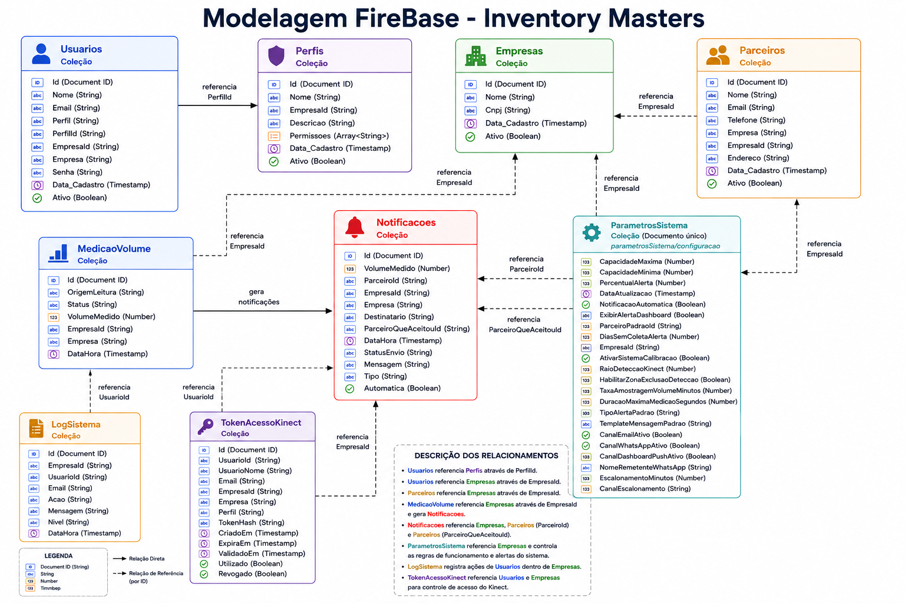
</p>

---

# Estrutura das Coleções Firebase

| Coleção | Finalidade |
|---------|------------|
| **Empresas** | Armazena as empresas cadastradas na plataforma. |
| **Usuarios** | Armazena os usuários vinculados às empresas. |
| **Perfis** | Define os perfis de acesso e permissões do sistema. |
| **Parceiros** | Armazena os parceiros responsáveis pelo recolhimento dos materiais. |
| **Medicoes** | Registra as medições volumétricas enviadas pelo Kinect. |
| **Notificacoes** | Armazena alertas automáticos e notificações enviadas aos parceiros. |
| **ParametrosSistema** | Centraliza as configurações operacionais da aplicação. |
| **LogsSistema** | Registra eventos, auditorias e ações executadas pelos usuários. |
| **TokenAcessoKinect** | Armazena tokens temporários para autenticação do módulo Kinect. |

---

# Descrição das Coleções

## Coleção: Empresas

Armazena as empresas cadastradas na plataforma.

| Campo | Tipo |
|-------|------|
| Id | String |
| Nome | String |
| Cnpj | String |
| Data_Cadastro | Timestamp |
| Ativo | Boolean |

### Exemplo

```json
{
  "Nome": "Inventory Masters LTDA",
  "Cnpj": "12.345.678/0001-90",
  "Data_Cadastro": "2026-06-08T14:30:00",
  "Ativo": true
}
```

---

## Coleção: Usuarios

Representa os usuários responsáveis pela operação do sistema.

| Campo | Tipo |
|-------|------|
| Id | String |
| Nome | String |
| Email | String |
| Perfil | String |
| PerfilId | String |
| EmpresaId | String |
| Empresa | String |
| Senha | String |
| Data_Cadastro | Timestamp |
| Ativo | Boolean |

### Exemplo

```json
{
  "Nome": "Administrador",
  "Email": "admin@inventorymasters.com",
  "Perfil": "Administrador",
  "PerfilId": "perfil01",
  "EmpresaId": "empresa01",
  "Empresa": "Inventory Masters",
  "Senha": "******",
  "Data_Cadastro": "2026-06-08T14:30:00",
  "Ativo": true
}
```

---

## Coleção: Perfis

Define os perfis de acesso e suas respectivas permissões.

| Campo | Tipo |
|-------|------|
| Id | String |
| Nome | String |
| EmpresaId | String |
| Descricao | String |
| Permissoes | Array<String> |
| Data_Cadastro | Timestamp |
| Ativo | Boolean |

### Exemplo

```json
{
  "Nome": "Administrador",
  "EmpresaId": "empresa01",
  "Descricao": "Acesso total ao sistema",
  "Permissoes": [
    "Dashboard.Visualizar",
    "Usuarios.Gerenciar",
    "Perfis.Gerenciar"
  ],
  "Data_Cadastro": "2026-06-08T14:30:00",
  "Ativo": true
}
```

---

## Coleção: Parceiros

Armazena os parceiros responsáveis pela coleta dos materiais.

| Campo | Tipo |
|-------|------|
| Id | String |
| Nome | String |
| Empresa | String |
| EmpresaId | String |
| Email | String |
| Telefone | String |
| Endereco | String |
| Data_Cadastro | Timestamp |
| Ativo | Boolean |

### Exemplo

```json
{
  "Nome": "João Silva",
  "Empresa": "Recicla Minas",
  "EmpresaId": "empresa01",
  "Email": "contato@reciclaminas.com",
  "Telefone": "(31) 9 9999-9999",
  "Endereco": "Rua A, 100",
  "Data_Cadastro": "2026-06-08T14:30:00",
  "Ativo": true
}
```

---

## Coleção: Medicoes

Armazena todas as medições realizadas pelo Kinect.

| Campo | Tipo |
|-------|------|
| Id | String |
| OrigemLeitura | String |
| Status | String |
| VolumeMedido | Number |
| EmpresaId | String |
| Empresa | String |
| DataHora | Timestamp |

### Exemplo

```json
{
  "OrigemLeitura": "Kinect",
  "Status": "Normal",
  "VolumeMedido": 8.75,
  "EmpresaId": "empresa01",
  "Empresa": "Inventory Masters",
  "DataHora": "2026-06-08T14:30:00"
}
```

---

## Coleção: Notificacoes

Armazena notificações geradas automaticamente ou manualmente.

| Campo | Tipo |
|-------|------|
| Id | String |
| VolumeMedido | Number |
| ParceiroId | String |
| EmpresaId | String |
| Empresa | String |
| Destinatario | String |
| ParceiroQueAceitouId | String |
| DataHora | Timestamp |
| StatusEnvio | String |
| Mensagem | String |
| Tipo | String |
| Automatica | Boolean |

### Exemplo

```json
{
  "VolumeMedido": 8.75,
  "ParceiroId": "parceiro01",
  "EmpresaId": "empresa01",
  "Empresa": "Inventory Masters",
  "Destinatario": "contato@reciclaminas.com",
  "ParceiroQueAceitouId": null,
  "DataHora": "2026-06-08T14:30:00",
  "StatusEnvio": "Pendente",
  "Mensagem": "O estoque atingiu 85% da capacidade máxima.",
  "Tipo": "Capacidade",
  "Automatica": true
}
```

---

## Coleção: ParametrosSistema

Armazena as configurações operacionais do sistema.

### Documento

```text
ParametrosSistema/configuracao
```

### Campos

| Campo | Tipo |
|-------|------|
| EmpresaId | String |
| CapacidadeMaxima | Number |
| CapacidadeMinima | Number |
| PercentualAlerta | Number |
| DataAtualizacao | Timestamp |
| NotificacaoAutomatica | Boolean |
| ExibirAlertaDashboard | Boolean |
| ParceiroPadraoId | String |
| DiasSemColetaAlerta | Number |
| AtivarSistemaCalibracao | Boolean |
| RaioDeteccaoKinect | Number |
| HabilitarZonaExclusaoDeteccao | Boolean |
| TaxaAmostragemVolumeMinutos | Number |
| DuracaoMaximaMedicaoSegundos | Number |
| TipoAlertaPadrao | String |
| TemplateMensagemPadrao | String |
| CanalEmailAtivo | Boolean |
| CanalWhatsAppAtivo | Boolean |
| CanalDashboardPushAtivo | Boolean |
| NomeRemetenteWhatsApp | String |
| EscalonamentoMinutos | Number |
| CanalEscalonamento | String |

---

## Coleção: LogsSistema

Registra auditorias e eventos executados na plataforma.

| Campo | Tipo |
|-------|------|
| Id | String |
| EmpresaId | String |
| UsuarioId | String |
| Email | String |
| Acao | String |
| Mensagem | String |
| Nivel | String |
| DataHora | Timestamp |

### Exemplo

```json
{
  "EmpresaId": "empresa01",
  "UsuarioId": "usuario01",
  "Email": "admin@inventorymasters.com",
  "Acao": "Cadastro de parceiro",
  "Mensagem": "Novo parceiro cadastrado.",
  "Nivel": "Informacao",
  "DataHora": "2026-06-08T14:30:00"
}
```

---

## Coleção: TokenAcessoKinect

Responsável pelo controle de autenticação do módulo Kinect.

| Campo | Tipo |
|-------|------|
| Id | String |
| UsuarioId | String |
| UsuarioNome | String |
| Email | String |
| EmpresaId | String |
| Empresa | String |
| Perfil | String |
| TokenHash | String |
| CriadoEm | Timestamp |
| ExpiraEm | Timestamp |
| ValidadoEm | Timestamp |
| Utilizado | Boolean |
| Revogado | Boolean |

### Exemplo

```json
{
  "UsuarioId": "usuario01",
  "UsuarioNome": "Administrador",
  "EmpresaId": "empresa01",
  "Empresa": "Inventory Masters",
  "Perfil": "Administrador",
  "TokenHash": "d7af85d8c9...",
  "CriadoEm": "2026-06-08T14:30:00",
  "ExpiraEm": "2026-06-08T15:00:00",
  "Utilizado": false,
  "Revogado": false
}

```

### Modelagem Conceitual - Kinect SQLite

O modelo conceitual do módulo MVVM Kinect representa as principais entidades responsáveis pelo armazenamento das informações utilizadas durante o funcionamento da aplicação desktop. Essas entidades contemplam o registro das medições volumétricas capturadas pelo sensor Kinect, o histórico de ocupação dos espaços monitorados, o controle de usuários locais, as sessões de autenticação e os registros operacionais da aplicação.

Além das entidades persistidas, o módulo utiliza modelos auxiliares responsáveis pelo controle do processo de calibração durante a execução do sistema.

<p align="center">
  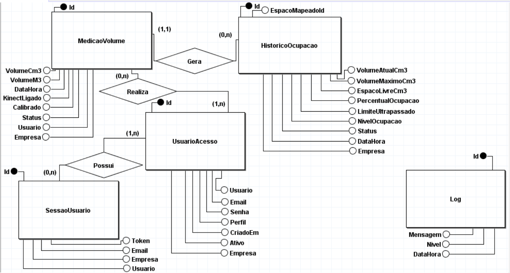
</p>

#### Entidades

| Entidade | Finalidade |
|-----------|------------|
| **UsuarioAcesso** | Armazena os usuários responsáveis pelo acesso ao módulo Kinect. |
| **MedicaoVolume** | Registra as medições volumétricas realizadas pelo sensor Kinect. |
| **HistoricoOcupacao** | Armazena o histórico da ocupação dos espaços monitorados. |
| **SessaoUsuario** | Controla os dados da sessão ativa do usuário autenticado. |
| **Log** | Registra eventos, avisos e erros gerados pela aplicação. |

---

#### Relacionamentos

| Relacionamento | Cardinalidade | Descrição |
|----------------|---------------|-----------|
| **UsuarioAcesso É' MedicaoVolume** | 1:N | Um usuário pode realizar várias medições volumétricas. |
| **UsuarioAcesso É' SessaoUsuario** | 1:N | Um usuário pode possuir várias sessões registradas no sistema. |
| **MedicaoVolume É' HistoricoOcupacao** | 1:N | Uma medição volumétrica pode gerar vários registros de histórico de ocupação. |

---

### Modelo Lógico – MVVM Kinect

O modelo lógico do módulo MVVM Kinect foi elaborado a partir do modelo conceitual, definindo as tabelas, atributos, tipos de dados, chaves primárias e chaves estrangeiras necessárias para garantir a organização e a integridade dos dados armazenados no banco SQLite local.

<p align="center">
  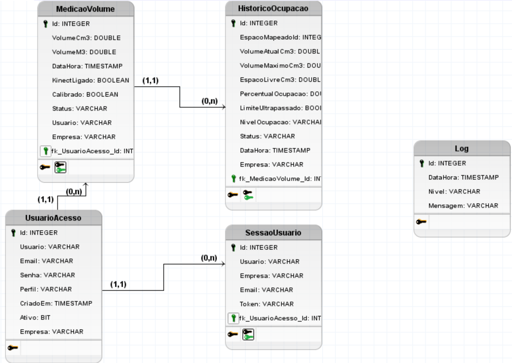
</p>

#### Estrutura Relacional

| Tabela | Descrição |
|---------|-----------|
| **UsuarioAcesso** | Controle local dos usuários que acessam o módulo Kinect. |
| **MedicaoVolume** | Registro das medições volumétricas capturadas pelo sensor Kinect. |
| **HistoricoOcupacao** | Registro consolidado da ocupação volumétrica dos espaços monitorados. |
| **SessaoUsuario** | Controle das sessões autenticadas dos usuários. |
| **Log** | Registro de eventos, avisos e erros operacionais da aplicação. |

---

#### Tabela: UsuarioAcesso

| Campo | Tipo | Descrição |
|---------|---------|-----------|
| Id | INTEGER | Identificador único do usuário |
| Usuario | VARCHAR | Nome do usuário |
| Email | VARCHAR | E-mail do usuário |
| Senha | VARCHAR | Senha de acesso |
| Perfil | VARCHAR | Perfil de acesso do usuário |
| CriadoEm | TIMESTAMP | Data e hora de criação do registro |
| Ativo | BIT | Indica se o usuário está ativo |
| Empresa | VARCHAR | Empresa vinculada ao usuário |

---

#### Tabela: MedicaoVolume

| Campo | Tipo | Descrição |
|---------|---------|-----------|
| Id | INTEGER | Identificador único da medição |
| VolumeCm3 | DOUBLE | Volume medido em centímetros cúbicos |
| VolumeM3 | DOUBLE | Volume medido em metros cúbicos |
| DataHora | TIMESTAMP | Data e hora da medição |
| KinectLigado | BOOLEAN | Indica se o Kinect estava ligado |
| Calibrado | BOOLEAN | Indica se o ambiente estava calibrado |
| Status | VARCHAR | Status da medição |
| Usuario | VARCHAR | Usuário responsável pela medição |
| Empresa | VARCHAR | Empresa vinculada à medição |
| fk_UsuarioAcesso_Id | INTEGER | Chave estrangeira vinculada à tabela UsuarioAcesso |

---

#### Tabela: HistoricoOcupacao

| Campo | Tipo | Descrição |
|---------|---------|-----------|
| Id | INTEGER | Identificador único do histórico |
| EspacoMapeadoId | INTEGER | Identificador lógico do espaço mapeado |
| VolumeAtualCm3 | DOUBLE | Volume atualmente ocupado |
| VolumeMaximoCm3 | DOUBLE | Volume máximo disponível |
| EspacoLivreCm3 | DOUBLE | Volume livre disponível |
| PercentualOcupacao | DOUBLE | Percentual de ocupação calculado |
| LimiteUltrapassado | BOOLEAN | Indica se o limite de ocupação foi ultrapassado |
| NivelOcupacao | VARCHAR | Nível de ocupação do espaço monitorado |
| Status | VARCHAR | Status do registro |
| DataHora | TIMESTAMP | Data e hora do histórico |
| Empresa | VARCHAR | Empresa vinculada ao histórico |
| fk_MedicaoVolume_Id | INTEGER | Chave estrangeira vinculada à tabela MedicaoVolume |

---

#### Tabela: SessaoUsuario

| Campo | Tipo | Descrição |
|---------|---------|-----------|
| Id | INTEGER | Identificador único da sessão |
| Usuario | VARCHAR | Usuário autenticado |
| Empresa | VARCHAR | Empresa vinculada à sessão |
| Email | VARCHAR | E-mail do usuário autenticado |
| Token | VARCHAR | Token da sessão |
| fk_UsuarioAcesso_Id | INTEGER | Chave estrangeira vinculada à tabela UsuarioAcesso |

---

#### Tabela: Log

| Campo | Tipo | Descrição |
|---------|---------|-----------|
| Id | INTEGER | Identificador único do log |
| DataHora | TIMESTAMP | Data e hora do evento registrado |
| Nivel | VARCHAR | Nível do log, como Info, Warning ou Erro |
| Mensagem | VARCHAR | Mensagem registrada pela aplicação |

---

### Modelo Físico – MVVM Kinect

O modelo físico do módulo **MVVM Kinect** foi implementado utilizando o banco de dados **SQLite**, por meio do **Entity Framework 6**, responsável pelo mapeamento objeto-relacional entre as classes do domínio e as tabelas persistidas no banco de dados local.

<p align="center">
  
</p>

A Figura acima apresenta a arquitetura de persistência adotada pelo módulo **MVVM Kinect**. Observa-se que a camada de apresentação, representada pelo **MainViewModel**, realiza o acesso aos dados por meio do **KinectRepository**. O **Entity Framework 6**, através do **AppDbContext**, é responsável pelo mapeamento objeto-relacional, pelo gerenciamento da comunicação entre a aplicação e o banco de dados, pela criação das tabelas, pelo controle das conexões e pela persistência dos dados utilizados pelo sistema.

Nesse contexto, o banco **SQLite** foi adotado por ser uma solução leve, embarcada e de baixo consumo de recursos, características adequadas para aplicações desktop que precisam operar localmente e com suporte ao funcionamento offline. Dessa forma, as entidades do módulo MVVM Kinect são armazenadas localmente, garantindo a persistência das informações mesmo sem conexão com serviços externos.

---
## PLANO DE IMPLANTAÇÃO

O Plano de Implantação tem como objetivo detalhar os aspectos técnicos, organizacionais e operacionais necessários para que o sistema Inventory Masters saia do ambiente acadêmico e seja implantado em um contexto real. Este documento serve como guia de transição, detalhando os passos necessários para garantir que a instalação, a configuração de infraestrutura, a migração de dados e a adaptação dos usuários ocorram de forma estruturada, minimizando riscos, falhas e impactos na rotina do cliente.

#### 1. Identificação do Projeto

| Campo | Descrição |
|---|---|
| Sistema | Inventory Masters — Sistema de Gestão de Estoque Inteligente |
| Cliente | Indústrias e Empresas com Gestão de Estoque e Almoxarifado |
| Repositório | https://github.com/Nylo1991/TCC_Inventory_Masters_Kinect.git |
| Data de início prevista | A definir como o cliente|
---

#### 1.2 Equipe e Função

| Colaborador | Função |
|---|---|
| Danilo |Técnico de Infraestrutura — instalação e configuração do cliente desktop WPF e integração com o sensor Kinect nas estações da empresa cliente; suporte na entrada em produção |
| Diulie |Gestor do Projeto — controle do cronograma, comunicação com o cliente e elaboração da documentação de implantação |
| Marilene |Analista de Dados — diagnóstico, extração, conversão e carga dos dados na migração; configuração do Firebase e dos fluxos em nuvem em produção |
| Miguel |Técnico de Infraestrutura — deploy e configuração web no MonsterASP.net; controle de versão das entregas via GitHub; suporte técnico durante a implantação |
---

---

### 2. Perguntas Norteadoras da Implantação

Esta seção responde, de forma objetiva, às perguntas levantadas pela equipe durante o planejamento, organizadas em dois blocos: características técnicas do sistema e características da implantação.

### 2.1 Sobre o Sistema

#### O sistema possui banco de dados? Qual?

Sim. O Inventory Masters utiliza o **Firebase (versão `Google.Cloud v4.2.0`)** como banco de dados NoSQL em nuvem e conta com o **SQLite (versão `SQLiteStudio v3.4.21`)** na qualidade de banco de dados relacional leve embutido na aplicação desktop, além de utilizar o **Entity Framework 6 (v6.5.1)** para o mapeamento objeto-relacional.

#### O sistema precisa de internet?

Sim, de forma parcial e integrada. O cliente desktop (WPF) interage com o SQLite local e se comunica via SignalR (v6.0.36) com o servidor central, enquanto a Aplicação web em ASP.NET Core MVC (hospedada na MonsterASP.net) faz a persistência centralizada no Firebase (Google.Cloud v4.2.0). Portanto, a conexão com a internet é necessária para a sincronização em tempo real e para o funcionamento do dashboard e do armazenamento em nuvem.

#### O sistema possui login?

Sim. O acesso é controlado por perfis de usuário (como Administrador e Perfis operacionais) e conta com rastreabilidade de logs no sistema (LogsSistema) e gestão de tokens de acesso vinculados ao hardware Kinect.

#### O sistema possui API?

Não, a comunicação ocorre via SignalR. O sistema utiliza a biblioteca SignalR para a comunicação em tempo real e a troca de mensagens, integrando a aplicação desktop diretamente com o servidor central e os serviços em nuvem sem o uso de uma API REST tradicional.

#### Precisa instalar runtime?

Sim. O ambiente exige o ecossistema .NET (compatível com a release do Visual Studio 2026 - v18.7.1) e os pacotes e dependências nativas configurados no projeto (como os drivers do Kinect SDK 1.8 para a captura por hardware e as bibliotecas de conexão).

#### Como o sistema será atualizado?

As atualizações seguem duas frentes: a Aplicação web e o backend hospedados na nuvem (MonsterASP.net) são atualizados via novo deploy, enquanto a aplicação desktop WPF instalada nas estações de trabalho e os componentes de integração com o Kinect exigem a distribuição de novos pacotes ou instaladores controlados via repositório no GitHub.

#### Como recuperar um backup?

O Firebase (`Google.Cloud v4.2.0`) gerencia a alta disponibilidade na nuvem, e o controle local de dados em SQLite (`SQLiteStudio v3.4.21`) conta com rotinas de persistência e logs do sistema, permitindo a restauração e auditoria de registros a partir das medições salvos no banco NoSQL.

#### Existe manual do sistema?

A documentação técnica e os rastreios de arquitetura encontram-se estruturados no repositório do projeto. Recomenda-se a formalização de um manual operacional focado nos operadores do almoxarifado/estoque para a fase de implantação.

#### Quem será treinado?

Os operadores do sistema responsáveis pelo controle de estoque e almoxarifado (utilizando a interface desktop com captura via Kinect) e os administradores encarregados do monitoramento do dashboard em nuvem e da gestão de perfis e acessos.

### 2.2 Sobre a Implantação

#### Qual sistema será implantado?

O Inventory Masters — um sistema integrado de gestão de estoque automatizado que combina uma aplicação desktop WPF (com suporte ao sensor Kinect SDK 1.8), banco local SQLite (`SQLiteStudio v3.4.21`), comunicação em tempo real via SignalR (`v6.0.36`), serviços hospedados na MonsterASP.net e armazenamento em nuvem no Firebase (`Google.Cloudv4.2.0`).

#### Quem será o cliente?

Empresas e indústrias com processos de controle de estoque, almoxarifado e logística interna que buscam automação e eficiência operacional.

#### Onde o sistema será instalado?

A aplicação desktop WPF será instalada localmente nas estações de trabalho dos operadores (junto ao hardware de captura Kinect), e os serviços web/dashboard serão hospedados na nuvem (MonsterASP.net e Firebase).

#### Quais computadores serão utilizados?

Computadores com Windows (compatíveis com o ecossistema .NET e Visual Studio 2026 - v18.7.1), dotados de portas e requisitos de hardware adequados para a execução do cliente WPF e conexão com o sensor Kinect.

#### Quais programas precisam estar previamente instalados?

* Nas estações dos operadores: .NET Runtime compatível, drivers do Kinect SDK 1.8 e os pacotes da aplicação desktop.
* Nas estações de desenvolvimento: Visual Studio 2026 (v18.7.1), SQLiteStudio (v3.4.21) e as ferramentas de versionamento Git.

#### Existe banco de dados? Qual?

Sim, de forma híbrida: SQLite (`SQLiteStudio v3.4.21`) local na aplicação desktop e Firebase (`Google.Cloud v4.2.0`) em nuvem NoSQL, gerenciado via Google Cloud SDK **Kinect SDK 1.8**.

#### Será necessário migrar informações?

Não será necessária a migração tradicional de dados legados, visto que o ecossistema do **Inventory Masters** baseia-se em uma inicialização limpa (*clean state*), gerando os dados de inventário nativamente e em tempo real a partir da captura física com o sensor Kinect. 

#### Quem ficará responsável por cada etapa?

A equipe descrita no projeto (Danilo, Diulie, Marilene e Miguel), dividida entre gestão, infraestrutura, suporte técnico e análise de dados.

#### Quanto tempo será necessário para concluir a implantação?

O prazo estimado deve contemplar as fases de configuração de ambiente, homologação, testes com o Kinect e implantação no cliente.

#### Como será realizada a validação do sistema?

Por meio de testes integrados entre o aplicativo desktop, o sensor Kinect, a comunicação em tempo real via SignalR (`v6.0.36`), os serviços web e o Firebase, seguidos de validação prática junto ao cliente.

#### Existe um plano caso ocorra algum problema durante a instalação?

Sim, prevendo ações de contingência para reversão de pacotes, checagem de conexões de rede/SignalR e restauração de dados em caso de falhas na nuvem ou nas estações locais.

---

## 3. Levantamento da Infraestrutura Necessária

### 3.1 Requisitos de Hardware (estações cliente)

| Item | Requisito mínimo | Configuração de Referência (Desenvolvimento/Teste) | Recomendado |
|---|---|---|---|
| Processador | Intel Core i7 | **13th Gen Intel(R) Core(TM) i7-13620H (2.40 GHz)** | Intel Core i7 de alta performance |
| Memória RAM | 24 GB | **24,0 GB (4800 MT/s)** | 24 GB ou superior |
| Armazenamento | 500 MB livres (dados locais em SQLite) | **477 GB (com cerca de 153 GB usados)** | 512 GB SSD ou superior |
| Sistema Operacional | Windows 10/11 (64 bits) | **Windows 11 (64 bits)** | Windows 11 (64 bits) |
| Periféricos | Porta USB 2.0 / 3.0 disponível | Porta USB dedicada para o sensor Kinect | Porta USB dedicada para o sensor Kinect |
| Conexão | Internet banda larga estável | Internet banda larga estável | Internet banda larga com redundância (4G de backup) |

### 3.2 Requisitos de Software

- Ecossistema .NET (compatível com a release do Visual Studio 2026 - v18.7.1)
- Drivers do Kinect SDK 1.8 para a captura via hardware
- SQLiteStudio (v3.4.21) para suporte local
- Navegador atualizado para acesso administrativo ao console Firebase (`Google.Cloud v4.2.0`)

### 3.3 Infraestrutura de Servidor e Serviços em Nuvem

| Camada | Serviço | Observação |
|---|---|---|
| Hospedagem Web | MonsterASP.net | Executa o backend e os serviços web integrados |
| Banco de dados | Firebase (Google.Cloud v4.2.0) | Armazenamento centralizado em nuvem NoSQL gerenciado via Google Cloud SDK |
| Comunicação em tempo real | SignalR (v6.0.36) | Gerencia a troca de mensagens e a sincronização entre a aplicação desktop e o servidor central |
| Controle de versão | Git/GitHub | Repositório centralizado e usado para a distribuição de pacotes e instaladores |

### 3.4 Rede e Segurança

- Conexão segura obrigatória para a sincronização em tempo real e comunicação com os serviços externos.
- Liberação de acesso de saída (outbound) nas estações da empresa cliente para os domínios do Firebase e da hospedagem em nuvem, caso exista firewall ou proxy corporativo.
- Controle de acesso segmentado por perfis de usuário (Administrador e Operacional) com trilha de rastreabilidade nos logs do sistema (`LogsSistema`).
- Definição prévia, junto ao cliente, dos responsáveis por cada perfil de acesso antes do início dos treinamentos.

---

## 4. Plano de Migração de Dados

Como o **Inventory Masters** substitui um controle manual ou planilhas legadas por um sistema automatizado com captura via sensor Kinect e banco de dados híbrido, a migração concentra-se em duas frentes: o cadastro inicial de referência (perfis de usuários, cadastros de parceiros e medições de estoque) e, quando disponível, o histórico de medições de materiais já mantido pela empresa.

| Fase | Atividade | Responsável |
|---|---|---|
| 1. Diagnóstico | Levantamento das planilhas, cadastros legados ou registros manuais existentes na empresa cliente; avaliação da qualidade e consistência dos dados | Analista de Dados (Marilene) |
| 2. Extração | Extração dos dados relevantes (descrição dos parâmetros, quantidades em estoque, localização e dados cadastrais prévios) | Analista de Dados (Marilene) |
| 3. Conversão | Estruturação dos dados extraídos no formato das entidades do Inventory Masters (para salvamento no SQLite local e sincronização via SignalR no Firebase) | Danilo |
| 4. Carga | Importação dos dados convertidos para o banco SQLite local e para o Firebase via rotinas estruturadas ou scripts de carga | Miguel |
| 5. Validação | Conferência de integridade dos dados migrados em conjunto com a equipe da empresa cliente | Diulie + Cliente |

> Caso a empresa cliente não possua nenhum controle histórico digitalizado, esta etapa se reduz ao cadastro inicial dos parâmetros, dos perfis de acesso, dos usuários e dos parceiros sem necessidade de conversão de dados legados.

---
## 5. Cronograma Resumido da Implantação

O cronograma abaixo estima 11 semanas de implantação, a partir da assinatura do aceite pela empresa cliente (D+0), adaptado da estrutura de cronograma corporativo usada como referência pela equipe.

| Etapa | Atividade principal | Duração estimada |
|---|---|---|
| 1. Kickoff | Reunião de abertura, alinhamento de expectativas e definição de responsáveis | 3 dias |
| 2. Infraestrutura | Validação do ambiente do cliente, configuração do Firebase, dos serviços na MonsterASP.net e do ecossistema .NET nas estações | 7 dias |
| 3. Migração de Dados | Diagnóstico, extração, conversão e carga dos dados existentes na empresa cliente (SQLite local e nuvem) | 5 dias |
| 4. Instalação do Cliente | Instalação do Inventory Masters nas estações de trabalho e configuração do sensor Kinect SDK 1.8 | 3 dias |
| 5. Elaboração de Manuais | Produção do manual operacional para o almoxarifado/estoque e da documentação técnica | 15 dias |
| 6. Treinamento | Capacitação dos usuários operacionais e do(s) administrador(es) nos perfis de acesso | 5 dias |
| 7. Testes e Homologação | Testes funcionais integrados via SignalR, testes com o hardware Kinect e homologação com o cliente | 10 dias |
| 8. Go-Live | Entrada em produção, sincronização em tempo real e acompanhamento intensivo pós Go-Live | 3 dias |
| 9. Encerramento | Coleta de feedback, relatório final e reunião de encerramento do projeto | 3 dias |

> **Prazo total estimado:** aproximadamente 11 semanas (54 dias úteis), podendo variar conforme a disponibilidade das equipes da empresa para participação nas etapas de migração, testes e treinamento.

---

### 6. Distribuição das Responsabilidades

| Papel na implantação | Integrante | Principais responsabilidades |
|---|---|---|
| Gestor do Projeto | Diulie | Coordenação geral, cronograma, comunicação com o cliente e com a equipe, relatório final |
| Técnico de Infraestrutura | Miguel / Danilo | Configuração dos serviços na MonsterASP.net, instalação do cliente desktop WPF e do sensor Kinect SDK 1.8 nas estações da empresa cliente, validação de rede e SignalR |
| Analista de Dados | Marilene | Diagnóstico, extração, conversão e carga de dados, configuração do Firebase e gerenciamento dos dados no SQLite local |
| Instrutor de Treinamento | Toda a equipe (rodízio) | Elaboração dos manuais operacionais e condução dos treinamentos com os usuários e administradores da empresa cliente |

---
### 7. Plano de Validação do Sistema

A validação segue três níveis, do técnico ao aceite final do cliente:

#### 7.1 Testes Funcionais

- Cadastro, edição e exclusão de perfis e movimentações no estoque (perfil Operacional e Administrador).
- Login e controle de acesso por perfil (Operacional / Administrador).
- Captura de dados e interação física com o sensor Kinect SDK 1.8.
- Geração de relatórios e registros a partir dos dados locais e em nuvem.

#### 7.2 Testes de Integração

- Comunicação em tempo real entre a aplicação desktop WPF e o servidor central via SignalR (`v6.0.36`).
- Sincronização e persistência híbrida entre o banco SQLite local (`SQLiteStudio v3.4.21`) e o Firebase (`Google.Cloud v4.2.0`).
- Comportamento do sistema e sincronização em cenários de instabilidade ou perda momentânea de conexão de rede.

#### 7.3 Homologação e Aceite

- Simulação de fluxos reais de trabalho de controle de estoque pelos próprios operadores da empresa cliente.
- Validação, pelo cliente, da migração de dados realizada na Seção 4 item 5.
- Assinatura de termo de aceite formalizando a homologação.

> **Critério de aceite:** o sistema será considerado apto quando todos os módulos e integrações (aplicação desktop WPF, captura via Kinect, banco SQLite local e sincronização via SignalR com o Firebase) estiverem funcionando sem erros críticos e o cliente tiver validado formalmente os dados migrados.

---

### 8. Plano de Contingência

| Risco | Probabilidade | Impacto | Ação de mitigação |
|---|---|---|---|
| Indisponibilidade dos serviços em nuvem (MonsterASP.net) | Baixo | Alto | Monitoramento ativo da hospedagem e procedimentos manuais de reinicialização ou verificação de logs no servidor |
| Falha ou desconexão do sensor Kinect SDK 1.8 | Média | Alto | Checagem prévia das portas USB 2.0 / 3.0, verificação de drivers e reinicialização do subsistema de captura |
| Falha na migração de dados | Média | Alto | Backup do banco SQLite local e estado do Firebase antes de cada carga; rotinas de rollback e nova tentativa |
| Indisponibilidade de internet na empresa contratante | Baixa | Alto | Verificação prévia de conectividade; uso de 4G/hotspot como contingência temporária para o funcionamento em nuvem e persistência local via SQLite |
| Resistência ou dificuldade dos usuários no treinamento | Média | Médio | Disponibilização do manual operacional, sessões de reforço e suporte próximo nos primeiros dias de uso |
| Erros críticos identificados após a implantação | Média | Alto | Equipe de suporte técnico de prontidão logo após a entrada em produção |

---

### 9. Considerações Finais

O planejamento apresentado demonstra que o **Inventory Masters** está tecnicamente apto a sair do ambiente acadêmico e ser implantado em um contexto real: sua arquitetura híbrida e conectada (aplicação desktop WPF com suporte ao sensor Kinect SDK 1.8, banco de dados local SQLite, comunicação em tempo real via SignalR e armazenamento em nuvem no Firebase), já validada durante o desenvolvimento, permite uma implantação estruturada e de baixo risco para a automação do estoque e da gestão interna.

A dependência de serviços em nuvem evidencia que a robustez da comunicação em tempo real e a integridade da persistência híbrida trabalham para assegurar a segurança e a confiabilidade dos dados em produção.

De forma geral, a viabilidade da implantação do Inventory Masters está sustentada por três fatores:

1. Uma arquitetura integrada e moderna, combinando processamento local e sincronização em tempo real via SignalR;
2. Um cronograma realista de aproximadamente 11 semanas, compatível com a maturidade atual do sistema e as etapas detalhadas;
3. Uma distribuição clara de responsabilidades dentro da equipe (Danilo, Diulie, Marilene e Miguel), aproximando a experiência do projeto acadêmico das práticas reais de implantação de sistemas.

---  

## VIABILIDADE TÉCNICA

#### Introdução

O projeto **Inventory Masters** propõe uma solução de monitoramento volumétrico inteligente utilizando o sensor **Kinect Xbox 360** integrado a um sistema desenvolvido em **C#**, com o objetivo de acompanhar a ocupação de espaços físicos destinados ao armazenamento de materiais e excedentes produtivos.

A solução combina captura de profundidade, processamento volumétrico, armazenamento local e sincronização com uma aplicação web, permitindo o acompanhamento contínuo da utilização dos espaços monitorados. Dessa forma, a plataforma contribui para o controle operacional, a redução de desperdícios e o apoio à tomada de decisão em ambientes logísticos e industriais.

---

#### Descrição da Solução

A solução utiliza os sensores de profundidade e imagem RGB do Kinect para capturar informações tridimensionais do ambiente monitorado.

O processo inicia-se com a calibração do espaço vazio, criando um mapa de referência utilizado como base para as medições futuras. Durante a operação, o sistema compara a leitura atual do ambiente com a referência calibrada, permitindo calcular automaticamente:

- Volume ocupado;
- Espaço livre;
- Percentual de ocupação;
- Evolução da ocupação ao longo do tempo.

A arquitetura foi dividida em três módulos principais:

#### Módulo Kinect

Responsável pela captura, processamento e armazenamento local das medições volumétricas.

#### Módulo MVC

Responsável pela visualização dos dados através de dashboards, gerenciamento de parâmetros, parceiros, notificações e relatórios.

#### Integração

Responsável pela comunicação em tempo real entre o Kinect e a aplicação MVC por meio do SignalR.

---

#### Requisitos de Hardware

Para a execução estável do sistema foi definida a seguinte configuração mínima:

#### Estação de Trabalho

- Processador Intel Core i3 ou superior;
- 8 GB de memória RAM;
- SSD de 240 GB ou superior;
- Sistema Operacional Windows compatível com Kinect SDK 1.8.

#### Sensor

- Kinect Xbox 360;
- Adaptador USB com fonte de alimentação própria.

#### Infraestrutura

- Estrutura de suporte para posicionamento adequado do sensor;
- Área monitorada livre de obstruções permanentes;
- Distância compatível com o campo de visão do Kinect.

---

## ORGANIZAÇÃO TECNOLÓGICA

#### Tecnologias do Módulo Kinect

- Linguagem: C#
- Plataforma: .NET Framework
- Interface: WPF
- Sensor: Kinect Xbox 360
- SDK: Kinect for Windows SDK 1.8
- Banco de Dados: SQLite
- Arquitetura: MVVM
- Comunicação: SignalR Client

#### Tecnologias da Aplicação MVC

- ASP.NET MVC
- Razor Pages
- Bootstrap
- SignalR
- Firebase

#### Tecnologias de Integração

- SignalR
- JSON
- WebSockets

---

## METODOLOGIA DE IMPLEMENTAÇÃO

O desenvolvimento da solução foi dividido em duas etapas principais.

#### Etapa 1 – Desenvolvimento do Módulo Kinect

1. Integração do Kinect Xbox 360 ao ambiente de desenvolvimento.
2. Captura dos dados de profundidade e imagem RGB.
3. Implementação da calibração do ambiente.
4. Desenvolvimento do algoritmo de cálculo volumétrico.
5. Implementação dos indicadores de ocupação.
6. Persistência local das medições em SQLite.
7. Implementação do histórico de medições.
8. Desenvolvimento dos mecanismos de diagnóstico e monitoramento do sensor.

#### Etapa 2 – Integração com a Aplicação MVC

1. Implementação da comunicação via SignalR.
2. Desenvolvimento dos dashboards de monitoramento.
3. Configuração dos parâmetros operacionais.
4. Implementação do sistema de notificações.
5. Desenvolvimento dos relatórios operacionais.
6. Sincronização dos dados entre os módulos.

---

## BENEFÍCIOS TECNOLÓGICOS

A solução apresenta diversos benefícios técnicos:

- Automatização das medições volumétricas;
- Redução da dependência de inventários manuais;
- Monitoramento contínuo da ocupação dos espaços;
- Armazenamento histórico das medições;
- Comunicação em tempo real entre os módulos;
- Operação local independente da aplicação web;
- Persistência dos dados em SQLite;
- Baixo custo de implantação;
- Facilidade de manutenção e expansão;
- Separação de responsabilidades entre Kinect, MVC e Integração.

---

## PONTOS DE VIABILIDADE

1. O Kinect Xbox 360 possui suporte por meio do Kinect SDK 1.8.
2. A câmera RGB e o sensor de profundidade podem ser acessados pela aplicação desktop.
3. O cálculo volumétrico pode ser realizado comparando o ambiente calibrado com a leitura atual.
4. O WPF permite integração direta com hardware local.
5. O SQLite possibilita armazenamento local sem necessidade de servidor dedicado.
6. O SignalR permite sincronização em tempo real com a aplicação MVC.
7. A arquitetura MVVM facilita a manutenção do código.
8. O sistema pode operar mesmo sem conexão com a aplicação web.
9. A separação entre módulos facilita futuras expansões.
10. A solução pode ser executada em computadores convencionais compatíveis com o Kinect SDK.

---

## LIMITAÇÕES TÉCNICAS

Apesar da viabilidade da solução, algumas limitações devem ser consideradas:

1. O Kinect possui limite de alcance e campo de visão.
2. A precisão das medições depende da correta calibração do ambiente.
3. Objetos fora da área monitorada não são considerados nos cálculos.
4. Obstáculos podem interferir na captura dos dados.
5. O Kinect SDK possui dependência do ambiente Windows.
6. O cálculo volumétrico representa uma estimativa baseada na profundidade capturada.
7. A comunicação com a aplicação MVC depende da disponibilidade da rede.
8. O Kinect Xbox 360 é um equipamento descontinuado, exigindo cuidados adicionais de manutenção.

Desta forma Conclui-se que com base nas tecnologias utilizadas, nos testes realizados e na integração entre hardware e software, conclui-se que a solução proposta é tecnicamente viável.

A utilização do Kinect Xbox 360 permitiu implementar um sistema de monitoramento volumétrico capaz de acompanhar a ocupação dos espaços de armazenamento de forma automatizada, utilizando recursos acessíveis e tecnologias amplamente consolidadas.

A combinação entre Kinect, SQLite, SignalR e ASP.NET MVC demonstrou ser adequada para o desenvolvimento de uma plataforma capaz de fornecer informações operacionais em tempo real, mantendo histórico das medições e apoiando processos relacionados à gestão de excedentes produtivos e utilização eficiente dos espaços de armazenamento.

---

## VIABILIDADE ECONOMICA

#### Custos Estimados de Implantação

O projeto Inventory Masters foi concebido como uma solução tecnológica de baixo custo, utilizando hardware acessível e desenvolvimento próprio. Essa abordagem reduz significativamente o investimento inicial quando comparada a sistemas industriais de monitoramento volumétrico.

#### Investimento em Hardware

| Item | Quantidade | Valor Unitário | Total |
| :--- | :---: | :---: | :---: |
| Kinect Xbox 360 | 1 | R$ 30,00 | R$ 30,00 |
| Adaptador USB com Fonte | 1 | R$ 80,00 | R$ 80,00 |
| Computador Core i3 | 1 | R$ 800,00 | R$ 800,00 |
| **Subtotal Hardware** | | | **R$ 910,00** |

---

#### Custo do desenvolvimento

Para fins de análise econômica, considerou-se o esforço de desenvolvimento realizado pela equipe do projeto.

- Horas totais: 40 horas
- Valor estimado por hora: R$ 15,00

**Total estimado de mão de obra:** R$ 600,00

---

#### Custo total do projeto

| Categoria | Valor |
| :--- | :---: |
| Hardware | R$ 910,00 |
| Mão de Obra | R$ 600,00 |
| **Total Geral** | **R$ 1.510,00** |

---

#### Benefícios econômicos

A implementação da plataforma proporciona diversos benefícios:

- Redução do tempo gasto em medições manuais;
- Melhor utilização dos espaços disponíveis;
- Identificação antecipada de excedentes produtivos;
- Apoio à tomada de decisão operacional;
- Redução de desperdícios;
- Melhor controle dos estoques;
- Possibilidade de reaproveitamento de materiais;
- Redução de custos operacionais.


Desta forma Conclui-se  que o investimento total estimado em **R$ 1.510,00** demonstra que a solução apresenta excelente relação custo-benefício quando comparada a alternativas industriais de monitoramento volumétrico.

Além do baixo investimento inicial, a plataforma oferece ganhos operacionais relacionados ao controle dos espaços de armazenamento, rastreabilidade das medições e apoio à gestão dos excedentes produtivos, tornando-se uma alternativa economicamente viável para organizações de diferentes portes.

---

## RESULTADOS E CONCLUSÃO

#### Resultados Alcançados

Durante o desenvolvimento do projeto foi possível validar a utilização do Kinect Xbox 360 como ferramenta de monitoramento volumétrico aplicada à gestão de espaços de armazenamento.

Os principais resultados obtidos foram:

- Automatização do processo de medição volumétrica;
- Monitoramento contínuo da ocupação dos espaços;
- Cálculo automático de volume ocupado, espaço livre e percentual de ocupação;
- Registro histórico das medições realizadas;
- Integração entre módulo Kinect e aplicação MVC;
- Disponibilização das informações em tempo real por meio de dashboards;
- Persistência local das medições através do SQLite;
- Funcionamento mesmo em situações de indisponibilidade temporária da aplicação web.

---

#### Conclusão

Conclui-se que a **Inventory Masters** demonstrou a viabilidade da utilização do Kinect Xbox 360 como ferramenta de monitoramento volumétrico aplicada ao controle de ocupação de espaços de armazenamento.

A integração entre captura de profundidade, processamento local, armazenamento em SQLite e sincronização com a aplicação MVC permitiu construir uma solução capaz de fornecer informações atualizadas e rastreáveis para apoio à gestão operacional.

Além dos benefícios relacionados ao controle dos estoques e à identificação de excedentes produtivos, a solução contribui para a otimização dos espaços de armazenamento e para a adoção de práticas alinhadas à economia circular.

Dessa forma, a plataforma demonstra potencial para aplicação em diferentes cenários logísticos e industriais, consolidando-se como uma solução de baixo custo, escalável e tecnicamente adequada para o monitoramento inteligente de ambientes de armazenamento.

---

## TELAS DO SISTEMA
---

<div align="center">

## TELA LOGIN WEB

<p align="center">
  
</p>

</div>

---

<div align="center">

## TELA DASHBOARD WEB

<p align="center">
  
</p>

</div>

---

<div align="center">

## TELA CADDASTRO DE PARCEIROS

<p align="center">
  
</p>

</div>

---

<div align="center">

## TELA CADASTRO DE USUÁRIOS

<p align="center">
  
</p>

</div>

---

<div align="center">

## TELA CADASTRO DE PERFIS

<p align="center">
  
</p>

</div>


---

<div align="center">

## TELA HISTÓRICO DE MEDIÇÕES

<p align="center">
  
</p>

</div>

---

<div align="center">

## TELA HISTÓRICO DE NOTIFICAÇÕES

<p align="center">
  
</p>

</div>

---

<div align="center">

## TELA DE PARAMETROS

<p align="center">
  
</p>

</div>

---

<div align="center">

## TELA LOGIN KINECT

<p align="center">
  
</p>

</div>

---

<div align="center">

## TELA DO KINECT LIGADO

<p align="center">
  
</p>

</div>

---

<div align="center">

## TELA DO KINECT CALIBRANDO

<p align="center">
  
</p>

</div>
---

<div align="center">

## TELA CADASTRO DO ESPAÇO

<p align="center">
  
</p>

</div>

---

  ## DOCUMENTOS COMPLEMENTARES
  
  Para acessar as documentações técnicas, diretrizes de manutenção e recursos visuais do sistema, utilize a tabela abaixo:
  
  | Documento | Descrição | Link de Acesso |
  | :--- | :--- | :--- |
  | **Business Model Canvas** | Modelagem de negócio, fluxogramas e assets visuais | [Acessar PDF](Docs/canva.pdf) |
  | **Documentação Integra** | Repositório central de especificações do TCC | [Acessar PDF](Docs/Documentação%20Integra.pdf) |
  | **Infraestrutura** | Especificações de infraestrutura, requisitos de hardware e software, arquitetura, riscos e checklist de implantação | [Acessar Markdown](Docs/Intalação%20do%20Sistema/Infraestrutura.md) |
  | **Migração de Banco de Dados** | Estratégia de backup, transição tecnológica e cenários de migração | [Acessar Markdown](Docs/Intalação%20do%20Sistema/Migracao.md) |
  | **Publicação Release** | Documentação de publicação, implantação, ferramentas e notas de release | [Acessar Markdown](Docs/Intalação%20do%20Sistema/Publicacao%20Release.md) |
  | **Licença de Uso** | Contrato de licença que define direitos autorais, responsabilidades operacionais, suporte técnico e conformidade com a LGPD. | [Acessar PDF](Docs/Intalação%20do%20Sistema/Licença%20-%20Inventory%20Masters.pdf) |
  | **Termo de Uso** | Regras de conduta, perfis de acesso, uso do hardware Kinect e diretrizes de segurança para o usuário final. | [Acessar PDF](Docs/Intalação%20do%20Sistema/Termo%20de%20uso%20-%20Inventory%20Masters.pdf) |
