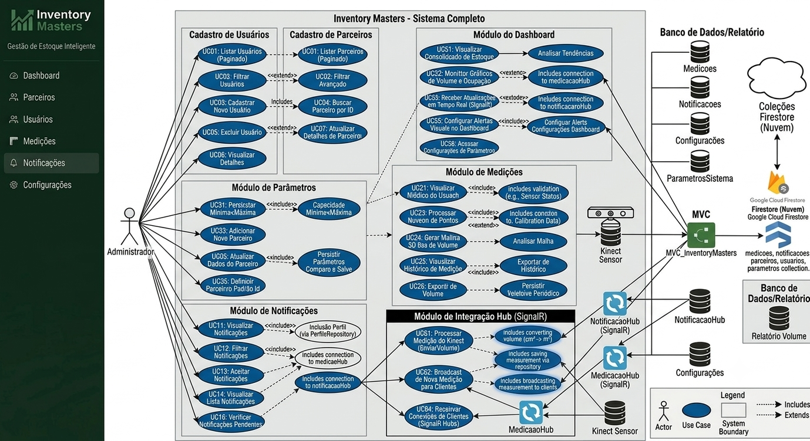
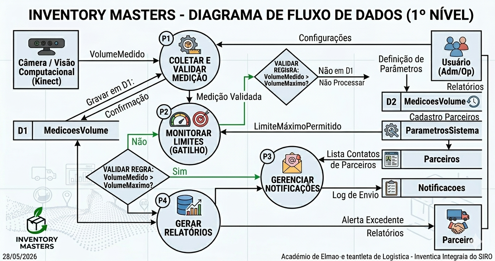
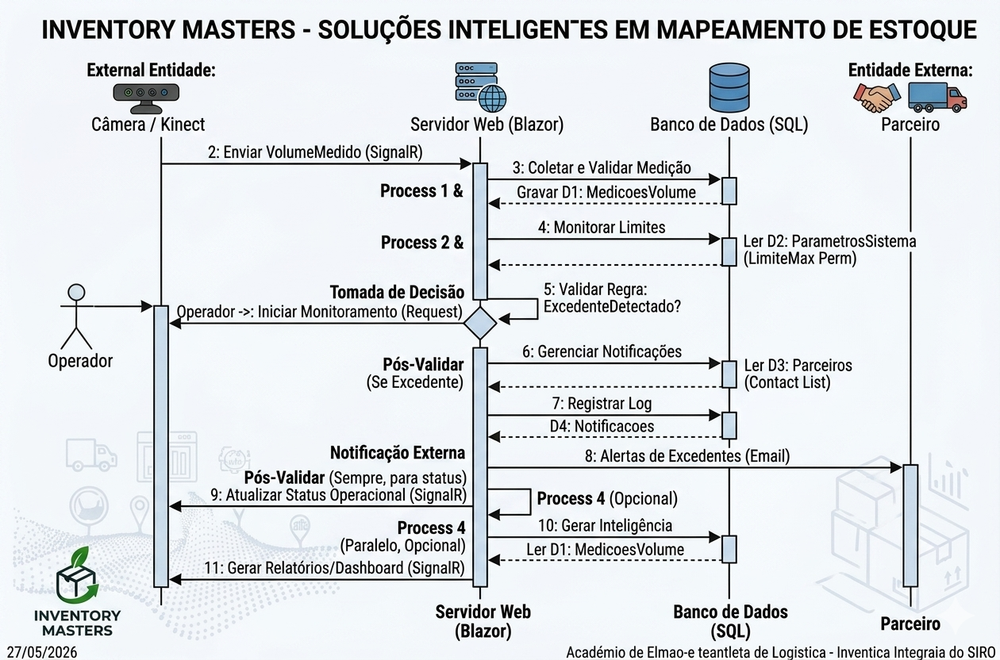
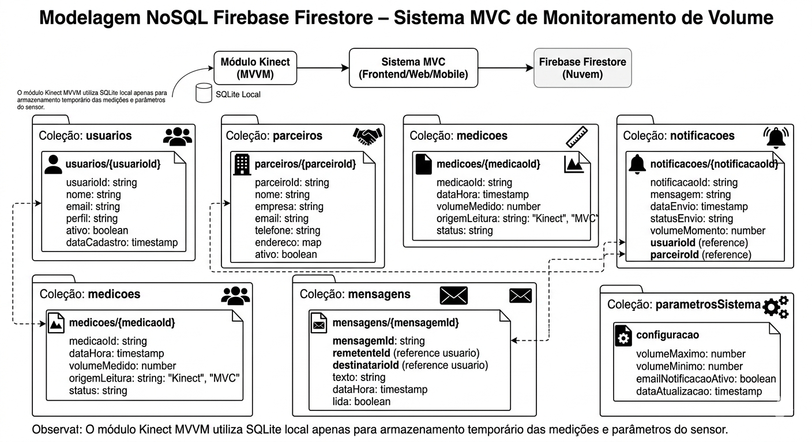

# INVENTORY MASTERS - SOLUÇÕES INTELIGENTES EM MAPEAMENTO DE ESTOQUE
---
**Unidade SENAI:** Nova Lima  
**Instrutor:** Frederico Martins Aguiar

<div align="center">

## INTEGRANTES DO GRUPO

<p align="center">
  
</p>

</div>

| Nome | Curso| Especialidade no Projeto |
| :--- | :--- | :--- |
| **Danilo Silva Santos** | Programação de Sistemas | Desenvolvimento e Integração do Sensor Kinect|
| **Marilene da Silva Araujo** | Programação de Sistemas | Desenvolvimento, e Modelagem de Banco de Dados |
| **Miguel Cassio Braga Duarte** |Programação de Sistemas | Desenvolvimento e Lógica do negócio |
| **Diulie Mileide Batista Correia** |Programação de Sistemas | Desenvolvimento , Integração do Sensor Kinect e Documentação  |

</div>

---

## Quem Somos

A Inventory Masters é uma plataforma tecnológica voltada para o monitoramento inteligente de espaços de armazenamento e a gestão estratégica de excedentes produtivos.

A solução utiliza tecnologias de visão computacional e mapeamento volumétrico para identificar, medir e acompanhar a ocupação de ambientes destinados ao armazenamento de materiais, permitindo maior controle sobre estoques, excedentes e capacidade disponível.

Por meio da integração entre o sensor Kinect, processamento de dados e dashboards gerenciais, a plataforma transforma informações operacionais em indicadores que auxiliam a tomada de decisão, promovendo maior eficiência logística e redução de desperdícios.

Além de otimizar a utilização dos espaços monitorados, a Inventory Masters contribui para a economia circular ao conectar materiais excedentes a oportunidades de reaproveitamento, transformando recursos subutilizados em ativos com potencial de geração de valor econômico.

Nossa proposta combina inovação tecnológica, sustentabilidade e inteligência operacional para apoiar empresas na construção de processos mais eficientes, competitivos e ambientalmente responsáveis.


<p align="center">
  
</p>

-------

## PROBLEMA 

O cenário empresarial atual é caracterizado por elevados níveis de produção e, consequentemente, pela geração contínua de excedentes produtivos. Esses excedentes incluem sobras de matéria-prima, materiais fora dos padrões comerciais, resíduos operacionais e insumos não aproveitados integralmente durante os processos produtivos. Em muitas organizações, esses materiais não são monitorados de forma estratégica, sendo frequentemente tratados apenas como resíduos ou custos inevitáveis.

Além da dificuldade de gerenciar os excedentes, muitas empresas enfrentam desafios relacionados ao controle e monitoramento da ocupação dos espaços de armazenamento. A ausência de mecanismos automatizados para medir a utilização dos ambientes dificulta a identificação da capacidade disponível, o acompanhamento do crescimento dos estoques e a tomada de decisões relacionadas ao reaproveitamento, movimentação ou destinação de materiais.

A falta de rastreabilidade, monitoramento e visibilidade dos espaços físicos gera impactos significativos:

* **Sob a ótica econômica** *: aumento dos custos operacionais, desperdício de recursos, utilização inadequada dos espaços disponíveis e baixa eficiência na gestão de estoques.
* **Sob a ótica operacional** *: dificuldade de acompanhar a ocupação dos ambientes em tempo real, reduzindo a capacidade de planejamento, controle logístico e gestão dos excedentes.
* **Sob a ótica ambiental:** * descarte inadequado de materiais reutilizáveis, aumento da geração de resíduos e maior pressão sobre os recursos naturais.

Embora a economia circular seja amplamente reconhecida como uma estratégia importante para o desenvolvimento sustentável, sua implementação ainda encontra barreiras devido à escassez de ferramentas tecnológicas acessíveis que permitam monitorar, medir e gerenciar excedentes de forma eficiente e baseada em dados.

Diante desse cenário, surge a necessidade de uma solução capaz de automatizar o monitoramento dos espaços de armazenamento, medir a ocupação dos ambientes, identificar excedentes produtivos e disponibilizar informações confiáveis para apoiar a tomada de decisão.

É nesse contexto que se insere a proposta da **Inventory Masters**, uma plataforma tecnológica que utiliza mapeamento volumétrico, visão computacional e monitoramento inteligente para acompanhar a ocupação de espaços físicos, rastrear excedentes produtivos e apoiar estratégias de reaproveitamento de materiais. A solução busca transformar dados operacionais em informações gerenciais, permitindo maior controle dos recursos, melhor utilização da capacidade disponível e redução de desperdícios.

Assim, o presente estudo busca integrar inovação tecnológica, eficiência operacional e sustentabilidade, contribuindo para uma gestão mais inteligente dos recursos, redução de desperdícios e fortalecimento das práticas de economia circular.

---

## SOLUÇÃO

A **Inventory Masters** é uma plataforma tecnológica desenvolvida para apoiar a gestão inteligente de excedentes produtivos por meio do monitoramento volumétrico de espaços de armazenamento e da rastreabilidade de materiais com potencial de reaproveitamento.

A solução utiliza tecnologias de visão computacional e mapeamento volumétrico para acompanhar a ocupação dos ambientes monitorados, permitindo identificar a capacidade utilizada, o espaço disponível e possíveis situações de excedente operacional. Por meio da integração entre o sensor Kinect, processamento de dados e dashboards gerenciais, o sistema transforma medições físicas em informações estratégicas para apoio à tomada de decisão.

O módulo Kinect é responsável por capturar dados de profundidade do ambiente, realizar a calibração do espaço monitorado e calcular automaticamente o volume ocupado. Essas informações são processadas e disponibilizadas em tempo real para a plataforma, permitindo o acompanhamento contínuo da ocupação dos estoques.

Com base nas medições realizadas, a plataforma calcula indicadores operacionais como:

* Volume ocupado;
* Espaço livre disponível;
* Percentual de ocupação;
* Histórico de medições;
* Situação dos limites configurados;
* Indicadores para apoio à tomada de decisão.

Além do monitoramento dos espaços, a plataforma atua como um elo integrador entre empresas geradoras de excedentes e parceiros aptos a reutilizá-los, estruturando um ecossistema colaborativo voltado para eficiência operacional, redução de desperdícios e sustentabilidade empresarial.

Ao conectar monitoramento inteligente, rastreabilidade e reaproveitamento de materiais, a solução contribui para:

* **Redução de custos** operacionais e de descarte;
* **Melhor aproveitamento dos espaços de armazenamento**;
* **Maior controle sobre excedentes produtivos**;
* **Melhoria da eficiência logística e operacional**;
* **Mitigação dos impactos ambientais** relacionados ao descarte inadequado de materiais.

Mais do que uma iniciativa sustentável, a Inventory Masters configura-se como uma solução de inovação aplicada à gestão de estoques, monitoramento volumétrico e economia circular, alinhada às tendências de transformação digital, responsabilidade socioambiental e competitividade empresarial.

---

### ÁREA TECNOLÓGICA DA SOLUÇÃO

A solução Inventory Masters está inserida no contexto da **Indústria 4.0**, integrando tecnologias de visão computacional, monitoramento volumétrico, processamento de dados e comunicação em tempo real para apoiar a gestão inteligente de excedentes produtivos e ocupação de espaços de armazenamento.

As principais áreas tecnológicas envolvidas são:

* **Visão Computacional:** Utilização do sensor Kinect Xbox 360, câmera RGB e sensor de profundidade (RGB-D) para captura de dados espaciais e realização do mapeamento volumétrico dos ambientes monitorados.

* **Monitoramento Volumétrico:** Processamento dos dados capturados para cálculo do volume ocupado, espaço livre disponível e percentual de ocupação dos ambientes de armazenamento.

* **Internet das Coisas (IoT):** Integração entre hardware e software para coleta automática de dados e monitoramento contínuo dos espaços físicos.

* **Sistemas de Informação:** Processamento, armazenamento e disponibilização das informações por meio de aplicações desenvolvidas em C#, WPF, ASP.NET Core, SQLite e Firebase Firestore.

* **Comunicação em Tempo Real:** Utilização do SignalR para sincronização das medições realizadas pelo módulo Kinect com os dashboards da aplicação web.

A combinação dessas tecnologias permite que a solução transforme medições físicas em informações estratégicas para apoio à tomada de decisão, rastreabilidade de excedentes e otimização dos espaços de armazenamento.

### JUSTIFICATIVA

A implementação deste projeto justifica-se pelas limitações dos métodos tradicionais de controle de estoque e monitoramento de espaços de armazenamento, que normalmente dependem de medições manuais, inspeções periódicas e registros sujeitos a falhas humanas.

A ausência de informações precisas sobre a ocupação dos ambientes dificulta o planejamento logístico, reduz a eficiência operacional e pode resultar em desperdícios, utilização inadequada dos espaços disponíveis e acúmulo de excedentes produtivos.

Nesse contexto, a Inventory Masters propõe uma alternativa tecnológica de baixo custo baseada no sensor Kinect Xbox 360, permitindo automatizar o monitoramento volumétrico dos ambientes e disponibilizar informações em tempo real sobre ocupação, capacidade disponível e situação dos estoques.

Além dos benefícios operacionais, a solução contribui para práticas de economia circular, rastreabilidade de materiais e redução de impactos ambientais, tornando a gestão dos excedentes mais eficiente, sustentável e orientada por dados.

### OBJETIVOS

#### Objetivo Geral

Desenvolver e implementar uma plataforma tecnológica capaz de realizar o monitoramento volumétrico de espaços de armazenamento e apoiar a gestão inteligente de excedentes produtivos por meio da captura, processamento e disponibilização de informações em tempo real.

#### Objetivos Específicos

##### Módulo Kinect

* Integrar o sensor Kinect Xbox 360 ao ambiente de desenvolvimento C# para captura de dados de profundidade e imagens do ambiente monitorado.
* Desenvolver mecanismos de calibração do espaço físico para obtenção de medições confiáveis.
* Criar algoritmos capazes de converter os dados de profundidade em métricas volumétricas.
* Calcular automaticamente o volume ocupado, espaço livre disponível e percentual de ocupação.
* Armazenar localmente as medições realizadas para consulta histórica e rastreabilidade.
* Disponibilizar as informações coletadas para integração com a aplicação web.

##### Módulo MVC

* Desenvolver dashboards para visualização das informações recebidas do módulo Kinect.
* Permitir o gerenciamento de parceiros e materiais com potencial de reaproveitamento.
* Disponibilizar configurações de parâmetros operacionais e limites de ocupação.
* Implementar mecanismos de notificação e acompanhamento dos excedentes produtivos.
* Apoiar a tomada de decisão por meio de indicadores operacionais e históricos de ocupação.

##### Integração Entre os Módulos

* Sincronizar as medições realizadas pelo Kinect com a aplicação web utilizando SignalR.
* Garantir atualização das informações em tempo real.
* Permitir operação local do módulo Kinect mesmo em situações de indisponibilidade da aplicação web.
* Apoiar a identificação, controle e direcionamento estratégico dos excedentes produtivos.

---

### DESENVOLVIMENTO

O desenvolvimento do projeto foi estruturado em etapas progressivas, permitindo a construção independente dos módulos Kinect e MVC, bem como sua integração para formação da solução completa.

#### 1. Levantamento de Requisitos e Modelagem

Foram definidos os requisitos funcionais, regras de negócio, fluxos operacionais e diagramas necessários para representar o funcionamento da solução.

#### 2. Desenvolvimento do Módulo Kinect

Nesta etapa foi realizada a integração com o sensor Kinect Xbox 360 utilizando o Microsoft Kinect SDK 1.8.

Foram implementados os recursos responsáveis por:

* Captura da câmera RGB;
* Captura dos dados de profundidade;
* Calibração do espaço monitorado;
* Processamento das medições volumétricas;
* Cálculo do volume ocupado;
* Cálculo do espaço livre disponível;
* Cálculo do percentual de ocupação;
* Armazenamento local das medições em SQLite.

#### 3. Desenvolvimento do Módulo MVC

Foi desenvolvida a aplicação web responsável pelo gerenciamento operacional da solução.

Nesta etapa foram implementados:

* Dashboard de acompanhamento;
* Gerenciamento de parceiros;
* Configuração de parâmetros;
* Sistema de notificações;
* Relatórios e consultas históricas;
* Integração com Firebase Firestore.

#### 4. Integração Entre os Módulos

Foi implementada a comunicação em tempo real utilizando SignalR, permitindo que as medições realizadas pelo módulo Kinect fossem disponibilizadas automaticamente na aplicação web.

#### 5. Testes e Validação

Foram realizados testes de calibração, precisão das medições, persistência dos dados, sincronização entre os módulos e atualização das informações em tempo real.

#### 6. Consolidação da Solução

Após a integração dos componentes, a plataforma passou a disponibilizar informações sobre ocupação dos espaços, capacidade disponível, histórico de medições e indicadores operacionais, apoiando a gestão dos excedentes produtivos e a tomada de decisão.

---
# REGRA DE NEGÓCIO

As regras de negócio definem o comportamento esperado do sistema, garantindo a precisão das medições, a integridade dos dados, a operação correta do hardware Kinect, a comunicação em tempo real com a aplicação MVC e o apoio à tomada de decisão logística.

As regras foram organizadas por domínio para separar claramente as responsabilidades do **Módulo Kinect**, do **Módulo MVC** e da **Integração entre os módulos**.

---

## 1. Regras de Gestão de Estoque e Parâmetros — MVC

* **RN01 - Validação de Limites:** Toda medição deve ser comparada com os limites de capacidade mínima e máxima configurados pelo administrador (`UC30`, `UC31`).

* **RN02 - Persistência Segura:** Configurações de parâmetros não podem ser salvas sem validação prévia de consistência de dados no Firestore (`UC32`, `UC36`).

* **RN03 - Vinculação de Entidade:** O sistema deve garantir que toda operação esteja vinculada a um parceiro. Caso não haja um parceiro ativo na sessão, o sistema deve utilizar o "Parceiro Padrão" configurado (`UC35`).

---

## 2. Regras de Processamento de Visão Computacional — Kinect

* **RN04 - Critério de Aceitação da Leitura:** Uma medição só pode ser considerada válida se houver dados suficientes de profundidade para representar o espaço monitorado, evitando leituras inconsistentes causadas por falhas, ruídos ou oclusões (`UC29`).

* **RN05 - Padronização de Unidade:** O sistema deve converter obrigatoriamente os dados brutos de `cm³` para `m³` antes da exibição ao usuário ou envio para dashboards (`UC61`).

* **RN06 - Rastreabilidade Espacial:** Toda medição válida deve permitir o registro do estado do ambiente monitorado no momento da captura, possibilitando auditoria e acompanhamento histórico (`UC19`).

* **RN07 - Limpeza de Memória:** O sistema deve executar rotinas de limpeza de buffer após o processamento das medições para evitar sobrecarga de memória durante a captura contínua dos dados (`UC39`).

---

## 3. Regras de Integração Reativa — SignalR

* **RN08 - Broadcast Obrigatório:** Sempre que uma nova medição for validada e processada, o sistema deve atualizar todos os clientes conectados aos dashboards em tempo real, sem necessidade de atualização manual da página (`UC62`).

* **RN09 - Resiliência e Cache:** Em caso de perda de conectividade com o servidor, os dados devem permanecer armazenados localmente até que a conexão seja restabelecida (`UC58`).

* **RN10 - Ciclo de Vida da Conexão:** O sistema deve gerenciar as conexões do SignalR, identificando eventos de conexão e desconexão para garantir que apenas clientes ativos recebam atualizações (`UC64`).

---

## 4. Regras de Segurança e Acesso — MVC

* **RN11 - Segregação de Perfis:**
  * **Admin:** Acesso a relatórios históricos, auditoria, gerenciamento de parâmetros, usuários e parceiros (`UC10`, `UC26`, `UC31`).
  * **Operador:** Operação do hardware, calibração, medição volumétrica e monitoramento em tempo real (`UC18`, `UC21`, `UC28`).

* **RN12 - Autenticação no Hub:** A conexão com os Hubs de integração SignalR exige validação de token para evitar acesso não autorizado a dados do sistema (`UC57`).

* **RN13 - Log de Segurança:** Qualquer tentativa de acesso não autorizado aos serviços de integração deve ser registrada em logs de auditoria de segurança (`UC60`).

---

## 5. Regras de Manutenção de Hardware — Kinect

* **RN14 - Monitoramento de Saúde:** O sistema deve verificar a conectividade e o estado operacional do Kinect antes dos processos de calibração e medição (`UC37`).

* **RN15 - Tratamento de Erros:** Falhas físicas, como desconexão do cabo ou indisponibilidade do sensor, devem ser registradas em logs operacionais para permitir diagnóstico técnico (`UC38`).

* **RN16 - Auto-recuperação:** O sistema deve tentar restabelecer a comunicação com o Kinect antes de notificar o erro ao operador (`UC50`).

---

## 6. Regras de Negócio do Módulo Kinect

* **RN17 - Inicialização do Sensor:** O Kinect deve estar conectado e operacional antes do início de qualquer processo de calibração ou medição volumétrica.

* **RN18 - Calibração Obrigatória:** Nenhuma medição poderá ser considerada válida sem que o ambiente tenha sido previamente calibrado em estado vazio.

* **RN19 - Referência Espacial:** A calibração deve gerar um mapa de profundidade de referência que será utilizado como base para comparação das medições futuras.

* **RN20 - Validação do Espaço Monitorado:** O usuário deverá cadastrar e salvar o espaço monitorado antes de liberar medições automáticas ou consultas históricas.

* **RN21 - Cálculo Volumétrico:** O volume ocupado deve ser calculado por meio da comparação entre o mapa calibrado e a leitura atual de profundidade obtida pelo Kinect.

* **RN22 - Conversão de Unidade:** Os cálculos internos poderão ser realizados em centímetros cúbicos (`cm³`), porém todas as informações exibidas ao usuário deverão ser apresentadas em metros cúbicos (`m³`).

* **RN23 - Cálculo de Ocupação:** O sistema deverá calcular automaticamente o percentual de ocupação com base no volume ocupado e na capacidade máxima cadastrada para o espaço monitorado.

* **RN24 - Cálculo do Espaço Livre:** O sistema deverá calcular automaticamente o espaço livre disponível com base na diferença entre a capacidade máxima e o volume atualmente ocupado.

* **RN25 - Histórico de Medições:** Toda medição válida deverá ser armazenada localmente para permitir rastreabilidade e acompanhamento da evolução da ocupação do espaço monitorado.

* **RN26 - Operação Offline:** O módulo Kinect deverá continuar operando normalmente mesmo que a aplicação MVC esteja temporariamente indisponível.

* **RN27 - Logoff por Inatividade:** Caso o usuário permaneça sem interação por período superior ao limite configurado, a sessão deverá ser encerrada automaticamente, exigindo novo acesso ao sistema.

---

## 7. Integração entre Kinect e MVC

* **RN28 - Envio de Medições:** Após o processamento de uma medição válida, o módulo Kinect deverá disponibilizar as informações para a aplicação MVC por meio do SignalR.

* **RN29 - Continuidade Operacional:** Em caso de falha de comunicação com a aplicação MVC, as medições deverão permanecer armazenadas localmente até que a comunicação seja restabelecida.

* **RN30 - Atualização em Tempo Real:** Sempre que uma nova medição for processada, os dashboards conectados deverão receber as informações atualizadas sem necessidade de atualização manual da página.

---

## Fluxo de Processamento de Negócio

O sistema opera por meio de um fluxo determinístico, garantindo que apenas dados validados alcancem a interface de monitoramento. Caso ocorra uma falha em qualquer etapa, o processo é interrompido para evitar inconsistências nos dados de estoque.

### Etapas do Processo

1. **Verificação de Hardware:** Diagnóstico do sensor Kinect e validação do estado de conexão (`UC37`, `UC45`).

2. **Calibração do Espaço:** Captura do ambiente vazio para criação do mapa de profundidade de referência.

3. **Captura e Filtro:** Coleta dos dados espaciais e remoção de ruídos da leitura (`UC23`, `UC42`).

4. **Cálculo e Conversão:** Processamento dos dados de profundidade, cálculo do volume ocupado e conversão de unidade de `cm³` para `m³` (`UC24`, `UC61`).

5. **Validação de Limites:** Comparação do volume obtido com os limites configurados pelo administrador (`UC30`).

6. **Persistência Local:** Salvamento das medições no SQLite para garantir histórico e rastreabilidade local.

7. **Sincronização com MVC:** Envio das medições para a aplicação MVC via SignalR (`UC62`).

8. **Atualização dos Dashboards:** Exibição das informações em tempo real nos painéis de acompanhamento.

9. **Notificações e Acompanhamento:** Caso os limites sejam atingidos, o MVC executa os processos de alerta, histórico e comunicação com parceiros.

> **Nota de Integridade:** Qualquer falha detectada durante as etapas de validação interrompe a propagação do dado, assegurando que o dashboard exiba apenas informações íntegras, coerentes e validadas.

---

# REQUISITOS DO SISTEMA

Os requisitos do sistema foram organizados por categoria, separando as funcionalidades relacionadas à gestão web, ao módulo Kinect, ao monitoramento, à integração e aos aspectos não funcionais da solução.

---

## 1. Requisitos Funcionais — MVC

| Categoria | ID | Requisito Funcional | Casos de Uso |
| :--- | :--- | :--- | :--- |
| **Gestão** | RF01 | Cadastro, edição, exclusão e listagem de usuários/parceiros. | UC01-UC07 |
| | RF02 | Gestão de permissões e perfis de acesso. | UC08, UC09 |
| | RF03 | Auditoria de alterações via logs. | UC10, UC44, UC49 |
| **Monitoramento** | RF07 | Painel em tempo real de ocupação e volume. | UC51, UC52 |
| | RF08 | Disparo de alertas baseados em regras de limite. | UC14, UC17, UC30, UC34, UC55 |
| **Integração** | RF09 | Comunicação assíncrona via SignalR Hubs. | UC53, UC62, UC64 |
| | RF10 | Persistência de dados no Firestore. | UC32, UC36, UC46 |

---

## 2. Requisitos Funcionais — Kinect

| Categoria | ID | Requisito Funcional | Casos de Uso |
| :--- | :--- | :--- | :--- |
| **Medição** | RF04 | Captura volumétrica via Kinect e processamento dos dados de profundidade. | UC21, UC23, UC24 |
| | RF05 | Calibração do sensor e verificação da estabilidade da leitura. | UC28, UC29, UC45 |
| | RF06 | Conversão de medições brutas de `cm³` para `m³`. | UC61 |
| **Kinect** | RF11 | Permitir ligar e desligar o sensor Kinect. | UC18 |
| | RF12 | Realizar calibração do espaço monitorado vazio. | UC28 |
| | RF13 | Capturar dados de profundidade e imagem RGB. | UC21, UC23 |
| | RF14 | Calcular automaticamente o volume ocupado. | UC24 |
| | RF15 | Calcular espaço livre e percentual de ocupação. | UC24 |
| | RF16 | Armazenar medições localmente em SQLite. | UC32 |
| | RF17 | Exibir histórico de medições. | UC26 |
| | RF18 | Permitir logoff automático por inatividade. | UC65 |

---

## 3. Requisitos Funcionais — Integração Kinect e MVC

| Categoria | ID | Requisito Funcional | Casos de Uso |
| :--- | :--- | :--- | :--- |
| **Integração** | RF19 | Enviar medições para a aplicação MVC via SignalR. | UC62 |
| | RF20 | Sincronizar dados em tempo real entre Kinect e Dashboard. | UC62, UC64 |
| | RF21 | Manter as medições salvas localmente quando a aplicação MVC estiver temporariamente indisponível. | UC58 |

---

## 4. Requisitos Não Funcionais

| ID | Tipo | Requisito Não Funcional | Casos de Uso |
| :--- | :--- | :--- | :--- |
| **RNF01** | Desempenho | Processamento volumétrico e atualização em tempo real com baixa latência. | - |
| **RNF02** | Resiliência | Auto-recuperação e cache local para evitar perda de dados. | UC50, UC58 |
| **RNF03** | Segurança | Autenticação, validação de acesso e proteção das informações transmitidas. | UC57, UC59 |
| **RNF04** | Confiabilidade | Diagnóstico contínuo de hardware e gestão de memória. | UC37, UC39 |
| **RNF05** | Manutenibilidade | Uso de injeção de dependência e separação de responsabilidades para desacoplamento. | UC63 |
| **RNF06** | Usabilidade | Interface clara para exibir volume ocupado, espaço livre, percentual de ocupação e status operacional. | - |
| **RNF07** | Disponibilidade Local | O módulo Kinect deve operar localmente mesmo quando a aplicação MVC estiver indisponível. | UC58 |
| **RNF08** | Rastreabilidade | As medições devem ser registradas para permitir consulta histórica e auditoria operacional. | UC19, UC26 |

 ---
# MODELAGEM DO SISTEMA

## Diagrama de Caso de Uso

O Diagrama de Caso de Uso representa as funcionalidades da solução Inventory Masters, organizadas em três módulos principais:

* **Módulo MVC:** Responsável pela gestão operacional, dashboards, parâmetros, parceiros, notificações e relatórios.
* **Módulo Kinect:** Responsável pela captura, processamento e monitoramento volumétrico dos ambientes.
* **Módulo de Integração:** Responsável pela comunicação em tempo real entre o Kinect e a aplicação MVC através do SignalR.


  <p align="center">

  

</p>


---

## Casos de Uso da Aplicação MVC

A tabela abaixo apresenta os casos de uso relacionados exclusivamente à aplicação web MVC, responsável pela administração, monitoramento, parametrização, notificações e gestão operacional da plataforma.

| ID | Nome da Funcionalidade | Perfil | Descrição |
| :--- | :--- | :--- | :--- |
| UC01 | Listar Registros (Pag) | Admin | Listagem paginada de usuários ou parceiros. |
| UC02 | Filtrar Dados | Admin | Filtros avançados para busca de usuários ou parceiros. |
| UC03 | Cadastro de Entidade | Admin | Inclusão de novos usuários/parceiros com validação. |
| UC04 | Buscar por ID | Admin | Localização de registros específicos via identificador. |
| UC05 | Atualizar/Excluir | Admin | Manutenção, edição e remoção de registros cadastrais. |
| UC06 | Visualizar Detalhes | Admin | Exibição detalhada de um registro selecionado. |
| UC07 | Atualizar Detalhes Parceiro | Admin | Edição de informações específicas de parceiros. |
| UC08 | Inclusão de Perfil | Admin | Associação de níveis de acesso aos usuários. |
| UC09 | Gestão de Acessos | Admin | Controle de permissões do sistema. |
| UC10 | Auditoria de Logs | Admin | Rastreamento de alterações realizadas no sistema. |
| UC11 | Visualizar Histórico | Admin | Exibição do histórico de notificações do sistema. |
| UC12 | Filtrar Notificações | Admin | Segmentação de alertas por data ou status. |
| UC13 | Aceitar Coleta | Admin | Registro de aceite de coleta via repositório. |
| UC14 | Notificar Clientes | Sistema | Broadcast de alertas via SignalR. |
| UC15 | Integrar Perfil Repositório | Sistema | Conexão entre módulo de notificação e repositório. |
| UC16 | Verificar Pendências | Admin | Verificação de notificações e tarefas pendentes. |
| UC17 | Gestão de Alertas Visuais | Admin | Configuração de gatilhos de alerta no Dashboard. |
| UC18 | Monitorar Ocupação | Operador | Acompanhamento em tempo real da ocupação do espaço. |
| UC21 | Iniciar Medição | Operador | Ativação da captura de dados pelo sensor Kinect. |
| UC22 | Visualizar Fluxo Profund. | Operador | Monitoramento visual do fluxo de profundidade. |
| UC25 | Histórico Medições | Admin | Consulta de medições recebidas pela plataforma. |
| UC26 | Exportar Dados | Admin | Exportação de relatórios volumétricos e periódicos. |
| UC27 | Relatório de Período | Admin | Geração de análise de volume por intervalo de tempo. |
| UC28 | Calibração de Sensor | Operador | Rotina de ajuste e definição do plano de referência. |
| UC30 | Validação de Regras de Limite | Sistema | Comparação das medições com parâmetros configurados. |
| UC31 | Ajustar Parâmetros | Admin | Configuração de limites mínimos e máximos de estoque. |
| UC32 | Persistir Configurações | Sistema | Validação e salvamento de parâmetros no Firestore. |
| UC33 | Adicionar Parceiro | Admin | Inclusão de novo parceiro via módulo de parâmetros. |
| UC34 | Ativar Alerta Dashboard | Admin | Ativação de alertas visuais no painel de controle. |
| UC35 | Definir Parceiro Padrão | Admin | Definição de entidade padrão para fluxos operacionais. |
| UC36 | Persistir Configurações | Sistema | Salvamento de parâmetros no Firestore. |
| UC45 | Verificação de Calibração | Operador | Check-up preventivo do estado de calibração do sensor. |
| UC47 | Gerenciamento de Coletas | Admin | Controle do ciclo de vida das coletas realizadas. |
| UC48 | Auditoria de Medições | Admin | Verificação de conformidade das medições. |
| UC51 | Visualizar Consolidado | Admin | Visão geral da ocupação e dos volumes monitorados. |
| UC52 | Monitorar Gráficos | Admin | Visualização de tendências e indicadores. |
| UC54 | Lista de Notificações | Admin | Exibição das notificações geradas. |
| UC55 | Configurar Alertas Visuais | Admin | Personalização dos alertas exibidos no Dashboard. |
| UC56 | Acessar Parâmetros | Admin | Acesso ao módulo de configuração. |

---
## Casos de Uso da Aplicação Kinect

Os casos de uso abaixo representam as funcionalidades relacionadas ao monitoramento volumétrico, captura dos dados de profundidade e processamento realizado pelo Kinect.

| ID | Nome da Funcionalidade | Perfil | Descrição |
| :--- | :--- | :--- | :--- |
| UCK01 | Realizar Login Local | Operador | Permite acesso ao módulo Kinect. |
| UCK02 | Realizar Logoff | Operador | Encerra a sessão atual. |
| UCK03 | Logoff por Inatividade | Sistema | Encerra automaticamente a sessão após período configurado. |
| UCK04 | Ligar Kinect | Operador | Inicializa o sensor Kinect. |
| UCK05 | Desligar Kinect | Operador | Finaliza a operação do sensor. |
| UCK06 | Verificar Conectividade do Sensor | Sistema | Verifica se o Kinect está conectado e operacional. |
| UCK07 | Diagnosticar Hardware | Sistema | Realiza diagnóstico do estado do sensor Kinect. |
| UCK08 | Calibrar Espaço Vazio | Operador | Captura o ambiente vazio para geração da referência espacial. |
| UCK09 | Verificar Estado da Calibração | Operador | Valida o estado atual da calibração realizada. |
| UCK10 | Capturar Dados de Profundidade | Sistema | Obtém os dados de profundidade do ambiente monitorado. |
| UCK11 | Capturar Imagem RGB | Sistema | Exibe a câmera RGB em tempo real. |
| UCK12 | Processar Dados de Profundidade | Sistema | Processa os dados recebidos do sensor Kinect. |
| UCK13 | Calcular Volume Ocupado | Sistema | Determina o volume ocupado no ambiente monitorado. |
| UCK14 | Calcular Espaço Livre | Sistema | Calcula a capacidade disponível no espaço monitorado. |
| UCK15 | Calcular Percentual de Ocupação | Sistema | Determina a taxa de ocupação do ambiente. |
| UCK16 | Salvar Medição Local | Sistema | Armazena medições realizadas no SQLite. |
| UCK17 | Consultar Histórico | Operador | Exibe o histórico das medições realizadas. |
| UCK18 | Registrar Logs Operacionais | Sistema | Registra eventos e falhas operacionais do módulo Kinect. |
| UCK19 | Enviar Medição para MVC | Sistema | Envia medições processadas para a aplicação MVC. |
| UCK20 | Sincronizar Dados via SignalR | Sistema | Realiza sincronização das medições em tempo real. |
| UCK21 | Operar Offline | Sistema | Mantém funcionamento local quando o MVC estiver indisponível. |
| UCK22 | Exibir Volume Atual | Operador | Visualiza o volume ocupado calculado pelo sistema. |
| UCK23 | Exibir Espaço Livre | Operador | Visualiza o espaço livre disponível. |
| UCK24 | Exibir Percentual de Ocupação | Operador | Visualiza o percentual de ocupação calculado. |
| UCK25 | Exibir Status do Kinect | Operador | Exibe o status atual do sensor Kinect. |
| UCK26 | Exibir Status do SQLite | Operador | Exibe o status do banco de dados local. |
| UCK27 | Exibir Status do SignalR | Operador | Exibe o status da comunicação com a aplicação MVC. |

---

## Casos de Uso Incluídos (<<include>>)

Os casos abaixo são executados internamente pelos casos de uso principais apresentados no diagrama.

| Caso Principal | Caso Incluído |
| :--- | :--- |
| UCK08 - Calibrar Espaço Vazio | Capturar Profundidade |
| UCK08 - Calibrar Espaço Vazio | Validar Calibração |
| UCK08 - Calibrar Espaço Vazio | Criar Mapa de Referência |
| UCK12 - Processar Dados de Profundidade | Aplicar Filtros |
| UCK12 - Processar Dados de Profundidade | Remover Ruídos |
| UCK12 - Processar Dados de Profundidade | Normalizar Dados |
| UCK13 - Calcular Volume Ocupado | Comparar com Referência Calibrada |
| **UC15** - Notificar Clientes | Integrar Perfil Repos. |
| UCK19 - Enviar Medição para MVC | Converter cm³ para m³ |
| **UC32** - Validação de Parâmetros | Persistir Configurações |
| **UC36** - Validação de Parâmetros | Persistir Configs |
| **UC41** - Processamento Espacial | Normalização de Dados |
| **UC42** - Processamento Espacial | Tratamento de Ruído |
| **UC43** - Cálculo Volumétrico | Cálculo de Superfície |
| **UC46** - Gestão de Dados | Sincronização de Histórico |
| **UC49** - Gestão de Logs | Backup de Logs |

> **Nota:** Os casos de uso identificados em negrito referem-se às funcionalidades nativas do projeto de aplicação MVC.
---

## Casos de Uso Extendidos (<<extend>>)

Casos que adicionam comportamento opcional ou condicional a um caso de uso principal.

| ID(s) | Nome da Funcionalidade | Perfil | Descrição |
| :--- | :--- | :--- | :--- |
| **UC19** | Registrar Snapshot Espacial | Sistema | Extende o processo de captura para fins de auditoria quando necessário. |
| **UC23, UC24** | Processamento e Geração de Malha | Sistema | Podem ser estendidos por condições de qualidade da nuvem. |
| **UC29** | Verificação de Estabilidade de Malha | Sistema | Extende a geração da malha para validar a qualidade espacial. |
| **UC30** | Validação de Regras de Limite | Sistema | Extende o cálculo de volume para disparar alertas condicionais. |
| **UC38, UC40, UC44** | Logs, Validação e Auditoria | Sistema | Extendem o ciclo de vida da medição conforme eventos de sistema ocorrem. |

> **Nota:** Os casos de uso identificados em negrito referem-se às funcionalidades nativas do projeto de aplicação MVC.
---

## Casos de Uso de Integração

Os casos de uso abaixo representam os mecanismos responsáveis pela comunicação entre o Kinect e a aplicação MVC.

| ID | Nome da Funcionalidade | Perfil | Descrição |
| :--- | :--- | :--- | :--- |
| UCI01 | Enviar Medições via SignalR | Sistema | Envia medições para a aplicação MVC. |
| UCI02 | Receber Medições | Sistema | Recebe medições enviadas pelo Kinect. |
| UCI03 | Atualizar Dashboard em Tempo Real | Sistema | Atualiza dashboards conectados. |
| UCI04 | Sincronizar Histórico | Sistema | Mantém consistência entre os módulos. |
| UCI05 | Operar Offline | Sistema | Mantém medições locais quando o MVC estiver indisponível. |
| UCI06 | Gerenciar Conexões | Sistema | Controle do ciclo de vida das conexões SignalR. |
| UCI07 | Autenticar Comunicação | Sistema | Validação de acesso aos serviços de integração. |
| **UC14** | Notificar Clientes | Sistema | Broadcast de alertas via SignalR (NotificacaoHub). |
| **UC20** | Validação de Conexões | Sistema | Monitoramento de handshake entre cliente e servidor. |
| **UC37** | Diagnóstico de Conectividade | Sistema | Verifica em tempo real se a comunicação entre o Kinect e o módulo MVC está ativa. |
| **UC50** | Estabilização de Conexão | Sistema | Tratamento de re-handshake automático para o Kinect. |
| **UC57** | Autenticação de Hub | Sistema | Validação de tokens de segurança JWT para acesso aos Hubs SignalR. |
| **UC53** | Receber Atualizações | Sistema | Integração assíncrona (Hub) para o Dashboard. |
| **UC58** | Cache de Estado Local | Sistema | Armazenamento temporário de medições no cliente para evitar perda de dados em micro-quedas de rede. |
| **UC59** | Criptografia de Payload | Sistema | Garantia de que os dados volumétricos estejam protegidos durante a transmissão via rede. |
| **UC60** | Log de Eventos de Segurança | Sistema | Registro de tentativas de acesso não autorizadas aos Hubs de integração. |
| **UC61** | Processar Medição Hub | Sistema | Conversão $cm^3 \rightarrow m^3$ e broadcast. |
| **UC62** | Broadcast Clientes | Sistema | Envio de nova medição para todos os Dashboards. |
| **UC63** | Injeção de Dependência | Sistema | Inicialização automática e resolução de instâncias de repositórios (Firestore/MVC) necessária para o ciclo de vida do SignalR Hub. |
| **UC64** | Gerenciar Conexões | Sistema | Controle de ciclo de vida das sessões (SignalR). |

> **Nota:** Os casos de uso identificados em negrito referem-se às funcionalidades nativas do projeto de aplicação MVC.

---

## Diagrama de Fluxo

<p align="center">
  
</p>

### Detalhamento do Diagrama de Fluxo de Dados

O Diagrama de Fluxo representa o caminho percorrido pelas informações dentro da solução Inventory Masters, evidenciando a interação entre o Módulo Kinect, a Aplicação MVC e os serviços de integração responsáveis pela comunicação em tempo real.

---

### Entidades Externas

* **Usuário:** Responsável por operar o sistema, realizar calibração, acompanhar medições e consultar informações operacionais.

* **Sensor Kinect:** Responsável pela captura das imagens RGB e dos dados de profundidade utilizados no monitoramento volumétrico.

* **Sistema MVC:** Responsável pela gestão operacional, dashboards, parâmetros, parceiros, notificações e relatórios.

* **Parceiro:** Responsável pelo recebimento de alertas relacionados aos excedentes produtivos.

---

### Processos do Módulo Kinect

* **P1: Inicializar Kinect:** Ativa o sensor e valida sua conectividade.

* **P2: Capturar Dados de Profundidade:** Recebe continuamente as leituras do ambiente monitorado.

* **P3: Calibrar Espaço Vazio:** Cria o mapa de profundidade de referência.

* **P4: Processar Dados Capturados:** Aplica filtros, validações e tratamento de ruídos.

* **P5: Calcular Volume Ocupado:** Compara a leitura atual com a referência calibrada.

* **P6: Calcular Indicadores Operacionais:** Calcula volume ocupado, espaço livre e percentual de ocupação.

* **P7: Persistir Medições:** Armazena os dados localmente em SQLite.

* **P8: Atualizar Histórico Local:** Mantém o histórico das medições realizadas.

---

### Processos da Aplicação MVC

* **P9: Receber Medições:** Recebe dados enviados pelo módulo Kinect.

* **P10: Atualizar Dashboard:** Atualiza indicadores e gráficos operacionais.

* **P11: Validar Limites Operacionais:** Compara medições com parâmetros configurados.

* **P12: Gerenciar Notificações:** Gera alertas quando os limites são atingidos.

* **P13: Consultar Parceiros:** Localiza parceiros aptos a receber notificações.

* **P14: Gerar Relatórios:** Disponibiliza relatórios e análises históricas.

---

### Processos de Integração

* **P15: Sincronizar Dados via SignalR:** Realiza a comunicação entre Kinect e MVC.

* **P16: Manter Operação Local:** Garante funcionamento mesmo sem conexão com o MVC.

* **P17: Atualizar Clientes Conectados:** Atualiza dashboards em tempo real.

---

### Depósitos de Dados

#### Módulo Kinect

* **D1: MedicaoVolumes:** Histórico das medições realizadas.
* **D2: HistoricoOcupacao:** Evolução da ocupação do espaço monitorado.
* **D3: UsuariosAcesso:** Controle de acesso local.
* **D4: LogsLocais:** Registro de eventos e falhas operacionais.

#### Aplicação MVC

* **D5: Usuarios:** Usuários cadastrados no sistema.
* **D6: Parceiros:** Parceiros aptos a receber notificações.
* **D7: ParametrosSistema:** Limites operacionais e configurações.
* **D8: Notificacoes:** Histórico de alertas gerados.
* **D9: Medicoes:** Medições recebidas do Kinect.
* **D10: Relatorios:** Informações consolidadas para análise.

---

### Detalhamento do Fluxo de Execução

1. O usuário acessa o sistema.
2. O Kinect é inicializado e validado.
3. O ambiente é calibrado em estado vazio.
4. O espaço monitorado é cadastrado.
5. O Kinect captura uma nova leitura de profundidade.
6. O sistema compara a leitura atual com a referência calibrada.
7. O volume ocupado é calculado automaticamente.
8. O sistema calcula espaço livre e percentual de ocupação.
9. A medição é armazenada localmente em SQLite.
10. Os dados são enviados para a aplicação MVC via SignalR.
11. O dashboard é atualizado em tempo real.
12. O MVC valida os limites configurados.
13. Caso necessário, são gerados alertas e notificações.
14. O monitoramento permanece ativo enquanto o Kinect estiver em operação.

---

## Diagrama de Sequência

<p align="center">
  
</p>

### Detalhamento do Fluxo de Sequência

O fluxo inicia-se quando o Kinect realiza uma nova leitura do ambiente monitorado, seguindo uma sequência de captura, processamento, armazenamento e sincronização dos dados.

---

### 1. Operação no Módulo Kinect

* O usuário acessa o sistema.
* O Kinect é inicializado.
* O ambiente é calibrado.
* O espaço monitorado é cadastrado.
* O sistema libera a medição volumétrica.

---

### 2. Captura, Processamento e Persistência

* O Kinect captura os dados de profundidade do ambiente.
* O sistema aplica filtros e validações nas leituras recebidas.
* A leitura atual é comparada ao mapa calibrado.
* A diferença entre as leituras é utilizada para calcular o volume ocupado.
* O sistema calcula:
  * Volume ocupado;
  * Espaço livre;
  * Percentual de ocupação;
  * Situação operacional.
* Os dados são armazenados localmente em SQLite.

---

### 3. Integração com o MVC

* Após salvar a medição, o módulo Kinect envia os dados para a aplicação MVC utilizando SignalR.
* Caso a conexão esteja indisponível, a medição permanece salva localmente.
* Quando a comunicação estiver disponível, as informações são sincronizadas automaticamente.

---

### 4. Processamento no MVC

* O MVC recebe as medições.
* O sistema consulta os parâmetros configurados.
* Os valores são comparados aos limites operacionais.
* Caso necessário, são gerados alertas e notificações.
* As informações são disponibilizadas nos dashboards.

---

### 5. Apoio à Tomada de Decisão

* As medições alimentam os indicadores operacionais.
* O histórico permite acompanhar a evolução da ocupação.
* Os dashboards apresentam informações em tempo real.
* Os dados consolidados apoiam a gestão dos excedentes produtivos, a utilização dos espaços de armazenamento e a tomada de decisão logística.
---

## MODELAGEM DO BANCO DE DADOS
---

Com a evolução arquitetural do projeto, a solução passou a utilizar uma abordagem híbrida de armazenamento de dados, combinando banco relacional local e banco NoSQL em nuvem.

O módulo responsável pela captura volumétrica via Kinect (MVVM) utiliza o banco local **SQLite**, garantindo baixo custo computacional, operação offline e persistência temporária das leituras do sensor.

Já a aplicação Web MVC, responsável pelo gerenciamento operacional, autenticação, dashboard, notificações e integração entre usuários e parceiros, passou a utilizar o **Firebase Firestore**, um banco de dados NoSQL orientado a documentos e altamente escalável.

Diferentemente da modelagem relacional tradicional, o Firestore organiza os dados em:
- Coleções;
- Documentos;
- Subcoleções;
- Referências por identificadores (IDs).

Essa abordagem elimina a necessidade de relacionamentos complexos e operações JOIN, proporcionando maior desempenho em aplicações distribuídas e em tempo real.

---

## Arquitetura de Persistência de Dados

### Módulo Kinect (MVVM)
- Banco Local: SQLite;
- Responsável por:
  - armazenamento temporário das medições;
  - persistência dos parâmetros do sensor;
  - funcionamento offline;
  - processamento local das leituras do Kinect.

### Aplicação MVC Web
- Banco em Nuvem: Firebase Firestore;
- Responsável por:
  - autenticação de usuários;
  - gerenciamento de parceiros;
  - dashboard operacional;
  - envio de notificações;
  - mensageria;
  - armazenamento centralizado das medições;
  - sincronização em tempo real.

---

## Modelagem NoSQL Firebase Firestore (MVC)

<p align="center">
  
</p>

---

## Estrutura das Coleções Firestore

| Coleção | Finalidade |
|---|---|
| **usuarios** | Armazena os usuários cadastrados no sistema |
| **parceiros** | Mantém os parceiros responsáveis pelo reaproveitamento dos excedentes |
| **medicoes** | Registra todas as medições volumétricas enviadas pelo Kinect |
| **notificacoes** | Controla os alertas automáticos disparados pelo sistema |
| **mensagens** | Gerencia a comunicação entre usuários |
| **parametrosSistema** | Armazena as regras de negócio e limites volumétricos |

---

## Descrição das Coleções

### Coleção: usuarios

Responsável pelo armazenamento das informações de autenticação e controle de acesso da plataforma.

| Campo | Tipo |
|---|---|
| usuarioId | String |
| nome | String |
| email | String |
| perfil | String |
| ativo | Boolean |
| dataCadastro | Timestamp |

---

### Coleção: parceiros

Armazena as empresas parceiras aptas a receber excedentes produtivos.

| Campo | Tipo |
|---|---|
| parceiroId | String |
| nome | String |
| empresa | String |
| email | String |
| telefone | String |
| endereco | Map |
| ativo | Boolean |

---

### Coleção: medicoes

Responsável pelo armazenamento das medições volumétricas capturadas pelo Kinect ou inseridas manualmente.

### Coleção: medicoes


| Campo | Tipo |
|---|---|
| medicaoId | String |
| dataHora | Timestamp |
| volumeMedido | Number |
| volumeTotalEspaco | Number |
| volumeLivre | Number |
| percentualOcupacao | Number |
| quantidadePontos3D | Number |
| confiabilidadeLeitura | Number |
| origemLeitura | String |
| status | String |
| espacoId | Reference |


---

### Coleção: notificacoes

Registra os alertas automáticos enviados pelo sistema aos parceiros e operadores.

| Campo | Tipo |
|---|---|
| notificacaoId | String |
| mensagem | String |
| dataEnvio | Timestamp |
| statusEnvio | String |
| volumeMomento | Number |
| percentualOcupacao | Number |
| usuarioId | Reference |
| parceiroId | Reference |


---

### Coleção: mensagens

Responsável pela comunicação interna entre usuários da plataforma.

| Campo | Tipo |
|---|---|
| mensagemId | String |
| remetenteId | Reference |
| destinatarioId | Reference |
| texto | String |
| dataHora | Timestamp |
| lida | Boolean |

---

### Coleção: parametrosSistema

Define os parâmetros operacionais utilizados pelos gatilhos automáticos da aplicação.

| Campo | Tipo |
|---|---|
| volumeMaximo | Number |
| percentualAlerta | Number |
| emailNotificacaoAtivo | Boolean |
| intervaloCapturaSegundos | Number |
| intervaloSnapshotSegundos | Number |
| dataAtualizacao | Timestamp |

---

###  espacosMapeados

Representa os ambientes cadastrados e mapeados pelo Kinect.

| Campo | Tipo |
|---|---|
| espacoId | String |
| nomeEspaco | String |
| volumeTotalEspaco | Number |
| volumeMaximoPermitido | Number |
| percentualAlerta | Number |
| ativo | Boolean |
| dataMapeamento | Timestamp |

---

###  snapshotsEspaciais

Armazena os estados periódicos do ambiente.

| Campo | Tipo |
|---|---|
| snapshotId | String |
| espacoId | Reference |
| dataHora | Timestamp |
| volumeAtual | Number |
| espacoLivre | Number |
| percentualOcupacao | Number |
| quantidadePontos3D | Number |

---

###  historicoOcupacao

Permite gerar gráficos e dashboards.

| Campo | Tipo |
|---|---|
| historicoId | String |
| espacoId | Reference |
| dataHora | Timestamp |
| percentualOcupacao | Number |
| volumeOcupado | Number |
| volumeLivre | Number |


## Considerações Arquiteturais

A adoção do Firebase Firestore trouxe benefícios importantes para a solução:

- Escalabilidade em nuvem;
- Sincronização em tempo real;
- Redução da complexidade relacional;
- Melhor desempenho para aplicações distribuídas;
- Facilidade de integração com aplicações Web e Mobile;
- Estrutura orientada a documentos adequada para IoT e monitoramento contínuo.

A arquitetura híbrida implementada no projeto permite que o módulo Kinect opere de maneira independente localmente, enquanto a aplicação MVC centraliza e distribui as informações operacionalmente em ambiente cloud.

---

## Modelo Conceitual — MVVM Kinect

<p align="center">
  
</p>

### Descrição das Entidades

| Entidade | Finalidade |
|---|---|
| **MedicaoVolume** | Armazena as leituras volumétricas realizadas pelo sensor Kinect |
| **ParametrosSistema** | Define os limites operacionais e parâmetros utilizados pelo sistema |

---

### Entidade: MedicaoVolume

| Campo | Tipo |
|---|---|
| id | Integer |
| data_hora | DateTime |
| volume_medido | Decimal |
| origem_leitura | String |

---

### Entidade: ParametrosSistema

| Campo | Tipo |
|---|---|
| id | Integer |
| volume_maximo | Decimal |
| volume_minimo | Decimal |
| email_notificacao_ativo | Boolean |
| data_atualizacao | DateTime |

---

## Modelo Lógico — MVVM Kinect

<p align="center">
  
</p>

### Estrutura Relacional

| Tabela | Descrição |
|---|---|
| **MedicaoVolume** | Histórico das medições capturadas pelo sensor |
| **ParametrosSistema** | Configurações e regras de negócio locais |

---

### Tabela: MedicaoVolume

| Campo | Tipo | Restrição |
|---|---|---|
| id | INTEGER | PK |
| data_hora | DATETIME | NOT NULL |
| volume_medido | DECIMAL | NOT NULL |
| origem_leitura | VARCHAR | NOT NULL |

---

### Tabela: ParametrosSistema

| Campo | Tipo | Restrição |
|---|---|---|
| id | INTEGER | PK |
| volume_maximo | DECIMAL | NOT NULL |
| volume_minimo | DECIMAL | NOT NULL |
| email_notificacao_ativo | BOOLEAN | NOT NULL |
| data_atualizacao | DATETIME | NOT NULL |

---

## Modelo Físico — MVVM Kinect

O modelo físico do módulo MVVM foi implementado utilizando:
- SQLite;
- Entity Framework Core;
- Migrations;
- Persistência local embarcada.

A estrutura física é gerada automaticamente pelo Entity Framework através das migrations da aplicação.

<p align="center">
  
</p>

---

# VIABILIDADE TÉCNICA

## Introdução

O projeto **Inventory Masters** propõe uma solução de monitoramento volumétrico inteligente utilizando o sensor **Kinect Xbox 360** integrado a um sistema desenvolvido em **C#**, com o objetivo de acompanhar a ocupação de espaços físicos destinados ao armazenamento de materiais e excedentes produtivos.

A solução combina captura de profundidade, processamento volumétrico, armazenamento local e sincronização com uma aplicação web, permitindo o acompanhamento contínuo da utilização dos espaços monitorados. Dessa forma, a plataforma contribui para o controle operacional, a redução de desperdícios e o apoio à tomada de decisão em ambientes logísticos e industriais.

---

## Descrição da Solução

A solução utiliza os sensores de profundidade e imagem RGB do Kinect para capturar informações tridimensionais do ambiente monitorado.

O processo inicia-se com a calibração do espaço vazio, criando um mapa de referência utilizado como base para as medições futuras. Durante a operação, o sistema compara a leitura atual do ambiente com a referência calibrada, permitindo calcular automaticamente:

- Volume ocupado;
- Espaço livre;
- Percentual de ocupação;
- Evolução da ocupação ao longo do tempo.

A arquitetura foi dividida em três módulos principais:

### Módulo Kinect

Responsável pela captura, processamento e armazenamento local das medições volumétricas.

### Módulo MVC

Responsável pela visualização dos dados através de dashboards, gerenciamento de parâmetros, parceiros, notificações e relatórios.

### Integração

Responsável pela comunicação em tempo real entre o Kinect e a aplicação MVC por meio do SignalR.

---

## Requisitos de Hardware

Para a execução estável do sistema foi definida a seguinte configuração mínima:

### Estação de Trabalho

- Processador Intel Core i3 ou superior;
- 8 GB de memória RAM;
- SSD de 240 GB ou superior;
- Sistema Operacional Windows compatível com Kinect SDK 1.8.

### Sensor

- Kinect Xbox 360;
- Adaptador USB com fonte de alimentação própria.

### Infraestrutura

- Estrutura de suporte para posicionamento adequado do sensor;
- Área monitorada livre de obstruções permanentes;
- Distância compatível com o campo de visão do Kinect.

---

## Organização Tecnológica

### Tecnologias do Módulo Kinect

- Linguagem: C#
- Plataforma: .NET Framework
- Interface: WPF
- Sensor: Kinect Xbox 360
- SDK: Kinect for Windows SDK 1.8
- Banco de Dados: SQLite
- Arquitetura: MVVM
- Comunicação: SignalR Client

### Tecnologias da Aplicação MVC

- ASP.NET MVC
- Razor Pages
- Bootstrap
- SignalR
- Firebase Firestore

### Tecnologias de Integração

- SignalR
- JSON
- WebSockets

---

## Metodologia de Implementação

O desenvolvimento da solução foi dividido em duas etapas principais.

### Etapa 1 – Desenvolvimento do Módulo Kinect

1. Integração do Kinect Xbox 360 ao ambiente de desenvolvimento.
2. Captura dos dados de profundidade e imagem RGB.
3. Implementação da calibração do ambiente.
4. Desenvolvimento do algoritmo de cálculo volumétrico.
5. Implementação dos indicadores de ocupação.
6. Persistência local das medições em SQLite.
7. Implementação do histórico de medições.
8. Desenvolvimento dos mecanismos de diagnóstico e monitoramento do sensor.

### Etapa 2 – Integração com a Aplicação MVC

1. Implementação da comunicação via SignalR.
2. Desenvolvimento dos dashboards de monitoramento.
3. Configuração dos parâmetros operacionais.
4. Implementação do sistema de notificações.
5. Desenvolvimento dos relatórios operacionais.
6. Sincronização dos dados entre os módulos.

---

## Benefícios Técnicos

A solução apresenta diversos benefícios técnicos:

- Automatização das medições volumétricas;
- Redução da dependência de inventários manuais;
- Monitoramento contínuo da ocupação dos espaços;
- Armazenamento histórico das medições;
- Comunicação em tempo real entre os módulos;
- Operação local independente da aplicação web;
- Persistência dos dados em SQLite;
- Baixo custo de implantação;
- Facilidade de manutenção e expansão;
- Separação de responsabilidades entre Kinect, MVC e Integração.

---

## Pontos de Viabilidade

1. O Kinect Xbox 360 possui suporte por meio do Kinect SDK 1.8.
2. A câmera RGB e o sensor de profundidade podem ser acessados pela aplicação desktop.
3. O cálculo volumétrico pode ser realizado comparando o ambiente calibrado com a leitura atual.
4. O WPF permite integração direta com hardware local.
5. O SQLite possibilita armazenamento local sem necessidade de servidor dedicado.
6. O SignalR permite sincronização em tempo real com a aplicação MVC.
7. A arquitetura MVVM facilita a manutenção do código.
8. O sistema pode operar mesmo sem conexão com a aplicação web.
9. A separação entre módulos facilita futuras expansões.
10. A solução pode ser executada em computadores convencionais compatíveis com o Kinect SDK.

---

## Limitações Técnicas

Apesar da viabilidade da solução, algumas limitações devem ser consideradas:

1. O Kinect possui limite de alcance e campo de visão.
2. A precisão das medições depende da correta calibração do ambiente.
3. Objetos fora da área monitorada não são considerados nos cálculos.
4. Obstáculos podem interferir na captura dos dados.
5. O Kinect SDK possui dependência do ambiente Windows.
6. O cálculo volumétrico representa uma estimativa baseada na profundidade capturada.
7. A comunicação com a aplicação MVC depende da disponibilidade da rede.
8. O Kinect Xbox 360 é um equipamento descontinuado, exigindo cuidados adicionais de manutenção.

---

## Conclusão da Viabilidade Técnica

Com base nas tecnologias utilizadas, nos testes realizados e na integração entre hardware e software, conclui-se que a solução proposta é tecnicamente viável.

A utilização do Kinect Xbox 360 permitiu implementar um sistema de monitoramento volumétrico capaz de acompanhar a ocupação dos espaços de armazenamento de forma automatizada, utilizando recursos acessíveis e tecnologias amplamente consolidadas.

A combinação entre Kinect, SQLite, SignalR e ASP.NET MVC demonstrou ser adequada para o desenvolvimento de uma plataforma capaz de fornecer informações operacionais em tempo real, mantendo histórico das medições e apoiando processos relacionados à gestão de excedentes produtivos e utilização eficiente dos espaços de armazenamento.

---

# VIABILIDADE ECONÔMICA

## Custos Estimados de Implantação

O projeto Inventory Masters foi concebido como uma solução tecnológica de baixo custo, utilizando hardware acessível e desenvolvimento próprio. Essa abordagem reduz significativamente o investimento inicial quando comparada a sistemas industriais de monitoramento volumétrico.

### Investimento em Hardware

| Item | Quantidade | Valor Unitário | Total |
| :--- | :---: | :---: | :---: |
| Kinect Xbox 360 | 1 | R$ 30,00 | R$ 30,00 |
| Adaptador USB com Fonte | 1 | R$ 80,00 | R$ 80,00 |
| Computador Core i3 | 1 | R$ 800,00 | R$ 800,00 |
| **Subtotal Hardware** | | | **R$ 910,00** |

---

## Custo de Desenvolvimento

Para fins de análise econômica, considerou-se o esforço de desenvolvimento realizado pela equipe do projeto.

- Horas totais: 30 horas
- Valor estimado por hora: R$ 15,00

**Total estimado de mão de obra:** R$ 450,00

---

## Custo Total do Projeto

| Categoria | Valor |
| :--- | :---: |
| Hardware | R$ 910,00 |
| Mão de Obra | R$ 450,00 |
| **Total Geral** | **R$ 1.360,00** |

---

## Benefícios Econômicos

A implementação da plataforma proporciona diversos benefícios:

- Redução do tempo gasto em medições manuais;
- Melhor utilização dos espaços disponíveis;
- Identificação antecipada de excedentes produtivos;
- Apoio à tomada de decisão operacional;
- Redução de desperdícios;
- Melhor controle dos estoques;
- Possibilidade de reaproveitamento de materiais;
- Redução de custos operacionais.

---

## Conclusão da Viabilidade Econômica

O investimento total estimado em **R$ 1.360,00** demonstra que a solução apresenta excelente relação custo-benefício quando comparada a alternativas industriais de monitoramento volumétrico.

Além do baixo investimento inicial, a plataforma oferece ganhos operacionais relacionados ao controle dos espaços de armazenamento, rastreabilidade das medições e apoio à gestão dos excedentes produtivos, tornando-se uma alternativa economicamente viável para organizações de diferentes portes.

---

# RESULTADOS E CONCLUSÃO

## Resultados Alcançados

Durante o desenvolvimento do projeto foi possível validar a utilização do Kinect Xbox 360 como ferramenta de monitoramento volumétrico aplicada à gestão de espaços de armazenamento.

Os principais resultados obtidos foram:

- Automatização do processo de medição volumétrica;
- Monitoramento contínuo da ocupação dos espaços;
- Cálculo automático de volume ocupado, espaço livre e percentual de ocupação;
- Registro histórico das medições realizadas;
- Integração entre módulo Kinect e aplicação MVC;
- Disponibilização das informações em tempo real por meio de dashboards;
- Persistência local das medições através do SQLite;
- Funcionamento mesmo em situações de indisponibilidade temporária da aplicação web.

---

## Conclusão

Conclui-se que a **Inventory Masters** demonstrou a viabilidade da utilização do Kinect Xbox 360 como ferramenta de monitoramento volumétrico aplicada ao controle de ocupação de espaços de armazenamento.

A integração entre captura de profundidade, processamento local, armazenamento em SQLite e sincronização com a aplicação MVC permitiu construir uma solução capaz de fornecer informações atualizadas e rastreáveis para apoio à gestão operacional.

Além dos benefícios relacionados ao controle dos estoques e à identificação de excedentes produtivos, a solução contribui para a otimização dos espaços de armazenamento e para a adoção de práticas alinhadas à economia circular.

Dessa forma, a plataforma demonstra potencial para aplicação em diferentes cenários logísticos e industriais, consolidando-se como uma solução de baixo custo, escalável e tecnicamente adequada para o monitoramento inteligente de ambientes de armazenamento.

---------------------------------------
## ANEXOS

### BMG CANVAS (Business Model Canvas)

O quadro abaixo resume o modelo de negócio da Inventory Masters, destacando como a empresa cria, entrega e captura valor.

| Parcerias Principais | Atividades-Chave | Propostas de Valor | Relacionamento com Clientes | Segmentos de Clientes |
| :--- | :--- | :--- | :--- | :--- |
| • Empresas de Reciclagem<br>• Gestores de Resíduos<br>• Fornecedores de Hardware (Kinect) | • Desenvolvimento de Software<br>• Calibração de Sensores<br>• Gestão de Dados | • Redução de custos em inventários<br>• Destinação estratégica de excedentes<br>• Mapeamento 3D de baixo custo | • Suporte Técnico<br>• Relatórios de Sustentabilidade (ESG)<br>• Interface Intuitiva | • Indústrias de Manufatura<br>• Centros Logísticos<br>• Pequenas e Médias Empresas (PMEs) |
| **Recursos Principais** | | **Canais** | | **Estrutura de Custos** |
| • Algoritmo de Visão Computacional<br>• Equipe Técnica<br>• Plataforma .NET 8 | | • Dashboard Web<br>• E-mail / Notificações Push<br>• Consultoria Técnica | | • Manutenção do Software<br>• Aquisição de Hardware<br>• Marketing e Vendas |

**Fluxos de Receita:**
* Licenciamento da Plataforma (SaaS);
* Taxa de conexão por material reaproveitado;
* Consultoria para implementação de Economia Circular.

---

### Situação de aprendizagem

Este projeto foi desenvolvido como resposta a uma **Demanda Setorial** mediada pelo **SENAI**, originada especificamente das necessidades do setor de **Indústria Gráfica**. O desafio proposto exigiu a criação de uma solução tecnológica capaz de gerenciar o elevado volume de excedentes produtivos — como aparas de papel, sobras de substratos e insumos — que frequentemente não possuem rastreabilidade automatizada.

A **Inventory Masters** foi projetada para resolver o gargalo de identificação e cubagem desses materiais, transformando o que antes era tratado como resíduo gráfico em ativos rastreáveis para a economia circular. 

**Versatilidade e Escalabilidade:**
Embora o desenvolvimento inicial tenha sido pautado pelo cenário de uma **Gráfica**, a arquitetura do sistema foi construída sob os pilares da **Indústria 4.0**, o que permite sua total adaptação a qualquer cenário industrial. A lógica de visão computacional e o algoritmo de cálculo volumétrico são agnósticos ao tipo de material, tornando a solução pronta para ser implementada em:
* **Fábricas de móveis** (sobras de madeira/MDF);
* **Indústrias metalúrgicas** (sucatas e retalhos metálicos);
* **Centros de distribuição e logística** (otimização de espaços e paletização).

Dessa forma, o projeto entrega uma resposta precisa à demanda da indústria gráfica, ao mesmo tempo que se consolida como uma ferramenta versátil de gestão de ativos para o ecossistema fabril de forma ampla.

---

# Anexo I

---

# Guia de Configuração do Ambiente — Inventory Masters Kinect

Este guia orienta os colaboradores sobre como configurar a máquina local para rodar o projeto **Inventory Masters Kinect** utilizando o banco de dados local **SQLite** e o **Entity Framework Core**.

---

## 1. Pré-requisitos do Ambiente

Como o SQLite roda diretamente como um arquivo dentro do projeto, não é necessário instalar nenhum servidor de banco de dados pesado (como SQL Server). No entanto, é preciso garantir que o ecossistema do .NET 6 esteja completo.

### A. Runtime do .NET 6 (Desktop / WPF)
Certifique-se de que possui a carga de trabalho de desenvolvimento desktop para .NET instalada no Visual Studio. Caso precise instalar ou atualizar os runtimes do .NET 6 via terminal, execute o seguinte comando no PowerShell como Administrador:

```powershell
winget install Microsoft.DotNet.DesktopRuntime.6
```
### B. Ferramenta Global do Entity Framework Core (`dotnet-ef`)
Para evitar conflitos de versão entre o .NET 6 do projeto e versões mais recentes do SDK instaladas em sua máquina, instale globalmente a ferramenta de linha de comando do EF Core na versão correspondente:

```powershell
dotnet tool install --global dotnet-ef --version 6.0.36
```

*(Nota: Se você já tiver uma versão mais recente instalada e encontrar erros, desinstale-a primeiro com `dotnet tool uninstall --global dotnet-ef` antes de rodar o comando acima).*

---

## 2. Primeiros Passos após o `Git Pull`
Assim que você puxar as últimas alterações da branch (que já incluem a infraestrutura do banco de dados e os pacotes NuGet configurados), siga o passo a passo abaixo para gerar o seu banco de dados local:

1. Abra a Solution (`.sln`) no **Visual Studio 2022**.
2. Abra o **Package Manager Console** (Console do Gerenciador de Pacotes):
   * Vá em: `Tools` > `NuGet Package Manager` > `Package Manager Console`
3. No topo do console, verifique se o campo **Default project** (Projeto padrão) está apontando exatamente para:
   * `InventoryMastersKinect`
4. Execute o comando para aplicar as migrações existentes e criar o banco de dados:

```powershell
Update-Database
```

## 3. Estrutura e Onde o Banco Fica Salvo
* Após a execução bem-sucedida do comando, o Entity Framework gerará o arquivo local **`inventory_masters.db`** na raiz do diretório do seu projeto executável.
* Os pacotes de inicialização nativa do driver (`SQLitePCLRaw`) já estão configurados no código do projeto, garantindo o mapeamento correto das tabelas de medição.
---
