# INVENTORY MASTERS - SOLUÇÕES INTELIGENTES EM MAPEAMENTO DE ESTOQUE
---
**Unidade SENAI:** Nova Lima  
**Instrutor:** Frederico Martins Aguiar

<div align="center">

## INTEGRANTES DO GRUPO

<p align="center">
  
</p>

</div>

| Nome | Curso| Especialidade no Projeto |
| :--- | :--- | :--- |
| **Danilo Silva Santos** | Programação de Sistemas |Desenvolvimento Kinect, Modelagem de Banco e Documentação|
| **Marilene da Silva Araujo** | Programação de Sistemas |Desenvolvimento MVC, Lógica de Negócio e Documentação|
| **Miguel Cassio Braga Duarte** |Programação de Sistemas | Desenvolvimento MVC, Lógica do Negócio, Modelagem de Banco e Documentação|
| **Diulie Mileide Batista Correia** |Programação de Sistemas | Desenvolvimento Kinect , Lógica de Negócio e Documentação|

</div>

---

## QUEM SOMOS

A Inventory Masters é uma plataforma tecnológica voltada para o monitoramento inteligente de espaços de armazenamento e a gestão estratégica de excedentes produtivos.

A solução utiliza tecnologias de visão computacional e mapeamento volumétrico para identificar, medir e acompanhar a ocupação de ambientes destinados ao armazenamento de materiais, permitindo maior controle sobre estoques, excedentes e capacidade disponível.

Por meio da integração entre o sensor Kinect, processamento de dados e dashboards gerenciais, a plataforma transforma informações operacionais em indicadores que auxiliam a tomada de decisão, promovendo maior eficiência logística e redução de desperdícios.

Além de otimizar a utilização dos espaços monitorados, a Inventory Masters contribui para a economia circular ao conectar materiais excedentes a oportunidades de reaproveitamento, transformando recursos subutilizados em ativos com potencial de geração de valor econômico.

Nossa proposta combina inovação tecnológica, sustentabilidade e inteligência operacional para apoiar empresas na construção de processos mais eficientes, competitivos e ambientalmente responsáveis.


<p align="center">
  
</p>

-------

## PROBLEMA 

O cenário empresarial atual é caracterizado por elevados níveis de produção e, consequentemente, pela geração contínua de excedentes produtivos. Esses excedentes incluem sobras de matéria-prima, materiais fora dos padrões comerciais, resíduos operacionais e insumos não aproveitados integralmente durante os processos produtivos. Em muitas organizações, esses materiais não são monitorados de forma estratégica, sendo frequentemente tratados apenas como resíduos ou custos inevitáveis.

Além da dificuldade de gerenciar os excedentes, muitas empresas enfrentam desafios relacionados ao controle e monitoramento da ocupação dos espaços de armazenamento. A ausência de mecanismos automatizados para medir a utilização dos ambientes dificulta a identificação da capacidade disponível, o acompanhamento do crescimento dos estoques e a tomada de decisões relacionadas ao reaproveitamento, movimentação ou destinação de materiais.

A falta de rastreabilidade, monitoramento e visibilidade dos espaços físicos gera impactos significativos:

* **Sob a ótica econômica** *: aumento dos custos operacionais, desperdício de recursos, utilização inadequada dos espaços disponíveis e baixa eficiência na gestão de estoques.
* **Sob a ótica operacional** *: dificuldade de acompanhar a ocupação dos ambientes em tempo real, reduzindo a capacidade de planejamento, controle logístico e gestão dos excedentes.
* **Sob a ótica ambiental:** * descarte inadequado de materiais reutilizáveis, aumento da geração de resíduos e maior pressão sobre os recursos naturais.

Embora a economia circular seja amplamente reconhecida como uma estratégia importante para o desenvolvimento sustentável, sua implementação ainda encontra barreiras devido à escassez de ferramentas tecnológicas acessíveis que permitam monitorar, medir e gerenciar excedentes de forma eficiente e baseada em dados.

Diante desse cenário, surge a necessidade de uma solução capaz de automatizar o monitoramento dos espaços de armazenamento, medir a ocupação dos ambientes, identificar excedentes produtivos e disponibilizar informações confiáveis para apoiar a tomada de decisão.

É nesse contexto que se insere a proposta da **Inventory Masters**, uma plataforma tecnológica que utiliza mapeamento volumétrico, visão computacional e monitoramento inteligente para acompanhar a ocupação de espaços físicos, rastrear excedentes produtivos e apoiar estratégias de reaproveitamento de materiais. A solução busca transformar dados operacionais em informações gerenciais, permitindo maior controle dos recursos, melhor utilização da capacidade disponível e redução de desperdícios.

Assim, o presente estudo busca integrar inovação tecnológica, eficiência operacional e sustentabilidade, contribuindo para uma gestão mais inteligente dos recursos, redução de desperdícios e fortalecimento das práticas de economia circular.

Com base nas medições realizadas, a plataforma calcula automaticamente diversos indicadores para apoio à tomada de decisão:

-  Volume ocupado;
-  Espaço livre disponível;
-  Percentual de ocupação;
-  Histórico das medições;
-  Situação dos limites configurados;
-  Indicadores gerenciais e operacionais.


---

## SOLUÇÃO

A **Inventory Masters** é uma plataforma tecnológica desenvolvida para apoiar a gestão inteligente de excedentes produtivos por meio do monitoramento volumétrico de espaços de armazenamento e da rastreabilidade de materiais com potencial de reaproveitamento.

A solução utiliza tecnologias de visão computacional e mapeamento volumétrico para acompanhar a ocupação dos ambientes monitorados, permitindo identificar a capacidade utilizada, o espaço disponível e possíveis situações de excedente operacional. Por meio da integração entre o sensor Kinect, processamento de dados e dashboards gerenciais, o sistema transforma medições físicas em informações estratégicas para apoio à tomada de decisão.

O módulo Kinect é responsável por capturar dados de profundidade do ambiente, realizar a calibração do espaço monitorado e calcular automaticamente o volume ocupado. Essas informações são processadas e disponibilizadas em tempo real para a plataforma, permitindo o acompanhamento contínuo da ocupação dos estoques.

Além do monitoramento dos espaços físicos, a plataforma atua como um elo integrador entre empresas geradoras de excedentes e parceiros aptos a reutilizar materiais, estruturando um ecossistema colaborativo voltado para eficiência operacional, redução de desperdícios e sustentabilidade empresarial.

Ao conectar monitoramento inteligente, rastreabilidade e reaproveitamento de materiais, a solução contribui para: 
* *Melhor aproveitamento dos espaços de armazenamento*;
* *Maior controle sobre excedentes produtivos*;
* *Melhoria da eficiência logística e operacional*;
* *Mitigação dos impactos ambientais* relacionados ao descarte inadequado de materiais.Mais do que uma iniciativa sustentável, a Inventory Masters configura-se como uma solução de inovação aplicada à gestão de estoques, monitoramento volumétrico e economia circular, alinhada às tendências de transformação digital, responsabilidade socioambiental e competitividade empresarial.
  
 ---

 ## ÁREA TECNOLÓGICA DA SOLUÇÃO

A solução Inventory Masters está inserida no contexto da **Indústria 4.0**, integrando tecnologias de visão computacional, monitoramento volumétrico, processamento de dados e comunicação em tempo real para apoiar a gestão inteligente de excedentes produtivos e ocupação de espaços de armazenamento.

As principais áreas tecnológicas envolvidas são:

* **Visão Computacional:** Utilização do sensor Kinect Xbox 360, câmera RGB e sensor de profundidade (RGB-D) para captura de dados espaciais e realização do mapeamento volumétrico dos ambientes monitorados.

* **Monitoramento Volumétrico:** Processamento dos dados capturados para cálculo do volume ocupado, espaço livre disponível e percentual de ocupação dos ambientes de armazenamento.

* **Internet das Coisas (IoT):** Integração entre hardware e software para coleta automática de dados e monitoramento contínuo dos espaços físicos.

* **Sistemas de Informação:** Processamento, armazenamento e disponibilização das informações por meio de aplicações desenvolvidas em C#, WPF, ASP.NET Core, SQLite e Firebase Firestore.

* **Comunicação em Tempo Real:** Utilização do SignalR para sincronização das medições realizadas pelo módulo Kinect com os dashboards da aplicação web.

A combinação dessas tecnologias permite que a solução transforme medições físicas em informações estratégicas para apoio à tomada de decisão, rastreabilidade de excedentes e otimização dos espaços de armazenamento.

---

## JUSTIFICATIVA

A implementação deste projeto justifica-se pelas limitações dos métodos tradicionais de controle de estoque e monitoramento de espaços de armazenamento, que normalmente dependem de medições manuais, inspeções periódicas e registros sujeitos a falhas humanas.

A ausência de informações precisas sobre a ocupação dos ambientes dificulta o planejamento logístico, reduz a eficiência operacional e pode resultar em desperdícios, utilização inadequada dos espaços disponíveis e acúmulo de excedentes produtivos.

Nesse contexto, a Inventory Masters propõe uma alternativa tecnológica de baixo custo baseada no sensor Kinect Xbox 360, permitindo automatizar o monitoramento volumétrico dos ambientes e disponibilizar informações em tempo real sobre ocupação, capacidade disponível e situação dos estoques.

Além dos benefícios operacionais, a solução contribui para práticas de economia circular, rastreabilidade de materiais e redução de impactos ambientais, tornando a gestão dos excedentes mais eficiente, sustentável e orientada por dados.

---

## OBJETIVOS

#### Objetivo Geral

Desenvolver e implementar uma plataforma tecnológica capaz de realizar o monitoramento volumétrico de espaços de armazenamento e apoiar a gestão inteligente de excedentes produtivos por meio da captura, processamento e disponibilização de informações em tempo real.

#### Objetivos Específicos

##### Módulo Kinect

* Integrar o sensor Kinect Xbox 360 ao ambiente de desenvolvimento C# para captura de dados de profundidade e imagens do ambiente monitorado.
* Desenvolver mecanismos de calibração do espaço físico para obtenção de medições confiáveis.
* Criar algoritmos capazes de converter os dados de profundidade em métricas volumétricas.
* Calcular automaticamente o volume ocupado, espaço livre disponível e percentual de ocupação.
* Armazenar localmente as medições realizadas para consulta histórica e rastreabilidade.
* Disponibilizar as informações coletadas para integração com a aplicação web.

##### Módulo MVC

* Desenvolver dashboards para visualização das informações recebidas do módulo Kinect.
* Permitir o gerenciamento de parceiros e materiais com potencial de reaproveitamento.
* Disponibilizar configurações de parâmetros operacionais e limites de ocupação.
* Implementar mecanismos de notificação e acompanhamento dos excedentes produtivos.
* Apoiar a tomada de decisão por meio de indicadores operacionais e históricos de ocupação.

##### Integração Entre os Módulos

* Sincronizar as medições realizadas pelo Kinect com a aplicação web utilizando SignalR.
* Garantir atualização das informações em tempo real.
* Permitir operação local do módulo Kinect mesmo em situações de indisponibilidade da aplicação web.
* Apoiar a identificação, controle e direcionamento estratégico dos excedentes produtivos.

---

## DESENVOLVIMENTO

O desenvolvimento do projeto foi estruturado em etapas progressivas, permitindo a construção independente dos módulos Kinect e MVC, bem como sua integração para formação da solução completa.

#### 1. Levantamento de Requisitos e Modelagem

Foram definidos os requisitos funcionais, regras de negócio, fluxos operacionais e diagramas necessários para representar o funcionamento da solução.

#### 2. Desenvolvimento do Módulo Kinect

Nesta etapa foi realizada a integração com o sensor Kinect Xbox 360 utilizando o Microsoft Kinect SDK 1.8.

Foram implementados os recursos responsáveis por:

* Captura da câmera RGB;
* Captura dos dados de profundidade;
* Calibração do espaço monitorado;
* Processamento das medições volumétricas;
* Cálculo do volume ocupado;
* Cálculo do espaço livre disponível;
* Cálculo do percentual de ocupação;
* Armazenamento local das medições em SQLite.

#### 3. Desenvolvimento do Módulo MVC

Foi desenvolvida a aplicação web responsável pelo gerenciamento operacional da solução.

Nesta etapa foram implementados:

* Dashboard de acompanhamento;
* Gerenciamento de parceiros;
* Configuração de parâmetros;
* Sistema de notificações;
* Relatórios e consultas históricas;
* Integração com Firebase Firestore.

#### 4. Integração Entre os Módulos

Foi implementada a comunicação em tempo real utilizando SignalR, permitindo que as medições realizadas pelo módulo Kinect fossem disponibilizadas automaticamente na aplicação web.

#### 5. Testes e Validação

Foram realizados testes de calibração, precisão das medições, persistência dos dados, sincronização entre os módulos e atualização das informações em tempo real.

#### 6. Consolidação da Solução

Após a integração dos componentes, a plataforma passou a disponibilizar informações sobre ocupação dos espaços, capacidade disponível, histórico de medições e indicadores operacionais, apoiando a gestão dos excedentes produtivos e a tomada de decisão.

---

## MINIMUNDO

O **Inventory Masters** é um sistema de monitoramento logístico inteligente projetado para o controle preciso de estoques em armazéns e centros de distribuição. O problema central que o sistema resolve é a divergência entre o estoque físico e o estoque registrado no sistema de gestão, causada principalmente por processos manuais de contagem, falhas na identificação de carga e falta de visibilidade em tempo real sobre a ocupação volumétrica dos espaços de armazenamento.

#### O Cenário Operacional
O sistema atua em um ambiente industrial onde o monitoramento é realizado por sensores de profundidade (**Microsoft Kinect**). Cada área de armazenamento (ou "Espaço Monitorado") possui um sensor dedicado que realiza leituras constantes do ambiente. O processo inicia-se com a **Calibração**, onde o sistema mapeia o "ambiente vazio" (estado de referência), permitindo que qualquer objeto introduzido no campo de visão seja detectado e calculado matematicamente.

#### A Jornada do Dado
As leituras brutas são processadas localmente para filtrar ruídos e oclusões, garantindo que apenas dados íntegros sejam convertidos para volumes volumétricos ($m^3$). Devido à natureza instável de redes industriais, o módulo de borda opera com **resiliência (Modo Offline)**, utilizando cache local (**SQLite**) para garantir a continuidade da medição mesmo em casos de queda de conexão.

A integração com o módulo central (web) ocorre via **SignalR**, permitindo que o *Dashboard* receba atualizações em tempo real. O sistema MVC atua como o cérebro da operação, onde os administradores configuram os limites de capacidade e os alertas de ocupação. Toda alteração de parâmetros ou ocorrência crítica (como uma zona de ocupação vermelha) gera um log de auditoria imutável, garantindo a conformidade e a rastreabilidade necessárias para processos de qualidade.

#### A Experiência do Operador
O operador do sistema interage com um *dashboard* responsivo e intuitivo, que oferece uma visão holística dos armazéns. Através de indicadores visuais (gráficos *Doughnut* com código de cores), ele identifica rapidamente se o armazém está operando dentro dos parâmetros de segurança. Quando um limite crítico é atingido, o sistema dispara notificações que exigem uma resposta ativa ("Ciente"), garantindo que nenhuma anomalia seja ignorada, transformando o monitoramento passivo em uma ferramenta ativa de suporte à tomada de decisão logística.

---

#  Estrutura do Projeto


O **Inventory Masters** é composto por duas aplicações integradas:

- **MVC InventoryMasters** (ASP.NET Core MVC)
- **TCC Inventory Masters Kinect** (WPF .NET Framework)
- 
<p align="center">
  
</p>

---

# Estrutura de Pastas

```text
InventoryMasters/
│
├── MVC_InventoryMasters/
│   ├── Controllers/
│   ├── Filters/
│   ├── Hubs/
│   ├── Models/
│   ├── Repositories/
│   ├── Services/
│   ├── ViewModels/
│   ├── Views/
│   ├── wwwroot/
│   ├── Config/
│   ├── Program.cs
│   └── appsettings.json
│
├── TCC_Inventory_Masters_Kinect/
│   ├── Command/
│   ├── ConfigKinect/
│   ├── Data/
│   ├── Logs/
│   ├── Model/
│   ├── Repository/
│   ├── Service/
│   ├── View/
│   ├── ViewModel/
│   ├── Videos/
│   ├── App.xaml
│   └── App.config
│
└── packages/
```

---

#  Aplicação MVC

## Controllers

```text
Controllers/
│
├── AcessoController.cs
├── DashboardController.cs
├── HomeController.cs
├── KinectApiController.cs
├── MedicoesController.cs
├── NotificacoesController.cs
├── ParametrosController.cs
├── ParceirosController.cs
├── PerfisController.cs
└── UsuariosController.cs
```

| Controller | Responsabilidade |
|------------|------------------|
| AcessoController | Login por e-mail, geração e validação do token |
| KinectApiController | Comunicação de autenticação com o Kinect |
| DashboardController | Dashboard em tempo real |
| MedicoesController | Histórico, filtros, paginação e resumo |
| NotificacoesController | Notificações e respostas |
| ParametrosController | Configurações da empresa |
| UsuariosController | Cadastro de usuários |
| ParceirosController | Cadastro de parceiros |
| PerfisController | Perfis e permissões |

---

## Models

```text
Models/
│
├── Empresa.cs
├── LogSistema.cs
├── MedicaoVolume.cs
├── Notificacao.cs
├── ParametrosSistema.cs
├── Parceiro.cs
├── Perfil.cs
├── PermissoesSistema.cs
├── TokenAcessoKinect.cs
└── Usuario.cs
```

Representam as entidades persistidas no **Google Cloud Firestore**.

---

## Repositories

```text
Repositories/
│
├── EmpresasRepository.cs
├── LogsSistemaRepository.cs
├── MedicaoVolumeRepository.cs
├── NotificacaoRepository.cs
├── ParametrosSistemaRepository.cs
├── ParceirosRepository.cs
├── PerfisRepository.cs
├── TokensAcessoKinectRepository.cs
└── UsuariosRepository.cs
```

Responsáveis por toda comunicação com o **Google Cloud Firestore**.

- Consultas
- Cadastros
- Atualizações
- Inativações
- Paginação
- Filtros

---

## Services

```text
Services/
│
├── ContextoUsuarioService.cs
├── EmailTokenService.cs
├── FirebaseService.cs
├── PermissaoService.cs
└── TokenAcessoKinectService.cs
```

| Serviço | Função |
|----------|--------|
| ContextoUsuarioService | Identifica empresa, usuário e perfil |
| EmailTokenService | Envia tokens por SMTP |
| FirebaseService | Inicializa Firestore |
| PermissaoService | Controle de permissões |
| TokenAcessoKinectService | Geração e validação dos tokens |

---

## SignalR

```text
Hubs/
│
├── MedicaoHub.cs
└── NotificacaoHub.cs
```

| Hub | Responsabilidade |
|------|------------------|
| MedicaoHub | Atualização do Dashboard em tempo real |
| NotificacaoHub | Distribuição de notificações |

---

## Views

```text
Views/
│
├── Acesso/
├── Dashboard/
├── Medicoes/
├── Notificacoes/
├── Parametros/
├── Parceiros/
├── Perfis/
├── Shared/
└── Usuarios/
```

---

#  Aplicação Kinect

## Models

```text
Model/
│
├── CalibrationProgress.cs
├── CalibrationResult.cs
├── HistoricoOcupacao.cs
├── Log.cs
├── MedicaoVolume.cs
├── SessaoUsuario.cs
├── TokenSolicitadoResultado.cs
├── UsuarioAcesso.cs
├── ValidacaoTokenResultado.cs
└── Point3DData.cs
```

---

## Services

```text
Service/
│
├── AutenticacaoMvcService.cs
├── KinectService.cs
├── KinectService.Calibration.cs
├── KinectService.Camera.cs
├── KinectService.Volume.cs
└── SignalRService.cs
```

| Serviço | Responsabilidade |
|----------|------------------|
| AutenticacaoMvcService | Solicita e valida token |
| KinectService | Gerencia todo o ciclo do Kinect |
| KinectService.Calibration | Calibração |
| KinectService.Camera | RGB + Profundidade |
| KinectService.Volume | Processamento volumétrico |
| SignalRService | Comunicação com o MVC |

---

## ViewModels

```text
ViewModel/
│
├── BaseViewModel.cs
├── MainViewModel.cs
├── MainViewModel.Espaco.cs
├── MainViewModel.Historico.cs
├── MainViewModel.Kinect.cs
└── MainViewModel.Volume.cs
```

A **MainViewModel** utiliza **classes parciais**, separando responsabilidades em módulos menores.

---

## Views

```text
View/
│
├── KinectLogin.xaml
├── KinectLogin.xaml.cs
├── KinectMonitorWindow.xaml
├── KinectMonitorWindow.xaml.cs
├── HistoricoMedicoesWindow.xaml
└── HistoricoMedicoesWindow.xaml.cs
```

| Tela | Função |
|------|---------|
| KinectLogin | Login via Token |
| KinectMonitorWindow | Monitoramento em tempo real |
| HistoricoMedicoesWindow | Histórico local |

---

# Fluxo entre as Aplicações

```text
             Kinect Sensor
                   │
                   ▼
            KinectService
                   │
                   ▼
            MainViewModel
             │           │
             │           ▼
             │      SQLite Local
             │
             ▼
        SignalRService
             │
             ▼
         MedicaoHub
             │
             ▼
     Google Firestore
             │
             ▼
      Dashboard MVC
```

---

#  Resumo da Arquitetura

```text
                MVC (Web)

 Login
 Usuários
 Empresas
 Perfis
 Parceiros
 Configurações
 Dashboard
 Medições
 Notificações
 Logs

        ▲
        │ SignalR
        ▼

          Kinect

 Login por Token
 Captura RGB
 Captura Profundidade
 Calibração
 Processamento
 Volume
 SQLite
 Envio das medições
```

---

#  Arquitetura Utilizada

- ASP.NET Core MVC
- WPF (.NET Framework)
- MVVM
- Repository Pattern
- Service Layer
- SignalR
- Google Cloud Firestore
- SQLite
- Kinect SDK 1.8

-----

## REGRA DE NEGÓCIO

As regras de negócio definem o comportamento esperado do sistema, garantindo a precisão das medições, a integridade dos dados, a operação correta do hardware Kinect, a comunicação em tempo real com a aplicação MVC e o apoio à tomada de decisão logística.

As regras do sistema **Inventory Masters** foram divididas em cinco grupos: 

> * Regras de negócio do MVC
> * Regras de negócio do Kinect
> * Regras de validação
> * Regras de integração
> * Regras técnicas/operacionais

#### Especificação das Regras
- **Condição:** O gatilho ou cenário em que a regra acontece.
- **Restrição:** O limite, validação ou decisão aplicada.
- **Ação:** O resultado esperado pelo sistema.

#### Critério de organização

- `RN`: Identifica regras relacionadas ao módulo MVC/Web.
- `RNK`: Identifica regras relacionadas ao módulo Kinect/Desktop.
- 🔵 **Regras de negócio:** Descrevem decisões do domínio, fluxos de uso e comportamentos esperados pelo usuário.
- 🔴 **Regras de validação:** Descrevem campos obrigatórios, formatos, limites, bloqueios e consistência de dados.
- **Regras de integração:** Descrevem comunicação entre módulos, Firebase, SQLite e SignalR/Hub.
- **Regras técnicas/operacionais:** Descrevem controles necessários para execução, rastreabilidade, configuração, cálculo e estabilidade.
- **Funcionalidades em evolução:** WhatsApp, escalonamento e canais de alerta permanecem como funcionalidades parametrizadas, pois o código já possui configurações para esses recursos.

### Regras de Negócio MVC
---

#### 🔵 RN001 - Solicitação de token por e-mail

| Condição | Restrição | Ação |
| :--- | :--- | :--- |
| O cliente informa o e-mail na tela de login do MVC. | O e-mail deve possuir formato válido e estar cadastrado para um usuário ativo. | O MVC gera um token numérico e envia para o e-mail cadastrado. |

> **Regra:** O sistema deve validar a existência e a integridade dos dados antes de disparar qualquer comunicação de segurança.
---

#### 🔵 RN009 - Envio do token por e-mail

| Condição | Restrição | Ação |
| :--- | :--- | :--- |
| O token é gerado com sucesso. | O envio deve ocorrer para o e-mail cadastrado do usuário. | O MVC envia o token e informa sucesso na tela. |

> **Regra:** O envio da comunicação deve ser direcionado exclusivamente ao endereço eletrônico vinculado ao usuário após a validação do processamento.
---

#### 🔵 RN014 - Login autorizado

| Condição | Restrição | Ação |
| :--- | :--- | :--- |
| O usuário informa token válido, ativo e dentro do prazo. | O usuário vinculado ao token deve existir e estar ativo. | O sistema autentica o usuário e libera o dashboard. |

> **Regra:** A autenticação do usuário depende estritamente da validade, vigência e vinculação correta do token de acesso ao cadastro do usuário.
---

#### 🔵 RN018 - Controle de acesso por perfil

| Condição | Restrição | Ação |
| :--- | :--- | :--- |
| Usuário autenticado acessa uma funcionalidade. | O perfil deve possuir a permissão exigida. | O sistema libera ou bloqueia o acesso. |

> **Regra:** O acesso às funcionalidades do sistema é condicionado pela verificação das permissões ativas atribuídas ao perfil do usuário.
---

#### 🔵 RN020 - Permissões do perfil Administrador

| Condição | Restrição | Ação |
| :--- | :--- | :--- |
| O usuário possui perfil Administrador. | Esse perfil representa controle total do sistema. | O sistema concede privilégios de acesso irrestrito ao usuário. |

> **Regra:** O perfil de Administrador confere privilégios de acesso irrestrito, sendo necessário garantir a gestão segura destas permissões.
---

#### 🔵 RN021 - Permissões do perfil Gestor

| Condição | Restrição | Ação |
| :--- | :--- | :--- |
| O usuário possui perfil Gestor. | O gestor deve acompanhar dados gerenciais sem administrar todo o sistema. | O sistema libera dashboard, medições, notificações e parceiros. |

> **Regra:** O acesso do gestor é limitado à supervisão de indicadores e parceiros, garantindo monitoramento sem privilégios administrativos.
---

#### 🔵 RN022 - Permissões do perfil Operador

| Condição | Restrição | Ação |
| :--- | :--- | :--- |
| O usuário possui perfil Operador. | O operador atua nas atividades operacionais. | O sistema libera dashboard, medições e acesso ao Kinect. |

> **Regra:** O perfil de operador é restrito às funcionalidades necessárias para a execução das atividades operacionais diárias.
---

#### 🔵 RN023 - Permissões do perfil Visualizador

| Condição | Restrição | Ação |
| :--- | :--- | :--- |
| O usuário possui perfil Visualizador. | Esse perfil não deve alterar cadastros. | O sistema permite visualizar dashboard, medições e notificações. |

> **Regra:** O acesso do visualizador é estritamente de leitura, sendo vedada qualquer permissão de alteração ou manipulação de dados.
---

#### 🔵 RN024 - Cadastro de perfil

| Condição | Restrição | Ação |
| :--- | :--- | :--- |
| O administrador cadastra um perfil. | O perfil deve possuir nome, status e permissões da lista oficial. | O sistema salva o perfil para uso no controle de acesso. |

> **Regra:** O cadastro de novos perfis deve respeitar a estrutura de permissões predefinida pelo sistema para garantir a integridade do controle de acesso.
---

#### 🔵 RN025 - Edição de perfil

| Condição | Restrição | Ação |
| :--- | :--- | :--- |
| O administrador edita um perfil. | As permissões devem continuar vinculadas à lista oficial do sistema. | O sistema atualiza o perfil e suas permissões. |

> **Regra:** Qualquer alteração em perfis existentes deve manter a conformidade com as regras e permissões estipuladas na lista oficial.
---

#### 🔵 RN026 - Inativação de perfil

| Condição | Restrição | Ação |
| :--- | :--- | :--- |
| O administrador inativa um perfil. | O perfil deixa de representar uma opção ativa para operação. | O sistema marca o perfil como inativo. |

> **Regra:** A inativação de um perfil deve impedir seu uso imediato em novas operações ou autenticações no sistema.
---

#### 🔵 RN027 - Cadastro de usuário

| Condição | Restrição | Ação |
| :--- | :--- | :--- |
| O administrador cadastra um usuário. | Nome, e-mail, perfil e senha são obrigatórios. | O sistema salva o usuário vinculado à empresa atual. |

> **Regra:** A criação de usuários exige o preenchimento de todos os dados obrigatórios e a vinculação necessária à organização correspondente.
---


#### 🔵 RN038 - Cadastro de parceiro

| Condição | Restrição | Ação |
| :--- | :--- | :--- |
| Usuário autorizado cadastra um parceiro. | Nome, e-mail, telefone, empresa e endereço são obrigatórios. | O sistema salva o parceiro vinculado à empresa atual. |

> **Regra:** O cadastro de parceiros exige a conformidade de todos os campos obrigatórios para garantir a integridade das informações vinculadas à organização.
---

#### 🔵 RN040 - Edição de parceiro somente com alteração real

| Condição | Restrição | Ação |
| :--- | :--- | :--- |
| Usuário autorizado edita um parceiro. | O sistema deve identificar mudanças reais nos dados, inclusive telefone normalizado. | O sistema atualiza o parceiro ou informa que nada foi alterado. |

> **Regra:** A persistência de dados de edição ocorre apenas mediante a detecção de alterações efetivas, evitando processamentos desnecessários.
---

#### 🔵 RN047 - Configuração de parâmetros do sistema

| Condição | Restrição | Ação |
| :--- | :--- | :--- |
| Usuário autorizado altera configurações operacionais. | Apenas perfis com permissão podem gerenciar configurações. | O sistema salva os parâmetros da empresa. |

> **Regra:** O gerenciamento das configurações operacionais é restrito a perfis com privilégios específicos, assegurando a governança do sistema.
---

#### 🔵 RN055 - Calibração acionada pelo MVC

| Condição | Restrição | Ação |
| :--- | :--- | :--- |
| Usuário autorizado aciona nova calibração nos parâmetros. | O parâmetro de calibração deve ser ativado. | O MVC marca `AtivarSistemaCalibracao` como verdadeiro. |

> **Regra:** O acionamento da calibração via MVC requer a ativação prévia do parâmetro correspondente para validar a operação.
---

#### 🔵 RN068 - Dashboard consolidado por empresa

| Condição | Restrição | Ação |
| :--- | :--- | :--- |
| Usuário acessa o dashboard. | Devem ser considerados parceiros, usuários, medições, alertas e parâmetros da empresa. | O sistema monta uma visão consolidada para tomada de decisão. |

> **Regra:** O dashboard deve refletir uma visão integrada de todos os ativos e dados críticos da empresa, otimizando o suporte à decisão.
---

#### 🔵 RN069 - Cálculo de ocupação no dashboard

| Condição | Restrição | Ação |
| :--- | :--- | :--- |
| Existe medição e capacidade máxima configurada. | O percentual deve usar a última medição dividida pela capacidade máxima. | O sistema calcula o percentual de ocupação. |

> **Regra:** A métrica de ocupação deve ser derivada da relação entre o dado de medição mais recente e a capacidade total definida, garantindo precisão nos indicadores do dashboard.
---

### Regras de Negócio Kinect
---

#### 🔵 RNK001 - Solicitação de token pelo Kinect

| Condição | Restrição | Ação |
| :--- | :--- | :--- |
| Usuário informa e-mail no módulo Kinect. | O e-mail deve estar cadastrado e ativo no MVC. | O Kinect solicita ao MVC o envio do token. |

> **Regra:** A solicitação de token via módulo Kinect exige a validação prévia da existência e status ativo do e-mail do usuário no sistema central.
---

#### 🔵 RNK004 - Validação de token no Kinect

| Condição | Restrição | Ação |
| :--- | :--- | :--- |
| Usuário informa token no módulo Kinect. | O token deve ser validado pelo MVC. | O Kinect libera o monitor somente se o token for válido. |

> **Regra:** O acesso ao monitoramento via Kinect é condicionado pela validação do token informada pelo usuário, garantindo a autenticidade do acesso.
---

#### 🔵 RNK012 - Criação da sessão local

| Condição | Restrição | Ação |
| :--- | :--- | :--- |
| MVC retorna token válido ao Kinect. | A sessão local deve guardar usuário, empresa, e-mail e token. | O sistema cria a sessão do usuário. |

> **Regra:** Após a confirmação da autenticidade, deve ser estabelecida uma sessão local persistente que armazene as informações essenciais para a continuidade da operação.
---

#### 🔵 RNK013 - Abertura do monitor somente após autenticação

| Condição | Restrição | Ação |
| :--- | :--- | :--- |
| Usuário tenta acessar o monitor Kinect. | É necessário possuir sessão validada pelo MVC. | O sistema abre o monitor somente após token validado. |

> **Regra:** O monitoramento através do Kinect é bloqueado até que a sessão do usuário seja devidamente validada pelo sistema MVC, assegurando o controle de acesso.
---

#### 🔵 RNK017 - Ambiente vazio na calibração

| Condição | Restrição | Ação |
| :--- | :--- | :--- |
| Usuário inicia a calibração. | A área monitorada deve estar vazia. | O Kinect captura o mapa de referência do ambiente vazio. |

> **Regra:** A calibração precisa de um mapa de referência limpo; portanto, é imperativo que o ambiente esteja desocupado durante a captura inicial.
---

#### 🔵 RNK032 - Medição manual

| Condição | Restrição | Ação |
| :--- | :--- | :--- |
| Usuário aciona uma medição manual. | Kinect conectado, espaço calibrado e espaço salvo são obrigatórios. | O sistema calcula, salva e envia a medição. |

> **Regra:** A execução de medições manuais depende da integridade do hardware e da configuração prévia do espaço de monitoramento.
---

#### 🔵 RNK033 - Medição automática

| Condição | Restrição | Ação |
| :--- | :--- | :--- |
| O timer de medição automática é executado. | As mesmas validações da medição manual devem ser respeitadas. | O sistema realiza a medição automática. |

> **Regra:** O processo automatizado de medição segue as mesmas premissas de validação que o modo manual, garantindo consistência nos dados coletados pelo sistema.
---

### Regras de Validação MVC/Web

#### 🔴 RN002 - Bloqueio de e-mail em formato inválido

| Condição | Restrição | Ação |
| :--- | :--- | :--- |
| O cliente informa um e-mail na tela de login. | O e-mail deve seguir o formato nome@dominio.com. | O sistema exibe mensagem de e-mail inválido e não envia token. |

> **Regra:** A validação sintática do endereço de e-mail é obrigatória para impedir tentativas de comunicação para destinos inexistentes ou mal formatados.
---

#### 🔴 RN003 - Bloqueio de e-mail não cadastrado

| Condição | Restrição | Ação |
| :--- | :--- | :--- |
| O cliente solicita token com um e-mail em formato válido. | O e-mail precisa existir na base de usuários. | O sistema recusa a solicitação e informa que o e-mail não foi encontrado ou o usuário está inativo. |

> **Regra:** A autenticação de existência na base de dados é pré-requisito para o processamento de qualquer solicitação de acesso, garantindo segurança contra acessos não autorizados.
---

#### 🔴 RN004 - Bloqueio de usuário inativo

| Condição | Restrição | Ação |
| :--- | :--- | :--- |
| O cliente solicita token com e-mail cadastrado. | O usuário vinculado ao e-mail deve estar ativo. | O sistema bloqueia o envio do token e registra a tentativa. |

> **Regra:** Usuários com status inativo devem ter seu acesso permanentemente bloqueado, sendo necessário o registro da tentativa para fins de auditoria.
---

#### 🔴 RN005 - Geração de token numérico

| Condição | Restrição | Ação |
| :--- | :--- | :--- |
| A solicitação de acesso é aceita. | O token deve ser numérico e possuir seis dígitos. | O MVC gera um código entre 100000 e 999999. |

> **Regra:** A padronização do token em formato numérico de seis dígitos garante a previsibilidade e conformidade necessária para o sistema de verificação.
---

#### 🔴 RN010 - Validação de token vazio

| Condição | Restrição | Ação |
| :--- | :--- | :--- |
| O usuário tenta validar acesso sem informar token. | Token vazio não pode liberar acesso. | O sistema informa que o token deve ser preenchido. |

> **Regra:** O preenchimento do campo token é obrigatório; o sistema não deve permitir submissões nulas ou em branco.

---

#### 🔴 RN011 - Validação de token inexistente

| Condição | Restrição | Ação |
| :--- | :--- | :--- |
| O usuário informa um token. | O hash informado deve corresponder a um token ativo salvo. | O sistema retorna token inválido quando não encontrar correspondência. |

> **Regra:** A integridade da correspondência entre o hash informado e o registro armazenado é vital para evitar acessos por tokens forjados.
---

#### 🔴 RN012 - Bloqueio de token expirado

| Condição | Restrição | Ação |
| :--- | :--- | :--- |
| O usuário informa um token existente. | A data/hora atual não pode ser maior que a data de expiração. | O sistema nega o acesso e informa que o token expirou. |

> **Regra:** A validade temporal do token é um mecanismo de segurança para limitar a janela de oportunidade de uso, expirando-o automaticamente após o tempo limite.
---

#### 🔴 RN013 - Uso único do token

| Condição | Restrição | Ação |
| :--- | :--- | :--- |
| Um token válido é utilizado com sucesso. | O mesmo token não pode liberar novo acesso. | O sistema marca o token como utilizado. |

> **Regra:** A imutabilidade do status do token após o primeiro uso bem-sucedido impede ataques de repetição e garante que cada token seja de uso exclusivo.
---

#### 🔴 RN017 - Proteção de telas autenticadas

| Condição | Restrição | Ação |
| :--- | :--- | :--- |
| Um usuário tenta acessar tela protegida. | O usuário precisa estar autenticado. | O sistema solicita autenticação ou bloqueia o acesso. |

> **Regra:** O acesso a áreas restritas é condicionado pela verificação da sessão ativa, garantindo que usuários não autenticados sejam barrados ou redirecionados para o login.
---

#### 🔴 RN019 - Acesso negado por falta de permissão

| Condição | Restrição | Ação |
| :--- | :--- | :--- |
| O usuário tenta acessar uma funcionalidade sem permissão. | A permissão necessária não pertence ao perfil do usuário. | O sistema redireciona para a tela de acesso negado. |

> **Regra:** A validação de permissão de acesso é mandatória para cada funcionalidade, prevenindo o acesso indevido por usuários com perfil insuficiente.
---

#### 🔴 RN028 - Validação de senha do usuário

| Condição | Restrição | Ação |
| :--- | :--- | :--- |
| Um usuário é cadastrado. | A senha deve possuir entre 6 e 20 caracteres. | O sistema aceita o cadastro somente quando a senha estiver dentro do padrão. |

> **Regra:** A definição de um comprimento mínimo e máximo para a senha reforça a segurança da conta e padroniza as credenciais de acesso.
---

#### 🔴 RN029 - Validação de e-mail do usuário

| Condição | Restrição | Ação |
| :--- | :--- | :--- |
| Um usuário é cadastrado ou editado. | O e-mail deve seguir formato válido. | O sistema valida o e-mail antes de salvar. |

> **Regra:** A garantia de um formato de e-mail válido no momento da persistência assegura a integridade das comunicações enviadas pelo sistema.
---

#### 🔴 RN030 - Busca de usuário por e-mail normalizado

| Condição | Restrição | Ação |
| :--- | :--- | :--- |
| O sistema valida login ou token. | A comparação não deve depender de maiúsculas, minúsculas ou espaços extras. | O sistema normaliza o e-mail antes da busca. |

> **Regra:** A normalização de e-mails para busca elimina inconsistências causadas por digitação variada, assegurando a precisão na localização de registros.
---

#### 🔴 RN032 - Preservação da senha na edição do usuário

| Condição | Restrição | Ação |
| :--- | :--- | :--- |
| O administrador edita dados gerais de um usuário. | A senha não deve ser alterada nessa edição padrão. | O sistema preserva a senha cadastrada. |

> **Regra:** A preservação da senha durante edições administrativas de dados gerais previne alterações acidentais e mantém a segurança da conta do usuário.
---

#### 🔴 RN033 - Preservação da data de cadastro do usuário

| Condição | Restrição | Ação |
| :--- | :--- | :--- |
| Um usuário é editado. | A data original de cadastro não deve ser substituída. | O sistema mantém a data original. |

> **Regra:** A integridade da data de criação é essencial para fins de auditoria e histórico, devendo ser imutável durante o processo de edição de dados cadastrais.
---

#### 🔴 RN034 - Ativação e inativação de usuário

| Condição | Restrição | Ação |
| :--- | :--- | :--- |
| O administrador altera o status de um usuário. | Usuário inativo não pode acessar o sistema nem receber token. | O sistema alterna o status entre ativo e inativo. |

> **Regra:** O controle de status deve restringir imediatamente o acesso e as operações de qualquer usuário inativado, garantindo a conformidade da segurança.
---

#### 🔴 RN035 - Exclusão de usuário

| Condição | Restrição | Ação |
| :--- | :--- | :--- |
| O administrador confirma exclusão de usuário. | O ID do usuário deve ser informado e existir. | O sistema remove o documento correspondente no Firestore. |

> **Regra:** A exclusão definitiva de registros no Firebase é condicionada à validação prévia da existência do ID, evitando operações em referências nulas ou incorretas.
---

#### 🔴 RN036 - Consulta de usuário inexistente

| Condição | Restrição | Ação |
| :--- | :--- | :--- |
| O administrador tenta editar, excluir ou detalhar usuário. | O usuário precisa existir. | O sistema retorna não encontrado se o usuário não existir. |

> **Regra:** O sistema deve validar a existência do registro em operações de gerenciamento, fornecendo feedback claro e preciso caso o recurso solicitado esteja ausente.
---

#### 🔴 RN039 - Validação de telefone do parceiro

| Condição | Restrição | Ação |
| :--- | :--- | :--- |
| Parceiro é cadastrado ou editado. | O telefone deve seguir o padrão (31) 9 9999-9999. | O sistema bloqueia o salvamento se o formato for inválido. |

> **Regra:** A padronização estrita do campo telefone é obrigatória para assegurar a consistência dos dados de contato dos parceiros no sistema.
---

#### 🔴 RN041 - Preservação da data de cadastro do parceiro

| Condição | Restrição | Ação |
| :--- | :--- | :--- |
| Um parceiro é editado. | A data original de cadastro não deve ser substituída. | O sistema mantém a data original. |

> **Regra:** A data de criação do registro de parceiro é um dado histórico e deve permanecer imutável durante qualquer processo de edição de informações.
---

#### 🔴 RN042 - Ativação e inativação de parceiro

| Condição | Restrição | Ação |
| :--- | :--- | :--- |
| Usuário altera o status de um parceiro. | O parceiro pode estar ativo ou inativo. | O sistema atualiza o status do parceiro. |

> **Regra:** O status operacional do parceiro deve ser gerenciável, permitindo a alternância de estado para controlar a disponibilidade do parceiro nas operações do sistema.
---

#### 🔴 RN043 - Exclusão de parceiro

| Condição | Restrição | Ação |
| :--- | :--- | :--- |
| Usuário autorizado confirma exclusão de parceiro. | O ID do parceiro deve ser informado e existir. | O sistema remove o parceiro do Firestore ou informa falha. |

> **Regra:** A exclusão física de um parceiro é uma operação sensível que requer a validação prévia da existência do registro antes da execução no Firebase.
---

#### 🔴 RN044 - Consulta de parceiro inexistente

| Condição | Restrição | Ação |
| :--- | :--- | :--- |
| Usuário tenta editar, excluir ou detalhar parceiro. | O parceiro precisa existir. | O sistema retorna não encontrado se o parceiro não existir. |

> **Regra:** Toda tentativa de interação com um registro de parceiro deve ser validada pela existência do mesmo na base de dados, garantindo tratamento adequado para casos de inexistência.
---

#### 🔴 RN048 - Capacidade máxima válida

| Condição | Restrição | Ação |
| :--- | :--- | :--- |
| Usuário configura a capacidade máxima. | A capacidade máxima deve ser maior que zero. | O sistema aceita o valor para cálculo de ocupação. |

> **Regra:** O parâmetro de capacidade máxima é crítico para os cálculos de ocupação e deve ser estritamente positivo para garantir a validade dos indicadores.
---

#### 🔴 RN049 - Capacidade mínima válida

| Condição | Restrição | Ação |
| :--- | :--- | :--- |
| Usuário configura capacidade mínima e máxima. | A capacidade mínima deve ser menor que a capacidade máxima. | O sistema salva somente se a relação for válida. |

> **Regra:** A coerência matemática entre os limites de capacidade é essencial para a integridade das regras de monitoramento, invalidando configurações onde o mínimo ultrapasse o máximo.
---

#### 🔴 RN050 - Percentual de alerta válido

| Condição | Restrição | Ação |
| :--- | :--- | :--- |
| Usuário configura percentual de alerta. | O percentual deve estar entre 1% e 100%. | O sistema usa esse valor para alertas de ocupação. |

> **Regra:** A validação do percentual de alerta é fundamental para garantir que os gatilhos de notificação estejam dentro de uma faixa operacional lógica e utilizável.
---

#### 🔴 RN051 - Taxa de amostragem válida

| Condição | Restrição | Ação |
| :--- | :--- | :--- |
| Usuário define a taxa de amostragem de volume. | O valor deve estar entre 1 e 1440 minutos. | O sistema salva a taxa se estiver válida. |

> **Regra:** O intervalo de amostragem deve respeitar limites de tempo (1 minuto a 24 horas) para evitar a sobrecarga do sistema ou a coleta insuficiente de dados.
---

#### 🔴 RN052 - Duração máxima de medição válida

| Condição | Restrição | Ação |
| :--- | :--- | :--- |
| Usuário define duração máxima da medição. | O valor deve estar entre 1 e 86400 segundos. | O sistema salva a duração se estiver válida. |

> **Regra:** A imposição de limites para a duração da medição garante a estabilidade do hardware durante longos períodos de monitoramento contínuo.
---

#### 🔴 RN053 - Raio de detecção válido

| Condição | Restrição | Ação |
| :--- | :--- | :--- |
| Usuário informa raio de detecção do Kinect. | O valor deve estar entre 0 e 100 metros. | O sistema salva o raio se estiver válido. |

> **Regra:** O raio de detecção deve ser configurado dentro dos limites operacionais do dispositivo para assegurar a precisão e a confiabilidade na captura do volume.
---

#### 🔴 RN054 - Configuração de zona de exclusão

| Condição | Restrição | Ação |
| :--- | :--- | :--- |
| Usuário configura parâmetros do Kinect no MVC. | A zona de exclusão pode estar habilitada ou desabilitada. | O sistema salva a decisão nos parâmetros. |

> **Regra:** A flexibilidade para habilitar ou desabilitar a zona de exclusão permite a adaptação do Kinect a diferentes cenários e necessidades de monitoramento do ambiente.
---

#### 🔴 RN056 - Atualização de parâmetros somente com alteração real

| Condição | Restrição | Ação |
| :--- | :--- | :--- |
| Usuário salva parâmetros. | Se nenhum campo foi alterado, não deve haver gravação desnecessária. | O sistema informa que nenhuma alteração foi realizada. |

> **Regra:** Otimização de I/O de dados: gravações no banco devem ocorrer estritamente mediante a detecção de alterações nos valores dos parâmetros.
---

#### 🔴 RN057 - Data de atualização dos parâmetros

| Condição | Restrição | Ação |
| :--- | :--- | :--- |
| Parâmetros são salvos. | Toda alteração deve ser rastreável. | O sistema atualiza `DataAtualizacao` em UTC. |

> **Regra:** A persistência da data de atualização em padrão UTC é obrigatória para garantir o rastreio temporal preciso e a sincronia global dos logs de alteração.
---

#### 🔴 RN062 - Template de mensagem

| Condição | Restrição | Ação |
| :--- | :--- | :--- |
| O usuário configura mensagem padrão de alerta. | O texto deve possuir no máximo 1000 caracteres. | O sistema salva o template para uso nas comunicações. |

> **Regra:** O limite de caracteres no template de mensagem assegura que as notificações sejam otimizadas para leitura rápida e compatibilidade com diferentes canais de comunicação.
---

#### 🔴 RN064 - Nome do remetente WhatsApp

| Condição | Restrição | Ação |
| :--- | :--- | :--- |
| O usuário configura remetente para WhatsApp. | O nome deve possuir no máximo 80 caracteres. | O sistema aceita o remetente somente dentro do limite. |

> **Regra:** A limitação de caracteres no campo de remetente previne erros de formatação nos envios via API do WhatsApp, mantendo a padronização das mensagens.
---

#### 🔴 RN065 - Escalonamento de alerta

| Condição | Restrição | Ação |
| :--- | :--- | :--- |
| Uma notificação permanece pendente. | O tempo de escalonamento deve estar entre 1 e 1440 minutos. | O sistema mantém o tempo e o canal configurados para escalonamento. |

> **Regra:** O intervalo de escalonamento é configurado para garantir a reatividade operacional em casos de notificações não atendidas, respeitando o limite de até 24 horas.
---

#### 🔴 RN066 - Dias sem coleta para alerta

| Condição | Restrição | Ação |
| :--- | :--- | :--- |
| O sistema controla ausência de coleta. | O limite configurável deve estar entre 1 e 365 dias. | O sistema mantém esse parâmetro para alerta operacional. |

> **Regra:** A janela de monitoramento de ausência de dados deve ser definida em um período de até um ano, garantindo que o alerta operacional seja disparado caso a inatividade ultrapasse o limite configurado.
---

#### 🔴 RN071 - Limite visual do percentual

| Condição | Restrição | Ação |
| :--- | :--- | :--- |
| O percentual calculado ultrapassa 100%. | A exibição do dashboard não deve passar de 100%. | O sistema limita o percentual exibido. |

> **Regra:** O truncamento visual em 100% é obrigatório para evitar distorções na interface do usuário (UI) do dashboard, mantendo a clareza e a legibilidade dos indicadores de ocupação.
---

#### 🔴 RN080 - Erro no processamento da medição pelo Hub

| Condição | Restrição | Ação |
| :--- | :--- | :--- |
| Ocorre erro ao processar medição recebida. | O erro não pode gerar dado inconsistente nem derrubar a aplicação. | O MVC registra o erro e envia mensagem de falha ao cliente chamador. |

> **Regra:** A resiliência do sistema é prioritária; erros no processamento de medições via Hub devem ser tratados de forma isolada, evitando a corrupção de dados ou a indisponibilidade do serviço.
---

#### 🔴 RN084 - Bloqueio de alerta sem capacidade válida

| Condição | Restrição | Ação |
| :--- | :--- | :--- |
| O sistema verifica alertas automáticos. | A capacidade máxima deve ser maior que zero. | O sistema não gera alerta se a capacidade estiver inválida. |

> **Regra:** O disparo de alertas automáticos exige uma premissa matemática válida (capacidade máxima > 0); na ausência desta, o sistema deve omitir o alerta para evitar falsos positivos.
---

#### 🔴 RN085 - Não geração de alerta abaixo do limite

| Condição | Restrição | Ação |
| :--- | :--- | :--- |
| Uma medição é recebida. | O percentual calculado está abaixo do percentual de alerta. | O sistema não cria notificação automática. |

> **Regra:** Notificações automáticas são emitidas exclusivamente quando os limiares de ocupação configurados são atingidos, preservando o fluxo de comunicações para situações críticas.
---

#### 🔴 RN089 - Listagem paginada de medições

| Condição | Restrição | Ação |
| :--- | :--- | :--- |
| Usuário acessa o histórico de medições. | A listagem deve exibir 10 registros por página. | O sistema pagina as medições. |

> **Regra:** A paginação dos dados de histórico em blocos de 10 registros garante a performance da interface e a facilidade de navegação para o usuário final.
---

#### 🔴 RN092 - Normalização da página de medições

| Condição | Restrição | Ação |
| :--- | :--- | :--- |
| Usuário informa uma página inválida. | A página não pode ser menor que 1 nem maior que o total disponível. | O sistema ajusta a página para valor válido. |

> **Regra:** A sanitização dos parâmetros de paginação é necessária para prevenir erros de requisição e garantir que a navegação do usuário permaneça dentro dos limites reais do conjunto de dados.
---

#### 🔴 RN102 - Aceite de coleta com ID obrigatório

| Condição | Restrição | Ação |
| :--- | :--- | :--- |
| Parceiro aceita uma coleta. | O ID da notificação deve ser informado. | O sistema rejeita a operação se o ID estiver vazio. |

> **Regra:** O fornecimento de um identificador (ID) único para a notificação de coleta é indispensável para garantir a precisão e a rastreabilidade da operação no banco de dados.
---

#### 🔴 RN103 - Atualização da coleta antes da comunicação

| Condição | Restrição | Ação |
| :--- | :--- | :--- |
| Uma coleta é aceita. | O status deve ser atualizado no banco antes de avisar os clientes. | O sistema só envia aviso após sucesso na atualização. |

> **Regra:** A consistência entre o estado do banco de dados e as comunicações enviadas deve ser mantida, garantindo que o status "Aceito" seja persistido com sucesso antes de disparar qualquer notificação externa.
---

#### 🔴 RN104 - Status de notificação aceita

| Condição | Restrição | Ação |
| :--- | :--- | :--- |
| Parceiro aceita a solicitação de coleta. | O registro deve refletir a nova situação. | O sistema altera o status para `Aceito`. |

> **Regra:** O registro de solicitação deve ser atualizado precisamente para o estado `Aceito`, assegurando que o ciclo de vida da coleta seja corretamente representado para todos os módulos do sistema.
---

#### 🔴 RN106 - Falha no envio de notificação SignalR

| Condição | Restrição | Ação |
| :--- | :--- | :--- |
| O MVC tenta avisar os clientes conectados. | Falhas de comunicação devem ser rastreadas. | O sistema registra erro caso o envio falhe. |

> **Regra:** A falha no canal de comunicação SignalR deve ser documentada via log, permitindo a auditabilidade de eventos de notificação não entregues.
---

#### 🔴 RN109 - Falha de comunicação com Firestore

| Condição | Restrição | Ação |
| :--- | :--- | :--- |
| O sistema tenta acessar o Firestore e ocorre erro. | A falha não deve interromper toda a aplicação. | O MVC registra o erro e retorna mensagem adequada ou lista vazia. |

> **Regra:** O isolamento de falhas de persistência é obrigatório; a indisponibilidade temporária do Firestore deve degradar o serviço de forma controlada, mantendo o sistema operante.
---

#### 🔴 RN111 - Consulta global para dados antigos

| Condição | Restrição | Ação |
| :--- | :--- | :--- |
| O sistema consulta dados por empresa. | Registros antigos sem EmpresaId ainda precisam ser acessíveis no contexto global. | O MVC exibe registros sem empresa apenas quando o contexto for global. |

> **Regra:** A retrocompatibilidade de dados é garantida ao permitir o acesso a registros legados exclusivamente sob a consulta de contexto global, protegendo a integridade do escopo empresarial.
---

#### 🔴 RN115 - Resposta do MVC para token inválido

| Condição | Restrição | Ação |
| :--- | :--- | :--- |
| O Kinect envia token inválido, expirado ou inexistente. | O acesso ao Kinect não pode ser liberado. | O MVC retorna resposta de recusa da validação. |

> **Regra:** Qualquer token que não cumpra os requisitos de validade, expiração ou existência deve resultar em uma negação explícita de acesso ao hardware Kinect.
---

#### 🔴 RN118 - Proteção antifalsificação em formulários

| Condição | Restrição | Ação |
| :--- | :--- | :--- |
| Usuário envia formulário de criação, edição, exclusão ou configuração. | A requisição deve conter token antiforgery válido. | O MVC aceita a operação somente após validação. |

> **Regra:** A implementação de tokens Antiforgery é obrigatória em todas as ações de escrita (CUD) para mitigar ataques de Cross-Site Request Forgery (CSRF).
---

### Regras de Validação Kinect/Desktop
---

#### 🔴 RNK002 - E-mail obrigatório para solicitar token

| Condição | Restrição | Ação |
| :--- | :--- | :--- |
| Usuário tenta solicitar token no Kinect. | O e-mail é obrigatório. | O sistema informa que o e-mail cadastrado deve ser preenchido. |

> **Regra:** A identificação do usuário via e-mail é o gatilho inicial obrigatório para o fluxo de autenticação no hardware Kinect.
---

#### 🔴 RNK005 - Token obrigatório no Kinect

| Condição | Restrição | Ação |
| :--- | :--- | :--- |
| Usuário tenta entrar no Kinect. | O token de acesso é obrigatório. | O sistema informa que o token deve ser preenchido. |

> **Regra:** O preenchimento do token é requisito de segurança indispensável para validar a entrada no sistema de monitoramento via Kinect.
---

#### 🔴 RNK007 - Bloqueio por token inválido

| Condição | Restrição | Ação |
| :--- | :--- | :--- |
| Usuário tenta acessar o Kinect com token inválido. | O token não pode estar expirado, inexistente ou já utilizado. | O Kinect bloqueia o acesso e exibe mensagem de erro. |

> **Regra:** O acesso é estritamente negado caso as credenciais (tokens) falhem na verificação de integridade, validade ou reutilização.
---

#### 🔴 RNK014 - Kinect conectado para medir

| Condição | Restrição | Ação |
| :--- | :--- | :--- |
| Usuário solicita uma medição. | O sensor Kinect deve estar conectado. | O sistema permite a medição somente com o sensor ativo. |

> **Regra:** A operação de medição depende diretamente da disponibilidade física e da conectividade estável do hardware Kinect.
---

#### 🔴 RNK015 - Leitura de profundidade obrigatória

| Condição | Restrição | Ação |
| :--- | :--- | :--- |
| Kinect tenta calcular volume. | O fluxo de profundidade deve estar disponível. | O sistema retorna volume zero se a leitura de profundidade estiver indisponível. |

> **Regra:** O processamento de volume requer o fluxo constante de profundidade; a indisponibilidade deste dado impede o cálculo, resultando em leitura nula.
---

#### 🔴 RNK016 - Calibração obrigatória

| Condição | Restrição | Ação |
| :--- | :--- | :--- |
| Usuário deseja medir o volume. | O ambiente precisa estar calibrado previamente. | O sistema bloqueia a medição até a calibração ser concluída. |

> **Regra:** A calibração é um passo crítico para a precisão espacial; nenhuma medição deve ser executada sem a definição prévia do mapa de referência do ambiente.
---

#### 🔴 RNK019 - Quantidade mínima de pontos na calibração

| Condição | Restrição | Ação |
| :--- | :--- | :--- |
| Kinect captura o mapa calibrado. | Deve existir quantidade suficiente de pontos válidos. | O sistema cancela a calibração se os dados forem insuficientes. |

> **Regra:** A precisão do mapa de referência é dependente da densidade de pontos capturados; a insuficiência destes invalida o processo de calibração.
---

#### 🔴 RNK020 - Volume máximo de referência

| Condição | Restrição | Ação |
| :--- | :--- | :--- |
| A calibração captura o ambiente vazio. | O volume de referência deve ser maior que zero. | O sistema só marca o ambiente como calibrado se o volume máximo for válido. |

> **Regra:** Um ambiente vazio deve resultar em um volume de referência positivo; valores nulos indicam falha na leitura espacial ou no hardware.
---

#### 🔴 RNK026 - Nome do espaço obrigatório

| Condição | Restrição | Ação |
| :--- | :--- | :--- |
| Usuário deseja salvar o espaço monitorado. | O nome do espaço deve ser informado. | O sistema bloqueia o salvamento se o nome estiver vazio. |

> **Regra:** A identificação nominal de cada espaço monitorado é obrigatória para assegurar a organização e a correta associação dos dados em banco.
---

#### 🔴 RNK027 - Limite de ocupação obrigatório

| Condição | Restrição | Ação |
| :--- | :--- | :--- |
| Usuário salva o espaço monitorado. | O limite de ocupação deve ser informado. | O sistema bloqueia o salvamento se o limite estiver vazio. |

> **Regra:** A configuração de um limiar de ocupação é essencial para o funcionamento dos alertas operacionais, sendo um campo de preenchimento obrigatório.
---

#### 🔴 RNK028 - Limite de ocupação válido

| Condição | Restrição | Ação |
| :--- | :--- | :--- |
| Usuário salva o espaço monitorado. | O limite deve ser numérico e estar entre 1% e 100%. | O sistema salva o espaço somente com limite válido. |

> **Regra:** A validação do percentual de ocupação garante que os limites configurados estejam dentro de um intervalo lógico (1-100%), evitando falhas nos cálculos de status.
---

#### 🔴 RNK029 - Espaço salvo somente após calibração

| Condição | Restrição | Ação |
| :--- | :--- | :--- |
| Usuário tenta salvar o espaço monitorado. | O volume máximo calibrado deve ser maior que zero. | O sistema solicita calibração antes de salvar o espaço. |

> **Regra:** A persistência de uma configuração de espaço está estritamente condicionada à existência de um processo de calibração bem-sucedido.
---

#### 🔴 RNK030 - Espaço salvo antes da medição

| Condição | Restrição | Ação |
| :--- | :--- | :--- |
| Usuário tenta medir o volume. | O espaço monitorado precisa estar salvo. | O sistema bloqueia a medição até o espaço ser salvo. |

> **Regra:** A persistência prévia da configuração do espaço é indispensável para que o sistema possua os metadados necessários para realizar o cálculo de ocupação.
---

#### 🔴 RNK034 - Frame atual obrigatório

| Condição | Restrição | Ação |
| :--- | :--- | :--- |
| Uma medição é solicitada. | O sensor deve entregar frame de profundidade válido. | O sistema retorna volume zero se nenhum frame for capturado. |

> **Regra:** O cálculo volumétrico é dependente de dados em tempo real; a ausência de um frame de profundidade válido interrompe o processamento, resultando em leitura nula.
---

#### 🔴 RNK035 - Mapa calibrado compatível

| Condição | Restrição | Ação |
| :--- | :--- | :--- |
| O sistema compara ambiente calibrado e leitura atual. | Os dois mapas devem possuir o mesmo tamanho. | O sistema cancela o cálculo em caso de incompatibilidade. |

> **Regra:** A paridade nas dimensões entre o mapa de referência (calibrado) e o stream atual é obrigatória para que a subtração volumétrica seja matematicamente precisa.
---

#### 🔴 RNK036 - Profundidade mínima válida

| Condição | Restrição | Ação |
| :--- | :--- | :--- |
| Kinect analisa pontos de profundidade. | Pontos abaixo da profundidade mínima configurada são inválidos. | O sistema ignora esses pontos no cálculo volumétrico. |

> **Regra:** O descarte de pontos que estão muito próximos ao sensor previne ruídos e leituras incorretas (dead zone do Kinect), garantindo a precisão da medição.
---

#### 🔴 RNK037 - Profundidade máxima válida

| Condição | Restrição | Ação |
| :--- | :--- | :--- |
| Kinect analisa pontos de profundidade. | Pontos acima da profundidade máxima configurada são inválidos. | O sistema descarta esses pontos da medição. |

> **Regra:** A delimitação de um alcance máximo de leitura filtra interferências externas e objetos fora da área de interesse, assegurando que o volume calculado reflita apenas a zona monitorada.
---

#### 🔴 RNK038 - Altura mínima do objeto

| Condição | Restrição | Ação |
| :--- | :--- | :--- |
| O sistema compara profundidade base e atual. | Diferenças menores que a altura mínima não representam objeto relevante. | O sistema ignora pequenas variações. |

> **Regra:** A filtragem de variações abaixo da altura mínima é essencial para desconsiderar ruídos de sensor ou pequenas irregularidades superficiais que não constituem um volume relevante.
---

#### 🔴 RNK039 - Altura máxima do objeto

| Condição | Restrição | Ação |
| :--- | :--- | :--- |
| O sistema calcula altura do objeto detectado. | Alturas acima do limite máximo são inconsistentes. | O sistema descarta o ponto da medição. |

> **Regra:** Pontos que excedem a altura máxima esperada são tratados como erros de leitura ou interferências, sendo removidos para não comprometer a precisão do cálculo volumétrico.
---

#### 🔴 RNK040 - Quantidade mínima de pontos válidos

| Condição | Restrição | Ação |
| :--- | :--- | :--- |
| O Kinect calcula volume. | Deve existir quantidade suficiente de pontos válidos. | O sistema descarta a leitura se houver poucos pontos confiáveis. |

> **Regra:** A confiabilidade da medição está atrelada a uma densidade mínima de pontos; leituras com poucos dados válidos são consideradas inconclusivas e descartadas.
---

#### 🔴 RNK041 - Margem de leitura do sensor

| Condição | Restrição | Ação |
| :--- | :--- | :--- |
| O Kinect percorre o frame de profundidade. | As bordas do frame são menos confiáveis. | O sistema ignora margens laterais, superiores e inferiores. |

> **Regra:** O recorte das bordas do frame (margem de segurança) evita distorções geométricas comuns nas extremidades das lentes do Kinect, garantindo que apenas dados de alta fidelidade sejam processados.
---

#### 🔴 RNK044 - Volume não detectado

| Condição | Restrição | Ação |
| :--- | :--- | :--- |
| Kinect realiza uma leitura. | O volume calculado deve ser maior que zero. | O sistema não salva nem envia medições sem volume detectado. |

> **Regra:** A persistência de dados só ocorre quando há volume efetivo detectado, evitando a geração de registros nulos que não agregam valor à inteligência logística do sistema.
---

#### 🔴 RNK046 - Percentual local limitado

| Condição | Restrição | Ação |
| :--- | :--- | :--- |
| O Kinect calcula percentual de ocupação. | O percentual exibido deve ficar entre 0% e 100%. | O sistema limita o valor antes de exibir. |

> **Regra:** A normalização do percentual de ocupação entre os limites de 0 a 100% é obrigatória para manter a integridade visual da interface, evitando valores negativos ou superiores à capacidade total.
---

#### 🔴 RNK047 - Espaço livre não negativo

| Condição | Restrição | Ação |
| :--- | :--- | :--- |
| O Kinect calcula espaço livre. | O espaço livre não pode ficar abaixo de zero. | O sistema limita o espaço livre mínimo a zero. |

> **Regra:** O cálculo de espaço livre deve respeitar o limite físico de zero, garantindo que o valor apresentado sempre represente um volume real disponível.
---

#### 🔴 RNK048 - Alerta local de limite

| Condição | Restrição | Ação |
| :--- | :--- | :--- |
| Percentual de ocupação é calculado. | O percentual deve ser comparado ao limite configurado para o espaço. | O sistema exibe status `Limite` ou `Normal`. |

> **Regra:** A avaliação do status operacional (Limite/Normal) é baseada na comparação constante entre o valor medido em tempo real e o parâmetro configurado pelo usuário.
---

#### 🔴 RNK074 - Mensagem para medição sem calibração

| Condição | Restrição | Ação |
| :--- | :--- | :--- |
| Usuário tenta medir sem volume máximo calibrado. | O sistema não pode calcular ocupação sem referência. | O Kinect informa que o espaço deve ser calibrado antes de medir. |

> **Regra:** A notificação de falta de calibração orienta o usuário sobre o fluxo de trabalho necessário, bloqueando operações que carecem de base de referência (volume zero).
---

#### 🔴 RNK075 - Mensagem para espaço não salvo

| Condição | Restrição | Ação |
| :--- | :--- | :--- |
| Usuário tenta medir antes de salvar o espaço. | Toda medição deve estar associada a um espaço. | O sistema informa que o espaço deve ser salvo. |

> **Regra:** A obrigatoriedade do salvamento do espaço garante que os dados de medição sejam devidamente atribuídos a um registro, mantendo a consistência do banco.
---

#### 🔴 RNK076 - Mensagem para Kinect desconectado

| Condição | Restrição | Ação |
| :--- | :--- | :--- |
| Usuário tenta medir com Kinect desconectado. | O sensor é obrigatório para capturar profundidade. | O sistema informa que o Kinect não está conectado. |

> **Regra:** A detecção imediata da desconexão do hardware é necessária para interromper o fluxo de medição e informar o usuário sobre a necessidade de reparo ou reconexão física.
---

#### 🔴 RNK077 - Limpeza de mensagem ao alternar login

| Condição | Restrição | Ação |
| :--- | :--- | :--- |
| Usuário alterna entre solicitar token e entrar. | Mensagens antigas não devem confundir o usuário. | O Kinect limpa mensagens da tela ao alternar modo. |

> **Regra:** A higienização da interface ao alternar entre modos de entrada evita confusões semânticas, assegurando que o feedback fornecido seja relevante apenas para o estado atual da aplicação.
---

#### Regras de Integração

##### MVC/Web

**RN072 - Recebimento de medição em tempo real**

**Condição:** O Kinect envia volume ao MVC via SignalR.<br>

**Restrição:** O volume recebido deve representar uma leitura válida em cm3.<br>

**Ação:** O `MedicaoHub` recebe e processa a medição.<br>

**RN073 - Conversão do volume recebido**

**Condição:** O MVC recebe volume em cm3.<br>

**Restrição:** O módulo web trabalha com volume em m3.<br>

**Ação:** O sistema divide o volume por 1.000.000 antes de salvar e exibir.<br>

**RN074 - Registro da origem da medição**

**Condição:** Uma medição é recebida pelo Hub.<br>

**Restrição:** Toda medição automática deve indicar sua origem.<br>

**Ação:** O sistema registra a origem como `Kinect`.<br>

**RN075 - Status inicial da medição recebida**

**Condição:** Uma medição é processada com sucesso.<br>

**Restrição:** Medição recebida sem erro operacional deve iniciar como normal.<br>

**Ação:** O sistema salva a medição com status `Normal`.<br>

**RN076 - Persistência da medição no Firestore**

**Condição:** O Hub processa uma medição válida.<br>

**Restrição:** A medição deve ser armazenada na coleção `Medicoes`.<br>

**Ação:** O MVC salva volume, origem, status, empresa e data/hora.<br>

**RN077 - Data e hora da medição no MVC**

**Condição:** Uma medição é registrada.<br>

**Restrição:** O horário deve representar o momento do recebimento no MVC.<br>

**Ação:** O sistema grava data/hora atual em UTC.<br>

**RN078 - Atualização em tempo real do dashboard**

**Condição:** Uma medição é salva com sucesso.<br>

**Restrição:** Clientes conectados ao Hub devem receber atualização.<br>

**Ação:** O sistema envia o evento `NovaMedicao`.<br>

**RN079 - Formatação da data/hora no Hub**

**Condição:** O Hub envia nova medição aos clientes.<br>

**Restrição:** A data/hora deve ser legível ao usuário.<br>

**Ação:** O sistema envia a data no formato `dd/MM/yyyy HH:mm:ss`.<br>

**RN083 - Verificação automática de alerta**

**Condição:** Uma nova medição é recebida pelo Hub.<br>

**Restrição:** A medição deve ser comparada aos parâmetros da empresa.<br>

**Ação:** O sistema verifica se o percentual atingiu o limite de alerta.<br>

**RN086 - Notificação automática por capacidade**

**Condição:** O percentual atinge ou ultrapassa o limite de alerta.<br>

**Restrição:** Não pode existir outra notificação pendente para a empresa.<br>

**Ação:** O sistema cria notificação automática de capacidade com status `Pendente`.<br>

**RN087 - Dados da notificação automática**

**Condição:** O sistema cria uma notificação por capacidade.<br>

**Restrição:** A notificação deve conter volume, tipo, status, mensagem, empresa e data/hora.<br>

**Ação:** O sistema salva a notificação como automática.<br>

**RN088 - Mensagem automática de alerta**

**Condição:** Uma notificação automática é criada.<br>

**Restrição:** A mensagem deve informar o percentual atingido.<br>

**Ação:** O sistema gera texto indicando a ocupação da capacidade máxima.<br>

**RN105 - Comunicação em tempo real de coleta aceita**

**Condição:** A coleta é aceita com sucesso.<br>

**Restrição:** Todos os clientes conectados devem ser comunicados.<br>

**Ação:** O MVC envia mensagem via SignalR.<br>

**RN107 - Firebase como banco principal do MVC**

**Condição:** O MVC precisa persistir dados operacionais.<br>

**Restrição:** Usuários, parceiros, perfis, parâmetros, medições, tokens, logs e notificações devem ser gravados no Firestore.<br>

**Ação:** O sistema utiliza o Firebase como banco principal web.<br>

**RN108 - Coleções separadas no Firestore**

**Condição:** O MVC salva dados no Firebase.<br>

**Restrição:** Cada entidade deve ser gravada em sua coleção correspondente.<br>

**Ação:** O sistema organiza os documentos por tipo de informação.<br>

**RN110 - Isolamento de dados por empresa**

**Condição:** Usuário acessa dados do sistema.<br>

**Restrição:** Usuários, parceiros, medições, parâmetros e notificações pertencem à empresa logada.<br>

**Ação:** O sistema impede visualização de dados de outras empresas.<br>

**RN112 - Empresa padrão para usuário sem empresa**

**Condição:** Usuário autenticado não possui empresa vinculada.<br>

**Restrição:** O sistema precisa manter compatibilidade operacional.<br>

**Ação:** O MVC usa a empresa padrão `global`.<br>

**RN113 - Filtro por cabeçalho de empresa**

**Condição:** Uma requisição informa `X-Empresa-Id`.<br>

**Restrição:** O contexto da empresa pode vir do cabeçalho quando não houver claim.<br>

**Ação:** O sistema usa esse identificador para filtrar dados.<br>

**RN114 - Validação de token do Kinect pelo MVC**

**Condição:** O módulo Kinect envia token para validação pelo MVC.<br>

**Restrição:** O token deve ser validado pelo mesmo serviço usado no MVC.<br>

**Ação:** O MVC retorna validação positiva para token válido ou recusa para token inválido.<br>

**RN121 - Configuração de autenticação do MVC**

**Condição:** O sistema MVC é iniciado.<br>

**Restrição:** A autenticação por cookie deve estar configurada para manter a sessão do usuário.<br>

**Ação:** O MVC habilita login, sessão autenticada e logout do usuário.<br>

**RN122 - Configuração do Firebase no MVC**

**Condição:** O MVC precisa acessar dados persistidos.<br>

**Restrição:** A conexão com o Firebase Firestore deve estar configurada antes das consultas e gravações.<br>

**Ação:** O sistema utiliza o serviço Firebase como fonte de dados do módulo web.<br>

**RN123 - Configuração dos Hubs SignalR**

**Condição:** O sistema precisa operar comunicação em tempo real.<br>

**Restrição:** Os hubs de medição e notificação devem estar registrados na aplicação MVC.<br>

**Ação:** O MVC disponibiliza os canais SignalR para receber medições e enviar atualizações aos clientes.<br>

**RN124 - Configuração da validade do token**

**Condição:** O MVC gera token de acesso para o usuário.<br>

**Restrição:** O tempo de validade deve vir da configuração do sistema ou assumir o padrão de 15 minutos.<br>

**Ação:** O sistema define o prazo de expiração usado na autenticação por token.<br>

**RN126 - Configuração dos serviços e repositórios**

**Condição:** O MVC executa funcionalidades de cadastros, medições, parâmetros e notificações.<br>

**Restrição:** Serviços e repositórios devem estar registrados para injeção de dependência.<br>

**Ação:** O sistema permite que controllers acessem regras, dados e integrações necessárias.<br>

#### Regras de Negócio do Kinect/Desktop

##### Kinect/Desktop

**RNK003 - Comunicação com MVC para solicitar token**

**Condição:** Usuário solicita token pelo Kinect.<br>

**Restrição:** O endereço do serviço MVC responsável pela solicitação de token deve estar configurado e acessível.<br>

**Ação:** O Kinect solicita ao MVC a geração e envio do token.<br>

**RNK006 - Comunicação com MVC para validar token**

**Condição:** Usuário informa token no Kinect.<br>

**Restrição:** O endereço do serviço MVC responsável pela validação do token deve estar configurado e acessível.<br>

**Ação:** O Kinect solicita ao MVC a validação do token informado.<br>

**RNK008 - Timeout na autenticação MVC**

**Condição:** Kinect solicita ou valida token no MVC.<br>

**Restrição:** A resposta deve ocorrer dentro do tempo limite de 15 segundos.<br>

**Ação:** O sistema informa tempo esgotado se o MVC não responder.<br>

**RNK009 - Erro de conexão com MVC na autenticação**

**Condição:** Kinect tenta solicitar ou validar token.<br>

**Restrição:** O MVC pode estar indisponível.<br>

**Ação:** O sistema informa que não foi possível conectar ao MVC.<br>

**RNK010 - Resposta inválida do MVC**

**Condição:** Kinect recebe retorno do MVC.<br>

**Restrição:** A resposta precisa estar no formato esperado.<br>

**Ação:** O sistema bloqueia o acesso se a resposta for inválida.<br>

**RNK011 - Chamada local sem proxy**

**Condição:** Kinect se comunica com serviços locais do MVC.<br>

**Restrição:** A chamada local não deve depender de proxy configurado no Windows.<br>

**Ação:** O sistema usa cliente HTTP sem proxy.<br>

**RNK057 - Banco SQLite por empresa**

**Condição:** O Kinect salva medições locais.<br>

**Restrição:** Os dados operacionais devem ficar isolados por empresa.<br>

**Ação:** O sistema usa contexto SQLite associado à empresa da sessão.<br>

**RNK063 - URL do SignalR obrigatória**

**Condição:** Kinect tenta conectar ao MVC.<br>

**Restrição:** A URL do SignalR deve estar configurada.<br>

**Ação:** O sistema não inicia conexão e informa erro se a URL estiver vazia.<br>

**RNK064 - Evitar múltiplas conexões SignalR**

**Condição:** Kinect solicita conexão ao SignalR.<br>

**Restrição:** Não deve existir conexão já conectada, conectando ou reconectando.<br>

**Ação:** O sistema evita abrir conexão duplicada.<br>

**RNK065 - Reconexão automática ao MVC**

**Condição:** A conexão SignalR cai temporariamente.<br>

**Restrição:** O sistema deve tentar restabelecer a comunicação.<br>

**Ação:** O Kinect usa reconexão automática.<br>

**RNK066 - Tempo limite da conexão SignalR**

**Condição:** Kinect está conectado ao MVC.<br>

**Restrição:** A conexão precisa detectar inatividade ou falha.<br>

**Ação:** O sistema usa controle de tempo limite e verificação periódica da conexão.<br>

**RNK067 - Envio apenas com conexão saudável**

**Condição:** O Kinect tenta enviar volume ao MVC.<br>

**Restrição:** A conexão SignalR deve estar no estado `Connected`.<br>

**Ação:** O sistema envia o volume somente com conexão ativa.<br>

**RNK068 - Envio da medição ao MVC**

**Condição:** Medição válida foi salva localmente.<br>

**Restrição:** A conexão SignalR deve estar ativa.<br>

**Ação:** O Kinect envia o volume ao MVC em tempo real.<br>

**RNK069 - Falha no envio ao MVC**

**Condição:** Medição válida foi realizada.<br>

**Restrição:** O SignalR está desconectado ou não inicializado.<br>

**Ação:** O sistema mantém a medição local e informa falha no envio.<br>

**RNK070 - Status visual da comunicação**

**Condição:** A conexão SignalR muda de estado.<br>

**Restrição:** O usuário precisa saber se está conectado, reconectando ou desconectado.<br>

**Ação:** O Kinect atualiza a mensagem de status.<br>

**RNK071 - Envio de status operacional ao MVC**

**Condição:** Kinect precisa comunicar uma situação operacional.<br>

**Restrição:** A conexão SignalR deve estar ativa.<br>

**Ação:** O sistema envia status ao MVC via Hub.<br>

**RNK072 - Falha no envio de status**

**Condição:** Kinect tenta enviar status ao MVC.<br>

**Restrição:** A conexão pode estar nula, desconectada ou falhar.<br>

**Ação:** O sistema registra erro e atualiza a mensagem de comunicação.<br>

**RNK073 - Desconexão controlada do SignalR**

**Condição:** O módulo Kinect encerra a comunicação com o MVC.<br>

**Restrição:** A conexão deve ser parada e liberada corretamente.<br>

**Ação:** O sistema executa parada e descarte da conexão.<br>

#### Regras Técnicas/Operacionais

##### MVC/Web

**RN006 - Armazenamento seguro do token**

**Condição:** Um token é gerado.<br>

**Restrição:** O token não deve ser armazenado em texto puro.<br>

**Ação:** O sistema salva o token de forma protegida para evitar exposição do código original.<br>

**RN007 - Registro de criação e expiração do token**

**Condição:** Um token é criado.<br>

**Restrição:** O sistema deve saber quando ele foi criado e até quando pode ser usado.<br>

**Ação:** O MVC registra `CriadoEm` e `ExpiraEm`.<br>

**RN008 - Validade configurável do token**

**Condição:** O sistema define o prazo de uso do token.<br>

**Restrição:** A validade deve usar a configuração do sistema ou o padrão de 15 minutos.<br>

**Ação:** O token recebe uma data/hora de expiração.<br>

**RN015 - Criação da sessão autenticada**

**Condição:** O login é realizado com sucesso.<br>

**Restrição:** A sessão deve conter identificador, nome, e-mail, perfil e empresa.<br>

**Ação:** O MVC cria as claims e autentica o usuário por cookie.<br>

**RN016 - Logout do sistema**

**Condição:** O usuário solicita sair do MVC.<br>

**Restrição:** A sessão autenticada deve ser encerrada.<br>

**Ação:** O sistema remove a autenticação e retorna para a tela de login.<br>

**RN031 - Edição de usuário somente com alteração real**

**Condição:** O administrador edita um usuário.<br>

**Restrição:** A alteração só deve ser salva se houver mudança real nos dados.<br>

**Ação:** O sistema atualiza o cadastro ou informa que nada foi alterado.<br>

**RN037 - Listagem e filtro de usuários**

**Condição:** O administrador consulta usuários.<br>

**Restrição:** A busca pode usar termo, perfil, empresa e status.<br>

**Ação:** O sistema retorna usuários compatíveis com os filtros e a empresa atual.<br>

**RN045 - Listagem e filtro de parceiros**

**Condição:** Usuário consulta parceiros.<br>

**Restrição:** A busca pode usar termo, data inicial, data final e status.<br>

**Ação:** O sistema retorna parceiros compatíveis com os filtros e a empresa atual.<br>

**RN046 - Pesquisa textual de parceiros**

**Condição:** Usuário pesquisa parceiros por termo.<br>

**Restrição:** O termo pode corresponder a ID, nome, e-mail, empresa ou telefone.<br>

**Ação:** O sistema retorna os parceiros encontrados.<br>

**RN058 - Restauração de padrões**

**Condição:** Usuário solicita restauração de padrões globais.<br>

**Restrição:** O sistema deve possuir valores mínimos para operar.<br>

**Ação:** O MVC aplica os parâmetros padrão.<br>

**RN059 - Parâmetros padrão**

**Condição:** Não há parâmetros cadastrados ou eles são restaurados.<br>

**Restrição:** O sistema precisa operar com valores iniciais.<br>

**Ação:** O MVC usa capacidade máxima 300, alerta 10%, notificações ativas e canais padrão.<br>

**RN060 - Documento de configuração por empresa**

**Condição:** O sistema busca parâmetros operacionais.<br>

**Restrição:** Cada empresa pode possuir sua própria configuração.<br>

**Ação:** O sistema busca `configuracao_{EmpresaId}` ou `configuracao` no contexto global.<br>

**RN061 - Fallback de configuração global**

**Condição:** A empresa não possui configuração própria.<br>

**Restrição:** O sistema não pode ficar sem parâmetros básicos.<br>

**Ação:** O MVC utiliza a configuração global como fallback.<br>

**RN063 - Canais de notificação**

**Condição:** O sistema prepara notificações.<br>

**Restrição:** Os canais e-mail, WhatsApp e dashboard push podem estar ativos ou inativos.<br>

**Ação:** O sistema respeita os canais configurados.<br>

**RN067 - Parceiro padrão para alertas**

**Condição:** O sistema possui parceiro padrão configurado.<br>

**Restrição:** O parceiro padrão pode ser usado como destinatário operacional das notificações.<br>

**Ação:** O sistema mantém o vínculo nos parâmetros.<br>

**RN070 - Capacidade padrão no dashboard**

**Condição:** O dashboard calcula ocupação sem capacidade configurada.<br>

**Restrição:** O cálculo não pode falhar por ausência de valor.<br>

**Ação:** O sistema usa capacidade padrão de 10000 quando necessário.<br>

**RN081 - Log de conexão ao Hub**

**Condição:** Um cliente se conecta ao Hub de medições.<br>

**Restrição:** A conexão em tempo real deve ser rastreável para diagnóstico.<br>

**Ação:** O sistema registra a conexão em log.<br>

**RN082 - Log de desconexão do Hub**

**Condição:** Um cliente se desconecta do Hub.<br>

**Restrição:** Caso exista erro na desconexão, ele deve ser registrado.<br>

**Ação:** O sistema registra desconexão normal ou com erro.<br>

**RN090 - Ordenação de medições**

**Condição:** Usuário acessa o histórico de medições.<br>

**Restrição:** As medições mais recentes devem aparecer primeiro.<br>

**Ação:** O sistema ordena por data/hora decrescente.<br>

**RN091 - Filtros de medições**

**Condição:** Usuário consulta o histórico de medições.<br>

**Restrição:** A consulta pode considerar origem, status, data inicial e data final.<br>

**Ação:** O sistema retorna apenas medições compatíveis.<br>

**RN093 - Indicadores estatísticos de medições**

**Condição:** Usuário solicita resumo das medições.<br>

**Restrição:** Devem ser consideradas apenas medições da empresa atual.<br>

**Ação:** O sistema calcula total, média, maior e menor volume.<br>

**RN094 - Contadores de medição por status**

**Condição:** Usuário consulta medições.<br>

**Restrição:** O sistema deve diferenciar medições normais e em alerta.<br>

**Ação:** O MVC calcula totais por status.<br>

**RN095 - Última medição**

**Condição:** Existem medições registradas.<br>

**Restrição:** A última medição deve ser a mais recente por data/hora.<br>

**Ação:** O sistema exibe a data da última medição.<br>

**RN096 - Listagem paginada de notificações**

**Condição:** Usuário acessa notificações.<br>

**Restrição:** Devem ser exibidas 10 notificações por página.<br>

**Ação:** O sistema pagina as notificações.<br>

**RN097 - Ordenação de notificações**

**Condição:** Usuário acessa a lista de notificações.<br>

**Restrição:** As notificações mais recentes devem aparecer primeiro.<br>

**Ação:** O sistema ordena por data/hora decrescente.<br>

**RN098 - Filtros de notificações**

**Condição:** Usuário pesquisa notificações.<br>

**Restrição:** A busca pode usar período, parceiro, status e tipo.<br>

**Ação:** O sistema retorna apenas notificações compatíveis.<br>

**RN099 - Contagem de notificações com sucesso**

**Condição:** Tela de notificações calcula indicadores.<br>

**Restrição:** Status `Aceito`, `Sucesso` e `Resolvido` representam sucesso operacional.<br>

**Ação:** O sistema agrupa esses status no total de sucesso.<br>

**RN100 - Contagem de notificações com erro**

**Condição:** Tela de notificações calcula indicadores.<br>

**Restrição:** Status `Erro` representa falha de comunicação ou processamento.<br>

**Ação:** O sistema contabiliza essas notificações no total de erro.<br>

**RN101 - Contagem de notificações pendentes**

**Condição:** Tela de notificações calcula indicadores.<br>

**Restrição:** Status `Pendente` representa ação ainda não atendida.<br>

**Ação:** O sistema contabiliza essas notificações no total de pendências.<br>

**RN116 - Inicialização da aplicação MVC**

**Condição:** O sistema MVC é iniciado.<br>

**Restrição:** Serviços essenciais devem estar configurados.<br>

**Ação:** O sistema inicializa autenticação, Firebase, repositórios, filtros, SignalR e controllers.<br>

**RN117 - Tratamento de erro geral no MVC**

**Condição:** Ocorre falha inesperada.<br>

**Restrição:** O usuário não deve visualizar erro técnico interno.<br>

**Ação:** O sistema redireciona para tela de erro e registra o problema.<br>

**RN119 - Registro de logs do sistema**

**Condição:** Ocorre ação crítica no sistema.<br>

**Restrição:** Login, token, erros e alterações importantes devem ser rastreados.<br>

**Ação:** O sistema registra logs para auditoria.<br>

**RN120 - Rota inicial e navegação**

**Condição:** Usuário acessa a aplicação MVC sem rota específica.<br>

**Restrição:** A aplicação deve direcionar para uma página inicial válida.<br>

**Ação:** O MVC exibe a tela inicial ou direciona para o fluxo de acesso.<br>

**RN125 - Configuração das rotas MVC**

**Condição:** O usuário navega pelo sistema web.<br>

**Restrição:** Controllers e actions precisam estar mapeados para acesso às telas e operações.<br>

**Ação:** O MVC direciona cada requisição para a funcionalidade correspondente.<br>

##### Kinect/Desktop

**RNK018 - Captura múltipla na calibração**

**Condição:** O sistema calibra o ambiente.<br>

**Restrição:** A referência deve ser formada por múltiplos frames válidos.<br>

**Ação:** O Kinect calcula média de profundidade para reduzir ruído.<br>

**RNK021 - Estado calibrado**

**Condição:** A calibração é concluída com sucesso.<br>

**Restrição:** Mapa de referência e volume máximo precisam estar válidos.<br>

**Ação:** O sistema altera o estado para calibrado.<br>

**RNK022 - Estado não calibrado em falha**

**Condição:** A calibração falha ou é cancelada.<br>

**Restrição:** O sistema não pode usar referência incompleta.<br>

**Ação:** O Kinect permanece marcado como não calibrado.<br>

**RNK023 - Movimento seguro do motor**

**Condição:** O Kinect ajusta o ângulo durante a calibração.<br>

**Restrição:** O ângulo deve permanecer dentro do intervalo permitido.<br>

**Ação:** O sistema limita o movimento ao ângulo mínimo e máximo.<br>

**RNK024 - Restauração do ângulo original**

**Condição:** A calibração termina, falha ou é cancelada.<br>

**Restrição:** O sensor deve retornar à posição anterior sempre que possível.<br>

**Ação:** O sistema tenta restaurar o ângulo original do Kinect.<br>

**RNK025 - Reset da suavização após calibração**

**Condição:** Um novo mapa calibrado é capturado.<br>

**Restrição:** Histórico de volumes anteriores não pode influenciar a nova referência.<br>

**Ação:** O sistema limpa o histórico de suavização.<br>

**RNK031 - Timer fixo de medição automática**

**Condição:** O espaço é salvo com sucesso.<br>

**Restrição:** A medição automática deve ocorrer em intervalo fixo local.<br>

**Ação:** O sistema inicia timer de 60 segundos.<br>

**RNK042 - Cálculo do volume**

**Condição:** Kinect possui mapa calibrado e leitura atual.<br>

**Restrição:** O cálculo deve comparar profundidade atual com a referência calibrada.<br>

**Ação:** O sistema calcula o volume ocupado em cm3.<br>

**RNK043 - Estabilização da leitura**

**Condição:** O volume é calculado pelo Kinect.<br>

**Restrição:** A leitura pode oscilar por ruído do sensor.<br>

**Ação:** O sistema aplica média móvel e suavização antes de exibir.<br>

**RNK045 - Conversão local de volume**

**Condição:** O Kinect exibe volume ou espaço livre.<br>

**Restrição:** O cálculo interno usa cm3, mas a interface deve mostrar m3.<br>

**Ação:** O sistema divide por 1.000.000 e exibe com três casas decimais.<br>

**RNK049 - Salvamento local da medição**

**Condição:** Medição válida é realizada.<br>

**Restrição:** A medição deve conter volume, data, usuário, empresa, espaço e status.<br>

**Ação:** O sistema salva a medição no SQLite.<br>

**RNK050 - Status da medição local**

**Condição:** Uma medição é realizada.<br>

**Restrição:** O status deve indicar se a medição foi manual ou automática.<br>

**Ação:** O SQLite registra `Medição manual` ou `Medição automática`.<br>

**RNK051 - Registro do usuário na medição**

**Condição:** Uma medição é salva no SQLite.<br>

**Restrição:** A medição deve indicar quem realizou a operação.<br>

**Ação:** O sistema salva o usuário da sessão.<br>

**RNK052 - Registro da empresa na medição**

**Condição:** Uma medição é salva no SQLite.<br>

**Restrição:** A medição deve estar vinculada à empresa autenticada.<br>

**Ação:** O sistema salva a empresa da sessão.<br>

**RNK053 - Registro do nome do espaço**

**Condição:** Uma medição válida é salva.<br>

**Restrição:** A medição precisa identificar o espaço monitorado.<br>

**Ação:** O sistema salva o nome do espaço.<br>

**RNK054 - Registro do limite de ocupação**

**Condição:** Uma medição válida é salva.<br>

**Restrição:** O limite configurado para o espaço deve ser preservado.<br>

**Ação:** O sistema salva o percentual de alerta junto da medição.<br>

**RNK055 - Registro do estado do Kinect**

**Condição:** Uma medição válida é salva.<br>

**Restrição:** Deve ser possível saber se o Kinect estava ligado.<br>

**Ação:** O sistema grava o campo `KinectLigado`.<br>

**RNK056 - Registro do estado de calibração**

**Condição:** Uma medição válida é salva.<br>

**Restrição:** Deve ser possível saber se a medição ocorreu com ambiente calibrado.<br>

**Ação:** O sistema grava o campo `Calibrado`.<br>

**RNK058 - Histórico local limitado**

**Condição:** O Kinect carrega histórico local.<br>

**Restrição:** A tela não deve carregar registros ilimitados.<br>

**Ação:** O sistema recupera até 100 medições recentes.<br>

**RNK059 - Consulta de histórico por empresa**

**Condição:** Medições são consultadas no SQLite.<br>

**Restrição:** Dados de empresas diferentes não devem ser misturados.<br>

**Ação:** O sistema filtra os registros pela empresa autenticada.<br>

**RNK060 - Salvamento de histórico de ocupação**

**Condição:** O sistema gera histórico de ocupação.<br>

**Restrição:** O histórico deve conter espaço, volume atual, volume máximo, espaço livre, percentual e empresa.<br>

**Ação:** O Kinect salva o histórico no SQLite.<br>

**RNK061 - Consulta de histórico por espaço**

**Condição:** Usuário consulta histórico de um espaço específico.<br>

**Restrição:** Devem retornar apenas registros daquele espaço e da empresa atual.<br>

**Ação:** O sistema filtra histórico por espaço e empresa.<br>

**RNK062 - Consulta dos últimos históricos**

**Condição:** Usuário consulta históricos recentes.<br>

**Restrição:** A consulta deve respeitar a empresa da sessão.<br>

**Ação:** O sistema retorna os últimos históricos autorizados.<br>

**RNK078 - Log de acesso liberado ao Kinect**

**Condição:** Token é validado com sucesso.<br>

**Restrição:** O acesso ao módulo físico deve ser rastreável.<br>

**Ação:** O sistema registra log de acesso liberado.<br>

**RNK079 - Log de tentativa inválida de acesso**

**Condição:** Usuário informa token inválido no Kinect.<br>

**Restrição:** Tentativas recusadas precisam ser rastreadas.<br>

**Ação:** O sistema registra aviso de tentativa inválida.<br>

**RNK080 - Log de token solicitado pelo Kinect**

**Condição:** Usuário solicita token pelo aplicativo Kinect.<br>

**Restrição:** A solicitação deve ser rastreável.<br>

**Ação:** O sistema registra log informando que o token foi solicitado ao MVC.<br>

**RNK081 - Log de eventos operacionais do Kinect**

**Condição:** Ocorre calibração, medição, erro ou falha de envio.<br>

**Restrição:** Eventos operacionais precisam ser rastreáveis.<br>

**Ação:** O sistema registra logs locais.<br>

**RNK082 - Log de erro no SQLite**

**Condição:** Ocorre falha ao salvar ou consultar medições locais.<br>

**Restrição:** A falha deve ser rastreável.<br>

**Ação:** O Kinect registra erro no log local.<br>

---
## REQUISITOS DO SISTEMA

Os requisitos do sistema foram organizados conforme o modelo de comparação entre requisito funcional e requisito não funcional.

Os **requisitos funcionais (RF)** descrevem o que o sistema deve fazer, ou seja, as funcionalidades esperadas pelos usuários e pelos módulos do sistema, como autenticação por token, cadastro de usuários e parceiros, controle de permissões, configuração de parâmetros, dashboard, medições volumétricas, notificações e integração com o Kinect.

Os **requisitos não funcionais (RNF)** descrevem como o sistema deve se comportar para garantir qualidade, segurança e confiabilidade. Eles abrangem aspectos como autenticação segura, isolamento de dados por empresa, rastreabilidade por logs, comunicação em tempo real via SignalR, persistência em Firebase e SQLite, desempenho das listagens, clareza das mensagens, disponibilidade operacional e suporte à evolução do sistema.

#### Tabela Geral de Comparação

| Característica | Requisito Funcional | Requisito Não Funcional |
|---|---|---|
| Foco principal | O comportamento do sistema: o que o sistema faz. | A qualidade do sistema: como o sistema se comporta. |
| Formato comum | Casos de uso, fluxos e funcionalidades. | Atributos de qualidade, restrições e propriedades operacionais. |
| Validação | Passa ou falha: a funcionalidade existe e executa o fluxo esperado. | Escala/grau: segurança, desempenho, disponibilidade, usabilidade e rastreabilidade. |
| Exemplo no projeto | O sistema deve permitir solicitar token por e-mail. | O token deve ser temporário, seguro e de uso único. |

#### Autenticação e Acesso - MVC/Web

| Característica | Requisito Funcional | Requisito Não Funcional relacionado |
|---|---|---|
| Solicitar token de acesso por e-mail | **RF001:** O sistema deve permitir que o usuário solicite um token informando seu e-mail na tela de login. | Qualidade associada ao funcionamento correto, seguro e rastreável da funcionalidade. |
| Validar e-mail informado no login | **RF002:** O sistema deve validar o formato do e-mail informado antes de solicitar o token. | Qualidade associada ao funcionamento correto, seguro e rastreável da funcionalidade. |
| Verificar cadastro do usuário pelo e-mail | **RF003:** O sistema deve consultar se o e-mail informado pertence a um usuário cadastrado. | Qualidade associada ao funcionamento correto, seguro e rastreável da funcionalidade. |
| Verificar status ativo do usuário | **RF004:** O sistema deve permitir solicitação de token apenas para usuários ativos. | Qualidade associada ao funcionamento correto, seguro e rastreável da funcionalidade. |
| Gerar token de acesso | **RF005:** O sistema deve gerar um token numérico para autenticação do usuário. | Qualidade associada ao funcionamento correto, seguro e rastreável da funcionalidade. |
| Enviar token por e-mail | **RF006:** O sistema deve enviar o token gerado para o e-mail cadastrado do usuário. | Qualidade associada ao funcionamento correto, seguro e rastreável da funcionalidade. |
| Validar token informado pelo usuário | **RF007:** O sistema deve validar o token informado na tela de validação. | Qualidade associada ao funcionamento correto, seguro e rastreável da funcionalidade. |
| Bloquear token inválido, expirado ou já utilizado | **RF008:** O sistema deve impedir o acesso quando o token não for válido. | Qualidade associada ao funcionamento correto, seguro e rastreável da funcionalidade. |
| Autenticar usuário com token válido | **RF009:** O sistema deve autenticar o usuário quando o token for válido e dentro do prazo. | Qualidade associada ao funcionamento correto, seguro e rastreável da funcionalidade. |
| Criar sessão autenticada | **RF010:** O sistema deve criar uma sessão contendo identificador, nome, e-mail, perfil e empresa do usuário. | Qualidade associada ao funcionamento correto, seguro e rastreável da funcionalidade. |
| Encerrar sessão do usuário | **RF011:** O sistema deve permitir logout e encerrar a sessão autenticada. | Qualidade associada ao funcionamento correto, seguro e rastreável da funcionalidade. |
| Redirecionar usuário sem permissão | **RF012:** O sistema deve redirecionar usuários sem permissão para a tela de acesso negado. | Qualidade associada ao funcionamento correto, seguro e rastreável da funcionalidade. |

#### Perfis e Permissões - MVC/Web

| Característica | Requisito Funcional | Requisito Não Funcional relacionado |
|---|---|---|
| Controlar acesso por perfil | **RF013:** O sistema deve controlar o acesso às funcionalidades com base no perfil do usuário. | Qualidade associada ao funcionamento correto, seguro e rastreável da funcionalidade. |
| Aplicar permissões do perfil Administrador | **RF014:** O sistema deve permitir que o perfil Administrador acesse todas as funcionalidades. | Qualidade associada ao funcionamento correto, seguro e rastreável da funcionalidade. |
| Aplicar permissões do perfil Gestor | **RF015:** O sistema deve permitir que o perfil Gestor acesse dashboard, medições, notificações e parceiros. | Qualidade associada ao funcionamento correto, seguro e rastreável da funcionalidade. |
| Aplicar permissões do perfil Operador | **RF016:** O sistema deve permitir que o perfil Operador acesse dashboard, medições e Kinect. | Qualidade associada ao funcionamento correto, seguro e rastreável da funcionalidade. |
| Aplicar permissões do perfil Visualizador | **RF017:** O sistema deve permitir que o perfil Visualizador acesse dashboard, medições e notificações. | Qualidade associada ao funcionamento correto, seguro e rastreável da funcionalidade. |
| Cadastrar perfis | **RF018:** O sistema deve permitir o cadastro de perfis com permissões selecionadas. | Qualidade associada ao funcionamento correto, seguro e rastreável da funcionalidade. |
| Editar perfis | **RF019:** O sistema deve permitir a alteração dos dados e permissões de um perfil. | Qualidade associada ao funcionamento correto, seguro e rastreável da funcionalidade. |
| Inativar perfis | **RF020:** O sistema deve permitir a inativação de perfis. | Qualidade associada ao funcionamento correto, seguro e rastreável da funcionalidade. |
| Listar perfis | **RF021:** O sistema deve listar perfis cadastrados. | Qualidade associada ao funcionamento correto, seguro e rastreável da funcionalidade. |
| Filtrar perfis | **RF022:** O sistema deve permitir busca de perfis por termo e status. | Qualidade associada ao funcionamento correto, seguro e rastreável da funcionalidade. |

#### Usuários - MVC/Web

| Característica | Requisito Funcional | Requisito Não Funcional relacionado |
|---|---|---|
| Cadastrar usuários | **RF023:** O sistema deve permitir o cadastro de usuários. | Qualidade associada ao funcionamento correto, seguro e rastreável da funcionalidade. |
| Validar dados obrigatórios do usuário | **RF024:** O sistema deve validar nome, e-mail, perfil e senha no cadastro de usuário. | Qualidade associada ao funcionamento correto, seguro e rastreável da funcionalidade. |
| Editar usuários | **RF025:** O sistema deve permitir a edição de dados de usuários cadastrados. | Qualidade associada ao funcionamento correto, seguro e rastreável da funcionalidade. |
| Preservar senha na edição padrão do usuário | **RF026:** O sistema deve manter a senha existente quando a edição não tratar troca de senha. | Qualidade associada ao funcionamento correto, seguro e rastreável da funcionalidade. |
| Ativar e inativar usuários | **RF027:** O sistema deve permitir alterar o status de um usuário. | Qualidade associada ao funcionamento correto, seguro e rastreável da funcionalidade. |
| Excluir usuários | **RF028:** O sistema deve permitir excluir usuários cadastrados. | Qualidade associada ao funcionamento correto, seguro e rastreável da funcionalidade. |
| Detalhar usuários | **RF029:** O sistema deve permitir visualizar detalhes de um usuário. | Qualidade associada ao funcionamento correto, seguro e rastreável da funcionalidade. |
| Listar usuários por empresa | **RF030:** O sistema deve listar usuários conforme a empresa do usuário autenticado. | Qualidade associada ao funcionamento correto, seguro e rastreável da funcionalidade. |
| Filtrar usuários | **RF031:** O sistema deve permitir filtrar usuários por termo, perfil, empresa e status. | Qualidade associada ao funcionamento correto, seguro e rastreável da funcionalidade. |

#### Parceiros - MVC/Web

| Característica | Requisito Funcional | Requisito Não Funcional relacionado |
|---|---|---|
| Cadastrar parceiros | **RF032:** O sistema deve permitir o cadastro de parceiros. | **RNF007:** O sistema deve impedir acesso a dados de outras empresas.<br>**RNF013:** O sistema deve registrar eventos relevantes para auditoria e diagnóstico.<br>**RNF016:** Listagens de usuários, parceiros, medições e notificações devem ser paginadas.<br>**RNF022:** O sistema deve exibir mensagens compreensíveis para falhas de login, token, cadastro e medição.<br>**RNF029:** O acesso a dados deve ser centralizado em repositórios. |
| Validar dados obrigatórios do parceiro | **RF033:** O sistema deve validar nome, e-mail, telefone, empresa e endereço no cadastro de parceiro. | **RNF007:** O sistema deve impedir acesso a dados de outras empresas.<br>**RNF013:** O sistema deve registrar eventos relevantes para auditoria e diagnóstico.<br>**RNF016:** Listagens de usuários, parceiros, medições e notificações devem ser paginadas.<br>**RNF022:** O sistema deve exibir mensagens compreensíveis para falhas de login, token, cadastro e medição.<br>**RNF029:** O acesso a dados deve ser centralizado em repositórios. |
| Editar parceiros | **RF034:** O sistema deve permitir a edição dos dados de parceiros. | **RNF007:** O sistema deve impedir acesso a dados de outras empresas.<br>**RNF013:** O sistema deve registrar eventos relevantes para auditoria e diagnóstico.<br>**RNF016:** Listagens de usuários, parceiros, medições e notificações devem ser paginadas.<br>**RNF022:** O sistema deve exibir mensagens compreensíveis para falhas de login, token, cadastro e medição.<br>**RNF029:** O acesso a dados deve ser centralizado em repositórios. |
| Ativar e inativar parceiros | **RF035:** O sistema deve permitir alterar o status de um parceiro. | **RNF007:** O sistema deve impedir acesso a dados de outras empresas.<br>**RNF013:** O sistema deve registrar eventos relevantes para auditoria e diagnóstico.<br>**RNF016:** Listagens de usuários, parceiros, medições e notificações devem ser paginadas.<br>**RNF022:** O sistema deve exibir mensagens compreensíveis para falhas de login, token, cadastro e medição.<br>**RNF029:** O acesso a dados deve ser centralizado em repositórios. |
| Excluir parceiros | **RF036:** O sistema deve permitir excluir parceiros cadastrados. | **RNF007:** O sistema deve impedir acesso a dados de outras empresas.<br>**RNF013:** O sistema deve registrar eventos relevantes para auditoria e diagnóstico.<br>**RNF016:** Listagens de usuários, parceiros, medições e notificações devem ser paginadas.<br>**RNF022:** O sistema deve exibir mensagens compreensíveis para falhas de login, token, cadastro e medição.<br>**RNF029:** O acesso a dados deve ser centralizado em repositórios. |
| Detalhar parceiros | **RF037:** O sistema deve permitir visualizar detalhes de um parceiro. | **RNF007:** O sistema deve impedir acesso a dados de outras empresas.<br>**RNF013:** O sistema deve registrar eventos relevantes para auditoria e diagnóstico.<br>**RNF016:** Listagens de usuários, parceiros, medições e notificações devem ser paginadas.<br>**RNF022:** O sistema deve exibir mensagens compreensíveis para falhas de login, token, cadastro e medição.<br>**RNF029:** O acesso a dados deve ser centralizado em repositórios. |
| Listar parceiros por empresa | **RF038:** O sistema deve listar parceiros conforme a empresa do usuário autenticado. | **RNF007:** O sistema deve impedir acesso a dados de outras empresas.<br>**RNF013:** O sistema deve registrar eventos relevantes para auditoria e diagnóstico.<br>**RNF016:** Listagens de usuários, parceiros, medições e notificações devem ser paginadas.<br>**RNF022:** O sistema deve exibir mensagens compreensíveis para falhas de login, token, cadastro e medição.<br>**RNF029:** O acesso a dados deve ser centralizado em repositórios. |
| Filtrar parceiros | **RF039:** O sistema deve permitir filtrar parceiros por termo, período de cadastro e status. | **RNF007:** O sistema deve impedir acesso a dados de outras empresas.<br>**RNF013:** O sistema deve registrar eventos relevantes para auditoria e diagnóstico.<br>**RNF016:** Listagens de usuários, parceiros, medições e notificações devem ser paginadas.<br>**RNF022:** O sistema deve exibir mensagens compreensíveis para falhas de login, token, cadastro e medição.<br>**RNF029:** O acesso a dados deve ser centralizado em repositórios. |
| Pesquisar parceiros por texto | **RF040:** O sistema deve permitir pesquisa por ID, nome, e-mail, empresa ou telefone. | **RNF007:** O sistema deve impedir acesso a dados de outras empresas.<br>**RNF013:** O sistema deve registrar eventos relevantes para auditoria e diagnóstico.<br>**RNF016:** Listagens de usuários, parceiros, medições e notificações devem ser paginadas.<br>**RNF022:** O sistema deve exibir mensagens compreensíveis para falhas de login, token, cadastro e medição.<br>**RNF029:** O acesso a dados deve ser centralizado em repositórios. |

#### Parâmetros e Configurações - MVC/Web

| Característica | Requisito Funcional | Requisito Não Funcional relacionado |
|---|---|---|
| Exibir parâmetros do sistema | **RF041:** O sistema deve exibir os parâmetros operacionais cadastrados. | Qualidade associada ao funcionamento correto, seguro e rastreável da funcionalidade. |
| Editar parâmetros do sistema | **RF042:** O sistema deve permitir que usuários autorizados alterem parâmetros operacionais. | Qualidade associada ao funcionamento correto, seguro e rastreável da funcionalidade. |
| Validar capacidade máxima | **RF043:** O sistema deve validar se a capacidade máxima é maior que zero. | Qualidade associada ao funcionamento correto, seguro e rastreável da funcionalidade. |
| Validar capacidade mínima | **RF044:** O sistema deve validar se a capacidade mínima é menor que a capacidade máxima. | Qualidade associada ao funcionamento correto, seguro e rastreável da funcionalidade. |
| Validar percentual de alerta | **RF045:** O sistema deve validar se o percentual de alerta está entre 1 e 100. | Qualidade associada ao funcionamento correto, seguro e rastreável da funcionalidade. |
| Configurar notificação automática | **RF046:** O sistema deve permitir ativar ou desativar notificações automáticas. | Qualidade associada ao funcionamento correto, seguro e rastreável da funcionalidade. |
| Configurar exibição de alerta no dashboard | **RF047:** O sistema deve permitir ativar ou desativar alertas visuais no dashboard. | Qualidade associada ao funcionamento correto, seguro e rastreável da funcionalidade. |
| Configurar parceiro padrão | **RF048:** O sistema deve permitir definir parceiro padrão para alertas. | Qualidade associada ao funcionamento correto, seguro e rastreável da funcionalidade. |
| Configurar dias sem coleta para alerta | **RF049:** O sistema deve permitir definir o limite de dias sem coleta. | Qualidade associada ao funcionamento correto, seguro e rastreável da funcionalidade. |
| Configurar calibração pelo MVC | **RF050:** O sistema deve permitir marcar o parâmetro de calibração do Kinect. | Qualidade associada ao funcionamento correto, seguro e rastreável da funcionalidade. |
| Configurar raio de detecção do Kinect | **RF051:** O sistema deve permitir configurar o raio de detecção. | Qualidade associada ao funcionamento correto, seguro e rastreável da funcionalidade. |
| Configurar zona de exclusão | **RF052:** O sistema deve permitir ativar ou desativar zona de exclusão. | Qualidade associada ao funcionamento correto, seguro e rastreável da funcionalidade. |
| Configurar taxa de amostragem | **RF053:** O sistema deve permitir configurar a taxa de amostragem de volume. | Qualidade associada ao funcionamento correto, seguro e rastreável da funcionalidade. |
| Configurar duração máxima de medição | **RF054:** O sistema deve permitir configurar a duração máxima de medição. | Qualidade associada ao funcionamento correto, seguro e rastreável da funcionalidade. |
| Configurar tipo de alerta padrão | **RF055:** O sistema deve permitir definir o tipo padrão de alerta. | Qualidade associada ao funcionamento correto, seguro e rastreável da funcionalidade. |
| Configurar template de mensagem | **RF056:** O sistema deve permitir configurar o texto padrão das mensagens de alerta. | Qualidade associada ao funcionamento correto, seguro e rastreável da funcionalidade. |
| Configurar canais de comunicação | **RF057:** O sistema deve permitir ativar ou desativar canais como e-mail, WhatsApp e dashboard push. | Qualidade associada ao funcionamento correto, seguro e rastreável da funcionalidade. |
| Configurar escalonamento de alerta | **RF058:** O sistema deve permitir configurar tempo e canal de escalonamento. | Qualidade associada ao funcionamento correto, seguro e rastreável da funcionalidade. |
| Restaurar parâmetros padrão | **RF059:** O sistema deve permitir restaurar os padrões globais de configuração. | Qualidade associada ao funcionamento correto, seguro e rastreável da funcionalidade. |

#### Dashboard - MVC/Web

| Característica | Requisito Funcional | Requisito Não Funcional relacionado |
|---|---|---|
| Exibir dashboard operacional | **RF060:** O sistema deve exibir um dashboard com dados consolidados. | **RNF019:** Clientes conectados devem receber novas medições sem atualização manual da página.<br>**RNF024:** O Kinect deve exibir volume, percentual, espaço livre e status de ocupação.<br>**RNF026:** Datas exibidas aos clientes devem estar em formato legível.<br>**RNF037:** O sistema deve converter corretamente cm3 para m3 entre Kinect e MVC. |
| Exibir usuários no dashboard | **RF061:** O sistema deve apresentar usuários vinculados à empresa. | **RNF019:** Clientes conectados devem receber novas medições sem atualização manual da página.<br>**RNF024:** O Kinect deve exibir volume, percentual, espaço livre e status de ocupação.<br>**RNF026:** Datas exibidas aos clientes devem estar em formato legível.<br>**RNF037:** O sistema deve converter corretamente cm3 para m3 entre Kinect e MVC. |
| Exibir parceiros no dashboard | **RF062:** O sistema deve apresentar parceiros vinculados à empresa. | **RNF019:** Clientes conectados devem receber novas medições sem atualização manual da página.<br>**RNF024:** O Kinect deve exibir volume, percentual, espaço livre e status de ocupação.<br>**RNF026:** Datas exibidas aos clientes devem estar em formato legível.<br>**RNF037:** O sistema deve converter corretamente cm3 para m3 entre Kinect e MVC. |
| Exibir medições no dashboard | **RF063:** O sistema deve apresentar medições registradas. | **RNF019:** Clientes conectados devem receber novas medições sem atualização manual da página.<br>**RNF024:** O Kinect deve exibir volume, percentual, espaço livre e status de ocupação.<br>**RNF026:** Datas exibidas aos clientes devem estar em formato legível.<br>**RNF037:** O sistema deve converter corretamente cm3 para m3 entre Kinect e MVC. |
| Exibir alertas no dashboard | **RF064:** O sistema deve apresentar alertas e notificações. | **RNF019:** Clientes conectados devem receber novas medições sem atualização manual da página.<br>**RNF024:** O Kinect deve exibir volume, percentual, espaço livre e status de ocupação.<br>**RNF026:** Datas exibidas aos clientes devem estar em formato legível.<br>**RNF037:** O sistema deve converter corretamente cm3 para m3 entre Kinect e MVC. |
| Calcular percentual de ocupação | **RF065:** O sistema deve calcular a ocupação com base na última medição e capacidade máxima. | **RNF019:** Clientes conectados devem receber novas medições sem atualização manual da página.<br>**RNF024:** O Kinect deve exibir volume, percentual, espaço livre e status de ocupação.<br>**RNF026:** Datas exibidas aos clientes devem estar em formato legível.<br>**RNF037:** O sistema deve converter corretamente cm3 para m3 entre Kinect e MVC. |
| Limitar percentual exibido | **RF066:** O sistema deve limitar a exibição do percentual de ocupação a 100%. | **RNF019:** Clientes conectados devem receber novas medições sem atualização manual da página.<br>**RNF024:** O Kinect deve exibir volume, percentual, espaço livre e status de ocupação.<br>**RNF026:** Datas exibidas aos clientes devem estar em formato legível.<br>**RNF037:** O sistema deve converter corretamente cm3 para m3 entre Kinect e MVC. |

#### Medições - MVC/Web

| Característica | Requisito Funcional | Requisito Não Funcional relacionado |
|---|---|---|
| Receber medição enviada pelo Kinect | **RF067:** O sistema deve receber volume enviado pelo Kinect via SignalR/Hub. | Qualidade associada ao funcionamento correto, seguro e rastreável da funcionalidade. |
| Converter unidade de volume | **RF068:** O sistema deve converter volume recebido em cm3 para m3. | Qualidade associada ao funcionamento correto, seguro e rastreável da funcionalidade. |
| Salvar medição no Firebase | **RF069:** O sistema deve persistir medições recebidas na coleção de medições. | Qualidade associada ao funcionamento correto, seguro e rastreável da funcionalidade. |
| Registrar origem da medição | **RF070:** O sistema deve registrar a origem da medição como Kinect. | Qualidade associada ao funcionamento correto, seguro e rastreável da funcionalidade. |
| Registrar status da medição | **RF071:** O sistema deve registrar status inicial da medição recebida. | Qualidade associada ao funcionamento correto, seguro e rastreável da funcionalidade. |
| Listar medições | **RF072:** O sistema deve listar medições registradas. | Qualidade associada ao funcionamento correto, seguro e rastreável da funcionalidade. |
| Paginar medições | **RF073:** O sistema deve paginar medições em grupos de registros. | Qualidade associada ao funcionamento correto, seguro e rastreável da funcionalidade. |
| Filtrar medições | **RF074:** O sistema deve permitir filtros por origem, status e período. | Qualidade associada ao funcionamento correto, seguro e rastreável da funcionalidade. |
| Ordenar medições | **RF075:** O sistema deve ordenar medições da mais recente para a mais antiga. | Qualidade associada ao funcionamento correto, seguro e rastreável da funcionalidade. |
| Exibir resumo estatístico de medições | **RF076:** O sistema deve calcular total, média, maior e menor volume. | Qualidade associada ao funcionamento correto, seguro e rastreável da funcionalidade. |
| Exibir última medição | **RF077:** O sistema deve apresentar a data/hora da última medição registrada. | Qualidade associada ao funcionamento correto, seguro e rastreável da funcionalidade. |

#### Notificações e Coleta - MVC/Web

| Característica | Requisito Funcional | Requisito Não Funcional relacionado |
|---|---|---|
| Verificar alerta após medição | **RF078:** O sistema deve verificar se uma nova medição ultrapassou o percentual de alerta. | Qualidade associada ao funcionamento correto, seguro e rastreável da funcionalidade. |
| Gerar notificação automática por capacidade | **RF079:** O sistema deve gerar notificação quando a ocupação atingir ou ultrapassar o limite configurado. | Qualidade associada ao funcionamento correto, seguro e rastreável da funcionalidade. |
| Evitar notificação pendente duplicada | **RF080:** O sistema deve impedir nova notificação quando já existir pendência. | Qualidade associada ao funcionamento correto, seguro e rastreável da funcionalidade. |
| Salvar notificação no Firebase | **RF081:** O sistema deve salvar notificações geradas. | Qualidade associada ao funcionamento correto, seguro e rastreável da funcionalidade. |
| Listar notificações | **RF082:** O sistema deve listar notificações cadastradas. | Qualidade associada ao funcionamento correto, seguro e rastreável da funcionalidade. |
| Paginar notificações | **RF083:** O sistema deve paginar notificações. | Qualidade associada ao funcionamento correto, seguro e rastreável da funcionalidade. |
| Filtrar notificações | **RF084:** O sistema deve permitir filtros por período, parceiro, status e tipo. | Qualidade associada ao funcionamento correto, seguro e rastreável da funcionalidade. |
| Calcular totais de notificações | **RF085:** O sistema deve calcular totais de sucesso, erro e pendência. | Qualidade associada ao funcionamento correto, seguro e rastreável da funcionalidade. |
| Aceitar solicitação de coleta | **RF086:** O sistema deve permitir aceitar uma solicitação de coleta. | Qualidade associada ao funcionamento correto, seguro e rastreável da funcionalidade. |
| Atualizar status da notificação | **RF087:** O sistema deve alterar o status da notificação para Aceito após aceite de coleta. | Qualidade associada ao funcionamento correto, seguro e rastreável da funcionalidade. |
| Notificar clientes em tempo real | **RF088:** O sistema deve enviar aviso em tempo real quando uma coleta for aceita. | Qualidade associada ao funcionamento correto, seguro e rastreável da funcionalidade. |

#### SignalR/Hub - MVC/Web e Integração

| Característica | Requisito Funcional | Requisito Não Funcional relacionado |
|---|---|---|
| Disponibilizar Hub de medições | **RF089:** O sistema deve disponibilizar um Hub para receber medições do Kinect. | Qualidade associada ao funcionamento correto, seguro e rastreável da funcionalidade. |
| Distribuir nova medição aos clientes conectados | **RF090:** O sistema deve enviar evento de nova medição aos clientes conectados. | Qualidade associada ao funcionamento correto, seguro e rastreável da funcionalidade. |
| Disponibilizar Hub de notificações | **RF091:** O sistema deve disponibilizar um Hub para envio de notificações em tempo real. | Qualidade associada ao funcionamento correto, seguro e rastreável da funcionalidade. |
| Registrar conexão ao Hub | **RF092:** O sistema deve registrar conexões realizadas aos Hubs. | Qualidade associada ao funcionamento correto, seguro e rastreável da funcionalidade. |
| Registrar desconexão do Hub | **RF093:** O sistema deve registrar desconexões normais ou com erro. | Qualidade associada ao funcionamento correto, seguro e rastreável da funcionalidade. |

#### Firebase e Persistência - MVC/Web

| Característica | Requisito Funcional | Requisito Não Funcional relacionado |
|---|---|---|
| Persistir dados no Firestore | **RF094:** O sistema deve persistir dados do MVC no Firebase Firestore. | Qualidade associada ao funcionamento correto, seguro e rastreável da funcionalidade. |
| Separar dados por coleções | **RF095:** O sistema deve organizar usuários, perfis, parceiros, parâmetros, medições, notificações, tokens e logs em coleções. | Qualidade associada ao funcionamento correto, seguro e rastreável da funcionalidade. |
| Consultar dados por empresa | **RF096:** O sistema deve filtrar dados conforme a empresa do usuário autenticado. | Qualidade associada ao funcionamento correto, seguro e rastreável da funcionalidade. |
| Usar configuração global como fallback | **RF097:** O sistema deve usar configuração global quando a empresa não possuir configuração própria. | Qualidade associada ao funcionamento correto, seguro e rastreável da funcionalidade. |
| Considerar registros globais legados | **RF098:** O sistema deve permitir registros sem empresa no contexto global. | Qualidade associada ao funcionamento correto, seguro e rastreável da funcionalidade. |

#### Logs - MVC/Web

| Característica | Requisito Funcional | Requisito Não Funcional relacionado |
|---|---|---|
| Registrar logs de autenticação | **RF099:** O sistema deve registrar eventos de solicitação de token, validação de token e login. | **RNF013:** O sistema deve registrar eventos relevantes para auditoria e diagnóstico.<br>**RNF049:** O sistema deve registrar eventos de solicitação, envio, validação e uso de token.<br>**RNF050:** O sistema deve registrar falhas de Firebase, SignalR e comunicação com MVC.<br>**RNF052:** O sistema deve registrar eventos relevantes para suporte e auditoria. |
| Registrar logs de erro | **RF100:** O sistema deve registrar falhas críticas e erros operacionais. | **RNF013:** O sistema deve registrar eventos relevantes para auditoria e diagnóstico.<br>**RNF049:** O sistema deve registrar eventos de solicitação, envio, validação e uso de token.<br>**RNF050:** O sistema deve registrar falhas de Firebase, SignalR e comunicação com MVC.<br>**RNF052:** O sistema deve registrar eventos relevantes para suporte e auditoria. |
| Registrar logs de operações relevantes | **RF101:** O sistema deve registrar eventos importantes para rastreabilidade. | **RNF013:** O sistema deve registrar eventos relevantes para auditoria e diagnóstico.<br>**RNF049:** O sistema deve registrar eventos de solicitação, envio, validação e uso de token.<br>**RNF050:** O sistema deve registrar falhas de Firebase, SignalR e comunicação com MVC.<br>**RNF052:** O sistema deve registrar eventos relevantes para suporte e auditoria. |

#### Autenticação - Kinect/Desktop

| Característica | Requisito Funcional | Requisito Não Funcional relacionado |
|---|---|---|
| Solicitar token pelo Kinect | **RF102:** O sistema Kinect deve permitir solicitar token informando e-mail cadastrado. | Qualidade associada ao funcionamento correto, seguro e rastreável da funcionalidade. |
| Validar token pelo MVC | **RF103:** O sistema Kinect deve validar o token junto ao MVC. | Qualidade associada ao funcionamento correto, seguro e rastreável da funcionalidade. |
| Bloquear acesso com token inválido | **RF104:** O sistema Kinect deve bloquear acesso ao monitor quando o token for inválido. | Qualidade associada ao funcionamento correto, seguro e rastreável da funcionalidade. |
| Criar sessão local do Kinect | **RF105:** O sistema Kinect deve criar uma sessão com usuário, empresa, e-mail e token. | Qualidade associada ao funcionamento correto, seguro e rastreável da funcionalidade. |
| Abrir monitor Kinect após autenticação | **RF106:** O sistema Kinect deve abrir a tela de monitoramento após validação do token. | Qualidade associada ao funcionamento correto, seguro e rastreável da funcionalidade. |

#### Calibração - Kinect/Desktop

| Característica | Requisito Funcional | Requisito Não Funcional relacionado |
|---|---|---|
| Verificar conexão do Kinect | **RF107:** O sistema deve verificar se o sensor Kinect está conectado. | Qualidade associada ao funcionamento correto, seguro e rastreável da funcionalidade. |
| Iniciar calibração do ambiente | **RF108:** O sistema deve permitir iniciar calibração do espaço monitorado. | Qualidade associada ao funcionamento correto, seguro e rastreável da funcionalidade. |
| Capturar referência do ambiente vazio | **RF109:** O sistema deve capturar mapa de profundidade do ambiente vazio. | Qualidade associada ao funcionamento correto, seguro e rastreável da funcionalidade. |
| Mover motor do Kinect durante calibração | **RF110:** O sistema deve mover o sensor em ângulos definidos durante a calibração. | Qualidade associada ao funcionamento correto, seguro e rastreável da funcionalidade. |
| Capturar múltiplos frames de profundidade | **RF111:** O sistema deve capturar múltiplos frames para formar referência mais estável. | Qualidade associada ao funcionamento correto, seguro e rastreável da funcionalidade. |
| Detectar referência angular do ambiente | **RF112:** O sistema deve identificar a referência angular adequada durante a calibração. | Qualidade associada ao funcionamento correto, seguro e rastreável da funcionalidade. |
| Calcular volume máximo de referência | **RF113:** O sistema deve calcular o volume máximo do espaço monitorado. | Qualidade associada ao funcionamento correto, seguro e rastreável da funcionalidade. |
| Concluir calibração válida | **RF114:** O sistema deve marcar o ambiente como calibrado quando a referência for válida. | Qualidade associada ao funcionamento correto, seguro e rastreável da funcionalidade. |
| Cancelar calibração inválida | **RF115:** O sistema deve impedir calibração quando não houver dados válidos suficientes. | Qualidade associada ao funcionamento correto, seguro e rastreável da funcionalidade. |
| Restaurar ângulo original do Kinect | **RF116:** O sistema deve tentar restaurar o ângulo original após calibração, erro ou cancelamento. | Qualidade associada ao funcionamento correto, seguro e rastreável da funcionalidade. |

#### Espaço Monitorado - Kinect/Desktop

| Característica | Requisito Funcional | Requisito Não Funcional relacionado |
|---|---|---|
| Salvar espaço monitorado | **RF117:** O sistema deve permitir salvar nome do espaço e limite de ocupação. | Qualidade associada ao funcionamento correto, seguro e rastreável da funcionalidade. |
| Validar nome do espaço | **RF118:** O sistema deve exigir nome para salvar o espaço monitorado. | Qualidade associada ao funcionamento correto, seguro e rastreável da funcionalidade. |
| Validar limite de ocupação do espaço | **RF119:** O sistema deve exigir limite numérico entre 1% e 100%. | Qualidade associada ao funcionamento correto, seguro e rastreável da funcionalidade. |
| Liberar medição após salvar espaço | **RF120:** O sistema deve liberar histórico e medição automática após salvar espaço válido. | Qualidade associada ao funcionamento correto, seguro e rastreável da funcionalidade. |

#### Medição Volumétrica - Kinect/Desktop

| Característica | Requisito Funcional | Requisito Não Funcional relacionado |
|---|---|---|
| Realizar medição manual | **RF121:** O sistema deve permitir medição manual do volume. | Qualidade associada ao funcionamento correto, seguro e rastreável da funcionalidade. |
| Realizar medição automática | **RF122:** O sistema deve realizar medições automáticas em intervalo definido. | Qualidade associada ao funcionamento correto, seguro e rastreável da funcionalidade. |
| Calcular volume atual | **RF123:** O sistema deve calcular o volume ocupado com base no mapa calibrado e leitura atual. | Qualidade associada ao funcionamento correto, seguro e rastreável da funcionalidade. |
| Aplicar filtros de profundidade | **RF124:** O sistema deve considerar apenas pontos válidos de profundidade. | Qualidade associada ao funcionamento correto, seguro e rastreável da funcionalidade. |
| Aplicar filtros de altura do objeto | **RF125:** O sistema deve considerar apenas alturas dentro dos limites definidos. | Qualidade associada ao funcionamento correto, seguro e rastreável da funcionalidade. |
| Aplicar margem de leitura | **RF126:** O sistema deve ignorar bordas do frame de profundidade. | Qualidade associada ao funcionamento correto, seguro e rastreável da funcionalidade. |
| Estabilizar volume calculado | **RF127:** O sistema deve aplicar média móvel e suavização ao volume. | Qualidade associada ao funcionamento correto, seguro e rastreável da funcionalidade. |
| Exibir volume em metros cúbicos | **RF128:** O sistema deve exibir volume em m3. | Qualidade associada ao funcionamento correto, seguro e rastreável da funcionalidade. |
| Calcular percentual de ocupação local | **RF129:** O sistema deve calcular percentual de ocupação do espaço. | Qualidade associada ao funcionamento correto, seguro e rastreável da funcionalidade. |
| Calcular espaço livre local | **RF130:** O sistema deve calcular espaço livre disponível. | Qualidade associada ao funcionamento correto, seguro e rastreável da funcionalidade. |
| Exibir status local de ocupação | **RF131:** O sistema deve exibir status Normal ou Limite. | Qualidade associada ao funcionamento correto, seguro e rastreável da funcionalidade. |
| Bloquear medição sem Kinect conectado | **RF132:** O sistema deve impedir medição se o Kinect estiver desconectado. | Qualidade associada ao funcionamento correto, seguro e rastreável da funcionalidade. |
| Bloquear medição sem calibração | **RF133:** O sistema deve impedir medição sem calibração válida. | Qualidade associada ao funcionamento correto, seguro e rastreável da funcionalidade. |
| Bloquear medição sem espaço salvo | **RF134:** O sistema deve impedir medição sem espaço monitorado salvo. | Qualidade associada ao funcionamento correto, seguro e rastreável da funcionalidade. |
| Descartar medição sem volume detectado | **RF135:** O sistema não deve salvar nem enviar medições com volume zero ou inválido. | Qualidade associada ao funcionamento correto, seguro e rastreável da funcionalidade. |

#### SQLite e Histórico - Kinect/Desktop

| Característica | Requisito Funcional | Requisito Não Funcional relacionado |
|---|---|---|
| Salvar medição no SQLite | **RF136:** O sistema deve salvar medições locais no banco SQLite. | Qualidade associada ao funcionamento correto, seguro e rastreável da funcionalidade. |
| Vincular medição ao usuário | **RF137:** O sistema deve salvar o usuário da sessão na medição local. | Qualidade associada ao funcionamento correto, seguro e rastreável da funcionalidade. |
| Vincular medição à empresa | **RF138:** O sistema deve salvar a empresa da sessão na medição local. | Qualidade associada ao funcionamento correto, seguro e rastreável da funcionalidade. |
| Vincular medição ao espaço | **RF139:** O sistema deve salvar o nome do espaço monitorado na medição. | Qualidade associada ao funcionamento correto, seguro e rastreável da funcionalidade. |
| Salvar estado do Kinect na medição | **RF140:** O sistema deve registrar se o Kinect estava ligado. | Qualidade associada ao funcionamento correto, seguro e rastreável da funcionalidade. |
| Salvar estado de calibração na medição | **RF141:** O sistema deve registrar se a medição ocorreu com calibração. | Qualidade associada ao funcionamento correto, seguro e rastreável da funcionalidade. |
| Salvar limite de ocupação na medição | **RF142:** O sistema deve salvar o limite configurado junto à medição. | Qualidade associada ao funcionamento correto, seguro e rastreável da funcionalidade. |
| Carregar histórico local de medições | **RF143:** O sistema deve carregar medições salvas no SQLite. | Qualidade associada ao funcionamento correto, seguro e rastreável da funcionalidade. |
| Limitar histórico local exibido | **RF144:** O sistema deve limitar o histórico local a registros recentes. | Qualidade associada ao funcionamento correto, seguro e rastreável da funcionalidade. |
| Salvar histórico de ocupação | **RF145:** O sistema deve salvar histórico consolidado de ocupação. | Qualidade associada ao funcionamento correto, seguro e rastreável da funcionalidade. |
| Consultar histórico por espaço | **RF146:** O sistema deve permitir consultar histórico de ocupação por espaço. | Qualidade associada ao funcionamento correto, seguro e rastreável da funcionalidade. |
| Consultar últimos históricos | **RF147:** O sistema deve permitir consultar os últimos históricos registrados. | Qualidade associada ao funcionamento correto, seguro e rastreável da funcionalidade. |

#### Comunicação Kinect com MVC - Integração

| Característica | Requisito Funcional | Requisito Não Funcional relacionado |
|---|---|---|
| Conectar Kinect ao SignalR do MVC | **RF148:** O sistema Kinect deve conectar ao Hub SignalR configurado. | Qualidade associada ao funcionamento correto, seguro e rastreável da funcionalidade. |
| Enviar volume ao MVC | **RF149:** O sistema Kinect deve enviar volume calculado ao MVC em tempo real. | Qualidade associada ao funcionamento correto, seguro e rastreável da funcionalidade. |
| Enviar status operacional ao MVC | **RF150:** O sistema Kinect deve enviar status operacional quando necessário. | Qualidade associada ao funcionamento correto, seguro e rastreável da funcionalidade. |
| Atualizar status visual da comunicação | **RF151:** O sistema Kinect deve informar ao usuário o estado da conexão. | Qualidade associada ao funcionamento correto, seguro e rastreável da funcionalidade. |
| Tentar reconexão automática | **RF152:** O sistema Kinect deve tentar reconectar ao MVC quando a comunicação cair. | Qualidade associada ao funcionamento correto, seguro e rastreável da funcionalidade. |
| Desconectar SignalR de forma controlada | **RF153:** O sistema Kinect deve encerrar a conexão de forma controlada. | Qualidade associada ao funcionamento correto, seguro e rastreável da funcionalidade. |

#### Logs - Kinect/Desktop

| Característica | Requisito Funcional | Requisito Não Funcional relacionado |
|---|---|---|
| Registrar logs locais do Kinect | **RF154:** O sistema Kinect deve registrar eventos operacionais locais. | **RNF010:** O módulo Kinect deve tratar falhas de sensor, calibração, medição e comunicação.<br>**RNF013:** O sistema deve registrar eventos relevantes para auditoria e diagnóstico.<br>**RNF050:** O sistema deve registrar falhas de Firebase, SignalR e comunicação com MVC.<br>**RNF051:** O sistema deve registrar calibração, medição, falhas e comunicação do Kinect.<br>**RNF052:** O sistema deve registrar eventos relevantes para suporte e auditoria. |
| Registrar falhas de medição | **RF155:** O sistema Kinect deve registrar falhas durante medição. | **RNF010:** O módulo Kinect deve tratar falhas de sensor, calibração, medição e comunicação.<br>**RNF013:** O sistema deve registrar eventos relevantes para auditoria e diagnóstico.<br>**RNF050:** O sistema deve registrar falhas de Firebase, SignalR e comunicação com MVC.<br>**RNF051:** O sistema deve registrar calibração, medição, falhas e comunicação do Kinect.<br>**RNF052:** O sistema deve registrar eventos relevantes para suporte e auditoria. |
| Registrar falhas de calibração | **RF156:** O sistema Kinect deve registrar falhas durante calibração. | **RNF010:** O módulo Kinect deve tratar falhas de sensor, calibração, medição e comunicação.<br>**RNF013:** O sistema deve registrar eventos relevantes para auditoria e diagnóstico.<br>**RNF050:** O sistema deve registrar falhas de Firebase, SignalR e comunicação com MVC.<br>**RNF051:** O sistema deve registrar calibração, medição, falhas e comunicação do Kinect.<br>**RNF052:** O sistema deve registrar eventos relevantes para suporte e auditoria. |
| Registrar falhas de comunicação | **RF157:** O sistema Kinect deve registrar falhas de comunicação com o MVC. | **RNF010:** O módulo Kinect deve tratar falhas de sensor, calibração, medição e comunicação.<br>**RNF013:** O sistema deve registrar eventos relevantes para auditoria e diagnóstico.<br>**RNF050:** O sistema deve registrar falhas de Firebase, SignalR e comunicação com MVC.<br>**RNF051:** O sistema deve registrar calibração, medição, falhas e comunicação do Kinect.<br>**RNF052:** O sistema deve registrar eventos relevantes para suporte e auditoria. |

#### Resumo dos Requisitos Não Funcionais

| Categoria | Requisito Não Funcional |
|---|---|
| Segurança | **RNF001 - Autenticação obrigatória:** O sistema deve exigir autenticação para acesso às funcionalidades protegidas. |
| Segurança | **RNF002 - Controle de autorização por perfil:** O sistema deve restringir funcionalidades conforme perfil do usuário. |
| Segurança | **RNF003 - Token temporário:** O token de acesso deve possuir prazo de validade. |
| Segurança | **RNF004 - Token de uso único:** O token validado não deve ser reutilizado. |
| Segurança | **RNF005 - Armazenamento protegido do token:** O token não deve ser persistido em texto puro. |
| Segurança | **RNF006 - Proteção contra requisições indevidas:** Formulários sensíveis devem utilizar proteção antifalsificação. |
| Segurança | **RNF007 - Isolamento por empresa:** O sistema deve impedir acesso a dados de outras empresas. |
| Segurança | **RNF008 - Sessão com dados mínimos de segurança:** A sessão deve armazenar dados necessários para autorização e filtragem. |
| Confiabilidade | **RNF009 - Tratamento de erros no MVC:** O MVC deve tratar falhas sem expor detalhes técnicos ao usuário. |
| Confiabilidade | **RNF010 - Tratamento de erros no Kinect:** O módulo Kinect deve tratar falhas de sensor, calibração, medição e comunicação. |
| Confiabilidade | **RNF011 - Persistência local em caso de falha de comunicação:** O Kinect deve manter medições salvas localmente quando não conseguir enviar ao MVC. |
| Confiabilidade | **RNF012 - Reconexão automática SignalR:** A comunicação SignalR deve tentar reconectar em caso de queda. |
| Confiabilidade | **RNF013 - Logs para rastreabilidade:** O sistema deve registrar eventos relevantes para auditoria e diagnóstico. |
| Confiabilidade | **RNF014 - Fallback de configuração global:** O sistema deve usar configuração global quando não houver configuração por empresa. |
| Confiabilidade | **RNF015 - Não interrupção por falha de Firestore:** Falhas no Firestore devem ser tratadas sem derrubar toda a aplicação. |
| Desempenho e Eficiência | **RNF016 - Paginação de listagens:** Listagens de usuários, parceiros, medições e notificações devem ser paginadas. |
| Desempenho e Eficiência | **RNF017 - Limitação do histórico local:** O Kinect deve limitar a quantidade de medições carregadas na tela. |
| Desempenho e Eficiência | **RNF018 - Processamento de medição em tempo real:** O sistema deve processar medições recebidas pelo Hub em tempo real. |
| Desempenho e Eficiência | **RNF019 - Atualização em tempo real do dashboard:** Clientes conectados devem receber novas medições sem atualização manual da página. |
| Desempenho e Eficiência | **RNF020 - Suavização da leitura volumétrica:** O Kinect deve reduzir oscilações de leitura por meio de estabilização do volume. |
| Desempenho e Eficiência | **RNF021 - Filtro de pontos inválidos:** O cálculo volumétrico deve descartar pontos fora dos limites físicos definidos. |
| Usabilidade | **RNF022 - Mensagens claras de erro:** O sistema deve exibir mensagens compreensíveis para falhas de login, token, cadastro e medição. |
| Usabilidade | **RNF023 - Feedback visual de comunicação:** O Kinect deve informar se está conectado, reconectando, desconectado ou com falha. |
| Usabilidade | **RNF024 - Feedback visual de ocupação:** O Kinect deve exibir volume, percentual, espaço livre e status de ocupação. |
| Usabilidade | **RNF025 - Formatação de volume:** Volumes exibidos ao usuário devem estar em m3 com formatação adequada. |
| Usabilidade | **RNF026 - Formatação de data e hora:** Datas exibidas aos clientes devem estar em formato legível. |
| Usabilidade | **RNF027 - Preservação de mensagens consistentes:** O sistema deve limpar mensagens antigas ao alternar telas de login no Kinect. |
| Manutenibilidade | **RNF028 - Separação por módulos:** O sistema deve manter separação entre MVC/Web, Kinect/Desktop e serviços de integração. |
| Manutenibilidade | **RNF029 - Uso de repositórios:** O acesso a dados deve ser centralizado em repositórios. |
| Manutenibilidade | **RNF030 - Uso de serviços:** Regras de autenticação, token, permissões, e-mail e Firebase devem ser organizadas em serviços. |
| Manutenibilidade | **RNF031 - Permissões centralizadas:** As permissões do sistema devem estar centralizadas em lista oficial. |
| Manutenibilidade | **RNF032 - Parâmetros centralizados:** Configurações operacionais devem ser mantidas em estrutura própria de parâmetros. |
| Manutenibilidade | **RNF033 - Código dividido por responsabilidade:** Funcionalidades do Kinect devem ser separadas por câmera, calibração, volume, histórico e comunicação. |
| Interoperabilidade | **RNF034 - Comunicação em tempo real por SignalR:** O sistema deve usar SignalR/Hub para comunicação entre Kinect, MVC e clientes conectados. |
| Interoperabilidade | **RNF035 - Integração com Firebase Firestore:** O MVC deve integrar-se ao Firebase Firestore para persistência principal. |
| Interoperabilidade | **RNF036 - Integração com SQLite:** O Kinect deve integrar-se ao SQLite para persistência local. |
| Interoperabilidade | **RNF037 - Compatibilidade entre unidades de medida:** O sistema deve converter corretamente cm3 para m3 entre Kinect e MVC. |
| Interoperabilidade | **RNF038 - Configuração de URLs de comunicação:** Endereços de comunicação entre Kinect e MVC devem ser configuráveis. |
| Disponibilidade e Operação | **RNF039 - Operação local do Kinect:** O Kinect deve conseguir salvar medições localmente mesmo sem comunicação ativa com o MVC. |
| Disponibilidade e Operação | **RNF040 - Dependência de ambiente Windows para Kinect:** O módulo Kinect deve executar em ambiente compatível com Kinect SDK. |
| Disponibilidade e Operação | **RNF041 - Sensor Kinect obrigatório para medições reais:** Medições volumétricas dependem do sensor Kinect conectado e funcional. |
| Disponibilidade e Operação | **RNF042 - Calibração prévia obrigatória:** O ambiente deve ser calibrado antes das medições operacionais. |
| Disponibilidade e Operação | **RNF043 - Configuração prévia do espaço monitorado:** O espaço deve ser salvo antes do início das medições automáticas. |
| Escalabilidade e Evolução | **RNF044 - Configuração por empresa:** O sistema deve suportar parâmetros específicos por empresa. |
| Escalabilidade e Evolução | **RNF045 - Preparação para canais de comunicação futuros:** O sistema deve manter configurações para canais como WhatsApp e dashboard push. |
| Escalabilidade e Evolução | **RNF046 - Preparação para escalonamento de alertas:** O sistema deve manter parâmetros de tempo e canal de escalonamento. |
| Escalabilidade e Evolução | **RNF047 - Suporte a dados legados globais:** O sistema deve manter compatibilidade com registros antigos sem empresa. |
| Escalabilidade e Evolução | **RNF048 - Expansão por novos perfis e permissões:** O sistema deve permitir criação de novos perfis com permissões selecionáveis. |
| Auditoria e Diagnóstico | **RNF049 - Registro de login e token:** O sistema deve registrar eventos de solicitação, envio, validação e uso de token. |
| Auditoria e Diagnóstico | **RNF050 - Registro de erros de integração:** O sistema deve registrar falhas de Firebase, SignalR e comunicação com MVC. |
| Auditoria e Diagnóstico | **RNF051 - Registro de eventos do Kinect:** O sistema deve registrar calibração, medição, falhas e comunicação do Kinect. |
| Auditoria e Diagnóstico | **RNF052 - Registro de operações críticas:** O sistema deve registrar eventos relevantes para suporte e auditoria. |
  
 ---
## MODELAGEM DO SISTEMA

### Diagrama de Caso de Uso

O Diagrama de Caso de Uso representa as funcionalidades da solução Inventory Masters, organizadas em três módulos principais:

* **Módulo MVC:** Responsável pela autenticação, dashboard, usuários, perfis, parceiros, configurações, medições, notificações e registros operacionais.
* **Módulo Kinect:** Responsável pelo acesso operacional, captura, calibração, processamento volumétrico, armazenamento local e envio das medições.
* **Módulo de Integração:** Responsável pela comunicação entre o Kinect e a aplicação MVC por meio de API e SignalR.

<p align="center">
  
</p>

---

#### Casos de Uso da Aplicação MVC

| ID | Nome da Funcionalidade | Perfil | Descrição |
| :--- | :--- | :--- | :--- |
| UC01 | Exibir tela de login | Usuário | Apresenta a tela para informar o e-mail cadastrado. |
| UC02 | Validar formato de e-mail | Sistema | Impede o envio da solicitação com e-mail vazio ou inválido. |
| UC03 | Localizar usuário por e-mail | Sistema | Consulta o usuário cadastrado no Firestore. |
| UC04 | Recusar usuário inativo | Sistema | Não gera token para usuário inexistente ou inativo. |
| UC05 | Gerar token de acesso | Sistema | Cria token numérico temporário para acesso ao Kinect. |
| UC06 | Armazenar hash do token | Sistema | Salva somente o hash do token, validade e dados de contexto. |
| UC07 | Enviar token por e-mail | Sistema | Envia o token ao e-mail cadastrado do usuário. |
| UC08 | Registrar solicitação de token | Sistema | Registra em log a solicitação do token. |
| UC09 | Registrar envio de token | Sistema | Registra em log o envio do token. |
| UC10 | Validar token | Sistema | Verifica se o token existe e corresponde ao hash armazenado. |
| UC11 | Validar expiração do token | Sistema | Recusa tokens utilizados após o prazo de validade. |
| UC12 | Validar uso único do token | Sistema | Recusa token já utilizado anteriormente. |
| UC13 | Marcar token como utilizado | Sistema | Marca token validado para impedir nova utilização. |
| UC14 | Criar sessão autenticada | Sistema | Cria cookie de sessão e claims do usuário validado. |
| UC15 | Encerrar sessão | Usuário | Realiza logout do sistema MVC. |
| UC16 | Exibir acesso negado | Sistema | Informa ao usuário que seu perfil não possui permissão. |
| UC17 | Controlar permissão por perfil | Sistema | Autoriza ou bloqueia funcionalidades conforme o perfil. |
| UC18 | Exibir Dashboard | Usuário autorizado | Exibe o painel principal da empresa logada. |
| UC19 | Exibir indicadores do Dashboard | Usuário autorizado | Exibe total de parceiros, usuários, medições e alertas. |
| UC20 | Exibir gráfico de volume | Usuário autorizado | Mostra histórico recente das medições. |
| UC21 | Exibir percentual de ocupação | Usuário autorizado | Calcula ocupação com base no volume e capacidade máxima. |
| UC22 | Exibir últimas notificações | Usuário autorizado | Mostra notificações mais recentes da empresa. |
| UC23 | Atualizar Dashboard em tempo real | Sistema | Atualiza dados recebidos pelos hubs SignalR. |
| UC24 | Listar usuários | Administrador | Exibe usuários da empresa com paginação. |
| UC25 | Filtrar usuários por nome | Administrador | Pesquisa usuários pelo nome. |
| UC26 | Filtrar usuários por e-mail | Administrador | Pesquisa usuários pelo e-mail. |
| UC27 | Filtrar usuários por perfil | Administrador | Filtra usuários pelo perfil de acesso. |
| UC28 | Filtrar usuários por empresa | Administrador | Filtra usuários pela empresa vinculada. |
| UC29 | Filtrar usuários por status | Administrador | Filtra usuários ativos ou inativos. |
| UC30 | Cadastrar usuário | Administrador | Inclui usuário com nome, e-mail, perfil e empresa. |
| UC31 | Visualizar usuário | Administrador | Exibe os detalhes de um usuário. |
| UC32 | Editar usuário | Administrador | Atualiza dados cadastrais do usuário. |
| UC33 | Ativar usuário | Administrador | Torna um usuário apto a acessar o sistema. |
| UC34 | Inativar usuário | Administrador | Impede novo acesso de um usuário. |
| UC35 | Excluir usuário | Administrador | Remove usuário quando permitido pela regra do negócio. |
| UC36 | Listar perfis | Administrador | Exibe os perfis cadastrados para a empresa. |
| UC37 | Cadastrar perfil | Administrador | Cria um perfil de acesso. |
| UC38 | Editar perfil | Administrador | Altera nome, descrição e permissões do perfil. |
| UC39 | Visualizar perfil | Administrador | Exibe permissões configuradas no perfil. |
| UC40 | Inativar perfil | Administrador | Impede associação de novos usuários ao perfil. |
| UC41 | Definir permissões do perfil | Administrador | Vincula funcionalidades permitidas a cada perfil. |
| UC42 | Listar parceiros | Administrador/Gestor | Exibe parceiros cadastrados da empresa. |
| UC43 | Filtrar parceiros por nome | Administrador/Gestor | Pesquisa parceiros pelo nome. |
| UC44 | Filtrar parceiros por e-mail | Administrador/Gestor | Pesquisa parceiros pelo e-mail. |
| UC45 | Filtrar parceiros por empresa | Administrador/Gestor | Pesquisa parceiros pela empresa. |
| UC46 | Filtrar parceiros por período | Administrador/Gestor | Filtra parceiros por data de cadastro. |
| UC47 | Filtrar parceiros por status | Administrador/Gestor | Filtra parceiros ativos ou inativos. |
| UC48 | Cadastrar parceiro | Administrador/Gestor | Inclui parceiro com dados de contato. |
| UC49 | Visualizar parceiro | Administrador/Gestor | Exibe detalhes do parceiro. |
| UC50 | Editar parceiro | Administrador/Gestor | Atualiza dados cadastrais do parceiro. |
| UC51 | Ativar parceiro | Administrador/Gestor | Habilita parceiro para operação. |
| UC52 | Inativar parceiro | Administrador/Gestor | Desabilita parceiro sem apagar histórico. |
| UC53 | Excluir parceiro | Administrador | Remove parceiro quando não houver dependência. |
| UC54 | Exibir configurações | Administrador | Exibe parâmetros operacionais da empresa. |
| UC55 | Configurar capacidade máxima | Administrador | Define a capacidade máxima do espaço. |
| UC56 | Configurar capacidade mínima | Administrador | Define o limite mínimo operacional. |
| UC57 | Configurar percentual de alerta | Administrador | Define o percentual que dispara alertas. |
| UC58 | Configurar notificação automática | Administrador | Ativa ou desativa alertas automáticos. |
| UC59 | Configurar canais de notificação | Administrador | Define canais de e-mail, WhatsApp e Dashboard. |
| UC60 | Configurar parâmetros Kinect | Administrador | Define raio, taxa de amostragem e duração de medição. |
| UC61 | Iniciar calibração | Administrador | Registra a solicitação de calibração do ambiente. |
| UC62 | Restaurar padrões | Administrador | Restaura parâmetros padrão da empresa. |
| UC63 | Listar medições | Usuário autorizado | Exibe medições em ordem decrescente de data. |
| UC64 | Filtrar medições por data | Usuário autorizado | Filtra medições por data inicial e final. |
| UC65 | Filtrar medições por origem | Usuário autorizado | Filtra leituras conforme a origem. |
| UC66 | Filtrar medições por status | Usuário autorizado | Filtra medições por status da leitura. |
| UC67 | Paginar medições | Usuário autorizado | Exibe no máximo dez registros por página. |
| UC68 | Exibir resumo de medições | Usuário autorizado | Exibe total, média, máximo e mínimo de volume. |
| UC69 | Receber medição via SignalR | Sistema | Recebe volume enviado pelo aplicativo Kinect. |
| UC70 | Persistir medição | Sistema | Armazena medição com empresa, data, origem e status. |
| UC71 | Calcular ocupação | Sistema | Calcula percentual em relação à capacidade máxima. |
| UC72 | Gerar notificação automática | Sistema | Cria alerta quando o limite configurado for atingido. |
| UC73 | Evitar alerta duplicado | Sistema | Verifica notificação pendente antes de gerar novo alerta. |
| UC74 | Listar notificações | Usuário autorizado | Exibe histórico de notificações. |
| UC75 | Filtrar notificações por período | Usuário autorizado | Filtra notificações por data inicial e final. |
| UC76 | Filtrar notificações por parceiro | Usuário autorizado | Filtra notificações pelo parceiro vinculado. |
| UC77 | Filtrar notificações por tipo | Usuário autorizado | Filtra notificações por tipo de alerta. |
| UC78 | Filtrar notificações por status | Usuário autorizado | Filtra notificações por pendente, aceito, erro ou resolvido. |
| UC79 | Paginar notificações | Usuário autorizado | Exibe notificações em páginas. |
| UC80 | Aceitar coleta | Usuário autorizado | Atualiza uma notificação pendente para aceita. |
| UC81 | Notificar clientes conectados | Sistema | Comunica atualizações de notificação via SignalR. |
| UC82 | Registrar logs operacionais | Sistema | Registra login, token, configuração, erro e eventos relevantes. |
| UC83 | Isolar dados por empresa | Sistema | Restringe consultas e operações à empresa do usuário. |
| UC84 | Solicitar token pela API Kinect | Aplicação Kinect | Recebe e-mail do Kinect e inicia a geração do token. |
| UC85 | Validar token pela API Kinect | Aplicação Kinect | Valida token recebido do Kinect e retorna usuário/empresa. |

---

#### Casos de Uso da Aplicação Kinect

| ID | Nome da Funcionalidade | Perfil | Descrição |
| :--- | :--- | :--- | :--- |
| UC86 | Exibir tela de acesso | Operador | Apresenta as abas de entrada e solicitação de token. |
| UC87 | Informar e-mail cadastrado | Operador | Informa o e-mail associado ao usuário no MVC. |
| UC88 | Solicitar token ao MVC | Operador | Solicita que o MVC gere e envie o token por e-mail. |
| UC89 | Exibir resultado da solicitação | Sistema Kinect | Mostra sucesso ou falha da solicitação de token. |
| UC90 | Receber token por e-mail | Operador | Consulta o e-mail e obtém o código temporário. |
| UC91 | Informar token de acesso | Operador | Digita o token numérico recebido. |
| UC92 | Validar token no MVC | Sistema Kinect | Envia o token ao MVC para validação. |
| UC93 | Bloquear token inválido | Sistema Kinect | Mantém acesso bloqueado para token inválido, expirado ou usado. |
| UC94 | Criar sessão operacional | Sistema Kinect | Guarda usuário, e-mail e empresa após validação. |
| UC95 | Liberar monitoramento | Sistema Kinect | Abre a tela do monitoramento após validação positiva. |
| UC96 | Conectar ao Kinect físico | Operador | Inicializa comunicação com o sensor Kinect. |
| UC97 | Verificar disponibilidade do sensor | Sistema Kinect | Informa quando o dispositivo não está conectado ou disponível. |
| UC98 | Iniciar captura de profundidade | Operador | Inicia coleta de dados de profundidade. |
| UC99 | Interromper captura | Operador | Interrompe a coleta de dados do sensor. |
| UC100 | Calibrar ambiente | Operador | Executa calibração do espaço de medição. |
| UC101 | Ajustar ângulo do sensor | Operador | Ajusta inclinação do Kinect quando aplicável. |
| UC102 | Definir área de leitura | Operador | Delimita área utilizada no cálculo do volume. |
| UC103 | Capturar leitura de profundidade | Kinect | Obtém os dados de distância do ambiente. |
| UC104 | Filtrar ruídos da leitura | Sistema Kinect | Ignora dados fora da faixa confiável do sensor. |
| UC105 | Calcular volume ocupado | Sistema Kinect | Processa profundidade e área para obter o volume. |
| UC106 | Converter centímetros cúbicos para metros cúbicos | Sistema Kinect | Converte a unidade de volume antes do envio. |
| UC107 | Exibir volume atual | Operador | Mostra o volume calculado em tempo real. |
| UC108 | Exibir status da medição | Operador | Informa se leitura está normal, em alerta ou com erro. |
| UC109 | Atualizar gráfico local | Sistema Kinect | Atualiza indicadores visuais de volume durante a leitura. |
| UC110 | Registrar medição local | Sistema Kinect | Armazena medição em base local para apoio operacional. |
| UC111 | Consultar histórico local | Operador | Exibe histórico local de medições. |
| UC112 | Enviar medição ao MVC | Sistema Kinect | Envia volume ao hub SignalR do MVC. |
| UC113 | Enviar origem da leitura | Sistema Kinect | Identifica a origem da medição como Kinect. |
| UC114 | Associar medição à empresa | Sistema Kinect | Usa contexto do usuário validado para associar empresa. |
| UC115 | Tratar falha de conexão com MVC | Sistema Kinect | Exibe mensagem quando o MVC não estiver acessível. |
| UC116 | Tentar reconectar ao SignalR | Sistema Kinect | Tenta restabelecer conexão em caso de perda. |
| UC117 | Registrar log de acesso | Sistema Kinect | Registra solicitação e validação de token localmente. |
| UC118 | Registrar log de leitura | Sistema Kinect | Registra início, parada e resultado de medições. |
| UC119 | Registrar log de erro | Sistema Kinect | Registra falhas de sensor, rede, calibração e envio. |
| UC120 | Encerrar monitoramento | Operador | Finaliza a sessão operacional do Kinect. |

---

#### Casos de Uso Incluídos (<<include>>)

| Caso Principal | Caso Incluído |
| :--- | :--- |
| UC01 - Exibir tela de login | UC02 - Validar formato de e-mail |
| UC03 - Localizar usuário por e-mail | UC04 - Recusar usuário inativo |
| UC05 - Gerar token de acesso | UC06 - Armazenar hash do token |
| UC05 - Gerar token de acesso | UC07 - Enviar token por e-mail |
| UC05 - Gerar token de acesso | UC08 - Registrar solicitação de token |
| UC07 - Enviar token por e-mail | UC09 - Registrar envio de token |
| UC10 - Validar token | UC11 - Validar expiração do token |
| UC10 - Validar token | UC12 - Validar uso único do token |
| UC10 - Validar token | UC13 - Marcar token como utilizado |
| UC10 - Validar token | UC14 - Criar sessão autenticada |
| UC18 - Exibir Dashboard | UC19 - Exibir indicadores do Dashboard |
| UC18 - Exibir Dashboard | UC20 - Exibir gráfico de volume |
| UC18 - Exibir Dashboard | UC21 - Exibir percentual de ocupação |
| UC18 - Exibir Dashboard | UC22 - Exibir últimas notificações |
| UC23 - Atualizar Dashboard em tempo real | UC69 - Receber medição via SignalR |
| UC30 - Cadastrar usuário | UC17 - Controlar permissão por perfil |
| UC38 - Editar perfil | UC41 - Definir permissões do perfil |
| UC54 - Exibir configurações | UC55 - Configurar capacidade máxima |
| UC54 - Exibir configurações | UC56 - Configurar capacidade mínima |
| UC54 - Exibir configurações | UC57 - Configurar percentual de alerta |
| UC54 - Exibir configurações | UC58 - Configurar notificação automática |
| UC54 - Exibir configurações | UC59 - Configurar canais de notificação |
| UC54 - Exibir configurações | UC60 - Configurar parâmetros Kinect |
| UC63 - Listar medições | UC67 - Paginar medições |
| UC63 - Listar medições | UC68 - Exibir resumo de medições |
| UC69 - Receber medição via SignalR | UC70 - Persistir medição |
| UC70 - Persistir medição | UC71 - Calcular ocupação |
| UC71 - Calcular ocupação | UC72 - Gerar notificação automática |
| UC72 - Gerar notificação automática | UC73 - Evitar alerta duplicado |
| UC74 - Listar notificações | UC79 - Paginar notificações |
| UC80 - Aceitar coleta | UC81 - Notificar clientes conectados |
| UC84 - Solicitar token pela API Kinect | UC05 - Gerar token de acesso |
| UC85 - Validar token pela API Kinect | UC10 - Validar token |
| UC88 - Solicitar token ao MVC | UC84 - Solicitar token pela API Kinect |
| UC92 - Validar token no MVC | UC85 - Validar token pela API Kinect |
| UC96 - Conectar ao Kinect físico | UC97 - Verificar disponibilidade do sensor |
| UC98 - Iniciar captura de profundidade | UC103 - Capturar leitura de profundidade |
| UC100 - Calibrar ambiente | UC101 - Ajustar ângulo do sensor |
| UC100 - Calibrar ambiente | UC102 - Definir área de leitura |
| UC103 - Capturar leitura de profundidade | UC104 - Filtrar ruídos da leitura |
| UC104 - Filtrar ruídos da leitura | UC105 - Calcular volume ocupado |
| UC105 - Calcular volume ocupado | UC106 - Converter centímetros cúbicos para metros cúbicos |
| UC112 - Enviar medição ao MVC | UC113 - Enviar origem da leitura |
| UC112 - Enviar medição ao MVC | UC114 - Associar medição à empresa |

> **Nota:** Os casos de uso incluídos representam funcionalidades internas ou obrigatórias executadas durante a realização de um caso de uso principal.

---

#### Casos de Uso Extendidos (<<extend>>)

| ID(s) | Nome da Funcionalidade | Perfil | Descrição |
| :--- | :--- | :--- | :--- |
| UC04 | Recusar usuário inativo | Sistema | Estende a localização do usuário quando o cadastro estiver inexistente ou inativo. |
| UC11, UC12 | Validações do Token | Sistema | Estendem a validação do token quando houver expiração ou tentativa de reutilização. |
| UC16 | Exibir acesso negado | Sistema | Estende o controle de permissões quando o usuário não possuir acesso à funcionalidade. |
| UC23 | Atualizar Dashboard em tempo real | Sistema | Estende o Dashboard quando novas medições ou notificações forem recebidas. |
| UC33, UC34 | Ativação/Inativação de usuário | Administrador | Estendem a manutenção de usuários conforme necessidade administrativa. |
| UC51, UC52 | Ativação/Inativação de parceiro | Administrador/Gestor | Estendem a manutenção de parceiros sem apagar o histórico. |
| UC61 | Iniciar calibração | Administrador | Estende as configurações quando for necessário solicitar calibração do ambiente. |
| UC62 | Restaurar padrões | Administrador | Estende as configurações quando os parâmetros precisarem retornar aos valores padrão. |
| UC72, UC73 | Geração e controle de alertas | Sistema | Estendem o cálculo de ocupação quando o limite configurado for atingido. |
| UC80 | Aceitar coleta | Usuário autorizado | Estende o fluxo de notificações quando uma coleta pendente for aceita. |
| UC89 | Exibir resultado da solicitação | Sistema Kinect | Estende a solicitação de token informando sucesso ou falha ao operador. |
| UC93 | Bloquear token inválido | Sistema Kinect | Estende a validação do token quando o código estiver inválido, expirado ou utilizado. |
| UC95 | Liberar monitoramento | Sistema Kinect | Estende a criação da sessão operacional após validação positiva. |
| UC115, UC116 | Tratamento e reconexão SignalR | Sistema Kinect | Estendem o envio de medição quando houver falha de conexão com o MVC. |
| UC117, UC118, UC119 | Logs locais do Kinect | Sistema Kinect | Estendem os processos operacionais registrando acesso, leitura e erros. |

> **Nota:** Os casos de uso extendidos representam comportamentos condicionais ou complementares executados conforme o resultado do fluxo principal.

---

#### Casos de Uso de Integração

| ID | Nome da Funcionalidade | Perfil | Descrição |
| :--- | :--- | :--- | :--- |
| UCI01 | Solicitar token via API | Aplicação Kinect | O Kinect envia o e-mail informado para a API MVC solicitar o token. |
| UCI02 | Gerar token no MVC | Sistema MVC | O MVC valida o usuário, gera o token e envia por e-mail. |
| UCI03 | Validar token via API | Aplicação Kinect | O Kinect envia o token informado para validação no MVC. |
| UCI04 | Retornar usuário e empresa | Sistema MVC | O MVC retorna os dados do usuário e da empresa após validação do token. |
| UCI05 | Enviar medição via SignalR | Sistema Kinect | O Kinect envia as medições processadas para o hub SignalR do MVC. |
| UCI06 | Receber medição no MVC | Sistema MVC | O MVC recebe o volume enviado pelo Kinect. |
| UCI07 | Persistir medição integrada | Sistema MVC | O MVC armazena a medição vinculada à empresa. |
| UCI08 | Atualizar Dashboard em tempo real | Sistema MVC | O Dashboard é atualizado automaticamente após o recebimento da medição. |
| UCI09 | Gerar notificação automática | Sistema MVC | O MVC gera alerta quando a ocupação atinge o limite configurado. |
| UCI10 | Notificar clientes conectados | Sistema MVC | O MVC comunica dashboards e usuários conectados via SignalR. |
| UCI11 | Tratar falha de conexão | Sistema Kinect | O Kinect identifica indisponibilidade do MVC durante o envio. |
| UCI12 | Tentar reconexão SignalR | Sistema Kinect | O Kinect tenta restabelecer a comunicação com o MVC. |
| UCI13 | Registrar logs de integração | Sistema | Registra eventos de token, conexão, envio, erro e sincronização. |

---

#### Relação entre as Aplicações

1. O operador abre a aplicação Kinect e solicita token usando o e-mail cadastrado.
2. O Kinect chama a API do MVC.
3. O MVC valida o usuário, gera token, registra o evento e envia e-mail.
4. O operador informa o token no Kinect.
5. O Kinect chama a API do MVC para validar o token.
6. O MVC marca o token como utilizado e retorna usuário e empresa.
7. O Kinect libera o monitoramento e envia medições pelo SignalR.
8. O MVC persiste as medições, atualiza o Dashboard e gera alertas quando necessário.

---

## Diagrama de Fluxo

Esta seção apresenta o fluxo operacional do módulo **MVVM Kinect**, responsável pelo monitoramento volumétrico utilizando o sensor Kinect. Para facilitar a compreensão da lógica implementada e evitar a poluição visual de um único diagrama extenso, o fluxo foi dividido em seis etapas sequenciais, contemplando desde a autenticação do usuário até o encerramento da sessão de monitoramento.

Cada etapa representa um conjunto específico de funcionalidades executadas pela aplicação desktop, evidenciando as principais decisões, validações e interações entre o operador, o módulo MVVM, o sensor Kinect e a aplicação Web MVC.

## MVVM

### Acesso e Autenticação

<p align="center">
  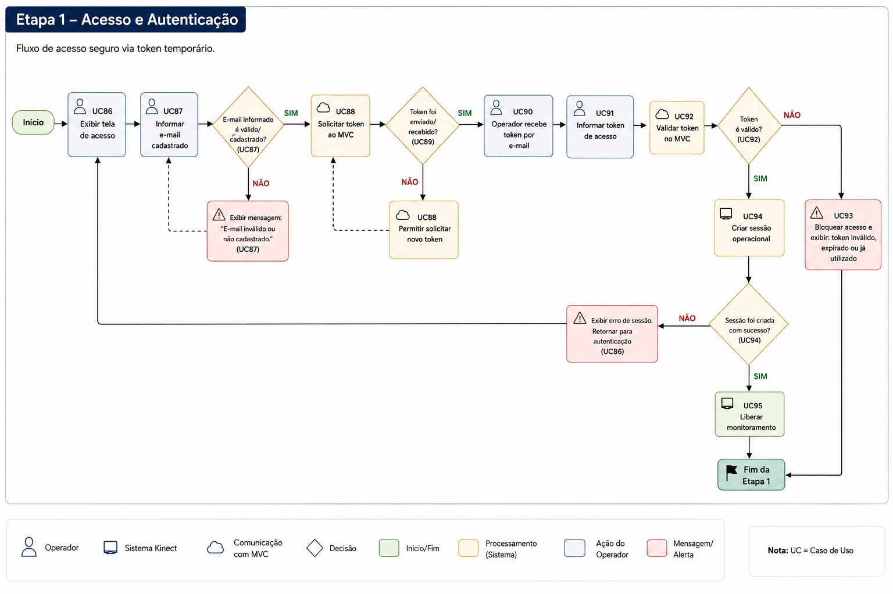
</p>

A primeira etapa do fluxo é responsável por garantir que apenas usuários autorizados tenham acesso ao módulo Kinect. Inicialmente, o operador informa o e-mail cadastrado na aplicação Web MVC. O sistema valida a existência desse usuário e, caso o cadastro seja encontrado, solicita ao servidor MVC a geração de um token temporário de autenticação, enviado automaticamente para o e-mail informado.

Após o recebimento do token, o operador realiza sua inserção na aplicação desktop, que encaminha a informação ao MVC para validação. Durante esse processo são verificadas situações como token inválido, expirado ou já utilizado. Somente após a validação bem-sucedida é criada uma sessão operacional contendo as informações do usuário autenticado, como nome, e-mail e empresa vinculada. Com a sessão estabelecida, o sistema libera o acesso ao monitoramento volumétrico do Kinect.

Essa etapa garante a autenticação segura entre os módulos Desktop e Web, além de assegurar que todas as medições realizadas posteriormente sejam vinculadas ao usuário e à empresa corretos.


### Conexão e Preparação do Sensor

<p align="center">
  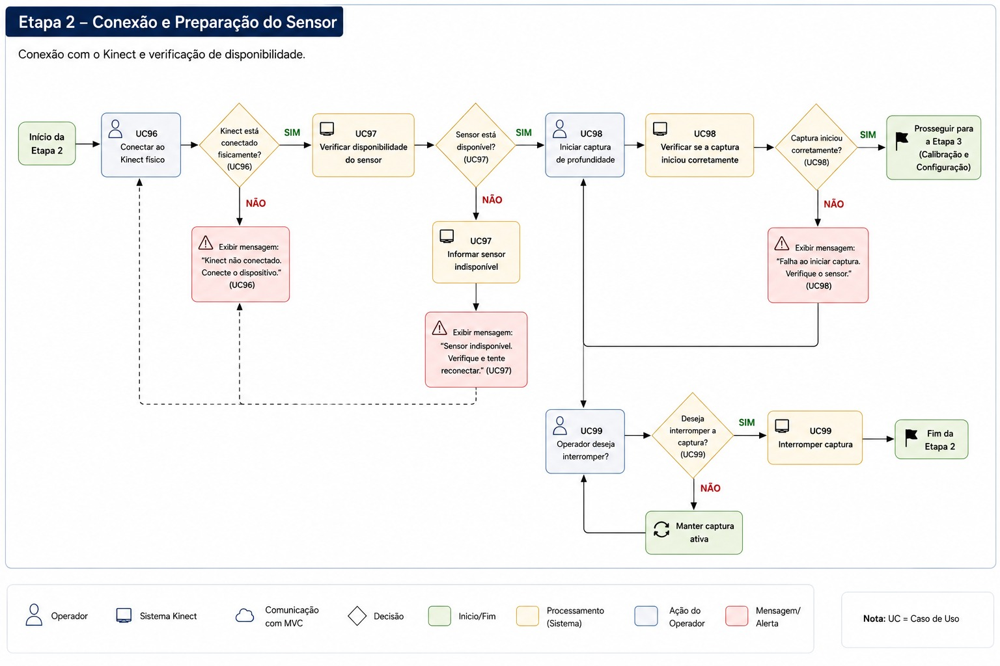
</p>

Após a autenticação, inicia-se a etapa de preparação do hardware responsável pelas medições. O operador conecta o sensor Kinect ao computador e o sistema verifica automaticamente sua disponibilidade e funcionamento.

Caso o dispositivo não esteja conectado ou apresente alguma falha de inicialização, mensagens de alerta são exibidas ao usuário, permitindo que a conexão seja restabelecida antes da continuidade do processo. Quando o sensor é reconhecido corretamente, inicia-se a captura dos dados de profundidade necessários para o cálculo volumétrico.

Durante toda essa etapa, o operador pode interromper ou reiniciar a captura caso seja necessário realizar ajustes físicos no equipamento ou no ambiente de medição.

Essa etapa garante que o sensor esteja operando adequadamente antes da realização das medições, reduzindo a possibilidade de erros decorrentes de falhas de hardware.


### Calibração e Configuração

<p align="center">
  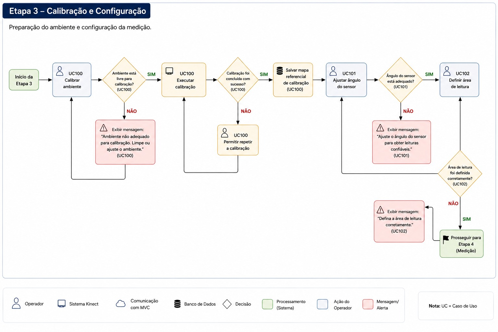
</p>

Com o sensor devidamente conectado, o sistema realiza o processo de calibração do ambiente monitorado. Nessa etapa são definidos os parâmetros necessários para que as medições sejam realizadas com precisão, incluindo a captura do mapa referencial do ambiente, o ajuste do ângulo do sensor e a definição da área útil de leitura.

Caso o ambiente não esteja adequado para calibração, o sistema solicita ao operador a remoção de obstáculos ou a reorganização do espaço. Da mesma forma, caso a calibração não seja concluída com sucesso, o procedimento pode ser repetido até que seja obtido um mapa referencial válido.

Após a calibração, o operador define a região que será utilizada para o cálculo do volume ocupado, estabelecendo os limites físicos considerados pelo algoritmo durante o processamento das medições.

Essa etapa é fundamental para garantir que os cálculos realizados posteriormente representem corretamente a ocupação volumétrica do espaço monitorado.


### Captura e Processamento da Medição

<p align="center">
  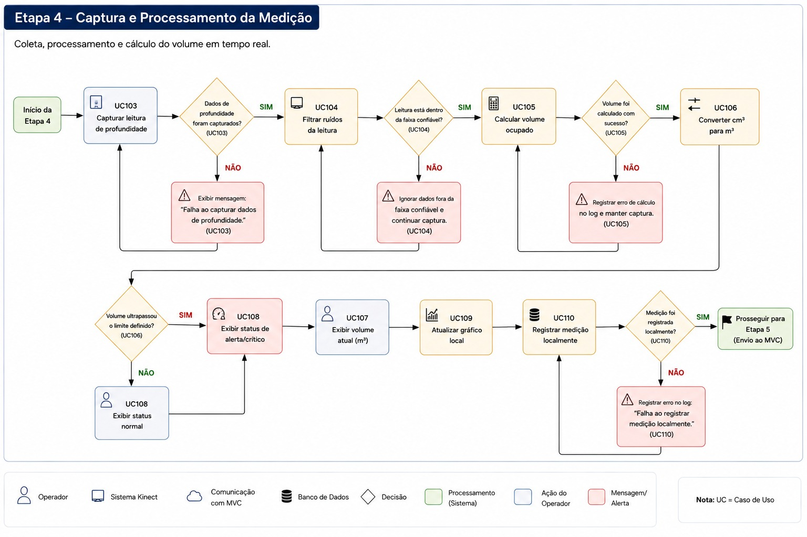
</p>

Após a calibração, inicia-se o processo contínuo de captura das informações provenientes do sensor Kinect. O sistema coleta os dados de profundidade do ambiente, aplica filtros para remoção de ruídos e descarta leituras consideradas inconsistentes ou fora da faixa de confiabilidade do equipamento.

Com os dados válidos, o algoritmo realiza o cálculo do volume ocupado em centímetros cúbicos e, posteriormente, converte o resultado para metros cúbicos, unidade utilizada na apresentação das informações ao usuário e na integração com a aplicação Web.

Além do cálculo volumétrico, o sistema compara continuamente os valores obtidos com os limites previamente configurados, classificando a ocupação em níveis como normal, alerta ou crítico. Os resultados são apresentados em tempo real na interface da aplicação e armazenados localmente no banco SQLite, garantindo o histórico das medições mesmo em situações de indisponibilidade da comunicação com o servidor.

Essa etapa representa o núcleo funcional do sistema, sendo responsável pela aquisição, processamento e armazenamento das medições realizadas pelo Kinect.


### Envio e Sincronização com o MVC

<p align="center">
  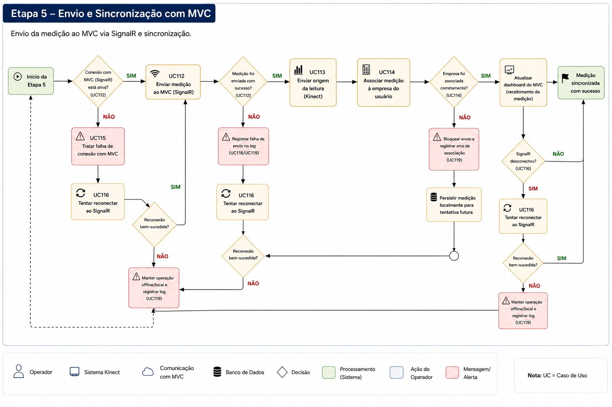
</p>

Após o registro local da medição, inicia-se o processo de sincronização com a aplicação Web MVC por meio do protocolo SignalR. Inicialmente é verificado se a conexão com o servidor permanece ativa. Em caso positivo, as medições são transmitidas ao servidor juntamente com informações que identificam sua origem e a empresa responsável.

Após o recebimento, o MVC atualiza automaticamente o painel de monitoramento em tempo real, permitindo que outros usuários visualizem imediatamente as novas informações de ocupação.

Caso ocorra perda de conexão durante o envio, o sistema registra a falha em log, mantém as medições armazenadas localmente e realiza tentativas automáticas de reconexão. Dessa forma, mesmo diante de falhas temporárias de rede, nenhuma medição é perdida.

Essa etapa garante a sincronização contínua entre o módulo Desktop e a aplicação Web, preservando a integridade e disponibilidade das informações monitoradas.


### Histórico, Logs e Encerramento

<p align="center">
  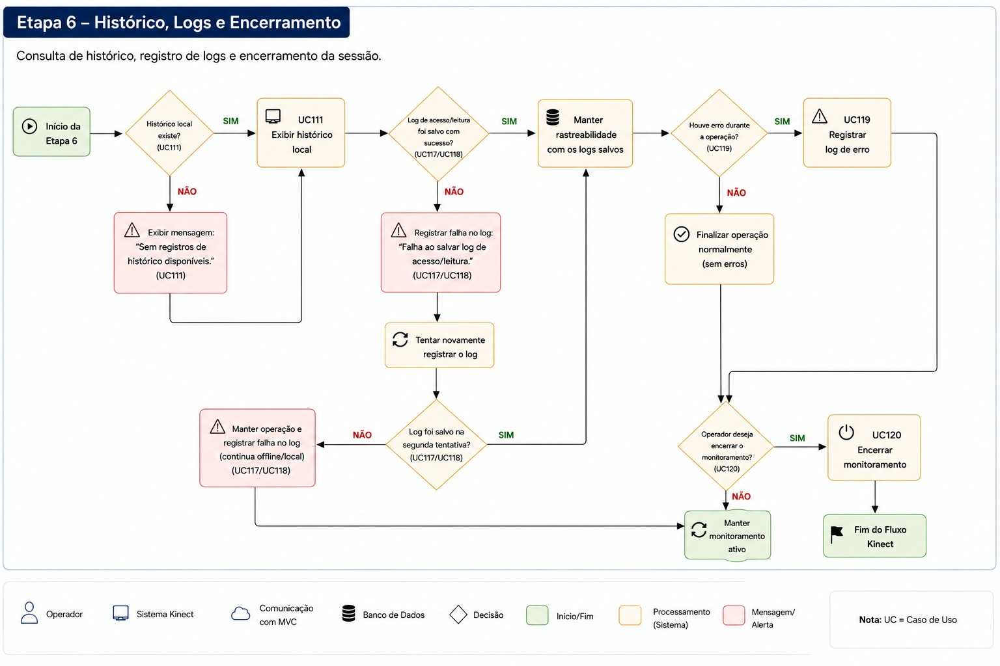
</p>

A última etapa contempla os mecanismos de rastreabilidade e encerramento da operação. O sistema disponibiliza ao operador o histórico local das medições registradas, permitindo consultas mesmo quando não há comunicação com o servidor Web.

Paralelamente, são registrados logs contendo informações sobre autenticação, medições realizadas, falhas de comunicação, erros de processamento e demais eventos relevantes para auditoria e manutenção do sistema.

Ao término da operação, o operador pode optar por encerrar o monitoramento, finalizando a sessão ativa e encerrando corretamente todos os processos relacionados ao Kinect. Caso o operador opte por continuar utilizando o sistema, o monitoramento permanece ativo e novas medições continuam sendo realizadas automaticamente.

Essa etapa assegura a rastreabilidade completa das operações executadas pelo sistema, contribuindo para auditorias, manutenção e diagnóstico de possíveis falhas, além de garantir um encerramento seguro da sessão operacional.

---
## MVC

# Login e Acesso Seguro

<p align="center">
  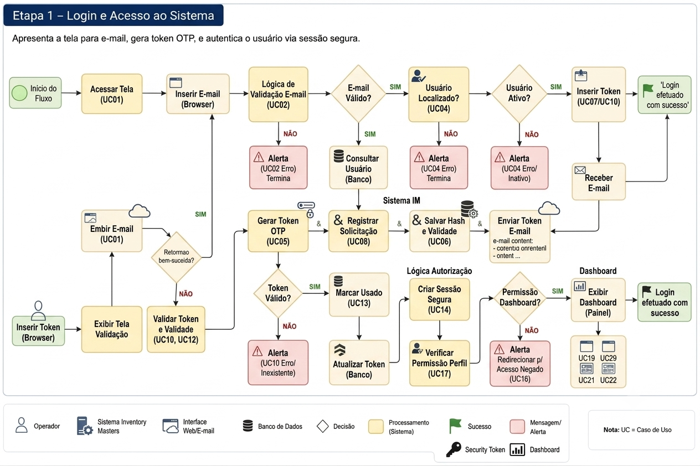
</p>

Este fluxo garante que apenas usuários validados e com as permissões corretas consigam entrar no sistema e visualizar o painel principal.

## 1. Entrada do E-mail (UC01 & UC02)

O usuário acessa a tela de login e informa seu endereço de e-mail.

- O sistema valida se o formato do e-mail é válido.
- Caso o formato esteja incorreto, o acesso é bloqueado imediatamente e uma mensagem de erro é exibida ao usuário.

## 2. Verificação no Banco de Dados (UC04)

Após a validação do formato do e-mail, o sistema consulta o banco de dados para verificar:

- Se o usuário está cadastrado.
- Se a conta está com o status **Ativa**.

Caso o usuário não exista ou a conta esteja inativa, o acesso é negado.

## 3. Geração e Envio do Token (UC05 a UC08)

Se o usuário estiver ativo, o sistema:

1. Gera um **Token OTP** (senha temporária).
2. Armazena no banco de dados o hash do token e sua data de expiração.
3. Envia o token para o e-mail do usuário.

## 4. Validação do Token (UC10 & UC12)

O usuário:

1. Acessa seu e-mail.
2. Copia o token recebido.
3. Informa o token na tela de validação.

O sistema verifica a validade do token.

- Se o token estiver expirado, o acesso é negado.
- Se o token estiver incorreto, uma mensagem de erro é exibida.

## 5. Criação da Sessão e Redirecionamento (UC13 a UC17)

Quando o token é validado com sucesso, o sistema:

1. Marca o token como **utilizado**, impedindo seu reaproveitamento.
2. Cria uma **Sessão Segura** (Cookie/Auth).
3. Verifica o perfil e as permissões do usuário.

Se o usuário possuir autorização para acessar o Dashboard, ele é redirecionado para a tela inicial do sistema com sucesso.

# Gestão de Usuários (Visualização de Detalhes e Exclusão)

<p align="center">
  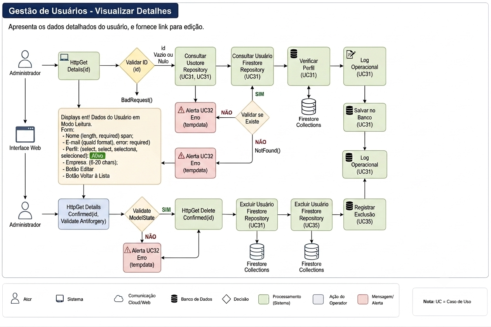
</p>

Este fluxo descreve o processo de governança de contas de usuários, permitindo que administradores consultem informações detalhadas e realizem a exclusão segura de usuários, mantendo registros para auditoria.

## 1. Visualização de Detalhes (Modo Leitura)

### Requisição por ID (UC31)

O administrador seleciona um colaborador na lista de usuários, acionando uma requisição **HTTP GET** para `Details(id)`.

O sistema realiza as seguintes validações:

- Verifica se o identificador (**ID**) foi informado.
- Caso o ID seja nulo ou vazio, retorna uma resposta **BadRequest**.

### Consulta ao Banco de Dados

Após validar o ID, o sistema consulta o **UsuariosRepository**, que busca o registro correspondente nas coleções do **Firestore**.

- Se o usuário não for encontrado, uma mensagem de erro (**NotFound**) é exibida utilizando **TempData**.
- Se o usuário existir, o sistema valida as permissões de acesso do administrador e carrega os dados em modo de leitura.

As informações exibidas incluem:

- Nome
- E-mail
- Perfil
- Empresa

### Registro de Auditoria (UC31)

Sempre que a tela de detalhes é acessada, o sistema registra um **Log Operacional** contendo a ação realizada.

Esse log é armazenado no banco de dados para fins de auditoria e rastreabilidade do acesso a informações sensíveis.

---

## 2. Processo de Exclusão Segura

### Confirmação e Validações (UC35)

Na tela de detalhes, o administrador possui a opção de excluir o usuário.

Ao confirmar a operação, o sistema envia uma requisição **HTTP POST** para `DetailsConfirmed`, protegida pelos seguintes mecanismos de segurança:

- **ValidateAntiForgeryToken**
- Validação do **ModelState**

### Remoção Definitiva (UC35)

Após todas as validações serem aprovadas, o sistema estabelece conexão com o **Firestore** e remove permanentemente o registro do usuário da coleção.

### Encerramento do Processo

Após a exclusão, o sistema executa as seguintes ações:

1. Registra um **Log Operacional** informando:
   - O administrador responsável pela exclusão;
   - O usuário que foi removido.
2. Salva o log no banco de dados.
3. Redireciona o administrador para a lista geral de usuários.
4. Exibe uma mensagem informando que a exclusão foi realizada com sucesso.

# Gestão de Parceiros (Cadastro, Edição, Exclusão e Controle de Status)

<p align="center">
  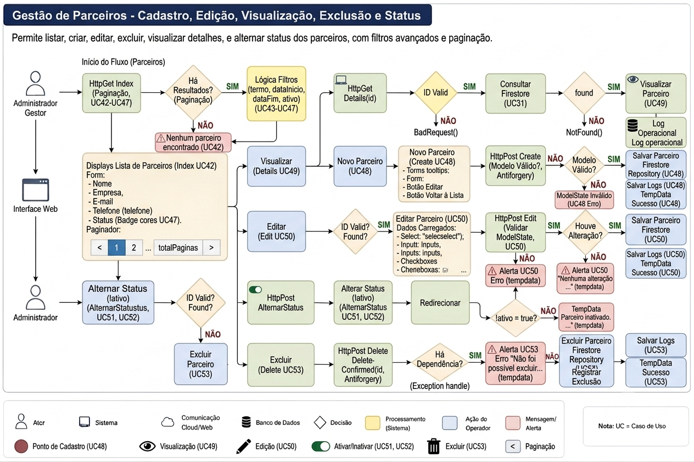
</p>

Este fluxo descreve todo o ciclo de vida da gestão de parceiros comerciais no sistema, abrangendo a consulta, o cadastro, a edição, a alteração de status e a exclusão segura dos registros, com mecanismos de validação e auditoria.

## 1. Consulta, Filtros e Listagem (Interface Web)

### Acesso à Tela (UC42–UC47)

O Administrador ou Gestor acessa a tela de parceiros por meio de uma requisição **HTTP GET** para `Index`.

O sistema consulta o **Firestore**, recuperando todos os parceiros vinculados à empresa do usuário autenticado.

### Tratamento dos Resultados

Após a consulta, o sistema verifica o resultado da pesquisa.

- Se nenhum parceiro for encontrado, é exibida a mensagem:
  - **"Nenhum parceiro encontrado."**
- Caso existam registros, o sistema aplica os filtros informados pelo usuário.

Os filtros disponíveis incluem:

- Busca por termo;
- Data inicial;
- Data final;
- Status (Ativo/Inativo).

Após a filtragem, os registros são ordenados, paginados e apresentados na interface contendo as seguintes informações:

- Nome;
- Empresa;
- E-mail;
- Telefone;
- Status.

---

## 2. Cadastro de Novo Parceiro

### Abertura do Formulário (UC48)

Ao selecionar a opção **"Novo Parceiro"**, é enviada uma requisição **HTTP GET** para `Create`.

O sistema exibe um formulário vazio contendo os campos necessários para cadastro, além de dicas e tooltips de auxílio ao preenchimento.

### Envio dos Dados (UC48)

Após preencher o formulário, o usuário envia uma requisição **HTTP POST** para `Create`.

Antes da gravação, o sistema executa as seguintes validações:

- Validação do **ModelState**;
- Verificação dos campos obrigatórios;
- Validação dos formatos informados;
- Proteção contra ataques de falsificação utilizando **ValidateAntiForgeryToken**.

### Persistência dos Dados

Após as validações:

- Se o formulário possuir erros, os campos inválidos são destacados e as mensagens de erro são exibidas.
- Caso todas as validações sejam aprovadas:
  1. O parceiro é salvo no **Firestore**;
  2. Um **Log Operacional** é registrado;
  3. Uma mensagem de sucesso é exibida ao usuário utilizando **TempData**.

---

## 3. Visualização de Detalhes e Edição

### Visualização de Detalhes (UC49)

Ao solicitar os detalhes de um parceiro, o sistema envia uma requisição **HTTP GET** para `Details(id)`.

São realizadas as seguintes validações:

- Verificação da validade do ID informado;
- Consulta ao Firestore para localizar o parceiro.

Caso o registro não seja encontrado, o sistema apresenta uma mensagem de **NotFound**.

Se localizado, todas as informações do parceiro são exibidas em uma tela detalhada.

### Alteração de Dados (UC50)

Ao selecionar a opção de edição, é enviada uma requisição **HTTP GET** para `Edit(id)`.

O sistema carrega o formulário preenchido com os dados atuais do parceiro, incluindo:

- Inputs;
- Checkboxes;
- Campos Select.

Após as alterações, o formulário é enviado por meio de uma requisição **HTTP POST** para `Edit`.

O sistema então:

1. Valida os dados recebidos;
2. Verifica se houve alguma modificação em relação aos dados originais;
3. Atualiza o registro no **Firestore**, caso existam alterações válidas;
4. Registra um **Log Operacional** informando a edição realizada com sucesso.

---

## 4. Controle de Status e Exclusão

### Alternar Status (UC51 e UC52)

O administrador pode alterar rapidamente o status de um parceiro utilizando uma ação **HTTP POST** para `AlternarStatus`.

O sistema executa as seguintes etapas:

1. Valida o ID recebido;
2. Altera o campo booleano responsável pelo status (Ativo/Inativo);
3. Salva a alteração;
4. Redireciona novamente para a listagem;
5. Exibe uma mensagem de confirmação utilizando **TempData**, informando se o parceiro foi ativado ou inativado.

### Exclusão do Registro (UC53)

Para remover um parceiro, o sistema executa uma requisição **HTTP POST** para `DeleteConfirmed`.

Antes da exclusão definitiva, é realizada uma verificação de integridade para identificar possíveis dependências associadas ao parceiro, como notificações vinculadas.

O fluxo segue duas possibilidades:

- **Se houver dependências:**
  - A exclusão é cancelada;
  - O sistema apresenta uma mensagem informando que não foi possível excluir o parceiro devido às dependências existentes.

- **Se não houver impedimentos:**
  1. O parceiro é removido definitivamente do **Firestore**;
  2. Um **Log Operacional** registra a exclusão realizada;
  3. A listagem de parceiros é recarregada;
  4. Uma mensagem de sucesso é exibida ao usuário.

# Gestão de Medições (Listagem, Filtros e Recebimento via Kinect)

<p align="center">
  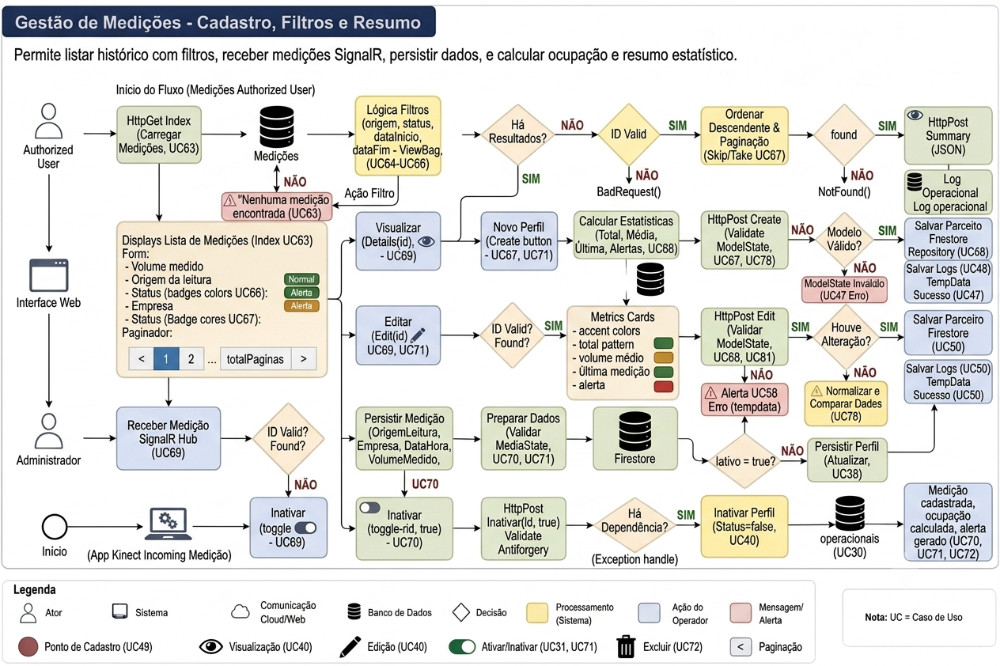
</p>

Este fluxo descreve o gerenciamento das medições de volumetria do estoque, integrando a consulta histórica realizada pelos usuários com o recebimento automático de dados em tempo real enviados pelo sensor Kinect.

## 1. Consulta, Filtros e Listagem (Interface Web)

### Acesso à Tela (UC63)

O usuário autorizado acessa a tela de medições por meio de uma requisição **HTTP GET** para `Index`.

O sistema consulta a coleção de medições armazenadas no **Firestore**.

### Tratamento dos Resultados

Após a consulta, o sistema verifica os registros encontrados.

- Caso não existam medições cadastradas, é exibida a mensagem:
  - **"Nenhuma medição encontrada."**

- Caso existam registros, o sistema aplica os filtros disponíveis.

Os filtros incluem:

- Origem da medição;
- Status;
- Data inicial;
- Data final.

Após a filtragem, os registros são ordenados de forma decrescente e paginados utilizando a lógica de **Skip/Take (UC67)**.

A tabela apresenta informações como:

- Volume medido;
- Origem da leitura;
- Status da medição, identificado por badges coloridos:
  - Verde: Normal;
  - Amarelo/Vermelho: Alerta.

---

## 2. Recebimento Automático das Medições (Aplicação Kinect)

### Captura das Leituras (UC69)

O aplicativo responsável pelo sensor Kinect envia continuamente as medições para o **SignalR Hub**, por meio do serviço de recebimento de medições.

Ao receber uma nova leitura, o sistema valida a integridade do identificador (**ID**) enviado.

### Persistência e Atualização das Estatísticas (UC70–UC72)

Após a validação, o sistema:

1. Monta o objeto contendo os dados da medição;
2. Persiste o registro no **Firestore**.

Na sequência, são executados os cálculos estatísticos da aplicação, incluindo:

- Total de medições;
- Média dos volumes;
- Última medição registrada;
- Verificação das metas e geração de alertas.

Com os novos valores calculados, os **Cards de Métricas** e os gráficos do Dashboard são atualizados automaticamente através do envio de um **JSON (HTTP POST Summary)**.

---

## 3. Ações Administrativas

### Visualização de Detalhes e Edição (UC69 e UC71)

O administrador pode consultar uma medição específica ou editar seus dados.

Ao editar um registro, o sistema:

1. Carrega o formulário contendo os dados atuais;
2. Valida o **ModelState**;
3. Compara os dados enviados com o estado anterior;
4. Salva as alterações caso sejam válidas.

### Inativação da Medição (UC70)

Quando uma leitura incorreta ou inválida é identificada, o administrador pode desativar o registro.

A operação é realizada por meio de uma requisição **HTTP POST** protegida por **ValidateAntiForgeryToken**.

O sistema:

1. Valida o registro solicitado;
2. Verifica possíveis dependências;
3. Atualiza o status da medição para **Inativa (Status = false)** na coleção operacional do **Firestore**.

---

# Gestão de Perfis (Cadastro, Permissões e Inativação)

<p align="center">
  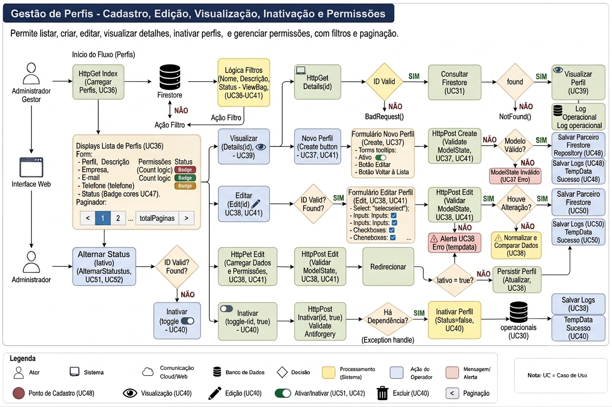
</p>

Este fluxo descreve o gerenciamento dos perfis de acesso da aplicação, permitindo controlar permissões, cadastrar novos perfis, editar privilégios e realizar a inativação segura quando necessário.

## 1. Consulta, Filtros e Listagem (Interface Web)

### Carregamento da Lista (UC36)

O Administrador Gestor acessa a tela de perfis através de uma requisição **HTTP GET** para `Index`.

O sistema consulta os perfis cadastrados no **Firestore**.

### Exibição dos Dados

Após recuperar os registros, o sistema aplica filtros utilizando:

- Nome do perfil;
- Descrição;
- Status.

Os resultados são organizados em uma listagem paginada contendo:

- Nome do perfil;
- Descrição;
- Quantidade de permissões associadas;
- Status atual do perfil.

---

## 2. Cadastro de Novo Perfil

### Abertura do Formulário (UC37 e UC41)

Ao selecionar **"Novo Perfil"**, o sistema envia uma requisição **HTTP GET** para `Create`.

É apresentado um formulário contendo:

- Campos para identificação do perfil;
- Tooltips explicativas;
- Lista de permissões disponíveis por meio de caixas de seleção.

### Validação e Persistência

Ao enviar o formulário (**HTTP POST Create**), o sistema executa:

- Validação do **ModelState**;
- Verificação dos dados obrigatórios.

Caso todas as validações sejam aprovadas:

1. O perfil é salvo no **Firestore**;
2. Um **Log Operacional** é registrado;
3. Uma mensagem de sucesso é armazenada em **TempData**.

---

## 3. Visualização de Detalhes e Edição

### Visualização Completa (UC39)

Ao solicitar os detalhes de um perfil, o sistema executa uma requisição **HTTP GET** para `Details(id)`.

São realizadas as seguintes etapas:

1. Validação do ID informado;
2. Consulta ao Firestore;
3. Exibição das informações do perfil e das permissões associadas.

O acesso também gera um **Log Operacional** para auditoria.

### Alteração de Permissões (UC38 e UC41)

Ao editar um perfil (**HTTP GET Edit**), o sistema carrega:

- Campos de entrada;
- Checkboxes das permissões atualmente atribuídas.

Após o envio (**HTTP POST Edit**), o sistema:

1. Valida o formulário;
2. Normaliza os dados recebidos;
3. Verifica se houve alterações em relação ao estado anterior;
4. Atualiza o perfil e suas permissões no **Firestore**;
5. Registra um **Log Operacional** documentando a alteração.

---

## 4. Inativação de Perfis

### Alteração do Status (UC40, UC51 e UC52)

O administrador pode alterar rapidamente o status de um perfil utilizando a opção de alternância disponível na listagem.

A operação é realizada por uma requisição **HTTP POST** protegida por mecanismos de antifalsificação.

### Verificação de Dependências (UC40)

Antes de concluir a inativação, o sistema verifica se existem usuários ativos associados ao perfil.

O fluxo segue duas possibilidades:

- **Se existirem usuários vinculados:**
  - A operação é interrompida;
  - Uma exceção é tratada e a inativação é cancelada por motivos de segurança.

- **Se não houver dependências:**
  1. O status do perfil é alterado para **Inativo (Status = false)**;
  2. O repositório salva as alterações no **Firestore**;
  3. A base operacional de segurança da aplicação é atualizada com o novo estado do perfil.

---

# Gestão de Notificações (Listagem, Filtros, Resumo e Ações)

<p align="center">
  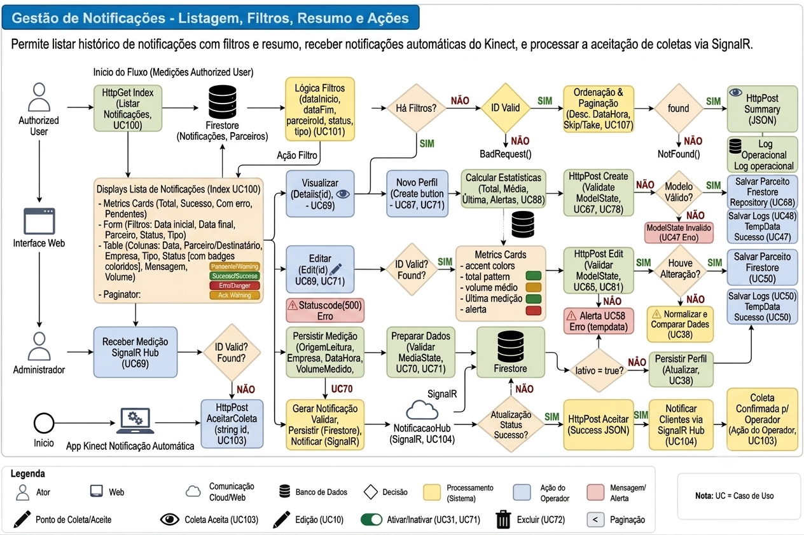
</p>

Este fluxo descreve o gerenciamento das notificações geradas pelo sistema, permitindo o monitoramento de alertas, o recebimento automático de eventos provenientes do Kinect e a confirmação de coletas em tempo real por meio do SignalR.

## 1. Consulta e Monitoramento de Alertas (Interface Web)

### Listagem Geral (UC100)

O usuário autorizado acessa a tela de notificações por meio de uma requisição **HTTP GET** para `Index`.

O sistema consulta o **Firestore**, recuperando o histórico de notificações e os parceiros relacionados.

Após a consulta, são apresentados **Cards de Métricas**, contendo indicadores consolidados como:

- Total de notificações;
- Notificações processadas com sucesso;
- Notificações com erro;
- Notificações pendentes.

### Listagem e Filtros (UC101 e UC107)

As notificações são exibidas em uma tabela contendo informações como:

- Data;
- Parceiro ou destinatário;
- Empresa;
- Tipo da notificação;
- Mensagem;
- Volume associado.

Cada registro apresenta uma identificação visual por meio de **badges de status**, indicando situações como:

- Success;
- Warning;
- Danger;
- Ack Warning.

O usuário pode utilizar filtros para localizar registros específicos, incluindo:

- Data inicial;
- Data final;
- Tipo da notificação;
- Status.

Após a aplicação dos filtros, os resultados são ordenados em ordem decrescente e paginados para facilitar a navegação.

---

## 2. Geração Automática e Integração em Tempo Real

### Processamento da Coleta (UC69 e UC103)

O sistema recebe automaticamente eventos enviados pela aplicação de notificações do Kinect através de uma requisição **HTTP POST** para `AceitarColeta`.

Ao receber a solicitação, são realizadas validações para garantir a integridade das informações recebidas.

### Geração e Distribuição da Notificação (UC104)

Após a validação dos dados, o sistema:

1. Persiste a medição original no **Firestore**;
2. Executa a rotina de geração da notificação;
3. Registra as informações necessárias para auditoria.

Na sequência, a nova notificação é publicada no **NotificacaoHub**, utilizando **SignalR**, permitindo que todos os operadores conectados recebam o alerta instantaneamente.

---

## 3. Configuração de Regras e Confirmação da Coleta

### Criação e Edição de Regras (UC67, UC71 e UC88)

Para cadastrar ou alterar regras de notificação, o sistema disponibiliza formulários específicos.

Durante o envio das informações, são executadas as seguintes validações:

- Validação do **ModelState**;
- Verificação da consistência dos dados;
- Comparação entre os dados existentes e as alterações realizadas.

Após a validação, o sistema calcula estatísticas relacionadas às notificações e salva as novas configurações na coleção correspondente do **Firestore**.

### Confirmação da Coleta (UC103)

Quando a atualização do banco de dados é concluída com sucesso, o sistema responde à requisição por meio de um **HTTP POST Aceitar**, retornando um objeto **Success (JSON)**.

Em seguida:

1. O novo status da coleta é persistido no **Firestore**;
2. Os clientes conectados recebem a atualização em tempo real através do **SignalR**;
3. O operador visualiza imediatamente a confirmação da coleta na interface;
4. Um **Log Operacional** é registrado, encerrando o ciclo de auditoria da notificação.

---
# Gestão de Parâmetros do Sistema (Configurações Gerais e Kinect)

<p align="center">
  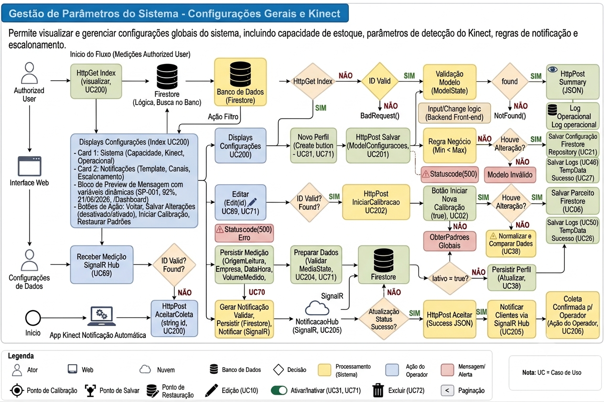
</p>

Este fluxo descreve o gerenciamento das configurações globais da aplicação, permitindo administrar parâmetros operacionais do sistema, configurações do sensor Kinect, regras de notificações e rotinas de calibração, garantindo a consistência das configurações e a integridade da operação.

## 1. Consulta e Exibição de Configurações

### Carregamento das Configurações (UC200)

O usuário com permissão para administrar configurações acessa a tela por meio de uma requisição **HTTP GET** para `Index`.

O sistema consulta o **Firestore**, recuperando os parâmetros gerais da aplicação.

### Painel de Configurações

Após a consulta, as informações são organizadas em blocos distintos na interface.

#### Card 1 – Configurações do Sistema

São apresentados parâmetros relacionados ao funcionamento geral da aplicação, incluindo:

- Capacidade máxima do estoque;
- Capacidade mínima;
- Configurações do sensor Kinect;
- Parâmetros operacionais.

#### Card 2 – Configurações de Notificações

O sistema disponibiliza configurações referentes ao processo de envio de notificações, como:

- Templates de mensagens;
- Canais de comunicação ativos;
- Regras de escalonamento de alertas.

#### Bloco de Pré-visualização

A interface apresenta uma visualização em tempo real da mensagem que será enviada aos usuários.

A prévia utiliza variáveis dinâmicas, como:

- Identificador do sensor;
- Percentual de ocupação;
- Data e hora;
- Links da aplicação.

---

## 2. Alteração de Configurações e Regras de Negócio

### Salvamento das Alterações (UC201)

Após modificar os parâmetros desejados, o usuário seleciona a opção **"Salvar Alterações"**.

O sistema envia uma requisição **HTTP POST** para `Salvar`, contendo o objeto `ModelConfiguracoes`.

### Validação dos Dados

Antes da persistência, o sistema executa diversas validações.

Inicialmente, é realizada a validação do **ModelState**, verificando:

- Campos obrigatórios;
- Tipos de dados;
- Formatos permitidos.

Em seguida, são aplicadas as regras de negócio da aplicação.

Entre elas:

- Verificar se a capacidade mínima é inferior à capacidade máxima;
- Validar limites permitidos para os parâmetros do Kinect;
- Garantir a consistência das configurações de notificações.

Caso alguma regra seja violada, a operação é interrompida e o sistema retorna um **StatusCode 500**, informando que a configuração não pôde ser processada.

### Persistência das Configurações

Se todas as validações forem aprovadas, o sistema:

1. Compara os novos valores com a configuração atual;
2. Verifica se houve alteração efetiva dos dados;
3. Atualiza os parâmetros no **Firestore**;
4. Registra um **Log Operacional** contendo as modificações realizadas;
5. Exibe uma mensagem de sucesso utilizando **TempData**.

---

## 3. Calibração do Sensor Kinect e Restauração de Configurações

### Calibração do Sensor (UC202)

Quando necessário, o operador pode iniciar uma nova calibração do sensor Kinect selecionando a opção **"Iniciar Calibração"**.

Essa ação envia uma requisição **HTTP POST** para `IniciarCalibracao`.

O sistema realiza as seguintes etapas:

1. Valida o identificador do dispositivo;
2. Verifica se o sensor está apto para iniciar a operação;
3. Ativa o modo de calibração (**Status = true**);
4. Inicia a rotina de calibração do equipamento.

Caso ocorra alguma falha durante o processo, o sistema utiliza os parâmetros globais de segurança previamente configurados para preservar a integridade da operação.

### Restauração dos Padrões do Sistema

Se alterações manuais comprometerem o funcionamento da aplicação, o administrador pode selecionar a opção **"Restaurar Padrões"**.

O sistema então:

1. Recupera as configurações padrão da aplicação;
2. Valida as permissões e dependências do perfil responsável pela operação;
3. Restaura os parâmetros originais no **Firestore**;
4. Registra um **Log Operacional** contendo todas as alterações realizadas durante a restauração;
5. Atualiza a aplicação com as configurações restauradas.
---

# Diagrama de Sequência do Módulo Kinect (MVVM)

O Diagrama de Sequência do módulo Kinect apresenta o comportamento dinâmico da aplicação durante a execução das principais funcionalidades do sistema. Diferentemente do Diagrama de Casos de Uso, que demonstra as funcionalidades disponíveis ao usuário, o Diagrama de Sequência evidencia a ordem cronológica das mensagens trocadas entre os componentes internos do sistema, permitindo compreender como ocorre o fluxo completo de autenticação, inicialização do hardware, calibração, processamento das medições, persistência local e sincronização com o módulo MVC.

Para facilitar a leitura e reduzir a complexidade visual, o fluxo foi dividido em seis etapas principais, cada uma representando uma fase específica da operação do sistema.


# Autenticação e Criação da Sessão

<p align="center">
  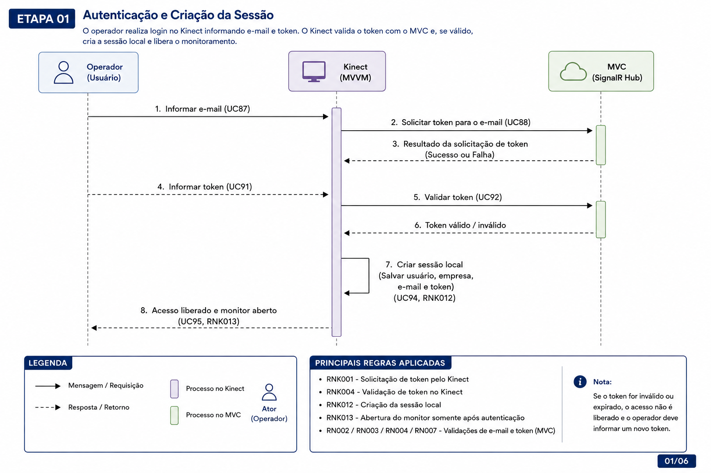
</p>

A primeira etapa representa o processo de autenticação do operador no módulo Kinect MVVM. Inicialmente, o usuário informa o endereço de e-mail previamente cadastrado no sistema MVC. A aplicação Kinect encaminha essa informação ao servidor MVC, que realiza a geração de um token temporário de autenticação e o envia para o e-mail informado.

Após receber o código, o operador informa o token na aplicação Kinect. O sistema realiza uma nova comunicação com o MVC para validar sua autenticidade, verificando se o token existe, ainda está dentro do período de validade e não foi utilizado anteriormente.

Quando todas as validações são aprovadas, o sistema cria uma sessão operacional local contendo as informações do usuário autenticado, empresa vinculada, e-mail e token utilizado. Em seguida, o monitor de medição é liberado para utilização.

Caso o token seja inválido, expirado ou já tenha sido utilizado anteriormente, a autenticação é bloqueada e o operador deverá solicitar um novo código de acesso.

### Objetivo da Etapa

Garantir que apenas usuários devidamente autenticados possam acessar o módulo Kinect e iniciar o monitoramento volumétrico.


# Inicialização do Kinect e Conexão ao SignalR

<p align="center">
  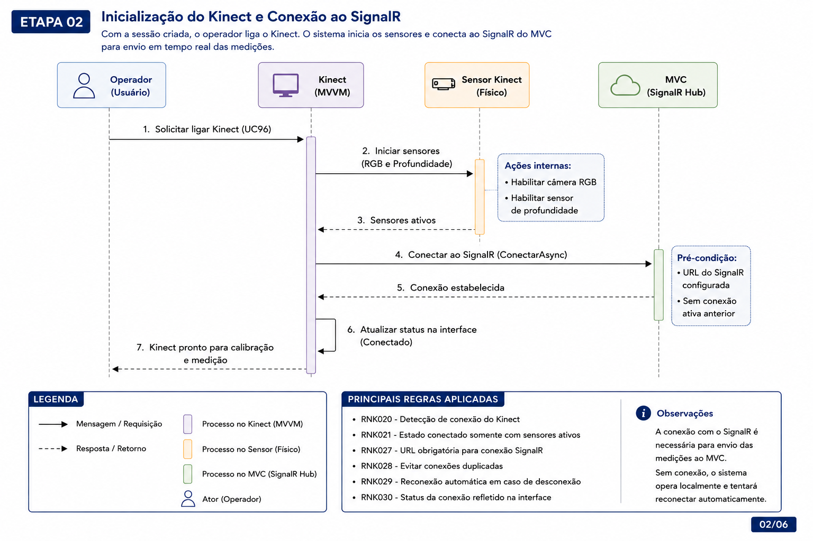
</p>

Após a autenticação bem-sucedida, inicia-se o processo de preparação do ambiente de monitoramento. O operador solicita a inicialização do Kinect e o sistema ativa os sensores RGB e de profundidade responsáveis pela captura das informações do ambiente físico.

Paralelamente à inicialização do hardware, a aplicação estabelece comunicação com o servidor SignalR hospedado no módulo MVC. Essa conexão será responsável pela transmissão das medições realizadas localmente para o sistema Web em tempo real.

Após a confirmação da conexão, a interface é atualizada indicando que tanto o Kinect quanto o SignalR encontram-se disponíveis, permitindo o prosseguimento para a etapa de calibração.

### Objetivo da Etapa

Preparar o hardware de captura e estabelecer a comunicação em tempo real entre o módulo Kinect e o sistema MVC.


# Calibração do Ambiente e Configuração do Espaço

<p align="center">
  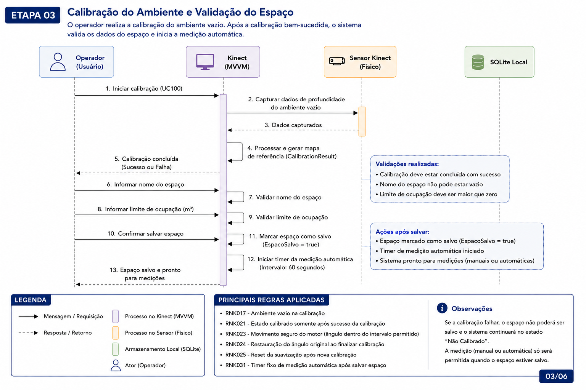
</p>

Nesta etapa é realizada a calibração do ambiente que será monitorado. O Kinect captura a imagem de profundidade do espaço vazio e processa essas informações para gerar uma referência volumétrica utilizada como base para todas as medições futuras.

Após a conclusão da calibração, o operador informa os parâmetros necessários para configuração do ambiente monitorado, como nome do espaço e limite máximo de ocupação.

O sistema valida essas informações, marca o espaço como configurado e habilita o temporizador responsável pelas medições automáticas. A partir desse momento, o ambiente encontra-se preparado para iniciar o monitoramento contínuo.

Caso alguma validação não seja atendida, como ausência de calibração ou parâmetros obrigatórios não informados, o sistema impede o início das medições até que todas as configurações sejam concluídas.

### Objetivo da Etapa

Estabelecer a referência espacial utilizada pelo sistema para realizar os cálculos volumétricos de forma precisa e consistente.


# Medição Local e Armazenamento

<p align="center">
  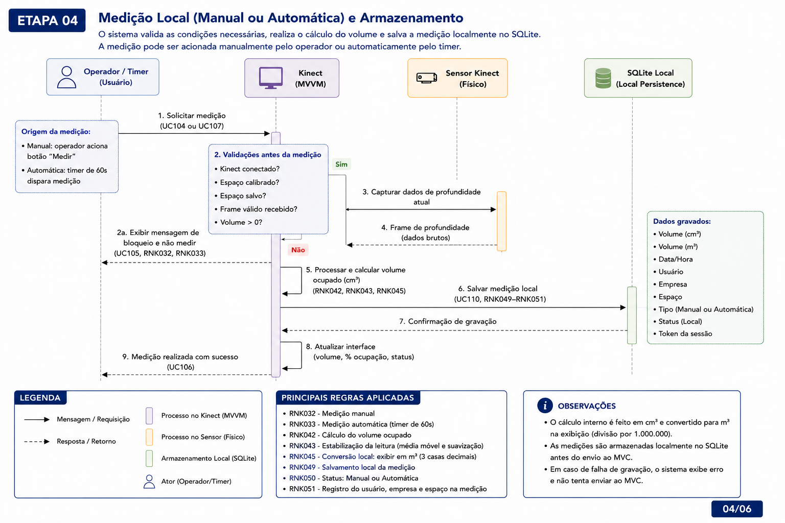
</p>

Após a configuração do ambiente, o sistema inicia o ciclo de monitoramento, que pode ocorrer manualmente por solicitação do operador ou automaticamente por meio do temporizador interno da aplicação.

Antes da captura de qualquer medição são realizadas diversas validações para garantir a integridade dos dados processados. O sistema verifica se o Kinect permanece conectado, se o ambiente foi calibrado corretamente, se o espaço monitorado encontra-se salvo e se existem dados válidos para processamento.

Em seguida, o sensor captura uma nova imagem de profundidade, calcula o volume ocupado utilizando a referência obtida durante a calibração e atualiza a interface com o volume atual, percentual de ocupação e status da medição.

Após o processamento, a medição é armazenada no banco de dados SQLite local, permitindo que o sistema continue funcionando normalmente mesmo em situações de indisponibilidade da conexão com o servidor.

### Objetivo da Etapa

Realizar a captura das informações do ambiente, calcular o volume ocupado e garantir a persistência local das medições para assegurar a continuidade da operação.


# Envio da Medição ao MVC e Atualização do Status

<p align="center">
  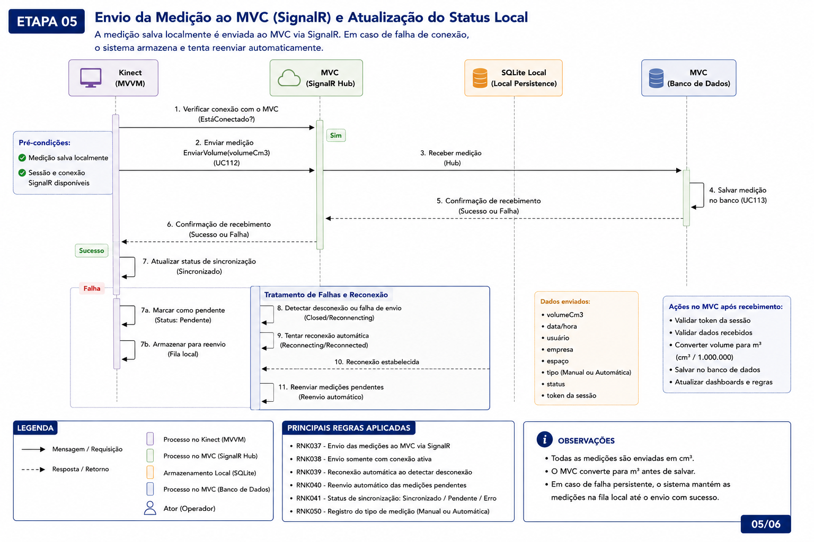
</p>

Após o armazenamento local da medição, o sistema verifica o estado da conexão com o servidor SignalR. Caso a comunicação esteja disponível, a aplicação transmite a medição ao módulo MVC utilizando o Hub responsável pela integração em tempo real.

O servidor confirma o recebimento da informação e a aplicação atualiza o status da sincronização na interface do operador.

Caso ocorra qualquer falha de comunicação, a medição permanece armazenada localmente no banco SQLite e o sistema inicia automaticamente tentativas de reconexão até que a comunicação seja restabelecida. Dessa forma, evita-se a perda de informações durante interrupções temporárias da rede.

### Objetivo da Etapa

Sincronizar as medições locais com o sistema MVC, mantendo a consistência dos dados e garantindo tolerância a falhas de comunicação.


# Histórico, Logs e Encerramento

<p align="center">
  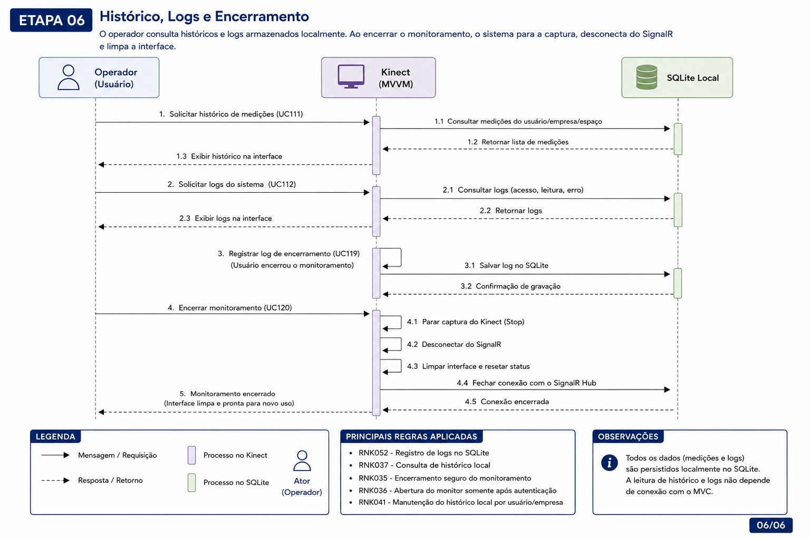
</p>

A etapa final contempla as funcionalidades relacionadas ao histórico operacional e ao encerramento da sessão de monitoramento.

Durante a operação, o operador pode consultar o histórico de medições armazenadas localmente no banco SQLite, bem como visualizar os registros de acesso, leituras realizadas e erros registrados pelo sistema.

Ao finalizar o monitoramento, a aplicação interrompe a captura das imagens de profundidade, encerra a comunicação com o Kinect, finaliza a conexão com o servidor SignalR e registra os eventos de encerramento no banco de dados local.

Por fim, a interface é atualizada, os estados internos da aplicação são reinicializados e o sistema permanece preparado para uma nova sessão de monitoramento.

### Objetivo da Etapa

Garantir a rastreabilidade das operações realizadas durante o monitoramento, preservar o histórico operacional e realizar o encerramento seguro da aplicação, liberando corretamente os recursos utilizados pelo sistema.


# Considerações

O Diagrama de Sequência demonstra a interação entre o operador, o módulo Kinect, o banco de dados SQLite local e o sistema MVC durante toda a execução da aplicação. A divisão do fluxo em seis etapas permitiu representar de forma organizada os processos de autenticação, inicialização do hardware, calibração, captura das medições, sincronização com o servidor e encerramento da operação.

Essa representação evidencia o comportamento temporal dos componentes envolvidos, facilitando a compreensão da arquitetura do sistema e demonstrando como os dados percorrem todas as camadas da aplicação, desde a aquisição pelo sensor Kinect até a persistência local e sincronização com o módulo Web.

---


## Diagrama de Sequência

# Etapa 1 – Login e Autenticação (Token OTP)

<p align="center">
  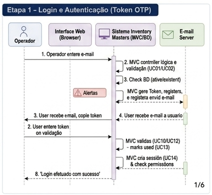
</p>

Esta etapa representa o ponto de entrada seguro da aplicação, garantindo que apenas usuários autorizados tenham acesso ao sistema.

## Como funciona

O operador informa seu endereço de e-mail na tela de login.

O sistema realiza as seguintes validações:

- Verifica se o e-mail está cadastrado;
- Confirma se a conta do usuário está ativa.

Se todas as validações forem aprovadas, o sistema:

1. Gera um **Token OTP** (senha temporária);
2. Envia o código para o e-mail do operador.

O usuário copia o token recebido, informa o código na tela de validação e o sistema verifica sua autenticidade.

Após a validação do token:

- Uma sessão segura é criada;
- O acesso ao Dashboard é liberado.

---

# Etapa 2 – Gestão de Medições (Filtros e Recebimento)

<p align="center">
  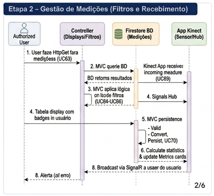
</p>

Esta etapa é responsável pelo gerenciamento do histórico de medições do estoque e pelo processamento das novas leituras enviadas pelo sensor Kinect.

## Como funciona

Quando um usuário autorizado acessa a tela de medições, o sistema consulta o **Firestore**, recuperando os registros armazenados.

Durante esse processo, são aplicados automaticamente:

- Filtros de pesquisa;
- Ordenação;
- Paginação dos resultados.

Paralelamente, o sensor Kinect envia continuamente novas leituras de profundidade.

Para cada leitura recebida, o sistema:

1. Valida o identificador da medição;
2. Converte a leitura física para volume em metros cúbicos ($m^3$);
3. Armazena a medição no banco de dados;
4. Atualiza automaticamente os gráficos e os Cards de Métricas.

Toda a atualização ocorre em tempo real por meio do **SignalR**, sem necessidade de recarregar a página.

---

# Etapa 3 – Gestão de Parceiros (Cadastro, Edição e Status)

<p align="center">
  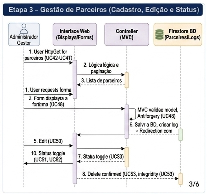
</p>

Esta etapa é responsável pelo gerenciamento das empresas e parceiros comerciais cadastrados na aplicação.

## Como funciona

Ao acessar a tela de parceiros, o administrador solicita a listagem dos registros.

O sistema recupera os parceiros cadastrados e aplica automaticamente as regras de paginação.

Durante o cadastro de um novo parceiro, o formulário passa pelas seguintes validações:

- Validação dos campos obrigatórios;
- Proteção contra ataques de falsificação (**ValidateAntiForgeryToken**).

Quando uma exclusão é solicitada, o sistema realiza uma verificação de integridade.

Caso o parceiro possua notificações ou outras dependências relacionadas, a exclusão é cancelada e uma mensagem de erro é apresentada ao administrador, preservando a consistência dos dados.

---

# Etapa 4 – Medição Local (Manual ou Automática)

<p align="center">
  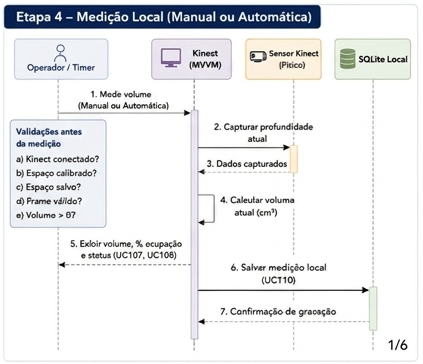
</p>

Esta etapa representa o processamento realizado localmente pelo sensor Kinect para calcular o volume do estoque.

## Como funciona

A medição pode ser iniciada manualmente pelo operador ou automaticamente por um temporizador.

Ao iniciar o processo, o sensor captura a profundidade atual do ambiente.

Antes de calcular o volume, o sistema executa diversas validações, incluindo:

- Verificação da conexão com o Kinect;
- Confirmação de que o ambiente foi previamente calibrado;
- Validação de que o volume calculado é maior que zero.

Após todas as verificações:

1. O volume é calculado em centímetros cúbicos ($cm^3$);
2. O resultado é apresentado na interface local;
3. A medição é armazenada temporariamente para posterior sincronização.

---

# Etapa 5 – Persistência e Envio (Conexão e Sincronização)

<p align="center">
  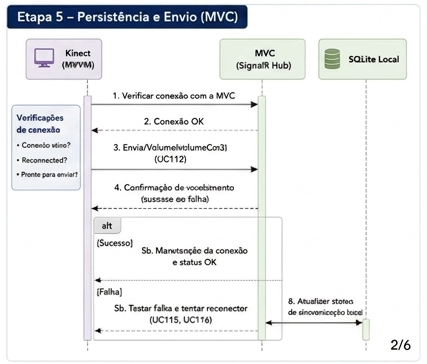
</p>

Esta etapa garante que as medições realizadas localmente sejam transmitidas com segurança ao servidor central.

## Como funciona

Antes do envio das informações, o sistema do Kinect verifica a conexão com o servidor principal.

Se a conexão estiver disponível:

1. O volume calculado é enviado ao servidor;
2. O servidor processa a informação recebida;
3. Uma confirmação de recebimento é retornada ao dispositivo.

Caso ocorra uma falha de comunicação, o sistema entra automaticamente em um fluxo alternativo de recuperação.

Nesse cenário, são executadas tentativas automáticas de reconexão, garantindo que nenhuma medição seja perdida durante o processo de sincronização.

---
# Etapa 6 – Histórico, Logs e Encerramento

<p align="center">
  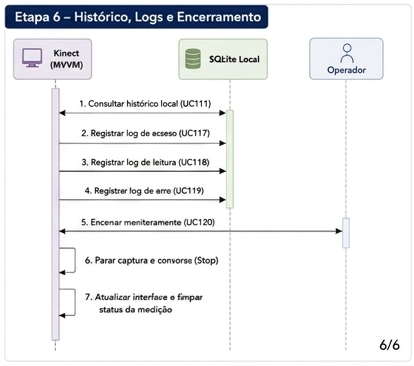
</p>

Esta etapa representa o encerramento do ciclo de monitoramento, garantindo que todas as informações geradas durante a operação sejam registradas com segurança antes da finalização do processo.

## Como funciona

Antes de encerrar o monitoramento, o sistema realiza uma última consulta ao histórico local para verificar se todas as informações foram registradas corretamente.

Em seguida, é iniciado o processo de auditoria, no qual são armazenados diferentes tipos de registros, incluindo:

- Log de acesso dos usuários;
- Log das medições realizadas pelo sensor Kinect;
- Log de erros ou exceções ocorridas durante a execução do sistema.

Após concluir o armazenamento dessas informações, os registros são persistidos no banco de dados local, garantindo a rastreabilidade das operações realizadas.

Com todas as etapas concluídas, o sistema executa o encerramento do monitoramento.

As ações finais incluem:

1. Finalização da sessão de monitoramento;
2. Interrupção da captura de dados pelo sensor Kinect para reduzir o consumo de recursos;
3. Atualização da interface da aplicação;
4. Limpeza dos dados temporários da tela, deixando o sistema preparado para iniciar um novo ciclo de medição.

---

## MODELAGEM DO BANCO DE DADOS
---

Com a evolução arquitetural do projeto, a solução passou a utilizar uma abordagem híbrida de armazenamento de dados, combinando banco relacional local e banco NoSQL em nuvem.

O módulo responsável pela captura volumétrica via Kinect (MVVM) utiliza o banco local **SQLite**, garantindo baixo custo computacional, operação offline e persistência temporária das leituras do sensor.

Já a aplicação Web MVC, responsável pelo gerenciamento operacional, autenticação, dashboard, notificações e integração entre usuários e parceiros, passou a utilizar o **Firebase Firestore**, um banco de dados NoSQL orientado a documentos e altamente escalável.

Diferentemente da modelagem relacional tradicional, o Firestore organiza os dados em:
- Coleções;
- Documentos;
- Subcoleções;
- Referências por identificadores (IDs).

Essa abordagem elimina a necessidade de relacionamentos complexos e operações JOIN, proporcionando maior desempenho em aplicações distribuídas e em tempo real.

---

## Arquitetura de Persistência de Dados

### Módulo Kinect (MVVM)
- Banco Local: SQLite;
- Responsável por:
  - armazenamento temporário das medições;
  - persistência dos parâmetros do sensor;
  - funcionamento offline;
  - processamento local das leituras do Kinect.

### Aplicação MVC Web
- Banco em Nuvem: Firebase Firestore;
- Responsável por:
  - autenticação de usuários;
  - gerenciamento de parceiros;
  - dashboard operacional;
  - envio de notificações;
  - mensageria;
  - armazenamento centralizado das medições;
  - sincronização em tempo real.

---

## Modelagem NoSQL Firebase Firestore (MVC)

<p align="center">
  
</p>

---

# Estrutura das Coleções Firestore

| Coleção | Finalidade |
|---------|------------|
| **Empresas** | Armazena as empresas cadastradas na plataforma. |
| **Usuarios** | Armazena os usuários vinculados às empresas. |
| **Perfis** | Define os perfis de acesso e permissões do sistema. |
| **Parceiros** | Armazena os parceiros responsáveis pelo recolhimento dos materiais. |
| **Medicoes** | Registra as medições volumétricas enviadas pelo Kinect. |
| **Notificacoes** | Armazena alertas automáticos e notificações enviadas aos parceiros. |
| **ParametrosSistema** | Centraliza as configurações operacionais da aplicação. |
| **LogsSistema** | Registra eventos, auditorias e ações executadas pelos usuários. |
| **TokenAcessoKinect** | Armazena tokens temporários para autenticação do módulo Kinect. |

---

# Descrição das Coleções

## Coleção: Empresas

Armazena as empresas cadastradas na plataforma.

| Campo | Tipo |
|-------|------|
| Id | String |
| Nome | String |
| Cnpj | String |
| Data_Cadastro | Timestamp |
| Ativo | Boolean |

### Exemplo

```json
{
  "Nome": "Inventory Masters LTDA",
  "Cnpj": "12.345.678/0001-90",
  "Data_Cadastro": "2026-06-08T14:30:00",
  "Ativo": true
}
```

---

## Coleção: Usuarios

Representa os usuários responsáveis pela operação do sistema.

| Campo | Tipo |
|-------|------|
| Id | String |
| Nome | String |
| Email | String |
| Perfil | String |
| PerfilId | String |
| EmpresaId | String |
| Empresa | String |
| Senha | String |
| Data_Cadastro | Timestamp |
| Ativo | Boolean |

### Exemplo

```json
{
  "Nome": "Administrador",
  "Email": "admin@inventorymasters.com",
  "Perfil": "Administrador",
  "PerfilId": "perfil01",
  "EmpresaId": "empresa01",
  "Empresa": "Inventory Masters",
  "Senha": "******",
  "Data_Cadastro": "2026-06-08T14:30:00",
  "Ativo": true
}
```

---

## Coleção: Perfis

Define os perfis de acesso e suas respectivas permissões.

| Campo | Tipo |
|-------|------|
| Id | String |
| Nome | String |
| EmpresaId | String |
| Descricao | String |
| Permissoes | Array<String> |
| Data_Cadastro | Timestamp |
| Ativo | Boolean |

### Exemplo

```json
{
  "Nome": "Administrador",
  "EmpresaId": "empresa01",
  "Descricao": "Acesso total ao sistema",
  "Permissoes": [
    "Dashboard.Visualizar",
    "Usuarios.Gerenciar",
    "Perfis.Gerenciar"
  ],
  "Data_Cadastro": "2026-06-08T14:30:00",
  "Ativo": true
}
```

---

## Coleção: Parceiros

Armazena os parceiros responsáveis pela coleta dos materiais.

| Campo | Tipo |
|-------|------|
| Id | String |
| Nome | String |
| Empresa | String |
| EmpresaId | String |
| Email | String |
| Telefone | String |
| Endereco | String |
| Data_Cadastro | Timestamp |
| Ativo | Boolean |

### Exemplo

```json
{
  "Nome": "João Silva",
  "Empresa": "Recicla Minas",
  "EmpresaId": "empresa01",
  "Email": "contato@reciclaminas.com",
  "Telefone": "(31) 9 9999-9999",
  "Endereco": "Rua A, 100",
  "Data_Cadastro": "2026-06-08T14:30:00",
  "Ativo": true
}
```

---

## Coleção: Medicoes

Armazena todas as medições realizadas pelo Kinect.

| Campo | Tipo |
|-------|------|
| Id | String |
| OrigemLeitura | String |
| Status | String |
| VolumeMedido | Number |
| EmpresaId | String |
| Empresa | String |
| DataHora | Timestamp |

### Exemplo

```json
{
  "OrigemLeitura": "Kinect",
  "Status": "Normal",
  "VolumeMedido": 8.75,
  "EmpresaId": "empresa01",
  "Empresa": "Inventory Masters",
  "DataHora": "2026-06-08T14:30:00"
}
```

---

## Coleção: Notificacoes

Armazena notificações geradas automaticamente ou manualmente.

| Campo | Tipo |
|-------|------|
| Id | String |
| VolumeMedido | Number |
| ParceiroId | String |
| EmpresaId | String |
| Empresa | String |
| Destinatario | String |
| ParceiroQueAceitouId | String |
| DataHora | Timestamp |
| StatusEnvio | String |
| Mensagem | String |
| Tipo | String |
| Automatica | Boolean |

### Exemplo

```json
{
  "VolumeMedido": 8.75,
  "ParceiroId": "parceiro01",
  "EmpresaId": "empresa01",
  "Empresa": "Inventory Masters",
  "Destinatario": "contato@reciclaminas.com",
  "ParceiroQueAceitouId": null,
  "DataHora": "2026-06-08T14:30:00",
  "StatusEnvio": "Pendente",
  "Mensagem": "O estoque atingiu 85% da capacidade máxima.",
  "Tipo": "Capacidade",
  "Automatica": true
}
```

---

## Coleção: ParametrosSistema

Armazena as configurações operacionais do sistema.

### Documento

```text
ParametrosSistema/configuracao
```

### Campos

| Campo | Tipo |
|-------|------|
| EmpresaId | String |
| CapacidadeMaxima | Number |
| CapacidadeMinima | Number |
| PercentualAlerta | Number |
| DataAtualizacao | Timestamp |
| NotificacaoAutomatica | Boolean |
| ExibirAlertaDashboard | Boolean |
| ParceiroPadraoId | String |
| DiasSemColetaAlerta | Number |
| AtivarSistemaCalibracao | Boolean |
| RaioDeteccaoKinect | Number |
| HabilitarZonaExclusaoDeteccao | Boolean |
| TaxaAmostragemVolumeMinutos | Number |
| DuracaoMaximaMedicaoSegundos | Number |
| TipoAlertaPadrao | String |
| TemplateMensagemPadrao | String |
| CanalEmailAtivo | Boolean |
| CanalWhatsAppAtivo | Boolean |
| CanalDashboardPushAtivo | Boolean |
| NomeRemetenteWhatsApp | String |
| EscalonamentoMinutos | Number |
| CanalEscalonamento | String |

---

## Coleção: LogsSistema

Registra auditorias e eventos executados na plataforma.

| Campo | Tipo |
|-------|------|
| Id | String |
| EmpresaId | String |
| UsuarioId | String |
| Email | String |
| Acao | String |
| Mensagem | String |
| Nivel | String |
| DataHora | Timestamp |

### Exemplo

```json
{
  "EmpresaId": "empresa01",
  "UsuarioId": "usuario01",
  "Email": "admin@inventorymasters.com",
  "Acao": "Cadastro de parceiro",
  "Mensagem": "Novo parceiro cadastrado.",
  "Nivel": "Informacao",
  "DataHora": "2026-06-08T14:30:00"
}
```

---

## Coleção: TokenAcessoKinect

Responsável pelo controle de autenticação do módulo Kinect.

| Campo | Tipo |
|-------|------|
| Id | String |
| UsuarioId | String |
| UsuarioNome | String |
| Email | String |
| EmpresaId | String |
| Empresa | String |
| Perfil | String |
| TokenHash | String |
| CriadoEm | Timestamp |
| ExpiraEm | Timestamp |
| ValidadoEm | Timestamp |
| Utilizado | Boolean |
| Revogado | Boolean |

### Exemplo

```json
{
  "UsuarioId": "usuario01",
  "UsuarioNome": "Administrador",
  "EmpresaId": "empresa01",
  "Empresa": "Inventory Masters",
  "Perfil": "Administrador",
  "TokenHash": "d7af85d8c9...",
  "CriadoEm": "2026-06-08T14:30:00",
  "ExpiraEm": "2026-06-08T15:00:00",
  "Utilizado": false,
  "Revogado": false
}
```

---

# Relacionamentos Entre Coleções

```text
Empresas
│
├── Usuarios (EmpresaId)
├── Perfis (EmpresaId)
├── Parceiros (EmpresaId)
├── Medicoes (EmpresaId)
├── Notificacoes (EmpresaId)
├── ParametrosSistema (EmpresaId)
├── LogsSistema (EmpresaId)
└── TokenAcessoKinect (EmpresaId)

Usuarios
│
├── PerfilId → Perfis
├── EmpresaId → Empresas
├── LogsSistema
└── TokenAcessoKinect

Perfis
│
└── Utilizados pelos Usuarios

Parceiros
│
└── Utilizados pelas Notificacoes

Medicoes
│
└── Geram Notificacoes automáticas

ParametrosSistema
│
├── Define capacidade máxima
├── Define percentual de alerta
├── Configura canais de comunicação
└── Configura parâmetros do Kinect

LogsSistema
│
└── Auditoria das ações dos Usuarios

TokenAcessoKinect
│
└── Controla autenticação entre o Kinect e o sistema MVC
```

---

# Considerações Arquiteturais

A modelagem atual do Firebase Firestore foi estruturada para suportar um ambiente **multiempresa (multi-tenant)**, permitindo que diversas organizações utilizem a mesma plataforma de forma isolada por meio do campo **EmpresaId** presente nas principais coleções.

Além disso, a arquitetura incorpora:

- Controle de acesso baseado em perfis e permissões;
- Autenticação segura do módulo Kinect por meio de tokens temporários;
- Auditoria completa das operações através da coleção **LogsSistema**;
- Configuração dinâmica dos parâmetros operacionais por empresa;
- Geração automática de notificações baseada nas medições recebidas;
- Sincronização em tempo real utilizando Firebase Firestore e SignalR.

O fluxo principal da aplicação é representado por:

```text
Kinect
   │
   ▼
TokenAcessoKinect
   │
   ▼
SignalR Hub
   │
   ▼
Firestore
   │
   ├── Medicoes
   ├── Notificacoes
   ├── LogsSistema
   └── ParametrosSistema
   │
   ▼
MVC Inventory Masters
   │
   ▼
Dashboard • Alertas • Administração
```

Essa modelagem representa a estrutura atual implementada no **Inventory Masters**, oferecendo escalabilidade, rastreabilidade, segurança e suporte ao gerenciamento de múltiplas empresas em uma única plataforma.

# Modelo Conceitual — MVVM Kinect

O modelo conceitual do módulo MVVM Kinect representa as principais entidades responsáveis pelo armazenamento das informações utilizadas durante o funcionamento da aplicação desktop. Essas entidades contemplam o registro das medições volumétricas capturadas pelo sensor Kinect, o histórico de ocupação dos espaços monitorados, o controle de usuários locais, as sessões de autenticação e os registros operacionais da aplicação.

Além das entidades persistidas, o módulo utiliza modelos auxiliares responsáveis pelo controle do processo de calibração durante a execução do sistema.

<p align="center">
  
</p>

## Entidades

| Entidade | Finalidade |
|-----------|------------|
| **UsuarioAcesso** | Armazena os usuários responsáveis pelo acesso ao módulo Kinect. |
| **MedicaoVolume** | Registra as medições volumétricas realizadas pelo sensor Kinect. |
| **HistoricoOcupacao** | Armazena o histórico da ocupação dos espaços monitorados. |
| **SessaoUsuario** | Controla os dados da sessão ativa do usuário autenticado. |
| **Log** | Registra eventos, avisos e erros gerados pela aplicação. |

---

## Relacionamentos

| Relacionamento | Cardinalidade | Descrição |
|----------------|---------------|-----------|
| **UsuarioAcesso → MedicaoVolume** | 1:N | Um usuário pode realizar várias medições volumétricas. |
| **UsuarioAcesso → SessaoUsuario** | 1:N | Um usuário pode possuir várias sessões registradas no sistema. |
| **MedicaoVolume → HistoricoOcupacao** | 1:N | Uma medição volumétrica pode gerar vários registros de histórico de ocupação. |

---

# Modelo Lógico — MVVM Kinect

O modelo lógico do módulo MVVM Kinect foi elaborado a partir do modelo conceitual, definindo as tabelas, atributos, tipos de dados, chaves primárias e chaves estrangeiras necessárias para garantir a organização e a integridade dos dados armazenados no banco SQLite local.

<p align="center">
  
</p>

## Estrutura Relacional

| Tabela | Descrição |
|---------|-----------|
| **UsuarioAcesso** | Controle local dos usuários que acessam o módulo Kinect. |
| **MedicaoVolume** | Registro das medições volumétricas capturadas pelo sensor Kinect. |
| **HistoricoOcupacao** | Registro consolidado da ocupação volumétrica dos espaços monitorados. |
| **SessaoUsuario** | Controle das sessões autenticadas dos usuários. |
| **Log** | Registro de eventos, avisos e erros operacionais da aplicação. |

---

## Tabela: UsuarioAcesso

| Campo | Tipo | Descrição |
|---------|---------|-----------|
| Id | INTEGER | Identificador único do usuário |
| Usuario | VARCHAR | Nome do usuário |
| Email | VARCHAR | E-mail do usuário |
| Senha | VARCHAR | Senha de acesso |
| Perfil | VARCHAR | Perfil de acesso do usuário |
| CriadoEm | TIMESTAMP | Data e hora de criação do registro |
| Ativo | BIT | Indica se o usuário está ativo |
| Empresa | VARCHAR | Empresa vinculada ao usuário |

---

## Tabela: MedicaoVolume

| Campo | Tipo | Descrição |
|---------|---------|-----------|
| Id | INTEGER | Identificador único da medição |
| VolumeCm3 | DOUBLE | Volume medido em centímetros cúbicos |
| VolumeM3 | DOUBLE | Volume medido em metros cúbicos |
| DataHora | TIMESTAMP | Data e hora da medição |
| KinectLigado | BOOLEAN | Indica se o Kinect estava ligado |
| Calibrado | BOOLEAN | Indica se o ambiente estava calibrado |
| Status | VARCHAR | Status da medição |
| Usuario | VARCHAR | Usuário responsável pela medição |
| Empresa | VARCHAR | Empresa vinculada à medição |
| fk_UsuarioAcesso_Id | INTEGER | Chave estrangeira vinculada à tabela UsuarioAcesso |

---

## Tabela: HistoricoOcupacao

| Campo | Tipo | Descrição |
|---------|---------|-----------|
| Id | INTEGER | Identificador único do histórico |
| EspacoMapeadoId | INTEGER | Identificador lógico do espaço mapeado |
| VolumeAtualCm3 | DOUBLE | Volume atualmente ocupado |
| VolumeMaximoCm3 | DOUBLE | Volume máximo disponível |
| EspacoLivreCm3 | DOUBLE | Volume livre disponível |
| PercentualOcupacao | DOUBLE | Percentual de ocupação calculado |
| LimiteUltrapassado | BOOLEAN | Indica se o limite de ocupação foi ultrapassado |
| NivelOcupacao | VARCHAR | Nível de ocupação do espaço monitorado |
| Status | VARCHAR | Status do registro |
| DataHora | TIMESTAMP | Data e hora do histórico |
| Empresa | VARCHAR | Empresa vinculada ao histórico |
| fk_MedicaoVolume_Id | INTEGER | Chave estrangeira vinculada à tabela MedicaoVolume |

---

## Tabela: SessaoUsuario

| Campo | Tipo | Descrição |
|---------|---------|-----------|
| Id | INTEGER | Identificador único da sessão |
| Usuario | VARCHAR | Usuário autenticado |
| Empresa | VARCHAR | Empresa vinculada à sessão |
| Email | VARCHAR | E-mail do usuário autenticado |
| Token | VARCHAR | Token da sessão |
| fk_UsuarioAcesso_Id | INTEGER | Chave estrangeira vinculada à tabela UsuarioAcesso |

---

## Tabela: Log

| Campo | Tipo | Descrição |
|---------|---------|-----------|
| Id | INTEGER | Identificador único do log |
| DataHora | TIMESTAMP | Data e hora do evento registrado |
| Nivel | VARCHAR | Nível do log, como Info, Warning ou Erro |
| Mensagem | VARCHAR | Mensagem registrada pela aplicação |

---

# Modelo Físico — MVVM Kinect

O modelo físico do módulo **MVVM Kinect** foi implementado utilizando o banco de dados **SQLite**, por meio do **Entity Framework 6**, responsável pelo mapeamento objeto-relacional entre as classes do domínio e as tabelas persistidas no banco de dados local.

<p align="center">
  
</p>

A Figura acima apresenta a arquitetura de persistência adotada pelo módulo **MVVM Kinect**. Observa-se que a camada de apresentação, representada pelo **MainViewModel**, realiza o acesso aos dados por meio do **KinectRepository**. O **Entity Framework 6**, através do **AppDbContext**, é responsável pelo mapeamento objeto-relacional, pelo gerenciamento da comunicação entre a aplicação e o banco de dados, pela criação das tabelas, pelo controle das conexões e pela persistência dos dados utilizados pelo sistema.

Nesse contexto, o banco **SQLite** foi adotado por ser uma solução leve, embarcada e de baixo consumo de recursos, características adequadas para aplicações desktop que precisam operar localmente e com suporte ao funcionamento offline. Dessa forma, as entidades do módulo MVVM Kinect são armazenadas localmente, garantindo a persistência das informações mesmo sem conexão com serviços externos.

---

## Estrutura

A estrutura física contempla as seguintes tabelas:

- UsuarioAcesso
- MedicaoVolume
- HistoricoOcupacao
- SessaoUsuario
- Log

Foram utilizadas chaves primárias do tipo **INTEGER AUTOINCREMENT** e chaves estrangeiras para garantir a integridade referencial entre as tabelas. :contentReference[oaicite:5]{index=5}

---

# Arquitetura de Persistência Local

```text
                 MVVM Kinect

                  MainViewModel
                         │
                         ▼
                KinectRepository
                         │
                         ▼
                  Entity Framework 6
                         │
                         ▼
                      SQLite
                         │
     ┌───────────────────┼────────────────────┐
     │                   │                    │
     ▼                   ▼                    ▼
MedicaoVolume   HistoricoOcupacao   UsuarioAcesso
                         │
                         ▼
                  SessaoUsuario
                         │
                         ▼
                        Log
```

---

# Considerações

A modelagem adotada permite organizar de forma eficiente os dados gerados pelo sensor Kinect, garantindo:

- Persistência local das medições;
- Histórico de ocupação dos espaços monitorados;
- Controle de acesso dos usuários;
- Registro das sessões ativas;
- Rastreabilidade das operações realizadas;
- Funcionamento offline do módulo MVVM.

A utilização do SQLite proporciona baixo consumo de recursos computacionais, rápida recuperação das informações e integração transparente com o Entity Framework, atendendo aos requisitos do módulo **Inventory Masters Kinect**.

## Tecnologias Utilizadas

- SQLite
- Entity Framework 6
- .NET Framework 4.8
- Arquitetura MVVM
- Kinect SDK 1.8

---

# Models Persistidas no SQLite

As models persistidas representam as entidades armazenadas fisicamente no banco de dados **SQLite** local. Essas entidades são mapeadas pelo **Entity Framework 6** por meio do **AppDbContext**, sendo responsáveis pela persistência das informações operacionais geradas durante a execução do módulo MVVM Kinect.

Cada model corresponde a uma tabela do banco de dados e armazena informações relacionadas às medições volumétricas, histórico de ocupação, autenticação de usuários, sessões ativas e registros operacionais da aplicação.

| Model | Descrição |
|---------|-----------|
| **UsuarioAcesso** | Entidade responsável pelo armazenamento dos usuários locais e suas informações de autenticação. |
| **MedicaoVolume** | Entidade responsável pelo armazenamento das medições volumétricas capturadas pelo sensor Kinect. |
| **HistoricoOcupacao** | Entidade responsável pelo registro do histórico de ocupação dos espaços monitorados. |
| **SessaoUsuario** | Entidade responsável pelo controle da sessão autenticada durante a execução da aplicação. |
| **Log** | Entidade responsável pelo armazenamento de mensagens informativas, avisos e erros registrados pelo sistema. |

Todas essas entidades são gerenciadas automaticamente pelo **Entity Framework 6** através do **AppDbContext**, que realiza as operações de criação, leitura, atualização e exclusão dos registros persistidos no banco SQLite.

---

# Models de Controle em Memória

Além das entidades persistidas, o módulo MVVM utiliza modelos auxiliares que não são armazenados no banco de dados. Essas classes existem apenas durante a execução da aplicação e são responsáveis por controlar o processo de calibração do sensor Kinect.

| Model | Finalidade |
|---------|-----------|
| **CalibrationResult** | Armazena o resultado final obtido durante a calibração do Kinect. |
| **CalibrationProgress** | Controla o progresso da calibração em tempo real, permitindo atualizar a interface do usuário durante o processo. |

---

## Observação Sobre o Armazenamento por Empresa

O módulo MVVM realiza a segregação lógica das informações através do atributo **Empresa**, presente nas principais entidades persistidas.

Essa abordagem garante que medições volumétricas, históricos de ocupação, sessões de autenticação e registros de log permaneçam associados à empresa do usuário autenticado, proporcionando maior organização, rastreabilidade e isolamento dos dados operacionais do sistema.

---
## VIABILIDADE TÉCNICA

#### Introdução

O projeto **Inventory Masters** propõe uma solução de monitoramento volumétrico inteligente utilizando o sensor **Kinect Xbox 360** integrado a um sistema desenvolvido em **C#**, com o objetivo de acompanhar a ocupação de espaços físicos destinados ao armazenamento de materiais e excedentes produtivos.

A solução combina captura de profundidade, processamento volumétrico, armazenamento local e sincronização com uma aplicação web, permitindo o acompanhamento contínuo da utilização dos espaços monitorados. Dessa forma, a plataforma contribui para o controle operacional, a redução de desperdícios e o apoio à tomada de decisão em ambientes logísticos e industriais.

---

#### Descrição da Solução

A solução utiliza os sensores de profundidade e imagem RGB do Kinect para capturar informações tridimensionais do ambiente monitorado.

O processo inicia-se com a calibração do espaço vazio, criando um mapa de referência utilizado como base para as medições futuras. Durante a operação, o sistema compara a leitura atual do ambiente com a referência calibrada, permitindo calcular automaticamente:

- Volume ocupado;
- Espaço livre;
- Percentual de ocupação;
- Evolução da ocupação ao longo do tempo.

A arquitetura foi dividida em três módulos principais:

#### Módulo Kinect

Responsável pela captura, processamento e armazenamento local das medições volumétricas.

#### Módulo MVC

Responsável pela visualização dos dados através de dashboards, gerenciamento de parâmetros, parceiros, notificações e relatórios.

#### Integração

Responsável pela comunicação em tempo real entre o Kinect e a aplicação MVC por meio do SignalR.

---

#### Requisitos de Hardware

Para a execução estável do sistema foi definida a seguinte configuração mínima:

#### Estação de Trabalho

- Processador Intel Core i3 ou superior;
- 8 GB de memória RAM;
- SSD de 240 GB ou superior;
- Sistema Operacional Windows compatível com Kinect SDK 1.8.

#### Sensor

- Kinect Xbox 360;
- Adaptador USB com fonte de alimentação própria.

#### Infraestrutura

- Estrutura de suporte para posicionamento adequado do sensor;
- Área monitorada livre de obstruções permanentes;
- Distância compatível com o campo de visão do Kinect.

---

## ORGANIZAÇÃO TECNOLÓGICA

#### Tecnologias do Módulo Kinect

- Linguagem: C#
- Plataforma: .NET Framework
- Interface: WPF
- Sensor: Kinect Xbox 360
- SDK: Kinect for Windows SDK 1.8
- Banco de Dados: SQLite
- Arquitetura: MVVM
- Comunicação: SignalR Client

#### Tecnologias da Aplicação MVC

- ASP.NET MVC
- Razor Pages
- Bootstrap
- SignalR
- Firebase Firestore

#### Tecnologias de Integração

- SignalR
- JSON
- WebSockets

---

## METODOLOGIA DE IMPLEMENTAÇÃO

O desenvolvimento da solução foi dividido em duas etapas principais.

#### Etapa 1 – Desenvolvimento do Módulo Kinect

1. Integração do Kinect Xbox 360 ao ambiente de desenvolvimento.
2. Captura dos dados de profundidade e imagem RGB.
3. Implementação da calibração do ambiente.
4. Desenvolvimento do algoritmo de cálculo volumétrico.
5. Implementação dos indicadores de ocupação.
6. Persistência local das medições em SQLite.
7. Implementação do histórico de medições.
8. Desenvolvimento dos mecanismos de diagnóstico e monitoramento do sensor.

#### Etapa 2 – Integração com a Aplicação MVC

1. Implementação da comunicação via SignalR.
2. Desenvolvimento dos dashboards de monitoramento.
3. Configuração dos parâmetros operacionais.
4. Implementação do sistema de notificações.
5. Desenvolvimento dos relatórios operacionais.
6. Sincronização dos dados entre os módulos.

---

## BENEFICIOS TECNOLÓGICOS

A solução apresenta diversos benefícios técnicos:

- Automatização das medições volumétricas;
- Redução da dependência de inventários manuais;
- Monitoramento contínuo da ocupação dos espaços;
- Armazenamento histórico das medições;
- Comunicação em tempo real entre os módulos;
- Operação local independente da aplicação web;
- Persistência dos dados em SQLite;
- Baixo custo de implantação;
- Facilidade de manutenção e expansão;
- Separação de responsabilidades entre Kinect, MVC e Integração.

---

## PONTOS DE VIABILIDADE

1. O Kinect Xbox 360 possui suporte por meio do Kinect SDK 1.8.
2. A câmera RGB e o sensor de profundidade podem ser acessados pela aplicação desktop.
3. O cálculo volumétrico pode ser realizado comparando o ambiente calibrado com a leitura atual.
4. O WPF permite integração direta com hardware local.
5. O SQLite possibilita armazenamento local sem necessidade de servidor dedicado.
6. O SignalR permite sincronização em tempo real com a aplicação MVC.
7. A arquitetura MVVM facilita a manutenção do código.
8. O sistema pode operar mesmo sem conexão com a aplicação web.
9. A separação entre módulos facilita futuras expansões.
10. A solução pode ser executada em computadores convencionais compatíveis com o Kinect SDK.

---

## LIMITAÇÕES TÉCNICAS

Apesar da viabilidade da solução, algumas limitações devem ser consideradas:

1. O Kinect possui limite de alcance e campo de visão.
2. A precisão das medições depende da correta calibração do ambiente.
3. Objetos fora da área monitorada não são considerados nos cálculos.
4. Obstáculos podem interferir na captura dos dados.
5. O Kinect SDK possui dependência do ambiente Windows.
6. O cálculo volumétrico representa uma estimativa baseada na profundidade capturada.
7. A comunicação com a aplicação MVC depende da disponibilidade da rede.
8. O Kinect Xbox 360 é um equipamento descontinuado, exigindo cuidados adicionais de manutenção.

Desta forma Conclui-se que com base nas tecnologias utilizadas, nos testes realizados e na integração entre hardware e software, conclui-se que a solução proposta é tecnicamente viável.

A utilização do Kinect Xbox 360 permitiu implementar um sistema de monitoramento volumétrico capaz de acompanhar a ocupação dos espaços de armazenamento de forma automatizada, utilizando recursos acessíveis e tecnologias amplamente consolidadas.

A combinação entre Kinect, SQLite, SignalR e ASP.NET MVC demonstrou ser adequada para o desenvolvimento de uma plataforma capaz de fornecer informações operacionais em tempo real, mantendo histórico das medições e apoiando processos relacionados à gestão de excedentes produtivos e utilização eficiente dos espaços de armazenamento.

---

## VIABILIDADE ECONÔMICA

#### Custos Estimados de Implantação

O projeto Inventory Masters foi concebido como uma solução tecnológica de baixo custo, utilizando hardware acessível e desenvolvimento próprio. Essa abordagem reduz significativamente o investimento inicial quando comparada a sistemas industriais de monitoramento volumétrico.

#### Investimento em Hardware

| Item | Quantidade | Valor Unitário | Total |
| :--- | :---: | :---: | :---: |
| Kinect Xbox 360 | 1 | R$ 30,00 | R$ 30,00 |
| Adaptador USB com Fonte | 1 | R$ 80,00 | R$ 80,00 |
| Computador Core i3 | 1 | R$ 800,00 | R$ 800,00 |
| **Subtotal Hardware** | | | **R$ 910,00** |

---

#### Custo do desenvolvimento

Para fins de análise econômica, considerou-se o esforço de desenvolvimento realizado pela equipe do projeto.

- Horas totais: 40 horas
- Valor estimado por hora: R$ 15,00
- 
**Total estimado de mão de obra:** R$ 600,00

---

#### Custo total do projeto

| Categoria | Valor |
| :--- | :---: |
| Hardware | R$ 910,00 |
| Mão de Obra | R$ 600,00 |
| **Total Geral** | **R$ 1.510,00** |

---

#### Benefícios econômicos

A implementação da plataforma proporciona diversos benefícios:

- Redução do tempo gasto em medições manuais;
- Melhor utilização dos espaços disponíveis;
- Identificação antecipada de excedentes produtivos;
- Apoio à tomada de decisão operacional;
- Redução de desperdícios;
- Melhor controle dos estoques;
- Possibilidade de reaproveitamento de materiais;
- Redução de custos operacionais.


Desta forma Conclui-se  que o investimento total estimado em **R$ 1.360,00** demonstra que a solução apresenta excelente relação custo-benefício quando comparada a alternativas industriais de monitoramento volumétrico.

Além do baixo investimento inicial, a plataforma oferece ganhos operacionais relacionados ao controle dos espaços de armazenamento, rastreabilidade das medições e apoio à gestão dos excedentes produtivos, tornando-se uma alternativa economicamente viável para organizações de diferentes portes.

---

# RESULTADOS E CONCLUSÃO

#### Resultados Alcançados

Durante o desenvolvimento do projeto foi possível validar a utilização do Kinect Xbox 360 como ferramenta de monitoramento volumétrico aplicada à gestão de espaços de armazenamento.

Os principais resultados obtidos foram:

- Automatização do processo de medição volumétrica;
- Monitoramento contínuo da ocupação dos espaços;
- Cálculo automático de volume ocupado, espaço livre e percentual de ocupação;
- Registro histórico das medições realizadas;
- Integração entre módulo Kinect e aplicação MVC;
- Disponibilização das informações em tempo real por meio de dashboards;
- Persistência local das medições através do SQLite;
- Funcionamento mesmo em situações de indisponibilidade temporária da aplicação web.

---

#### Conclusão

Conclui-se que a **Inventory Masters** demonstrou a viabilidade da utilização do Kinect Xbox 360 como ferramenta de monitoramento volumétrico aplicada ao controle de ocupação de espaços de armazenamento.

A integração entre captura de profundidade, processamento local, armazenamento em SQLite e sincronização com a aplicação MVC permitiu construir uma solução capaz de fornecer informações atualizadas e rastreáveis para apoio à gestão operacional.

Além dos benefícios relacionados ao controle dos estoques e à identificação de excedentes produtivos, a solução contribui para a otimização dos espaços de armazenamento e para a adoção de práticas alinhadas à economia circular.

Dessa forma, a plataforma demonstra potencial para aplicação em diferentes cenários logísticos e industriais, consolidando-se como uma solução de baixo custo, escalável e tecnicamente adequada para o monitoramento inteligente de ambientes de armazenamento.

---------------------------------------


