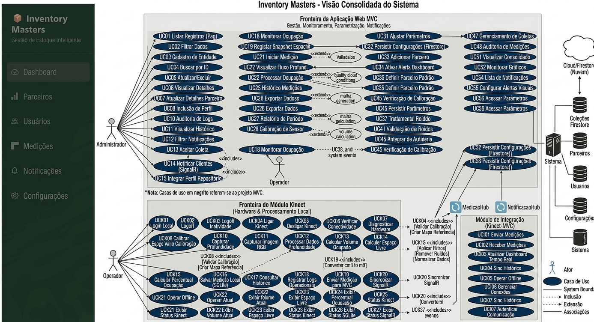
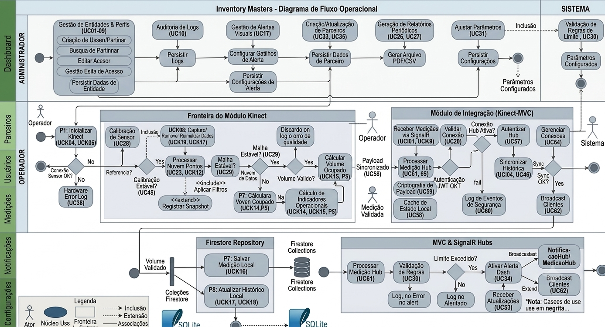
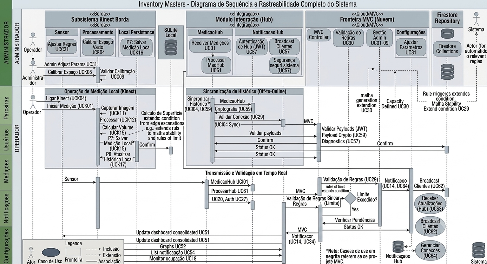
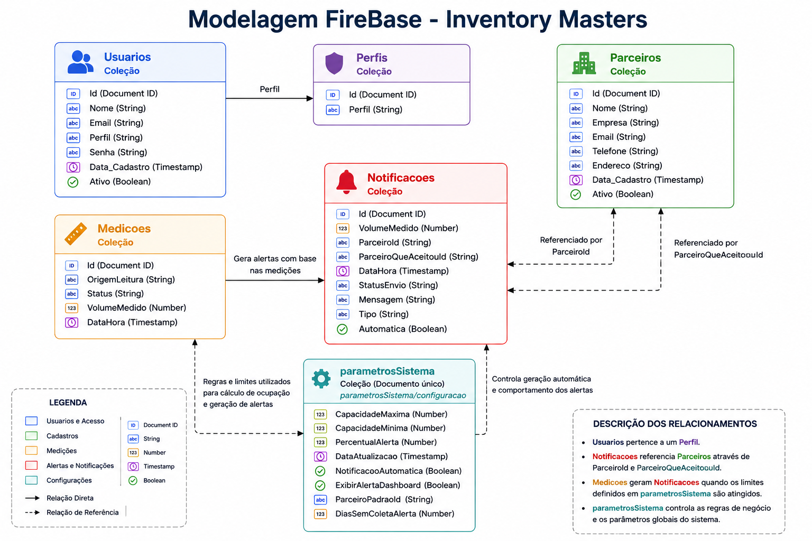

# INVENTORY MASTERS - SOLUÇÕES INTELIGENTES EM MAPEAMENTO DE ESTOQUE
---
**Unidade SENAI:** Nova Lima  
**Instrutor:** Frederico Martins Aguiar

<div align="center">

## INTEGRANTES DO GRUPO

<p align="center">
  
</p>

</div>

| Nome | Curso| Especialidade no Projeto |
| :--- | :--- | :--- |
| **Danilo Silva Santos** | Programação de Sistemas | Desenvolvimento e Integração do Sensor Kinect|
| **Marilene da Silva Araujo** | Programação de Sistemas | Desenvolvimento, e Modelagem de Banco de Dados |
| **Miguel Cassio Braga Duarte** |Programação de Sistemas | Desenvolvimento e Lógica do negócio |
| **Diulie Mileide Batista Correia** |Programação de Sistemas | Desenvolvimento , Integração do Sensor Kinect e Documentação  |

</div>

---

## QUEM SOMOS

A Inventory Masters é uma plataforma tecnológica voltada para o monitoramento inteligente de espaços de armazenamento e a gestão estratégica de excedentes produtivos.

A solução utiliza tecnologias de visão computacional e mapeamento volumétrico para identificar, medir e acompanhar a ocupação de ambientes destinados ao armazenamento de materiais, permitindo maior controle sobre estoques, excedentes e capacidade disponível.

Por meio da integração entre o sensor Kinect, processamento de dados e dashboards gerenciais, a plataforma transforma informações operacionais em indicadores que auxiliam a tomada de decisão, promovendo maior eficiência logística e redução de desperdícios.

Além de otimizar a utilização dos espaços monitorados, a Inventory Masters contribui para a economia circular ao conectar materiais excedentes a oportunidades de reaproveitamento, transformando recursos subutilizados em ativos com potencial de geração de valor econômico.

Nossa proposta combina inovação tecnológica, sustentabilidade e inteligência operacional para apoiar empresas na construção de processos mais eficientes, competitivos e ambientalmente responsáveis.


<p align="center">
  
</p>

-------

## PROBLEMA 

O cenário empresarial atual é caracterizado por elevados níveis de produção e, consequentemente, pela geração contínua de excedentes produtivos. Esses excedentes incluem sobras de matéria-prima, materiais fora dos padrões comerciais, resíduos operacionais e insumos não aproveitados integralmente durante os processos produtivos. Em muitas organizações, esses materiais não são monitorados de forma estratégica, sendo frequentemente tratados apenas como resíduos ou custos inevitáveis.

Além da dificuldade de gerenciar os excedentes, muitas empresas enfrentam desafios relacionados ao controle e monitoramento da ocupação dos espaços de armazenamento. A ausência de mecanismos automatizados para medir a utilização dos ambientes dificulta a identificação da capacidade disponível, o acompanhamento do crescimento dos estoques e a tomada de decisões relacionadas ao reaproveitamento, movimentação ou destinação de materiais.

A falta de rastreabilidade, monitoramento e visibilidade dos espaços físicos gera impactos significativos:

* **Sob a ótica econômica** *: aumento dos custos operacionais, desperdício de recursos, utilização inadequada dos espaços disponíveis e baixa eficiência na gestão de estoques.
* **Sob a ótica operacional** *: dificuldade de acompanhar a ocupação dos ambientes em tempo real, reduzindo a capacidade de planejamento, controle logístico e gestão dos excedentes.
* **Sob a ótica ambiental:** * descarte inadequado de materiais reutilizáveis, aumento da geração de resíduos e maior pressão sobre os recursos naturais.

Embora a economia circular seja amplamente reconhecida como uma estratégia importante para o desenvolvimento sustentável, sua implementação ainda encontra barreiras devido à escassez de ferramentas tecnológicas acessíveis que permitam monitorar, medir e gerenciar excedentes de forma eficiente e baseada em dados.

Diante desse cenário, surge a necessidade de uma solução capaz de automatizar o monitoramento dos espaços de armazenamento, medir a ocupação dos ambientes, identificar excedentes produtivos e disponibilizar informações confiáveis para apoiar a tomada de decisão.

É nesse contexto que se insere a proposta da **Inventory Masters**, uma plataforma tecnológica que utiliza mapeamento volumétrico, visão computacional e monitoramento inteligente para acompanhar a ocupação de espaços físicos, rastrear excedentes produtivos e apoiar estratégias de reaproveitamento de materiais. A solução busca transformar dados operacionais em informações gerenciais, permitindo maior controle dos recursos, melhor utilização da capacidade disponível e redução de desperdícios.

Assim, o presente estudo busca integrar inovação tecnológica, eficiência operacional e sustentabilidade, contribuindo para uma gestão mais inteligente dos recursos, redução de desperdícios e fortalecimento das práticas de economia circular.

---

## SOLUÇÃO

A **Inventory Masters** é uma plataforma tecnológica desenvolvida para apoiar a gestão inteligente de excedentes produtivos por meio do monitoramento volumétrico de espaços de armazenamento e da rastreabilidade de materiais com potencial de reaproveitamento.

A solução utiliza tecnologias de visão computacional e mapeamento volumétrico para acompanhar a ocupação dos ambientes monitorados, permitindo identificar a capacidade utilizada, o espaço disponível e possíveis situações de excedente operacional. Por meio da integração entre o sensor Kinect, processamento de dados e dashboards gerenciais, o sistema transforma medições físicas em informações estratégicas para apoio à tomada de decisão.

O módulo Kinect é responsável por capturar dados de profundidade do ambiente, realizar a calibração do espaço monitorado e calcular automaticamente o volume ocupado. Essas informações são processadas e disponibilizadas em tempo real para a plataforma, permitindo o acompanhamento contínuo da ocupação dos estoques.

Com base nas medições realizadas, a plataforma calcula indicadores operacionais como:

* Volume ocupado;
* Espaço livre disponível;
* Percentual de ocupação;
* Histórico de medições;
* Situação dos limites configurados;
* Indicadores para apoio à tomada de decisão.

Além do monitoramento dos espaços, a plataforma atua como um elo integrador entre empresas geradoras de excedentes e parceiros aptos a reutilizá-los, estruturando um ecossistema colaborativo voltado para eficiência operacional, redução de desperdícios e sustentabilidade empresarial.

Ao conectar monitoramento inteligente, rastreabilidade e reaproveitamento de materiais, a solução contribui para:

* **Redução de custos** operacionais e de descarte;
* **Melhor aproveitamento dos espaços de armazenamento**;
* **Maior controle sobre excedentes produtivos**;
* **Melhoria da eficiência logística e operacional**;
* **Mitigação dos impactos ambientais** relacionados ao descarte inadequado de materiais.

Mais do que uma iniciativa sustentável, a Inventory Masters configura-se como uma solução de inovação aplicada à gestão de estoques, monitoramento volumétrico e economia circular, alinhada às tendências de transformação digital, responsabilidade socioambiental e competitividade empresarial.

---

## ÁREA TECNOLÓGICA DA SOLUÇÃO

A solução Inventory Masters está inserida no contexto da **Indústria 4.0**, integrando tecnologias de visão computacional, monitoramento volumétrico, processamento de dados e comunicação em tempo real para apoiar a gestão inteligente de excedentes produtivos e ocupação de espaços de armazenamento.

As principais áreas tecnológicas envolvidas são:

* **Visão Computacional:** Utilização do sensor Kinect Xbox 360, câmera RGB e sensor de profundidade (RGB-D) para captura de dados espaciais e realização do mapeamento volumétrico dos ambientes monitorados.

* **Monitoramento Volumétrico:** Processamento dos dados capturados para cálculo do volume ocupado, espaço livre disponível e percentual de ocupação dos ambientes de armazenamento.

* **Internet das Coisas (IoT):** Integração entre hardware e software para coleta automática de dados e monitoramento contínuo dos espaços físicos.

* **Sistemas de Informação:** Processamento, armazenamento e disponibilização das informações por meio de aplicações desenvolvidas em C#, WPF, ASP.NET Core, SQLite e Firebase Firestore.

* **Comunicação em Tempo Real:** Utilização do SignalR para sincronização das medições realizadas pelo módulo Kinect com os dashboards da aplicação web.

A combinação dessas tecnologias permite que a solução transforme medições físicas em informações estratégicas para apoio à tomada de decisão, rastreabilidade de excedentes e otimização dos espaços de armazenamento.

---

## JUSTIFICATIVA

A implementação deste projeto justifica-se pelas limitações dos métodos tradicionais de controle de estoque e monitoramento de espaços de armazenamento, que normalmente dependem de medições manuais, inspeções periódicas e registros sujeitos a falhas humanas.

A ausência de informações precisas sobre a ocupação dos ambientes dificulta o planejamento logístico, reduz a eficiência operacional e pode resultar em desperdícios, utilização inadequada dos espaços disponíveis e acúmulo de excedentes produtivos.

Nesse contexto, a Inventory Masters propõe uma alternativa tecnológica de baixo custo baseada no sensor Kinect Xbox 360, permitindo automatizar o monitoramento volumétrico dos ambientes e disponibilizar informações em tempo real sobre ocupação, capacidade disponível e situação dos estoques.

Além dos benefícios operacionais, a solução contribui para práticas de economia circular, rastreabilidade de materiais e redução de impactos ambientais, tornando a gestão dos excedentes mais eficiente, sustentável e orientada por dados.

---

## OBJETIVOS

#### Objetivo Geral

Desenvolver e implementar uma plataforma tecnológica capaz de realizar o monitoramento volumétrico de espaços de armazenamento e apoiar a gestão inteligente de excedentes produtivos por meio da captura, processamento e disponibilização de informações em tempo real.

#### Objetivos Específicos

##### Módulo Kinect

* Integrar o sensor Kinect Xbox 360 ao ambiente de desenvolvimento C# para captura de dados de profundidade e imagens do ambiente monitorado.
* Desenvolver mecanismos de calibração do espaço físico para obtenção de medições confiáveis.
* Criar algoritmos capazes de converter os dados de profundidade em métricas volumétricas.
* Calcular automaticamente o volume ocupado, espaço livre disponível e percentual de ocupação.
* Armazenar localmente as medições realizadas para consulta histórica e rastreabilidade.
* Disponibilizar as informações coletadas para integração com a aplicação web.

##### Módulo MVC

* Desenvolver dashboards para visualização das informações recebidas do módulo Kinect.
* Permitir o gerenciamento de parceiros e materiais com potencial de reaproveitamento.
* Disponibilizar configurações de parâmetros operacionais e limites de ocupação.
* Implementar mecanismos de notificação e acompanhamento dos excedentes produtivos.
* Apoiar a tomada de decisão por meio de indicadores operacionais e históricos de ocupação.

##### Integração Entre os Módulos

* Sincronizar as medições realizadas pelo Kinect com a aplicação web utilizando SignalR.
* Garantir atualização das informações em tempo real.
* Permitir operação local do módulo Kinect mesmo em situações de indisponibilidade da aplicação web.
* Apoiar a identificação, controle e direcionamento estratégico dos excedentes produtivos.

---

## DESENVOLVIMENTO

O desenvolvimento do projeto foi estruturado em etapas progressivas, permitindo a construção independente dos módulos Kinect e MVC, bem como sua integração para formação da solução completa.

#### 1. Levantamento de Requisitos e Modelagem

Foram definidos os requisitos funcionais, regras de negócio, fluxos operacionais e diagramas necessários para representar o funcionamento da solução.

#### 2. Desenvolvimento do Módulo Kinect

Nesta etapa foi realizada a integração com o sensor Kinect Xbox 360 utilizando o Microsoft Kinect SDK 1.8.

Foram implementados os recursos responsáveis por:

* Captura da câmera RGB;
* Captura dos dados de profundidade;
* Calibração do espaço monitorado;
* Processamento das medições volumétricas;
* Cálculo do volume ocupado;
* Cálculo do espaço livre disponível;
* Cálculo do percentual de ocupação;
* Armazenamento local das medições em SQLite.

#### 3. Desenvolvimento do Módulo MVC

Foi desenvolvida a aplicação web responsável pelo gerenciamento operacional da solução.

Nesta etapa foram implementados:

* Dashboard de acompanhamento;
* Gerenciamento de parceiros;
* Configuração de parâmetros;
* Sistema de notificações;
* Relatórios e consultas históricas;
* Integração com Firebase Firestore.

#### 4. Integração Entre os Módulos

Foi implementada a comunicação em tempo real utilizando SignalR, permitindo que as medições realizadas pelo módulo Kinect fossem disponibilizadas automaticamente na aplicação web.

#### 5. Testes e Validação

Foram realizados testes de calibração, precisão das medições, persistência dos dados, sincronização entre os módulos e atualização das informações em tempo real.

#### 6. Consolidação da Solução

Após a integração dos componentes, a plataforma passou a disponibilizar informações sobre ocupação dos espaços, capacidade disponível, histórico de medições e indicadores operacionais, apoiando a gestão dos excedentes produtivos e a tomada de decisão.

---

## MINIMUNDO

O **Inventory Masters** é um sistema de monitoramento logístico inteligente projetado para o controle preciso de estoques em armazéns e centros de distribuição. O problema central que o sistema resolve é a divergência entre o estoque físico e o estoque registrado no sistema de gestão, causada principalmente por processos manuais de contagem, falhas na identificação de carga e falta de visibilidade em tempo real sobre a ocupação volumétrica dos espaços de armazenamento.

#### O Cenário Operacional
O sistema atua em um ambiente industrial onde o monitoramento é realizado por sensores de profundidade (**Microsoft Kinect**). Cada área de armazenamento (ou "Espaço Monitorado") possui um sensor dedicado que realiza leituras constantes do ambiente. O processo inicia-se com a **Calibração**, onde o sistema mapeia o "ambiente vazio" (estado de referência), permitindo que qualquer objeto introduzido no campo de visão seja detectado e calculado matematicamente.

#### A Jornada do Dado
As leituras brutas são processadas localmente para filtrar ruídos e oclusões, garantindo que apenas dados íntegros sejam convertidos para volumes volumétricos ($m^3$). Devido à natureza instável de redes industriais, o módulo de borda opera com **resiliência (Modo Offline)**, utilizando cache local (**SQLite**) para garantir a continuidade da medição mesmo em casos de queda de conexão.

A integração com o módulo central (web) ocorre via **SignalR**, permitindo que o *Dashboard* receba atualizações em tempo real. O sistema MVC atua como o cérebro da operação, onde os administradores configuram os limites de capacidade e os alertas de ocupação. Toda alteração de parâmetros ou ocorrência crítica (como uma zona de ocupação vermelha) gera um log de auditoria imutável, garantindo a conformidade e a rastreabilidade necessárias para processos de qualidade.

#### A Experiência do Operador
O operador do sistema interage com um *dashboard* responsivo e intuitivo, que oferece uma visão holística dos armazéns. Através de indicadores visuais (gráficos *Doughnut* com código de cores), ele identifica rapidamente se o armazém está operando dentro dos parâmetros de segurança. Quando um limite crítico é atingido, o sistema dispara notificações que exigem uma resposta ativa ("Ciente"), garantindo que nenhuma anomalia seja ignorada, transformando o monitoramento passivo em uma ferramenta ativa de suporte à tomada de decisão logística.

---

## REGRA DE NEGÓCIO

As regras de negócio definem o comportamento esperado do sistema, garantindo a precisão das medições, a integridade dos dados, a operação correta do hardware Kinect, a comunicação em tempo real com a aplicação MVC e o apoio à tomada de decisão logística.

As regras foram organizadas por domínio para separar claramente as responsabilidades do **Módulo Kinect**, do **Módulo MVC** e da **Integração entre os módulos**.

#### 1. Regras de Domínio e Processamento (Visão Computacional)
* **RN01 - Cálculo de Percentual de Ocupação:** Derivado da fórmula: $$Ocupacao = \left( \frac{VolumeMedido}{CapacidadeMaxima} \right) \times 100$$
    * *Validação:* Recalculado a cada nova medição válida.
* **RN02 - Cálculo Volumétrico:** Diferença absoluta entre o mapa de profundidade calibrado (vazio) e a leitura atual do Kinect. Valor negativo é tratado como erro ou 0.
* **RN03 - Cálculo do Espaço Livre:** Diferença matemática entre `CapacidadeMaxima` e `VolumeOcupado` ($EspacoLivre \ge 0$).
* **RN04 - Padronização de Unidades:** Cálculos internos em $cm^3$, exibição obrigatória em $m^3$ (fator $1.000.000$).
* **RN05 - Limite de Teto:** O sistema ignora ou limita valores que excedam 100% da capacidade configurada.
* **RN06 - Critério de Aceitação da Leitura:** Medição válida apenas se houver dados de profundidade consistentes, sem ruídos ou oclusões.
* **RN07 - Rastreabilidade Espacial:** Toda medição registra o estado (timestamp e mapa) para auditoria.

#### 2. Regras de Hardware e Calibração (Kinect)
* **RN08 - Inicialização do Sensor:** O Kinect deve estar operacional antes de qualquer processo.
* **RN09 - Calibração Obrigatória:** Nenhuma medição é válida sem calibração prévia do ambiente vazio.
* **RN10 - Referência Espacial:** A calibração gera o mapa base para comparações futuras.
* **RN11 - Cadastro de Espaço:** O ambiente deve ser salvo antes de liberar medições.
* **RN12 - Monitoramento de Saúde:** Verificação operacional do hardware antes de cada captura.
* **RN13 - Tratamento de Erros:** Falhas físicas registradas em logs operacionais.
* **RN14 - Auto-recuperação:** Tentativa automática de reconexão antes de notificar o erro.
* **RN15 - Operação Offline:** Armazenamento local caso o front-end MVC esteja indisponível.
* **RN16 - Limpeza de Memória:** Rotina de limpeza de buffer pós-processamento para evitar *memory leaks*.

#### 3. Regras de Integração (SignalR)
* **RN17 - Broadcast de Medição:** Evento `NovaMedicao` disparado imediatamente após validação.
* **RN18 - Resiliência e Cache:** Cache local se houver queda de conexão.
* **RN19 - Ciclo de Vida da Conexão:** Gerenciamento ativo de estados `Connect/Disconnect`.
* **RN20 - Conectividade Estável:** Uso obrigatório de `withAutomaticReconnect`.
* **RN21 - Proteção contra Replay Attacks:** Validação de `SequenceID` para evitar reprocessamento de mensagens antigas.

#### 4. Regras de Segurança, Persistência e Acesso (Módulo MVC)
* **RN22 - Singleton de Instância:** `FirebaseApp` instanciado uma única vez.
* **RN23 - Rastreabilidade:** Notificações registram o `VolumeMedido` no momento do disparo.
* **RN24 - Segregação de Perfis:** Admin (gestão total) vs. Operador (operação/monitoramento).
* **RN25 - Segurança em Hubs:** Conexão exige validação de token/sessão (JWT).
* **RN26 - Auditoria de Acesso:** Logs de segurança para tentativas não autorizadas.
* **RN27 - Sessão e Inatividade:** Logoff automático por ociosidade.
* **RN28 - Auditoria CRUD:** Coleção `AuditLogs` registrando quem alterou, quando e o que (de/para).
* **RN29 - Validação de Parâmetros:** Bloqueio de injeção de valores fora dos limites (0.1m³ a 10.000m³).
* **RN30 - Lock de Recurso de Hardware:** Flag `IsLocked` para impedir medições simultâneas durante calibração.
* **RN51 - Limite de Usuários Simultâneos (Throttling):** Limitação de conexões de escrita no Firebase para prevenir custos excessivos por bugs de loop.
* **RN52 - Validação de Formato de Senha:** Complexidade mínima obrigatória (8 caracteres, 1 especial, 1 maiúscula) para perfis administrativos.
* **RN53 - Bloqueio de Login por Tentativas:** Bloqueio temporário (15 min) da conta após 5 tentativas falhas de login.
* **RN54 - Validação de Origin (CORS):** Hubs SignalR e Endpoints MVC configurados para aceitar requisições apenas de domínios homologados.

#### 5. Regras de Interface e UX
* **RN31 - Validação de Formulários:** Bloqueio via *Data Annotations* (Client-Side).
* **RN32 - Máscara de Dados:** Telefone padrão `(00) 0 0000-0000`.
* **RN33 - Preservação de Estado:** Filtros persistidos na URL durante paginação.
* **RN34 - Segurança de Requisição:** `AntiForgeryToken` obrigatório em POST/PUT/DELETE.
* **RN35 - Rolling Buffer:** Histórico gráfico limitado a 20 entradas.
* **RN36 - Alerta Visual:** Hierarquia de cores baseada no `PercentualAlerta`.
* **RN37 - Feedback de Calibração:** *Progress Bar* (0-100%) com botão desabilitado.
* **RN38 - Notificação de Alerta Pendente:** Modal "Vermelho" persistente que exige interação ("Ciente").
* **RN39 - Indicador de Conexão:** Status visual (Verde/Amarelo/Vermelho) em tempo real.

#### 6. Regras Adicionais de Robustez
* **RN40 - Idempotência:** Garantia de que leituras via rede instável não criem duplicidade.
* **RN41 - Validação de Latência:** Log de `Warning` se processamento sensor-dashboard exceder 2 segundos.
* **RN42 - Fallback de Sensores:** Bloqueio e solicitação de recalibração caso o sensor detecte ruído anômalo.
* **RN43 - Níveis de Log:** Classificação em `Information`, `Warning`, `Critical` com notificação ao Admin.
* **RN44 - Retenção de Dados:** Migração de dados > 90 dias para *Cold Storage*.
* **RN45 - Responsividade:** Layout adaptativo (Cards para mobile, Tabelas para desktop).
* **RN46 - Tratamento de Nulidade:** Inicialização de listas (`= new()`) para evitar `NullReferenceException`.
* **RN47 - Integridade de Exclusão:** Bloqueio de exclusão de registros com dependências ativas.
* **RN48 - Ordem Cronológica:** Listagens ordenadas por `Data_Cadastro` (mais recentes no topo).
* **RN49 - Escopo Global de Parâmetros:** Configurações carregadas em Cache na inicialização para evitar gargalos de consulta.
* **RN50 - Validação de Calibração Ativa:** Verificação da data da última calibração; se exceder o tempo limite de deriva, força recalibração.
---
## FlUXO DE PROCESSAMENTO DE NEGÓCIO 

O processamento do *Inventory Masters* segue um pipeline de **validação contínua**, projetado para garantir que dados inconsistentes nunca alcancem o *dashboard*. O fluxo é segmentado entre a camada de borda (Kinect) e a camada de gestão (MVC).

#### 1. Camada de Borda (Kinect & Processamento Local)
* **Monitoramento de Saúde:** Diagnóstico contínuo do sensor (`RN12`, `RN14`). Se falhar, o sistema entra em estado de *Auto-recuperação*.
* **Calibração de Referência:** Mapeamento do ambiente vazio para gerar a base de cálculo de profundidade (`RN09`, `RN10`).
* **Captura de Dados:** Leitura de profundidade bruta com filtragem ativa de ruído e oclusões (`RN06`, `RN16`).
* **Processamento e Conversão:** Cálculo volumétrico (diferença absoluta) e conversão de unidade ($cm^3 \rightarrow m^3$) (`RN02`, `RN04`).
* **Persistência em Cache (Resiliência):** Escrita local em *SQLite* para garantir que nenhuma medição seja perdida durante instabilidades de rede (`RN15`, `RN18`).

#### 2. Camada de Integração (Barramento SignalR)
* **Transmissão Segura:** Envio dos dados via *SignalR* com `SequenceID` para evitar *Replay Attacks* e duplicidade (`RN21`, `RN40`).
* **Sincronização:** Verificação da latência. Se a conexão cair, o sistema entra em modo de fila (*buffer*) até a reconexão automática (`RN20`, `RN39`).

#### 3. Camada de Gestão e Interface (MVC & Firestore)
* **Validação de Integridade (Controller):** O MVC valida o token de acesso e os dados recebidos antes da persistência no *Firestore* (`RN24`, `RN45`).
* **Persistência e Auditoria:** Escrita no banco de dados com registro automático em `AuditLogs` (`RN46`).
* **Broadcast em Tempo Real:** Atualização automática do DOM do cliente via *SignalR* (`RN17`).
* **Alerta e UX:** Processamento de regras de exibição (Cores/Alertas) e exigência de "Ciente" pelo operador em casos de zona vermelha (`RN32`, `RN50`).

---

> **Nota de Integridade:** O fluxo possui uma barreira de segurança em cada transição. Se a **validação de limites** falhar ou o **hash de integridade** do *frame* de profundidade for inconsistente, o pipeline é interrompido imediatamente para evitar a propagação de "falsos positivos" de ocupação para o *dashboard*.

---

## REQUISITOS DO SISTEMA

Os requisitos do sistema foram organizados por categoria, separando as funcionalidades relacionadas à gestão web, ao módulo Kinect, ao monitoramento, à integração e aos aspectos não funcionais da solução.

### Requisitos Funcionais (RF)

#### 1. Módulo de Aquisição de Dados (Hardware e Visão Computacional)
* **RF01 - Captura Espacial:** O sistema deve iniciar a leitura de profundidade via sensor Kinect, convertendo o fluxo de frames em um mapa de profundidade tridimensional em tempo real.
* **RF02 - Calibração de Referência:** O sistema deve permitir que o operador execute uma rotina de calibração para capturar o "estado zero" (ambiente vazio), armazenando essa matriz de profundidade como *baseline*.
* **RF03 - Cálculo Volumétrico:** O sistema deve processar a diferença absoluta entre o mapa atual e o mapa de referência, aplicando algoritmos de integração volumétrica para determinar o volume ocupado.
* **RF04 - Conversão Dinâmica de Unidades:** O sistema deve possuir uma camada de tradução que converte o resultado do processamento de $cm^3$ para $m^3$, garantindo a precisão de até 3 casas decimais.
* **RF05 - Filtro de Integridade (Noise Filtering):** O sistema deve aplicar filtros de suavização para eliminar ruídos brancos (pixels espúrios) e desconsiderar oclusões físicas momentâneas no sensor.
* **RF06 - Auto-Diagnóstico:** O sistema deve verificar a conectividade do hardware e a integridade do driver do Kinect antes de cada ciclo de medição.
* **RF07 - Operação Offline:** O módulo local deve persistir medições em um banco SQLite caso a conexão com a internet seja interrompida, sincronizando o lote assim que a rede for restabelecida.

#### 2. Módulo de Integração (Barramento SignalR)
* **RF08 - Broadcast de Medições:** O sistema deve emitir eventos de *push* via SignalR contendo o objeto de medição validado para todos os clientes conectados.
* **RF09 - Gerenciamento de Reconexão:** O sistema deve implementar protocolos de *Exponential Backoff* para reconexão automática ao servidor MVC.
* **RF10 - Controle de Consistência (SequenceID):** Cada pacote transmitido deve conter um identificador sequencial único para garantir que o cliente não processe dados fora de ordem ou duplicados.
* **RF11 - Cache Local de Transmissão:** O sistema deve enfileirar as medições não enviadas durante a desconexão, garantindo a integridade do histórico.

#### 3. Módulo MVC (Persistência e Gestão)
* **RF12 - Gestão de Contas:** O sistema deve permitir que o Administrador realize o CRUD (Create, Read, Update, Delete) de usuários, atribuindo perfis de acesso (Admin/Operador).
* **RF13 - Parametrização de Espaços:** O sistema deve permitir que o Admin defina a `CapacidadeMaxima` (em $m^3$) e o `PercentualAlerta` (em %) para cada unidade monitorada.
* **RF14 - Persistência em Nuvem:** O sistema deve gravar todas as medições validadas no Firestore, indexando-as por `ID_Espaço` e `Timestamp`.
* **RF15 - Auditoria de Dados:** O sistema deve manter um log imutável de todas as alterações CRUD, registrando o `ID_Usuário`, `Ação`, `Timestamp` e o `Valor_Original/Novo`.
* **RF16 - Gestão de Sessões:** O sistema deve encerrar sessões após 30 minutos de inatividade do usuário.
* **RF17 - Segurança de Acesso:** O sistema deve validar hashes de senha antes da persistência e implementar bloqueio temporário (15 min) após 5 falhas de login.

#### 4. Módulo de Interface e UX
* **RF19 - Visualização Dinâmica:** O sistema deve renderizar um gráfico (Doughnut Chart) que reflete em tempo real o estado de ocupação do espaço.
* **RF20 - Sistema de Alertas Visuais:** A interface deve alterar a cor dos indicadores (Verde/Amarelo/Vermelho) automaticamente com base no *Threshold* configurado.
* **RF21 - Notificação Persistente:** O sistema deve apresentar um modal de alerta que bloqueia a interação do usuário até que o mesmo confirme ("Ciente") a leitura de uma ocorrência crítica.
* **RF22 - Status de Saúde (Conectividade):** O dashboard deve exibir um ícone de status (LED Virtual) que reflete a saúde da comunicação entre o sensor, o MVC e o cliente.

#### 5. Módulo de Governança e Performance
* **RF26 - Hierarquia de Logs:** O sistema deve gerar registros de erro detalhados, categorizados por severidade (`Information`, `Warning`, `Critical`), facilitando a manutenção corretiva.
* **RF27 - Gestão de Ciclo de Vida (Cold Storage):** O sistema deve mover automaticamente medições com data superior a 90 dias para arquivos de backup, liberando recursos do banco operacional.
* **RF28 - Throttling de Escrita:** O sistema deve limitar a quantidade de requisições de escrita por segundo para proteger a cota de uso do banco de dados (Cloud Firestore).
* **RF29 - Integridade Referencial:** O sistema deve validar bloqueios de exclusão: é proibido excluir um Parceiro que possua medições históricas associadas.

---

### Requisitos Não Funcionais (RNF)

#### 1. Desempenho e Performance
* **RNF01 - Latência de Processamento:** O tempo total entre a captura da imagem pelo Kinect e a atualização do *Dashboard* não deve exceder 2.5 segundos em condições ideais de rede.
* **RNF02 - Taxa de Atualização (Frame Rate):** O módulo de visão computacional deve processar, no mínimo, 10 frames por segundo (FPS) para garantir a fluidez na detecção de mudanças volumétricas.
* **RNF03 - Consumo de Memória:** A aplicação local (Módulo Kinect) não deve exceder 500MB de RAM em operação contínua, devendo disparar rotinas de coleta de lixo (*Garbage Collection*) caso atinja este limiar.
* **RNF04 - Tempo de Resposta do Banco:** Consultas de leitura no *Firestore* não devem exceder 500ms para carregamento de listagens de histórico.
* **RNF05 - Precisão Métrica:** A margem de erro na medição volumétrica não deve exceder ± 2% do volume real, garantindo a acurácia necessária para o controle de estoque.

#### 2. Confiabilidade e Disponibilidade
* **RNF06 - Disponibilidade do Sistema:** O sistema deve manter uma disponibilidade de 99.5%, permitindo janelas de manutenção programada fora do horário comercial (00:00 - 06:00).
* **RNF07 - Resiliência (Modo Offline):** O sistema deve ser capaz de operar de forma autônoma (armazenamento em cache local/SQLite) por até 48 horas em caso de falha total de comunicação com o servidor em nuvem.
* **RNF08 - Recuperação de Falhas (Failover):** Em caso de queda do serviço de *backend*, o módulo de captura deve restabelecer a conexão automaticamente sem intervenção humana após a normalização do link de dados.

#### 3. Segurança e Governança
* **RNF09 - Autenticação:** O acesso ao sistema deve exigir autenticação via protocolo HTTPS/TLS 1.2+, garantindo a criptografia dos dados em trânsito.
* **RNF10 - Integridade de Dados:** O sistema deve garantir a imutabilidade dos logs de auditoria; uma vez gravado, o `AuditLog` não pode ser editado nem mesmo pelo perfil Administrador.
* **RNF11 - Proteção contra Acessos:** Implementação de políticas de proteção contra ataques de força bruta, com bloqueio automático de IP após sucessivas falhas de autenticação.
* **RNF12 - Controle de Acesso (RBAC):** O sistema deve seguir o princípio do privilégio mínimo, onde cada perfil possui acesso estritamente necessário para suas funções.

#### 4. Usabilidade e Acessibilidade
* **RNF13 - Tempo de Aprendizado:** O sistema deve possuir uma interface intuitiva que permita a um operador treinado realizar uma calibração em menos de 3 minutos.
* **RNF14 - Responsividade:** O *dashboard* deve ser compatível com resoluções de 1024x768 até 1920x1080 (Full HD), garantindo legibilidade em telas industriais e dispositivos móveis.
* **RNF15 - Feedback do Usuário:** Toda ação crítica (ex: exclusão de parceiro ou calibração) deve exigir confirmação explícita via *modal* de diálogo.

#### 5. Manutenibilidade e Portabilidade
* **RNF16 - Modularidade:** O sistema deve ser desenvolvido seguindo uma arquitetura desacoplada, permitindo a substituição do sensor Kinect ou do banco de dados sem a necessidade de reescrita total do código.
* **RNF17 - Documentação de Código:** Todo novo componente deve seguir o padrão de documentação técnica (JSDoc ou XML Comments) para facilitar a manutenção de terceiros.
* **RNF18 - Portabilidade do Backend:** A aplicação MVC deve ser compatível com ambientes de hospedagem baseados em containers (ex: Docker) para facilitar a escalabilidade.
* **RNF19 - Versionamento e Evolução:** O sistema deve seguir o padrão de versionamento semântico (*Semantic Versioning*), permitindo atualizações incrementais do *firmware* do Kinect sem impacto na API do MVC.
  
 ---
## MODELAGEM DO SISTEMA

### Diagrama de Caso de Uso

O Diagrama de Caso de Uso representa as funcionalidades da solução Inventory Masters, organizadas em três módulos principais:

* **Módulo MVC:** Responsável pela gestão operacional, dashboards, parâmetros, parceiros, notificações e relatórios.
* **Módulo Kinect:** Responsável pela captura, processamento e monitoramento volumétrico dos ambientes.
* **Módulo de Integração:** Responsável pela comunicação em tempo real entre o Kinect e a aplicação MVC através do SignalR.


  <p align="center">

  

</p>

---

#### Casos de Uso da Aplicação MVC

A tabela abaixo apresenta os casos de uso relacionados exclusivamente à aplicação web MVC, responsável pela administração, monitoramento, parametrização, notificações e gestão operacional da plataforma.

| ID | Nome da Funcionalidade | Perfil | Descrição |
| :--- | :--- | :--- | :--- |
| UC01 | Listar Registros (Pag) | Admin | Listagem paginada de usuários ou parceiros. |
| UC02 | Filtrar Dados | Admin | Filtros avançados para busca de usuários ou parceiros. |
| UC03 | Cadastro de Entidade | Admin | Inclusão de novos usuários/parceiros com validação. |
| UC04 | Buscar por ID | Admin | Localização de registros específicos via identificador. |
| UC05 | Atualizar/Excluir | Admin | Manutenção, edição e remoção de registros cadastrais. |
| UC06 | Visualizar Detalhes | Admin | Exibição detalhada de um registro selecionado. |
| UC07 | Atualizar Detalhes Parceiro | Admin | Edição de informações específicas de parceiros. |
| UC08 | Inclusão de Perfil | Admin | Associação de níveis de acesso aos usuários. |
| UC09 | Gestão de Acessos | Admin | Controle de permissões do sistema. |
| UC10 | Auditoria de Logs | Admin | Rastreamento de alterações realizadas no sistema. |
| UC11 | Visualizar Histórico | Admin | Exibição do histórico de notificações do sistema. |
| UC12 | Filtrar Notificações | Admin | Segmentação de alertas por data ou status. |
| UC13 | Aceitar Coleta | Admin | Registro de aceite de coleta via repositório. |
| UC14 | Notificar Clientes | Sistema | Broadcast de alertas via SignalR. |
| UC15 | Integrar Perfil Repositório | Sistema | Conexão entre módulo de notificação e repositório. |
| UC16 | Verificar Pendências | Admin | Verificação de notificações e tarefas pendentes. |
| UC17 | Gestão de Alertas Visuais | Admin | Configuração de gatilhos de alerta no Dashboard. |
| UC18 | Monitorar Ocupação | Operador | Acompanhamento em tempo real da ocupação do espaço. |
| UC21 | Iniciar Medição | Operador | Ativação da captura de dados pelo sensor Kinect. |
| UC22 | Visualizar Fluxo Profund. | Operador | Monitoramento visual do fluxo de profundidade. |
| UC25 | Histórico Medições | Admin | Consulta de medições recebidas pela plataforma. |
| UC26 | Exportar Dados | Admin | Exportação de relatórios volumétricos e periódicos. |
| UC27 | Relatório de Período | Admin | Geração de análise de volume por intervalo de tempo. |
| UC28 | Calibração de Sensor | Operador | Rotina de ajuste e definição do plano de referência. |
| UC30 | Validação de Regras de Limite | Sistema | Comparação das medições com parâmetros configurados. |
| UC31 | Ajustar Parâmetros | Admin | Configuração de limites mínimos e máximos de estoque. |
| UC32 | Persistir Configurações | Sistema | Validação e salvamento de parâmetros no Firestore. |
| UC33 | Adicionar Parceiro | Admin | Inclusão de novo parceiro via módulo de parâmetros. |
| UC34 | Ativar Alerta Dashboard | Admin | Ativação de alertas visuais no painel de controle. |
| UC35 | Definir Parceiro Padrão | Admin | Definição de entidade padrão para fluxos operacionais. |
| UC36 | Persistir Configurações | Sistema | Salvamento de parâmetros no Firestore. |
| UC45 | Verificação de Calibração | Operador | Check-up preventivo do estado de calibração do sensor. |
| UC47 | Gerenciamento de Coletas | Admin | Controle do ciclo de vida das coletas realizadas. |
| UC48 | Auditoria de Medições | Admin | Verificação de conformidade das medições. |
| UC51 | Visualizar Consolidado | Admin | Visão geral da ocupação e dos volumes monitorados. |
| UC52 | Monitorar Gráficos | Admin | Visualização de tendências e indicadores. |
| UC54 | Lista de Notificações | Admin | Exibição das notificações geradas. |
| UC55 | Configurar Alertas Visuais | Admin | Personalização dos alertas exibidos no Dashboard. |
| UC56 | Acessar Parâmetros | Admin | Acesso ao módulo de configuração. |

---
#### Casos de Uso da Aplicação Kinect

Os casos de uso abaixo representam as funcionalidades relacionadas ao monitoramento volumétrico, captura dos dados de profundidade e processamento realizado pelo Kinect.

| ID | Nome da Funcionalidade | Perfil | Descrição |
| :--- | :--- | :--- | :--- |
| UCK01 | Realizar Login Local | Operador | Permite acesso ao módulo Kinect. |
| UCK02 | Realizar Logoff | Operador | Encerra a sessão atual. |
| UCK03 | Logoff por Inatividade | Sistema | Encerra automaticamente a sessão após período configurado. |
| UCK04 | Ligar Kinect | Operador | Inicializa o sensor Kinect. |
| UCK05 | Desligar Kinect | Operador | Finaliza a operação do sensor. |
| UCK06 | Verificar Conectividade do Sensor | Sistema | Verifica se o Kinect está conectado e operacional. |
| UCK07 | Diagnosticar Hardware | Sistema | Realiza diagnóstico do estado do sensor Kinect. |
| UCK08 | Calibrar Espaço Vazio | Operador | Captura o ambiente vazio para geração da referência espacial. |
| UCK09 | Verificar Estado da Calibração | Operador | Valida o estado atual da calibração realizada. |
| UCK10 | Capturar Dados de Profundidade | Sistema | Obtém os dados de profundidade do ambiente monitorado. |
| UCK11 | Capturar Imagem RGB | Sistema | Exibe a câmera RGB em tempo real. |
| UCK12 | Processar Dados de Profundidade | Sistema | Processa os dados recebidos do sensor Kinect. |
| UCK13 | Calcular Volume Ocupado | Sistema | Determina o volume ocupado no ambiente monitorado. |
| UCK14 | Calcular Espaço Livre | Sistema | Calcula a capacidade disponível no espaço monitorado. |
| UCK15 | Calcular Percentual de Ocupação | Sistema | Determina a taxa de ocupação do ambiente. |
| UCK16 | Salvar Medição Local | Sistema | Armazena medições realizadas no SQLite. |
| UCK17 | Consultar Histórico | Operador | Exibe o histórico das medições realizadas. |
| UCK18 | Registrar Logs Operacionais | Sistema | Registra eventos e falhas operacionais do módulo Kinect. |
| UCK19 | Enviar Medição para MVC | Sistema | Envia medições processadas para a aplicação MVC. |
| UCK20 | Sincronizar Dados via SignalR | Sistema | Realiza sincronização das medições em tempo real. |
| UCK21 | Operar Offline | Sistema | Mantém funcionamento local quando o MVC estiver indisponível. |
| UCK22 | Exibir Volume Atual | Operador | Visualiza o volume ocupado calculado pelo sistema. |
| UCK23 | Exibir Espaço Livre | Operador | Visualiza o espaço livre disponível. |
| UCK24 | Exibir Percentual de Ocupação | Operador | Visualiza o percentual de ocupação calculado. |
| UCK25 | Exibir Status do Kinect | Operador | Exibe o status atual do sensor Kinect. |
| UCK26 | Exibir Status do SQLite | Operador | Exibe o status do banco de dados local. |
| UCK27 | Exibir Status do SignalR | Operador | Exibe o status da comunicação com a aplicação MVC. |

---

#### Casos de Uso Incluídos (<<include>>)

Os casos abaixo são executados internamente pelos casos de uso principais apresentados no diagrama.

| Caso Principal | Caso Incluído |
| :--- | :--- |
| UCK08 - Calibrar Espaço Vazio | Capturar Profundidade |
| UCK08 - Calibrar Espaço Vazio | Validar Calibração |
| UCK08 - Calibrar Espaço Vazio | Criar Mapa de Referência |
| UCK12 - Processar Dados de Profundidade | Aplicar Filtros |
| UCK12 - Processar Dados de Profundidade | Remover Ruídos |
| UCK12 - Processar Dados de Profundidade | Normalizar Dados |
| UCK13 - Calcular Volume Ocupado | Comparar com Referência Calibrada |
| **UC15** - Notificar Clientes | Integrar Perfil Repos. |
| UCK19 - Enviar Medição para MVC | Converter cm³ para m³ |
| **UC32** - Validação de Parâmetros | Persistir Configurações |
| **UC36** - Validação de Parâmetros | Persistir Configs |
| **UC41** - Processamento Espacial | Normalização de Dados |
| **UC42** - Processamento Espacial | Tratamento de Ruído |
| **UC43** - Cálculo Volumétrico | Cálculo de Superfície |
| **UC46** - Gestão de Dados | Sincronização de Histórico |
| **UC49** - Gestão de Logs | Backup de Logs |

> **Nota:** Os casos de uso identificados em negrito referem-se às funcionalidades nativas do projeto de aplicação MVC.
---

#### Casos de Uso Extendidos (<<extend>>)

Casos que adicionam comportamento opcional ou condicional a um caso de uso principal.

| ID(s) | Nome da Funcionalidade | Perfil | Descrição |
| :--- | :--- | :--- | :--- |
| **UC19** | Registrar Snapshot Espacial | Sistema | Extende o processo de captura para fins de auditoria quando necessário. |
| **UC23, UC24** | Processamento e Geração de Malha | Sistema | Podem ser estendidos por condições de qualidade da nuvem. |
| **UC29** | Verificação de Estabilidade de Malha | Sistema | Extende a geração da malha para validar a qualidade espacial. |
| **UC30** | Validação de Regras de Limite | Sistema | Extende o cálculo de volume para disparar alertas condicionais. |
| **UC38, UC40, UC44** | Logs, Validação e Auditoria | Sistema | Extendem o ciclo de vida da medição conforme eventos de sistema ocorrem. |

> **Nota:** Os casos de uso identificados em negrito referem-se às funcionalidades nativas do projeto de aplicação MVC.
---

#### Casos de Uso de Integração

Os casos de uso abaixo representam os mecanismos responsáveis pela comunicação entre o Kinect e a aplicação MVC.

| ID | Nome da Funcionalidade | Perfil | Descrição |
| :--- | :--- | :--- | :--- |
| UCI01 | Enviar Medições via SignalR | Sistema | Envia medições para a aplicação MVC. |
| UCI02 | Receber Medições | Sistema | Recebe medições enviadas pelo Kinect. |
| UCI03 | Atualizar Dashboard em Tempo Real | Sistema | Atualiza dashboards conectados. |
| UCI04 | Sincronizar Histórico | Sistema | Mantém consistência entre os módulos. |
| UCI05 | Operar Offline | Sistema | Mantém medições locais quando o MVC estiver indisponível. |
| UCI06 | Gerenciar Conexões | Sistema | Controle do ciclo de vida das conexões SignalR. |
| UCI07 | Autenticar Comunicação | Sistema | Validação de acesso aos serviços de integração. |
| **UC14** | Notificar Clientes | Sistema | Broadcast de alertas via SignalR (NotificacaoHub). |
| **UC20** | Validação de Conexões | Sistema | Monitoramento de handshake entre cliente e servidor. |
| **UC37** | Diagnóstico de Conectividade | Sistema | Verifica em tempo real se a comunicação entre o Kinect e o módulo MVC está ativa. |
| **UC50** | Estabilização de Conexão | Sistema | Tratamento de re-handshake automático para o Kinect. |
| **UC57** | Autenticação de Hub | Sistema | Validação de tokens de segurança JWT para acesso aos Hubs SignalR. |
| **UC53** | Receber Atualizações | Sistema | Integração assíncrona (Hub) para o Dashboard. |
| **UC58** | Cache de Estado Local | Sistema | Armazenamento temporário de medições no cliente para evitar perda de dados em micro-quedas de rede. |
| **UC59** | Criptografia de Payload | Sistema | Garantia de que os dados volumétricos estejam protegidos durante a transmissão via rede. |
| **UC60** | Log de Eventos de Segurança | Sistema | Registro de tentativas de acesso não autorizadas aos Hubs de integração. |
| **UC61** | Processar Medição Hub | Sistema | Conversão $cm^3 \rightarrow m^3$ e broadcast. |
| **UC62** | Broadcast Clientes | Sistema | Envio de nova medição para todos os Dashboards. |
| **UC63** | Injeção de Dependência | Sistema | Inicialização automática e resolução de instâncias de repositórios (Firestore/MVC) necessária para o ciclo de vida do SignalR Hub. |
| **UC64** | Gerenciar Conexões | Sistema | Controle de ciclo de vida das sessões (SignalR). |

> **Nota:** Os casos de uso identificados em negrito referem-se às funcionalidades nativas do projeto de aplicação MVC.

---

## Diagrama de Fluxo

<p align="center">
  
</p>

O diagrama de fluxo descreve o ciclo de vida de uma medição, garantindo a integridade dos dados desde a captura no *Edge* até a persistência em nuvem e a interação no *Dashboard*.

#### Etapa 1: Inicialização e Setup de Hardware
* **Ação:** O operador inicia o `UCK04` (Ligar Kinect) e `UCK06` (Verificar Conectividade).
* **Tratamento de Exceção:** Caso `UCK07` (Diagnóstico Hardware) retorne erro, o sistema bloqueia o `UCK10` e `UCK11`, disparando uma notificação de falha no *dashboard* local.
* **Calibração (`UCK08`):** O sistema executa o *include* de `[Validar Calibração]` e `[Criar Mapa Referência]`. Esta matriz (`BaselineMatrix`) é persistida em `D1/D2` para garantir que, em caso de reinicialização, o sistema não perca a referência volumétrica.

#### Etapa 2: Pipeline de Visão e Cálculo Volumétrico 
* **Captura e Pré-processamento (`UCK11`, `UCK12`):** O Kinect captura o *stream*. O sistema aplica o *include* `[Aplicar Filtros/Remover Ruídos]` conforme o `UCK15`.
* **Cálculo (`UCK13`, `UCK14`):** O processamento de Cálculo de Volume Ocupado e Espaço Livre ocorre via comparação matricial (*Delta*).
* **Conversão de Unidade:** O valor final é convertido de $cm^3$ para $m^3$ com precisão de 3 casas decimais.

#### Etapa 3: Persistência de Integridade (Local)
* **Escrita em `D1` (SQLite):** A medição (ID, Timestamp, Volume, SequenceID) é gravada via `UCK16` (Salvar Medição Local).
* **Estado do Dado:** O registro é marcado como `PENDING`. Este banco atua como *Buffer* de Resiliência, garantindo que o `UCK21` (Operar Offline) funcione perfeitamente sem degradação de dados.

## Etapa 4: Camada de Integração e Sincronização (Hub)

* **Monitoramento e Roteamento (`UCI05`, `UCI01`, `UCK10`):** O `SyncService` opera em regime de monitoramento constante do `UCI05` (Gerenciar Conexões).
    * **Fluxo Condicional:** Caso o serviço detecte que a rede está indisponível, o sistema mantém o fluxo no estado de espera local, preservando a integridade do *buffer* (`D1`) e impedindo tentativas de transmissão inócuas.
    * **Sincronização:** Assim que a conectividade é restabelecida, o sistema retoma o fluxo, executando o `UCK20` (Sincronizar SignalR) para processar o envio do *payload* acumulado.

* **Controle de Consistência e Proteção (`SequenceID`):** O `MedicaoHub` (MVC) atua como o ponto de entrada seguro. Ao receber o pacote, o sistema valida o `SequenceID` para garantir a idempotência das transações:
    * **Prevenção de *Replay Attacks*:** Se o `SequenceID` já existir no banco de dados (`D9`), o sistema descarta o pacote automaticamente, evitando duplicidade de medições.
    * **Persistência em Nuvem:** Se o `SequenceID` for inédito, o MVC prossegue com a validação do token JWT (`UC57`), aplica a criptografia de transporte (`UC59`) e persiste a informação no Firestore.

## 5ª Etapa: Gestão, Alerta e Broadcast (MVC)

Nesta etapa, o sistema realiza o processamento lógico da medição em nuvem, garantindo a governança, a notificação proativa e a auditabilidade das ocorrências críticas.

#### 5.1. Pipeline de Validação de Regras de Negócio (UC30, UC34)
Assim que a medição é persistida no Firestore, o serviço de mensageria (`BusinessRuleEngine`) inicia o fluxo de validação:

* **Recuperação de Contexto:** O sistema recupera a `CapacidadeMaxima` e o `ParametroAlerta` (percentual) associados ao `SpaceID` da medição vigente (processos `P11`, `P12`).
* **Categorização de Severidade:** O sistema classifica o status operacional conforme o volume detectado:
    * **Nível Verde (Normal):** Volume abaixo do limite de alerta.
    * **Nível Amarelo (Atenção):** Volume entre 80% e 99% da capacidade.
    * **Nível Vermelho (Crítico):** Volume $\ge$ `ParametroAlerta` (ou 100% da capacidade).
* **Persistência de Alerta:** Em estados **Vermelhos**, o sistema registra a ocorrência na coleção `D8 (Notificacoes)` com o status `PENDING_ACK` (Aguardando Confirmação).

#### 5.2. Tomada de Decisão, Threshold e Broadcast
Nesta fase, o `BusinessRuleEngine` atua como um **Gateway de Controle**, executando a lógica de tomada de decisão baseada nos dados persistidos:

* **Ponto de Decisão (Gatekeeper):** O sistema avalia a condição booleana de criticidade:
    $$\text{IsAlertState} = \left( \frac{\text{VolumeAtual}}{\text{CapacidadeMaxima}} \right) \times 100 > \text{ParametroAlerta}$$

* **Fluxo de Bifurcação:**
    * **Se `Falso`:** O sistema encerra o *pipeline* de alerta, registrando apenas a métrica no histórico (Status: `NORMAL`).
    * **Se `Verdadeiro`:** O motor de regras dispara o gatilho de criticidade, acionando o fluxo de notificação em tempo real.

* **Broadcast Inteligente:** Uma vez confirmada a decisão de alerta, o `NotificacaoHub` (SignalR) realiza o envio de um *payload* estruturado (contendo `AlertID`, `Timestamp`, `Message` e `SeverityLevel`) apenas para os *dashboards* autorizados (`UC14`).

#### 5.3. UX Crítica: Protocolo de Confirmação Ativa (UC13, UC14)
Para garantir a governança do processo, implementamos o **Protocolo de Confirmação Ativa**:

* **Bloqueio de Interação (Modal Overlay):** Ao receber o evento `CRITICAL_ALERT`, o *dashboard* dispara um *Modal* de sobreposição que bloqueia a interação do usuário até que a anomalia seja reconhecida.
* **Ação de Ciência:** O operador deve executar o `UC13` (Aceitar Coleta).
* **Registro de Auditoria:** Ao confirmar, o sistema realiza um *update* no Firestore, alterando o status da notificação para `ACKNOWLEDGED` (Confirmado), registrando o `UserID` do operador e o `Timestamp` exato.
* **Objetivo:** Este ciclo garante a rastreabilidade total, permitindo que, em auditorias operacionais, seja possível comprovar que toda anomalia foi detectada, notificada e tratada por um responsável.

#### Tabela de Rastreabilidade: Fluxo de Execução Técnica

Esta tabela relaciona as etapas do ciclo de vida da medição com os Casos de Uso (UCs) e a infraestrutura responsável.

| Fase | Etapa do Fluxo | Agente Responsável | Caso de Uso (UC) | Estado do Dado |
| :--- | :--- | :--- | :--- | :--- |
| **01** | Handshake e Diagnóstico | Módulo Kinect | UCK04, UCK07 | `READY` |
| **02** | Calibração (Baseline) | Módulo Kinect | UCK08 | `BASELINE_STORED` |
| **03** | Captura e Filtros | Módulo Kinect | UCK11, UCK15 | `PROCESSING` |
| **04** | Cálculo Volumétrico | Módulo Kinect | UCK13, UCK14 | `VALUATED` |
| **05** | Persistência Local | SQLite (D1) | UCK16 | `SYNC_PENDING` |
| **06** | Sincronização (SignalR) | Barramento Integr. | UCK20, UCI01 | `IN_TRANSIT` |
| **07** | Validação de Consistência | MVC Controller | UCI07 | `VALIDATED` |
| **08** | Persistência em Nuvem | Firestore (D9) | UC32 | `STORED` |
| **09** | Broadcast de Alerta | NotificacaoHub | UC14, UC34 | `BROADCASTED` |
| **10** | Confirmação (ACK) | Operador (UI) | UC13 | `ACKNOWLEDGED` |

---

> **Nota:** A rastreabilidade apresentada assegura que cada transição de estado seja auditável, permitindo a verificação de *logs* em caso de falha de comunicação entre o HTTP e a Nuvem.  

---

## Diagrama de Sequência

<p align="center">
  
</p>

### Detalhamento do Fluxo de Sequência

Este diagrama detalha o ciclo de vida transacional de uma medição, garantindo a integridade dos dados desde a captura Http até a persistência em nuvem e a interação proativa no *Dashboard*.

#### Etapa 1: Inicialização e Setup de Hardware
* **Ação:** O operador executa o `UCK04` (Ligar Kinect) e `UCK06` (Verificar Conectividade).
* **Diagnóstico (`UCK07`):** O sistema realiza um *Self-Test* do hardware. Se houver falha, o fluxo é abortado via exceção, bloqueando preventivamente o acesso ao *dashboard* local para evitar leituras corrompidas.
* **Calibração de Referência (`UCK08`):** O sistema executa o *include* de `[Validar Calibração]` e `[Criar Mapa Referência]`. A `BaselineMatrix` gerada é persistida em `D1/D2` (SQLite), garantindo que, após reinicializações, o sistema retenha a referência volumétrica de estado "zero" sem necessidade de reconfiguração manual.

#### Etapa 2: Pipeline de Visão e Cálculo Volumétrico 
* **Captura e Pré-processamento (`UCK11`, `UCK12`):** O Kinect envia o *stream* de dados. O sistema aplica o *include* de `[Aplicar Filtros / Remover Ruídos]` (conforme `UCK15`), assegurando que o dado tratado possua a qualidade exigida para cálculos volumétricos.
* **Motor de Cálculo (`UCK13`, `UCK14`):** O sistema realiza a operação matricial (*Delta*) entre o *Frame* Atual e a `BaselineMatrix`.
* **Conversão e Normalização:** O volume é convertido de $cm^3$ para $m^3$ com precisão de 3 casas decimais, filtrando ruídos abaixo de uma margem mínima estipulada pelo `UCC31` (Ajustar Regras).

#### Etapa 3: Persistência de Integridade (Resiliência Local)
* **Escrita no Buffer (`UCK16`):** A medição (ID, Timestamp, Volume, SequenceID) é persistida no `SQLite` (`D1`) com o status `PENDING`.
* **Buffer de Resiliência:** Esta etapa atende ao `UCK21` (Operar Offline). Ao persistir localmente antes de qualquer tentativa de transmissão, o sistema garante que nenhum dado seja perdido durante falhas de rede, isolando a falha de comunicação da operação de medição.

#### Etapa 4: Camada de Integração e Sincronização (Hub)
* **Envio Assíncrono (`UCI01`, `UCK10`):** O `SyncService` monitora o `UCI05` (Gerenciar Conexões). Ao restaurar o link, ele executa o `UCK20` (Sincronizar SignalR), enviando o *payload*.
* **Controle de Consistência (`SequenceID`):** O `MedicaoHub` (MVC) recebe o pacote e verifica o `SequenceID`.
    * **Prevenção de Replay:** Se o ID já existir em `D9`, o MVC descarta o pacote automaticamente.
    * **Persistência Cloud:** Se novo, o MVC valida o JWT (`UC57`), criptografa (`UC59`) e persiste no `Firestore`.

#### Etapa 5: Gestão, Alerta e Broadcast (MVC)
* **Validação de Negócio (`P11`, `P12`, `UC30`, `UC34`):** O `BusinessRuleEngine` compara o volume recebido contra os limites definidos em `D7` (ParametrosSistema).
* **Lógica de Threshold:** $$\left( \frac{\text{VolumeAtual}}{\text{CapacidadeMaxima}} \right) \times 100 > \text{ParametroAlerta}$$

* **Broadcast e UX:** Se exceder o limite, o `NotificacaoHub` dispara um evento via SignalR (`UC14`). O *dashboard* força a exibição de um *Modal Overlay*. O operador deve realizar o `UC13` (Aceitar Coleta). O sistema registra a confirmação no Firestore, alterando o status da notificação para `ACKNOWLEDGED` (Confirmado), vinculado ao `UserID` e `Timestamp`.
---

## MODELAGEM DO BANCO DE DADOS
---

Com a evolução arquitetural do projeto, a solução passou a utilizar uma abordagem híbrida de armazenamento de dados, combinando banco relacional local e banco NoSQL em nuvem.

O módulo responsável pela captura volumétrica via Kinect (MVVM) utiliza o banco local **SQLite**, garantindo baixo custo computacional, operação offline e persistência temporária das leituras do sensor.

Já a aplicação Web MVC, responsável pelo gerenciamento operacional, autenticação, dashboard, notificações e integração entre usuários e parceiros, passou a utilizar o **Firebase Firestore**, um banco de dados NoSQL orientado a documentos e altamente escalável.

Diferentemente da modelagem relacional tradicional, o Firestore organiza os dados em:
- Coleções;
- Documentos;
- Subcoleções;
- Referências por identificadores (IDs).

Essa abordagem elimina a necessidade de relacionamentos complexos e operações JOIN, proporcionando maior desempenho em aplicações distribuídas e em tempo real.

---

## Arquitetura de Persistência de Dados

### Módulo Kinect (MVVM)
- Banco Local: SQLite;
- Responsável por:
  - armazenamento temporário das medições;
  - persistência dos parâmetros do sensor;
  - funcionamento offline;
  - processamento local das leituras do Kinect.

### Aplicação MVC Web
- Banco em Nuvem: Firebase Firestore;
- Responsável por:
  - autenticação de usuários;
  - gerenciamento de parceiros;
  - dashboard operacional;
  - envio de notificações;
  - mensageria;
  - armazenamento centralizado das medições;
  - sincronização em tempo real.

---

## Modelagem NoSQL Firebase Firestore (MVC)

<p align="center">
  
</p>

---

# Estrutura das Coleções Firestore

| Coleção               | Finalidade                                                         |
| --------------------- | ------------------------------------------------------------------ |
| **Usuarios**          | Armazena os usuários cadastrados no sistema                        |
| **Parceiros**         | Armazena os parceiros responsáveis pelo recolhimento dos materiais |
| **Medicoes**          | Registra as medições volumétricas recebidas pelo Kinect            |
| **Notificacoes**      | Armazena os alertas gerados automaticamente pelo sistema           |
| **parametrosSistema** | Armazena as configurações globais e regras operacionais do sistema |
| **Perfis**            | Define os perfis de acesso disponíveis para os usuários            |

---

# Descrição das Coleções

## Coleção: Usuarios

Responsável pelo armazenamento dos usuários cadastrados na plataforma.

| Campo         | Tipo      |
| ------------- | --------- |
| Id            | String    |
| Nome          | String    |
| Email         | String    |
| Perfil        | String    |
| Senha         | String    |
| Data_Cadastro | Timestamp |
| Ativo         | Boolean   |

### Exemplo

```json
{
  "Nome": "Administrador",
  "Email": "admin@inventorymasters.com",
  "Perfil": "Administrador",
  "Senha": "******",
  "Data_Cadastro": "2026-06-08T14:30:00",
  "Ativo": true
}
```

---

## Coleção: Parceiros

Armazena as empresas parceiras aptas a receber materiais excedentes.

| Campo         | Tipo      |
| ------------- | --------- |
| Id            | String    |
| Nome          | String    |
| Empresa       | String    |
| Email         | String    |
| Telefone      | String    |
| Endereco      | String    |
| Data_Cadastro | Timestamp |
| Ativo         | Boolean   |

### Exemplo

```json
{
  "Nome": "João Silva",
  "Empresa": "Recicla Minas",
  "Email": "contato@reciclaminas.com",
  "Telefone": "(31) 9 9999-9999",
  "Endereco": "Rua A, 100",
  "Data_Cadastro": "2026-06-08T14:30:00",
  "Ativo": true
}
```

---

## Coleção: Medicoes

Responsável pelo armazenamento das medições enviadas pelo Kinect.

| Campo         | Tipo      |
| ------------- | --------- |
| Id            | String    |
| OrigemLeitura | String    |
| Status        | String    |
| VolumeMedido  | Number    |
| DataHora      | Timestamp |

### Exemplo

```json
{
  "OrigemLeitura": "Kinect",
  "Status": "Normal",
  "VolumeMedido": 8.75,
  "DataHora": "2026-06-08T14:30:00"
}
```

---

## Coleção: Notificacoes

Armazena notificações e alertas gerados automaticamente quando os limites configurados são atingidos.

| Campo                | Tipo      |
| -------------------- | --------- |
| Id                   | String    |
| VolumeMedido         | Number    |
| ParceiroId           | String    |
| ParceiroQueAceitouId | String    |
| DataHora             | Timestamp |
| StatusEnvio          | String    |
| Mensagem             | String    |
| Tipo                 | String    |
| Automatica           | Boolean   |

### Exemplo

```json
{
  "VolumeMedido": 8.75,
  "ParceiroId": "abc123",
  "ParceiroQueAceitouId": null,
  "DataHora": "2026-06-08T14:30:00",
  "StatusEnvio": "Pendente",
  "Mensagem": "O estoque atingiu 85% da capacidade máxima.",
  "Tipo": "Capacidade",
  "Automatica": true
}
```

---

## Coleção: parametrosSistema

Armazena as configurações utilizadas pelo sistema para cálculo de ocupação e geração de alertas.

### Documento

```text
parametrosSistema/configuracao
```

### Campos

| Campo                 | Tipo      |
| --------------------- | --------- |
| CapacidadeMaxima      | Number    |
| CapacidadeMinima      | Number    |
| PercentualAlerta      | Number    |
| DataAtualizacao       | Timestamp |
| NotificacaoAutomatica | Boolean   |
| ExibirAlertaDashboard | Boolean   |
| ParceiroPadraoId      | String    |
| DiasSemColetaAlerta   | Number    |

### Exemplo

```json
{
  "CapacidadeMaxima": 10.0,
  "CapacidadeMinima": 1.0,
  "PercentualAlerta": 80,
  "DataAtualizacao": "2026-06-08T14:30:00",
  "NotificacaoAutomatica": true,
  "ExibirAlertaDashboard": true,
  "ParceiroPadraoId": "abc123",
  "DiasSemColetaAlerta": 15
}
```

---

## Coleção: Perfis

Responsável pelos perfis de acesso disponíveis para o sistema.

| Campo  | Tipo   |
| ------ | ------ |
| Id     | String |
| Perfil | String |

### Exemplo

```json
{
  "Perfil": "Administrador"
}
```

---

# Relacionamentos Entre Coleções

```text
Usuarios
    │
    └── Perfil

Notificacoes
    │
    ├── ParceiroId
    │
    └── ParceiroQueAceitouId

Medicoes
    │
    └── Utilizadas para geração de Notificacoes

parametrosSistema
    │
    ├── Define CapacidadeMaxima
    ├── Define PercentualAlerta
    └── Controla geração automática de alertas
```

---

# Considerações Arquiteturais

A solução utiliza o Firebase Firestore como banco de dados NoSQL orientado a documentos. A escolha do Firestore permite:

* Armazenamento em nuvem escalável;
* Sincronização em tempo real com SignalR;
* Integração simplificada com o módulo Kinect;
* Alta disponibilidade dos dados;
* Flexibilidade na evolução da estrutura dos documentos;
* Facilidade de integração com aplicações Web MVC.

A arquitetura implementada segue o fluxo:

```text
Kinect
   ↓
SignalR Hub
   ↓
Firestore
   ↓
MVC Inventory Masters
   ↓
Dashboard e Notificações
```

Essa estrutura representa a modelagem atualmente implementada no projeto Inventory Masters e utilizada para armazenamento, monitoramento e gerenciamento dos dados operacionais do sistema.


---

# Modelo Conceitual — MVVM Kinect

O modelo conceitual do módulo MVVM Kinect representa as entidades utilizadas para o controle local das medições volumétricas, histórico de ocupação, acesso temporário de usuários, registros de logs, sessão ativa e controle do processo de calibração.

<p align="center">
  
</p>

## Descrição das Entidades

| Entidade | Finalidade |
|-----------|------------|
| **MedicaoVolume** | Armazena as leituras volumétricas realizadas pelo sensor Kinect. |
| **HistoricoOcupacao** | Registra o histórico consolidado de ocupação do espaço monitorado. |
| **UsuarioAcesso** | Armazena usuários locais temporários utilizados no acesso ao módulo Kinect. |
| **Log** | Registra eventos, avisos e erros operacionais da aplicação. |
| **SessaoUsuario** | Controla os dados da sessão ativa do usuário logado. |
| **CalibrationResult** | Representa o resultado final da calibração do Kinect. |
| **CalibrationProgress** | Representa o andamento da calibração em tempo de execução. |

---

# Models Persistidas no SQLite

As models persistidas representam os dados armazenados fisicamente no banco SQLite local. Elas são utilizadas pelo Entity Framework e pelo AppDbContext para registrar informações operacionais do sistema.

| Model | Descrição |
|---------|-----------|
| **MedicaoVolume** | Registra cada medição volumétrica realizada pelo Kinect. |
| **HistoricoOcupacao** | Armazena a evolução da ocupação do espaço monitorado. |
| **UsuarioAcesso** | Armazena dados básicos de usuários locais temporários. |
| **Log** | Armazena registros operacionais, mensagens de diagnóstico e erros. |
| **SessaoUsuario** | Armazena ou transporta os dados da sessão ativa do usuário. |

---

# Models de Controle em Memória / Execução

As models de controle em memória não possuem, obrigatoriamente, persistência direta no banco de dados. Elas são utilizadas durante a execução da aplicação para controlar processos internos do Kinect.

| Model | Descrição |
|---------|-----------|
| **CalibrationResult** | Armazena o resultado final do processo de calibração. |
| **CalibrationProgress** | Armazena o progresso da calibração enquanto ela está em andamento. |

---

# Modelo Lógico — MVVM Kinect

## Estrutura Relacional

| Tabela | Descrição |
|---------|-----------|
| **MedicaoVolume** | Histórico das medições capturadas pelo sensor Kinect. |
| **HistoricoOcupacao** | Histórico consolidado da ocupação volumétrica. |
| **UsuarioAcesso** | Controle local temporário de usuários. |
| **Log** | Registros operacionais da aplicação. |
| **SessaoUsuario** | Dados da sessão ativa do usuário. |

---

## Tabela: MedicaoVolume

| Campo | Tipo | Descrição |
|---------|---------|-----------|
| Id | INTEGER | Identificador único da medição |
| VolumeCm3 | DECIMAL | Volume medido em centímetros cúbicos |
| DataHora | DATETIME | Data e hora da medição |
| KinectLigado | BOOLEAN | Indica se o Kinect estava ligado |
| Calibrado | BOOLEAN | Indica se o espaço estava calibrado |
| Status | VARCHAR | Status da medição |
| Empresa | VARCHAR | Empresa vinculada |
| Usuario | VARCHAR | Usuário responsável |
| NomeEspaco | VARCHAR | Espaço monitorado |
| LimiteOcupacaoPercentual | DECIMAL | Limite configurado para ocupação |

---

## Tabela: HistoricoOcupacao

| Campo | Tipo | Descrição |
|---------|---------|-----------|
| Id | INTEGER | Identificador único |
| EspacoMapeadoId | INTEGER | Identificador lógico do espaço |
| VolumeAtualCm3 | DECIMAL | Volume atualmente ocupado |
| VolumeMaximoCm3 | DECIMAL | Volume máximo disponível |
| EspacoLivreCm3 | DECIMAL | Volume livre disponível |
| PercentualOcupacao | DECIMAL | Percentual de ocupação |
| LimiteUltrapassado | BOOLEAN | Indica se o limite foi excedido |
| NivelOcupacao | VARCHAR | Normal, Alerta ou Crítico |
| Status | VARCHAR | Estado do registro |
| DataHora | DATETIME | Data e hora do histórico |
| Empresa | VARCHAR | Empresa vinculada |

---

## Tabela: UsuarioAcesso

| Campo | Tipo | Descrição |
|---------|---------|-----------|
| Id | INTEGER | Identificador único |
| Usuario | VARCHAR | Nome do usuário |
| Empresa | VARCHAR | Empresa vinculada |
| Email | VARCHAR | E-mail do usuário |
| Senha | VARCHAR | Senha de acesso |
| Perfil | VARCHAR | Perfil do usuário |
| CriadoEm | DATETIME | Data de criação |
| Ativo | BOOLEAN | Situação do usuário |

---

## Tabela: Log

| Campo | Tipo | Descrição |
|---------|---------|-----------|
| Id | INTEGER | Identificador único |
| DataHora | DATETIME | Data e hora do evento |
| Nivel | VARCHAR | Nível do log |
| Mensagem | TEXT | Mensagem registrada |

---

## Tabela: SessaoUsuario

| Campo | Tipo | Descrição |
|---------|---------|-----------|
| Usuario | VARCHAR | Usuário autenticado |
| Empresa | VARCHAR | Empresa vinculada |
| Email | VARCHAR | E-mail do usuário |
| Token | VARCHAR | Token da sessão |

---

# Modelo Físico — MVVM Kinect

O modelo físico do módulo MVVM Kinect foi implementado utilizando banco de dados SQLite com persistência local embarcada. A aplicação utiliza o Entity Framework para realizar o mapeamento entre as classes do domínio e as tabelas do banco de dados.

<p align="center">
  
</p>

## Tecnologias Utilizadas

- SQLite
- Entity Framework 6
- .NET Framework 4.8
- MVVM
- Kinect SDK 1.8

---

## Tabelas Persistidas

| Tabela | Finalidade |
|---------|-----------|
| MedicaoVolume | Armazenar medições volumétricas realizadas pelo Kinect |
| HistoricoOcupacao | Armazenar o histórico de ocupação dos espaços |
| UsuarioAcesso | Armazenar usuários locais temporários |
| Log | Armazenar eventos e erros operacionais |
| SessaoUsuario | Controlar os dados da sessão ativa |

---

## Models de Controle em Memória

As entidades abaixo são utilizadas durante a execução da aplicação e não necessitam persistência obrigatória em banco de dados:

| Model | Finalidade |
|---------|-----------|
| CalibrationResult | Resultado final da calibração |
| CalibrationProgress | Controle do progresso da calibração |

---

## Observação Sobre Banco Por Empresa

O sistema pode trabalhar com bancos SQLite separados por empresa logada. Dessa forma, as medições, históricos e logs ficam isolados conforme a empresa vinculada à sessão ativa.

O banco principal é utilizado para autenticação local temporária, enquanto os bancos específicos por empresa armazenam os dados operacionais do monitoramento volumétrico realizado pelo Kinect.

---

# VIABILIDADE TÉCNICA

## Introdução

O projeto **Inventory Masters** propõe uma solução de monitoramento volumétrico inteligente utilizando o sensor **Kinect Xbox 360** integrado a um sistema desenvolvido em **C#**, com o objetivo de acompanhar a ocupação de espaços físicos destinados ao armazenamento de materiais e excedentes produtivos.

A solução combina captura de profundidade, processamento volumétrico, armazenamento local e sincronização com uma aplicação web, permitindo o acompanhamento contínuo da utilização dos espaços monitorados. Dessa forma, a plataforma contribui para o controle operacional, a redução de desperdícios e o apoio à tomada de decisão em ambientes logísticos e industriais.

---

## Descrição da Solução

A solução utiliza os sensores de profundidade e imagem RGB do Kinect para capturar informações tridimensionais do ambiente monitorado.

O processo inicia-se com a calibração do espaço vazio, criando um mapa de referência utilizado como base para as medições futuras. Durante a operação, o sistema compara a leitura atual do ambiente com a referência calibrada, permitindo calcular automaticamente:

- Volume ocupado;
- Espaço livre;
- Percentual de ocupação;
- Evolução da ocupação ao longo do tempo.

A arquitetura foi dividida em três módulos principais:

### Módulo Kinect

Responsável pela captura, processamento e armazenamento local das medições volumétricas.

### Módulo MVC

Responsável pela visualização dos dados através de dashboards, gerenciamento de parâmetros, parceiros, notificações e relatórios.

### Integração

Responsável pela comunicação em tempo real entre o Kinect e a aplicação MVC por meio do SignalR.

---

## Requisitos de Hardware

Para a execução estável do sistema foi definida a seguinte configuração mínima:

### Estação de Trabalho

- Processador Intel Core i3 ou superior;
- 8 GB de memória RAM;
- SSD de 240 GB ou superior;
- Sistema Operacional Windows compatível com Kinect SDK 1.8.

### Sensor

- Kinect Xbox 360;
- Adaptador USB com fonte de alimentação própria.

### Infraestrutura

- Estrutura de suporte para posicionamento adequado do sensor;
- Área monitorada livre de obstruções permanentes;
- Distância compatível com o campo de visão do Kinect.

---

## Organização Tecnológica

### Tecnologias do Módulo Kinect

- Linguagem: C#
- Plataforma: .NET Framework
- Interface: WPF
- Sensor: Kinect Xbox 360
- SDK: Kinect for Windows SDK 1.8
- Banco de Dados: SQLite
- Arquitetura: MVVM
- Comunicação: SignalR Client

### Tecnologias da Aplicação MVC

- ASP.NET MVC
- Razor Pages
- Bootstrap
- SignalR
- Firebase Firestore

### Tecnologias de Integração

- SignalR
- JSON
- WebSockets

---

## Metodologia de Implementação

O desenvolvimento da solução foi dividido em duas etapas principais.

### Etapa 1 – Desenvolvimento do Módulo Kinect

1. Integração do Kinect Xbox 360 ao ambiente de desenvolvimento.
2. Captura dos dados de profundidade e imagem RGB.
3. Implementação da calibração do ambiente.
4. Desenvolvimento do algoritmo de cálculo volumétrico.
5. Implementação dos indicadores de ocupação.
6. Persistência local das medições em SQLite.
7. Implementação do histórico de medições.
8. Desenvolvimento dos mecanismos de diagnóstico e monitoramento do sensor.

### Etapa 2 – Integração com a Aplicação MVC

1. Implementação da comunicação via SignalR.
2. Desenvolvimento dos dashboards de monitoramento.
3. Configuração dos parâmetros operacionais.
4. Implementação do sistema de notificações.
5. Desenvolvimento dos relatórios operacionais.
6. Sincronização dos dados entre os módulos.

---

## Benefícios Técnicos

A solução apresenta diversos benefícios técnicos:

- Automatização das medições volumétricas;
- Redução da dependência de inventários manuais;
- Monitoramento contínuo da ocupação dos espaços;
- Armazenamento histórico das medições;
- Comunicação em tempo real entre os módulos;
- Operação local independente da aplicação web;
- Persistência dos dados em SQLite;
- Baixo custo de implantação;
- Facilidade de manutenção e expansão;
- Separação de responsabilidades entre Kinect, MVC e Integração.

---

## Pontos de Viabilidade

1. O Kinect Xbox 360 possui suporte por meio do Kinect SDK 1.8.
2. A câmera RGB e o sensor de profundidade podem ser acessados pela aplicação desktop.
3. O cálculo volumétrico pode ser realizado comparando o ambiente calibrado com a leitura atual.
4. O WPF permite integração direta com hardware local.
5. O SQLite possibilita armazenamento local sem necessidade de servidor dedicado.
6. O SignalR permite sincronização em tempo real com a aplicação MVC.
7. A arquitetura MVVM facilita a manutenção do código.
8. O sistema pode operar mesmo sem conexão com a aplicação web.
9. A separação entre módulos facilita futuras expansões.
10. A solução pode ser executada em computadores convencionais compatíveis com o Kinect SDK.

---

## Limitações Técnicas

Apesar da viabilidade da solução, algumas limitações devem ser consideradas:

1. O Kinect possui limite de alcance e campo de visão.
2. A precisão das medições depende da correta calibração do ambiente.
3. Objetos fora da área monitorada não são considerados nos cálculos.
4. Obstáculos podem interferir na captura dos dados.
5. O Kinect SDK possui dependência do ambiente Windows.
6. O cálculo volumétrico representa uma estimativa baseada na profundidade capturada.
7. A comunicação com a aplicação MVC depende da disponibilidade da rede.
8. O Kinect Xbox 360 é um equipamento descontinuado, exigindo cuidados adicionais de manutenção.

---

## Conclusão da Viabilidade Técnica

Com base nas tecnologias utilizadas, nos testes realizados e na integração entre hardware e software, conclui-se que a solução proposta é tecnicamente viável.

A utilização do Kinect Xbox 360 permitiu implementar um sistema de monitoramento volumétrico capaz de acompanhar a ocupação dos espaços de armazenamento de forma automatizada, utilizando recursos acessíveis e tecnologias amplamente consolidadas.

A combinação entre Kinect, SQLite, SignalR e ASP.NET MVC demonstrou ser adequada para o desenvolvimento de uma plataforma capaz de fornecer informações operacionais em tempo real, mantendo histórico das medições e apoiando processos relacionados à gestão de excedentes produtivos e utilização eficiente dos espaços de armazenamento.

---

# VIABILIDADE ECONÔMICA

## Custos Estimados de Implantação

O projeto Inventory Masters foi concebido como uma solução tecnológica de baixo custo, utilizando hardware acessível e desenvolvimento próprio. Essa abordagem reduz significativamente o investimento inicial quando comparada a sistemas industriais de monitoramento volumétrico.

### Investimento em Hardware

| Item | Quantidade | Valor Unitário | Total |
| :--- | :---: | :---: | :---: |
| Kinect Xbox 360 | 1 | R$ 30,00 | R$ 30,00 |
| Adaptador USB com Fonte | 1 | R$ 80,00 | R$ 80,00 |
| Computador Core i3 | 1 | R$ 800,00 | R$ 800,00 |
| **Subtotal Hardware** | | | **R$ 910,00** |

---

## Custo de Desenvolvimento

Para fins de análise econômica, considerou-se o esforço de desenvolvimento realizado pela equipe do projeto.

- Horas totais: 30 horas
- Valor estimado por hora: R$ 15,00

**Total estimado de mão de obra:** R$ 450,00

---

## Custo Total do Projeto

| Categoria | Valor |
| :--- | :---: |
| Hardware | R$ 910,00 |
| Mão de Obra | R$ 450,00 |
| **Total Geral** | **R$ 1.360,00** |

---

## Benefícios Econômicos

A implementação da plataforma proporciona diversos benefícios:

- Redução do tempo gasto em medições manuais;
- Melhor utilização dos espaços disponíveis;
- Identificação antecipada de excedentes produtivos;
- Apoio à tomada de decisão operacional;
- Redução de desperdícios;
- Melhor controle dos estoques;
- Possibilidade de reaproveitamento de materiais;
- Redução de custos operacionais.

---

## Conclusão da Viabilidade Econômica

O investimento total estimado em **R$ 1.360,00** demonstra que a solução apresenta excelente relação custo-benefício quando comparada a alternativas industriais de monitoramento volumétrico.

Além do baixo investimento inicial, a plataforma oferece ganhos operacionais relacionados ao controle dos espaços de armazenamento, rastreabilidade das medições e apoio à gestão dos excedentes produtivos, tornando-se uma alternativa economicamente viável para organizações de diferentes portes.

---

# RESULTADOS E CONCLUSÃO

## Resultados Alcançados

Durante o desenvolvimento do projeto foi possível validar a utilização do Kinect Xbox 360 como ferramenta de monitoramento volumétrico aplicada à gestão de espaços de armazenamento.

Os principais resultados obtidos foram:

- Automatização do processo de medição volumétrica;
- Monitoramento contínuo da ocupação dos espaços;
- Cálculo automático de volume ocupado, espaço livre e percentual de ocupação;
- Registro histórico das medições realizadas;
- Integração entre módulo Kinect e aplicação MVC;
- Disponibilização das informações em tempo real por meio de dashboards;
- Persistência local das medições através do SQLite;
- Funcionamento mesmo em situações de indisponibilidade temporária da aplicação web.

---

## Conclusão

Conclui-se que a **Inventory Masters** demonstrou a viabilidade da utilização do Kinect Xbox 360 como ferramenta de monitoramento volumétrico aplicada ao controle de ocupação de espaços de armazenamento.

A integração entre captura de profundidade, processamento local, armazenamento em SQLite e sincronização com a aplicação MVC permitiu construir uma solução capaz de fornecer informações atualizadas e rastreáveis para apoio à gestão operacional.

Além dos benefícios relacionados ao controle dos estoques e à identificação de excedentes produtivos, a solução contribui para a otimização dos espaços de armazenamento e para a adoção de práticas alinhadas à economia circular.

Dessa forma, a plataforma demonstra potencial para aplicação em diferentes cenários logísticos e industriais, consolidando-se como uma solução de baixo custo, escalável e tecnicamente adequada para o monitoramento inteligente de ambientes de armazenamento.

---------------------------------------


